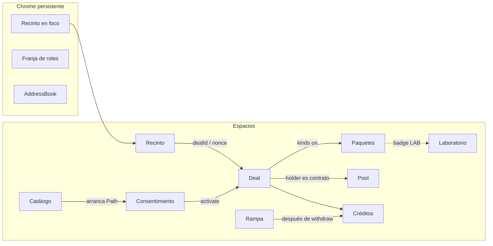
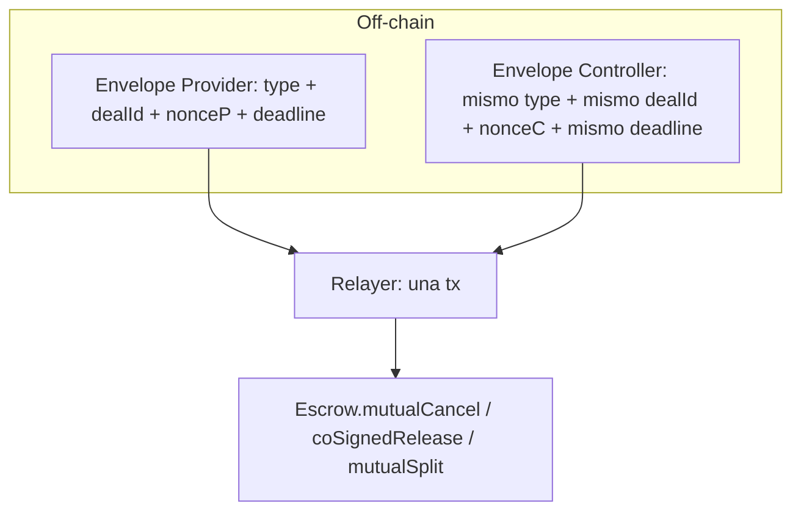
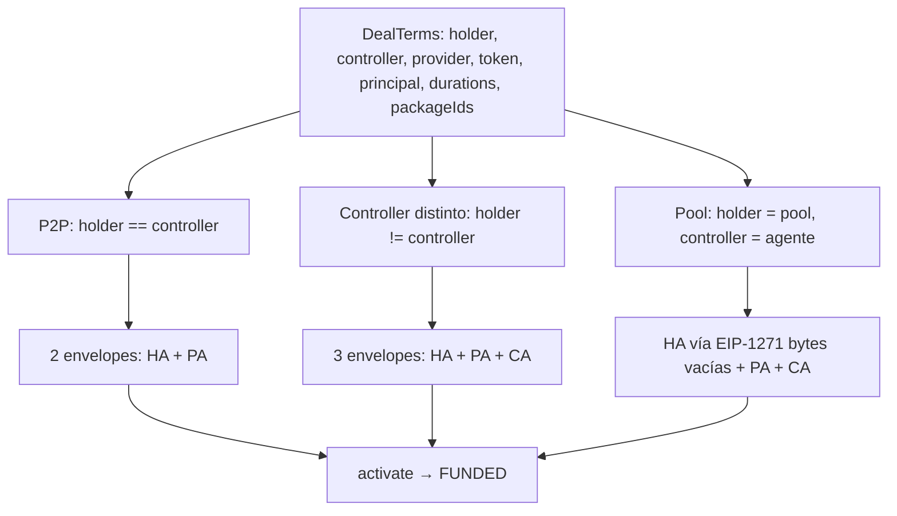
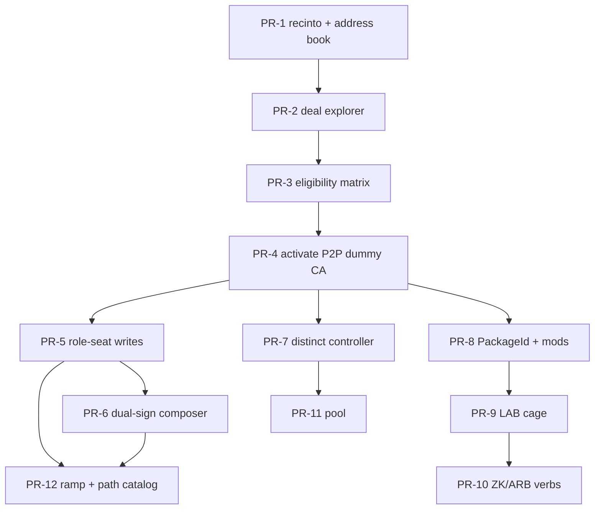

# Arquitectura de información: consola de laboratorio PluriSwap

| Campo | Valor |
| --- | --- |
| Título | IA de la consola de laboratorio del recinto PluriSwap |
| Autor | TBD |
| Fecha | 2026-09-10 |
| Estado | Draft |
| Audiencia | Autores del protocolo (Arbitrum Sepolia `421614`, Anvil `31337`) |
| Alcance | Información: objetos, identidad, navegación, affordances. **Sin implementación de UI.** |
| Recinto | Kernel `src/Escrow.sol`, lectura `src/interfaces/IEscrow.sol` |

---

## Overview

PluriSwap es un escrow de principal cripto contra fiat offchain. El kernel es una máquina cerrada de tres roles (`Holder`, `Provider`, `Controller`) con `packageIds = []` como modo constitucional. Paquetes, pool y rampa son opt-in y viven fuera de esa máquina (`ARCHITECTURE.md` §2). Hoy el catálogo se recorre en lote con Foundry (`script/Deal.s.sol`, `script/Paths.s.sol`, `script/TrioDeal.s.sol`, `script/PoolDeal.s.sol`, `script/KlerosDeal.s.sol`, `script/RampDeal.s.sol`, `script/CatalogDeals.s.sol`). Eso es correcto para CI; es un mal instrumento para *ver* la máquina: un `run()` consume nonces, avanza relojes y deja doce `dealId` terminales sin un humano que haya inspeccionado `status` / `kinds` / `clocks` entre txs.

Este documento congela la **arquitectura de información** de una consola de laboratorio: una vista del recinto, no un segundo protocolo. Cada widget mapea a un campo, evento o entrypoint on-chain. El producto no es un wizard de marketplace; es la **matriz de elegibilidad**: para el deal enfocado, qué entrypoints de `Escrow.sol` son legales ahora (status + `msg.sender` + reloj due/strictly-before + bitmap `kinds` + KERNEL-04), y por qué los ilegales revertirían (`WrongStatus`, `EdgeOff`, `Unauthorized`, `TooEarly`, `TooLate`, `PackageNotSelected`, `PackageDrift`, …). Passport y ZK en Sepolia son **adaptadores de laboratorio** (`PassportMock`, `VerifierMock`); la consola los etiqueta como tal y nunca los presenta como humanidad ni proof reales. Lo que se prueba es el contrato de interacción: resolución de `PackageMods`, recompute de `PackageId`, peer binding, `operator`, snapshot, drift, KERNEL-04, ZK `EdgeOff`, Core-only con `packageIds = []`.

---

## Background & Motivation

### Estado actual

El recinto ya existe. Constructor de `Escrow` vacío (`constructor() EIP712("PluriSwap", "1") {}`). El kernel no importa impls; importa `libraries/PackageId.sol` como **fórmula de hash**, no como allowlist. El relayer trae addresses en `PackageMods`; el kernel recomputa el id y exige que esté en los `packageIds` firmados (`Escrow._resolve`). Varios escrows conviven en Sepolia:

Cada JSON es un **set** de addresses etiquetadas, ancladas al `escrow` que declara (si lo tiene). `testToken` **no** es global.

| JSON | Rol de producto | `escrow` | `testToken` |
| --- | --- | --- | --- |
| `deployments/sepolia.json` | Core-only (`script/Deal.s.sol`) | `0x9b00D29E1c4B6D9F206D28aE767461d6D060499E` | `0x3E9a38A25d1A02126Ffe07f1B4d076196952d667` |
| `deployments/sepolia-paths.json` | Catálogo CASE-CORE-03..15 | `0x1Ab09F49431f952f22F29f54Dc2284F75640325E` | `0x2F975ee29b62f33155851c2BF317fE3b2395b265` |
| `deployments/sepolia-packages.json` | Stack empaquetado + mocks | `0xed094F54b5e0d4812ECD9c99720A0e5a669071F8` | `0x3E9a…` (mismo que `sepolia.json`) |
| `deployments/sepolia-kleros-packages.json` | ARBITRATION vía `KlerosAdapter` | `0x99c190FAA6c71eCa7cbcAf426bCaB5C70888bE00` | `0x3E9a…` |
| `deployments/sepolia-pool.json` | Pool apuntando a un escrow concreto | escrow `0x9b00…` (el de `sepolia.json`) | `0x3E9a…` |
| `deployments/sepolia-ramp.json` | Taxi StargateV2 | escrow `0xed09…` (el de packages) | USDC `0x3253…` (no TestToken) |
| `deployments/sepolia-pool-factory.json` | Factory + impl + codehash | **no es Recinto** (no trae `escrow`) | — |
| `deployments/sepolia-kleros.json` | Record de disputa live (`adapter`, `dealId`, `disputeId`) | **no es Recinto** (no trae `escrow`) | — |

Anvil: `31337.json` vs `31337-packages.json` son **dos** escrows distintos, cada uno con su `testToken` de ese archivo.

README: *more than one escrow may exist; point pools at the escrow whose domain you signed. Do not mix ABIs.* Mezclar `domainSeparator` / ABI entre esos deployments es un error de operador. La consola tiene que hacerlo *difícil*, no “inteligente”.

### Dolor

1. Los scripts son atómicos. `Paths.run()` ejecuta doce caminos y loguea ids. No hay un humano que vea `FUNDED` antes de `markFiat`.
2. `cast` + explorador muestran storage crudo. No decodifican `kinds` (`PKG_PASSPORT=1 … PKG_ARB=16`), no derivan `fiatDeadline = activatedAt + fiatDuration`, no predicen el revert del kernel.
3. Un dapp de consumo asume una wallet = un rol. El recinto exige **cambiar de firmante** entre `markFiat` (Provider) y `release` (Controller), y un Relayer tercero para dual-sign.
4. `PassportMock.setHuman` y `VerifierMock.verify` (`abi.decode` de `dealId+nullifier`) no son Passport ni circuito. Tratarlos como producto en una UI de consumo falsifica la evaluación (REVIEW.md §3.7, §3.8).
5. Core-only desaparece si la UI “ayuda” eligiendo el stack empaquetado. `packageIds = []` es Mandatory Core (`STATE_MACHINE.md` §1).

### Por qué ahora

El bytecode del kernel es evaluable. La consola no debe nacer como marketplace. Primero se congela cómo se nombra, se navega y se bindea a objetos on-chain. Después, PRs incrementales (sección PR Plan).

---

## Goals & Non-Goals

### Goals

- Congelar el **vocabulario de objetos** (Recinto, Deal, Party, Envelope, DualSignDraft, PackageSlot, PackageImpl, Pool, BondPosition, Credit, Clock, TerminalRecord, AddressBook, Path) con clave primaria y origen (firmado / calldata / snapshot / getter vivo).
- Definir **espacios, pantallas y paneles**, y qué objeto está en foco.
- Definir la **matriz de elegibilidad** como producto: verbos visibles siempre; ilegales deshabilitados con el error que el kernel usaría.
- Tratar **Core-only** (`packageIds = []`, overload de `activate` sin `PackageMods`) como modo de primera clase.
- Presentar P2P (`holder == controller`, 2 firmas) y Controller distinto (3 firmas) como el **mismo** `DealTerms`.
- Presentar un deal de pool como el **mismo** `DealTerms` con `holder = pool` y `holderSig = bytes("")` (EIP-1271). Constitución del vault **fuera** de la vista kernel.
- Elegir paquetes pegando addresses; la UI recomputa `PackageId.*` client-side con la misma fórmula que `src/libraries/PackageId.sol` y muestra match/mismatch **antes** de `activate`.
- Modelar dual-sign como **dos envelopes** (Provider + Controller) y **una** tx de relay, compuestos en un panel del espacio Deal (DualSignDraft), no en Consentimiento.
- Etiquetar `PassportMock.setHuman`, `VerifierMock` (`abi.encode(dealId, nullifier)`), `ArbitrationMock.submitRuling` como **verbos de laboratorio**, visualmente distintos de los verbos kernel.
- Catalogar los caminos de prueba (`CASE-CORE-01..17`, trío, ZK proof-or-timeout, arb, pool-as-holder, ramp taxi) como objeto `Path` de primera clase.
- v1: RPC + `dealId`/`nonce` aportados por el operador. Indexer opcional. Sin secretos en el address book.

### Non-Goals

- Implementar frontend, componentes, ni bindings TypeScript en este documento (solo IA).
- Un marketplace, onboarding de consumidores, ni “checkout” fiat.
- Passport real ni verifier de circuito en Sepolia. No diseñar la UI *como si* `setHuman` o `abi.encode(dealId, nullifier)` fueran humanidad o proof.
- Registry como gate de `activate`. El JSON de `deployments/` es conveniencia.
- Meter constitución de pool (NAV, shares, Sponsors, runoff) en la vista del deal kernel.
- Presentar `compose → activate` de rampa como verbo vivo. `StargateV2Ramp` es taxi-only (`RAMPS.md` lo permite; el bytecode no lo implementa; REVIEW.md §3.8).
- Mainnet, Circle USDC como producto, ETH nativo, subgraph obligatorio, indexer como fuente de verdad.
- Inventar estado que el kernel no tiene (`CLAIMED` como `Status`, `BRIDGING_*`, perfil `POOL`, `daoFee` en `DealTerms`).
- Ocultar acciones ilegales. Si el kernel las tiene, se ven; si revertirían, se deshabilitan con la razón.

---

## Proposed Design

### Principio

> La pantalla es una vista del recinto, no un segundo protocolo.

Si `IEscrow` no lo expone, si `Escrow.sol` no lo escribe, y si `Activated` / `Transitioned` / `Settled` no lo emiten, la consola no lo inventa. Lo derivado se etiqueta como derivado (reloj absoluto, bits de `kinds`, P2P vs Controller distinto).

Recomendación de producto: **laboratorio multi-rol que expone la máquina**. Argumento contra las alternativas: sección Alternatives Considered.

Ubicación propuesta del código futuro: `lab/` en este repo (convivencia con `src/`, `script/`, `deployments/`). No es un dapp público.

---

### 1. Objetos

Cada objeto tiene: clave, origen de verdad, qué se firma, qué es calldata, qué es snapshot, qué es getter vivo.

#### 1.1 Recinto

| | |
| --- | --- |
| **Qué es** | Una chain + un deployment de `Escrow`. Dominio EIP-712 `PluriSwap` / `1` / `chainId` / `verifyingContract = escrow` (`ENCODING.md` §1). |
| **Clave** | `(chainId, escrow address)` |
| **Origen** | On-chain: `IEscrow.domainSeparator()`. Off-chain: fila del AddressBook o address pegada. |
| **Firmado** | No. El dominio *acota* las firmas; no se firma el recinto. |
| **Snapshot** | No. El contrato es inmutable (sin proxy). |
| **Vivo** | `domainSeparator()`, `extcodehash` del escrow (diagnóstico de ABI), `creditOf` global por (token, beneficiary). |

Invariante de UI: **un Recinto en foco**. Cambiar de escrow invalida envelopes en borrador, dual-signs pendientes y el deal enfocado. Mostrar `name`, `version`, `chainId`, `verifyingContract` y el `domainSeparator` hex lado a lado. Si el operador pega un escrow cuyo `domainSeparator` no matchea el `chainId` de la wallet, bloquear firma (no “intentar igual”).

Hoy coexisten al menos cuatro recintos Sepolia (tabla de Background). Anvil: `deployments/31337.json` (core) vs `31337-packages.json` (otro `escrow`). Mezclarlos es el error que la IA debe hacer costoso de cometer.

#### 1.2 Deal

| | |
| --- | --- |
| **Qué es** | La unidad de custodia. Nace en `activate`. No existe en `Status.NONE`. |
| **Clave** | `(Recinto, dealId)` |
| **dealId** | `keccak256(abi.encode(DOMAIN_SEPARATOR, hashStruct(terms), holderNonce, providerNonce, holder==controller ? 0 : controllerNonce))` — `Consent.dealId` / `ENCODING.md` §4.5. |
| **Firmado** | `DealTerms` anidado en los envelopes de activación. **No** se firma `dealId`, fees, receivers, sujetos. |
| **Calldata extra** | `PackageMods` en el overload empaquetado de `activate`. No entra al digest. |
| **Snapshot** (post-`FUNDED`) | `terms`, orígenes de `DealClocks`, `subjects`, `modules` (`PackageMods`), `kinds` (bitmap `uint8`), y al terminal `holderAmt`/`providerAmt`. |
| **Vivo** | `status(dealId)`, los getters de `IEscrow` anteriores (el snapshot *es* storage; no hay “términos vivos” distintos). |

Getters canónicos (`IEscrow`):

```
domainSeparator()
used(signer, nonce) → bool
dealOf(signer, nonce) → dealId
status(dealId) → Status
terms(dealId) → DealTerms
clocks(dealId) → DealClocks
subjects(dealId) → (holderSubject, providerSubject)
modules(dealId) → PackageMods
kinds(dealId) → uint8
settlementOf(dealId) → (status, holderAmt, providerAmt)
creditOf(token, beneficiary) → uint256
```

`Status` (`Types.sol`): `NONE, FUNDED, FIAT_SENT, DISPUTED, RELEASED, RESOLVED_SPLIT, STALEMATE, CANCELLED, ARBITRATION_ACTIVE, RESOLVED_BY_ARBITRATION`.

**`CLAIMED` no es un estado.** Es un outcome económico de `RELEASED` (CASE-CORE-07). `settlementOf` no distingue claim vs `release`. La UI no fabrica un badge `CLAIMED` on-chain; puede anotar *hipótesis de origen* a partir del log `Transitioned(FIAT_SENT → RELEASED)` + que el caller no era el Controller, y debe etiquetarla como inferencia, no como `Status`.

Clases derivadas (no storage):

| Derivado | Fórmula |
| --- | --- |
| Core-only | `terms.packageIds.length == 0` |
| P2P | `terms.holder == terms.controller` |
| Controller distinto | `terms.holder != terms.controller` |
| Pool-as-Holder | `terms.holder` es contrato (code size > 0); la UI no asume “es Pool” hasta que el operador abre el espacio Pool o el AddressBook lo etiqueta |
| Terminal | `RELEASED \| RESOLVED_SPLIT \| STALEMATE \| CANCELLED \| RESOLVED_BY_ARBITRATION` |
| Activo | `FUNDED \| FIAT_SENT \| DISPUTED \| ARBITRATION_ACTIVE` |
| ZK-deal | `kinds & 8 != 0` (`PKG_ZK`) |
| ARB-deal | `kinds & 16 != 0` (`PKG_ARB`) |

#### 1.3 Party

| | |
| --- | --- |
| **Qué es** | Una address con un rol *respecto de un Deal* o de un Recinto. |
| **Clave** | `address`. El rol no es identidad: la misma address puede ser Holder de un deal y Relayer de otro. |
| **Roles que el kernel ve** | `Holder`, `Provider`, `Controller`. Relayer = cualquiera. |
| **Roles que el kernel no ve** | Sponsor, LP, designated (pool); DAO (recipient de un paquete); rampa. |
| **Firmado** | Las addresses de Holder/Provider/Controller *son* `DealTerms`. Destinos = esas addresses (`ENCODING.md` §2). No hay campo receiver. |
| **Vivo** | Balance ERC-20, ETH para gas, `used[party][nonce]`, `creditOf(token, party)`. |

DAO nunca es caller. No aparece como rol conectable. Si un paquete la puso de `feeRecipient` (`0x…0FEE` en los JSON oficiales), se muestra como **destinatario de invoice**, no como Party del deal.

#### 1.4 Envelope

Un mensaje EIP-712 de una party. Dual-sign = dos envelopes, una tx.

| Tipo | Cuándo | Payload | Consume |
| --- | --- | --- | --- |
| `HolderAuthorization` | Activación | `DealTerms + nonce + deadline` | `used[holder][nonce]` |
| `ProviderAgreement` | Activación | mismo `DealTerms + nonce + deadline` | `used[provider][nonce]` |
| `ControllerAcceptance` | Activación **solo si** `holder != controller` | mismo `DealTerms + nonce + deadline` | `used[controller][nonce]` |
| `MutualCancel` | Post-`FUNDED`, deal vivo | `dealId + nonce + deadline` | nonces Provider y Controller |
| `CoSignedRelease` | Post-`FIAT_SENT` (también DISPUTED / ARBITRATION_ACTIVE) | `dealId + nonce + deadline` | idem |
| `MutualSplit` | idem | `dealId + providerBps + nonce + deadline` | idem; las dos copias coinciden en `dealId`, `providerBps`, `deadline` |

| | |
| --- | --- |
| **Clave** | `(Recinto, typehash, signer, nonce)`. Un nonce usado no se reusa (`used[signer][nonce]`). |
| **Firmado** | Sí. Digest = `_hashTypedDataV4` del recinto en foco. EOA: 65 bytes. Contrato: bytes que `IERC1271` acepte (pool: vacío). |
| **Calldata** | Las `bytes` de firma viajan en `activate` / dual-sign; no están en el digest. |
| **Vivo** | `used(signer, nonce)`, `dealOf(signer, nonce)` (solo nonces consumidos en `activate`; dual-sign no escribe `dealOf`). |

`deadline` del envelope es **creation expiry** (activación) o expiry del payload (dual-sign), no un reloj del deal. Los relojes del escrow arrancan en `activatedAt` / `fiatSentAt` / `disputedAt` / `arbitrationOpenedAt`.

P2P: el UI muestra **dos slots de firma**, no tres. El kernel **no** tiene un overload de 4 argumentos. `script/Paths.s.sol` `_activate` siempre llama `escrow.activate(ha, holderSig, pa, providerSig, ca, "")` con `ControllerAcceptance memory ca` vacío. El bound tx P2P **sigue siendo el overload de 6 args**: HA + `holderSig` + PA + `providerSig` + **dummy** `ControllerAcceptance` (zeroed) + `bytes("")`. El kernel ignora CA ssi `holder == controller`. Controller distinto es el único caso que hashea, verifica y consume CA. La consola debe mostrar el overload que se va a encodear (6 vs 7), incluido el dummy.

Pool: `holderSig = ""`. El kernel no interpreta las bytes (`STATE_MACHINE.md` §3.2). El UI no fabrica un “permit de pool”. Un pool-as-Holder nombra un Controller agente (`holder != controller`) ⇒ CA real, no dummy.

#### 1.5 PackageSlot

Los cinco huecos de `PackageMods` (`Types.sol`), uno por kind. No se firman.

```
passport | reputation | bonds | zk | court
```

| | |
| --- | --- |
| **Clave** | `(Deal o borrador, kind)` con `kind ∈ {PASSPORT, REPUTATION, BONDS, ZK, ARBITRATION}` |
| **Calldata** | Addresses en `activate(..., mods)` |
| **Snapshot** | `modules(dealId)` tras `FUNDED` |
| **Vivo (pre-activate)** | Getters de policy del módulo pegado, para recompute |

Core-only: los cinco slots nulos y `packageIds = []`. Es un modo, no un “faltan paquetes”.

Bitmap `kinds` / `Escrow` internals:

| Bit | Constante | Kind |
| ---: | --- | --- |
| 1 | `PKG_PASSPORT` | PASSPORT |
| 2 | `PKG_REP` | REPUTATION |
| 4 | `PKG_BONDS` | BONDS |
| 8 | `PKG_ZK` | ZK |
| 16 | `PKG_ARB` | ARBITRATION |

Incompatibles al resolver (`_resolve`), **después** de reclamar ids: ZK+ARB → `IncompatiblePackages`; Rep without Passport / Bonds without Passport+Rep → `PackageRequired`. Un slot cuyo id no está en `packageIds` es `UnknownPackage` **antes** de esas dos. UI: el preflight usa el mismo orden.

#### 1.6 PackageImpl

Contrato detrás de un slot. Permissionless. El kernel no tiene allowlist.

| Kind | Interfaz | Policy que entra al `packageId` (`PackageId.sol`) |
| --- | --- | --- |
| PASSPORT | `IPassport` | `passport(adapter)` |
| REPUTATION | `IReputation` | `reputation(module, feeRecipient, activationFee, completionFee, contestFee)` |
| BONDS | `IBondVault` | `bonds(vault, sink)` + `BOND_LOCK_BPS = 1000` |
| ZK | `IPaymentProof` (+ `IVerifier` detrás) | `zk(module, verifier, feeRecipient, verifyFee)` |
| ARBITRATION | `ICourt` | `arbitration(adapter, partner, key)` / `kleros(adapter, arbitrator, extraData)` |

| | |
| --- | --- |
| **Clave** | `address` del módulo. El `packageId` es *contenido*, no clave de navegación. |
| **Firmado** | El **id**, no la address suelta. |
| **Vivo** | Getters de policy: `feeRecipient`, `activationFee`, `completionFee`, `contestFee`, `verifier`, `verifyFee`, `sink`, `passport()`, `packageBinding()`. Binding al escrow: ver mapa abajo. **No** entra al `packageId`. |
| **Lab vs real** | Metadato de AddressBook, no del chain. `PassportMock` / `VerifierMock` / `ArbitrationMock` / `ZkMock` se marcan `lab: true`. `KlerosAdapter` se marca `lab: false` (habla un tribunal externo; sigue siendo opt-in). |

El escrow al que el módulo acepta llamadas **no** se llama igual en todos los impls. Mapa de getters (comparar contra el Recinto en foco; no entra al `packageId`):

| Impl | Getter | Si mismatch |
| --- | --- | --- |
| `Reputation` | `operator` | `Unauthorized` en `admit` / `notifyTerminal` |
| `BondVault` | `operator` | `Unauthorized` en `reserve` / dispose |
| `ZkMock` | `operator` | `Unauthorized` en `verifyProof` (el kernel llama; si operator≠escrow el path revierte en el módulo) |
| `ArbitrationMock` | `operator` | `Unauthorized` en `openCourt` |
| `KlerosAdapter` | **`kernel`** (no existe `operator()`) | `Unauthorized` en `openCourt` |
| `PassportMock` | ninguno | `identify` es view sin `operator` |

PATH-KLEROS lee `kernel()`, no `operator()`. Un `ZkMock` desplegado contra escrow A no sirve en recinto B. Eso es parte del contrato a probar.

Recompute client-side (obligatorio **antes** de firmar y otra vez **antes** de `activate`):

```
id_passport = keccak256(abi.encode(PASSPORT_KIND, adapter))
id_rep      = keccak256(abi.encode(REPUTATION_KIND, module, feeRecipient, activationFee, completionFee, contestFee))
id_bonds    = keccak256(abi.encode(BONDS_KIND, vault, sink, 1000))
id_zk       = keccak256(abi.encode(ZK_KIND, module, verifier, feeRecipient, verifyFee))
id_arb      = keccak256(abi.encode(ARBITRATION_KIND, adapter, partner, key))
id_kleros   = arbitration(adapter, arbitrator, uint256(keccak256(extraData)))
```

Kinds:

```
PASSPORT_KIND     = keccak256("PluriSwap.Package.PASSPORT")
REPUTATION_KIND   = keccak256("PluriSwap.Package.REPUTATION")
BONDS_KIND        = keccak256("PluriSwap.Package.BONDS")
ZK_KIND           = keccak256("PluriSwap.Package.ZK")
ARBITRATION_KIND  = keccak256("PluriSwap.Package.ARBITRATION")
```

La UI **no** confía en `module.packageId()`. Lo muestra como “lo que el módulo declara” vs “lo que el kernel recomputaría”. Mentir produce otro id; si no está firmado, `UnknownPackage`.

Peer binding (pre-activate y en snapshot):

- `reputation.passport() == mods.passport`
- `vault.passport() == mods.passport`

Mismatch → `PeerMismatch`. Visible en el panel de slots **antes** de enviar.

Drift post-activación (`_named` en `verifyProof` / `openCourt` / completion / bonds): el id recomputeado con getters *vivos* debe seguir en `terms.packageIds`. Si no: `PackageDrift` en aristas; fee 0 en completion; fail-open en bonds. KERNEL-04: las salidas Core siguen. La consola re-ejecuta el recompute en cada render del deal vivo y muestra un badge `DRIFT` por slot, sin bloquear `timeoutFiat` / dual-sign / `forceStalemate`.

#### 1.7 Pool

Servicio Holder-contrato (`POOLS.md`). **No** es un perfil del kernel.

| | |
| --- | --- |
| **Clave** | `pool address` (clone). Constitución: `token`, `escrow` inmutables post-`initialize`. |
| **Relación con Deal** | `terms.holder == pool`. El deal no “sabe” que es un pool. |
| **Firmado** | El mismo `HolderAuthorization`. El pool responde EIP-1271 `isValidSignature(digest, bytes) == 0x1626ba7e`. Bytes vacías. |
| **Vivo (espacio propio)** | `life` (`NONE, ACTIVE, DEFICIENT, RUNOFF, WINDING_DOWN, CLOSED`), `idle`, `locked`, `credits`, `consumed`, `nav()`, `totalShares`, `sharesOf`, `sponsors`, `designated`, `auths[nonce]`, `controllerFeeBps`, `escrow`, `token`. |

Verbos de *este* objeto, no del Deal: `deposit`, `redeem`, `authorize(ha, mods)`, `unlock(nonce)`, `reconcile(nonce, providerNonce, controllerNonce)`, `setController` (kick de designated, futuro-only), `startRunoff`, `endRunoff`, `windDown`, `withdrawCredit`, `sync`.

La vista kernel del deal sigue mostrando `Holder = 0xpool…`. No se inyectan NAV ni Sponsors en el panel de términos.

#### 1.8 BondPosition

Caja de skin, no de principal (`PACKAGES.md` §5).

| | |
| --- | --- |
| **Clave de saldo** | `(vault, subject, token)` → `deposited`, `locked`, `available = deposited - locked` |
| **Clave de lock** | `(vault, subject, dealId)` → `lockOf` |
| **Firmado** | No. El `packageId` BONDS bindea `(vault, sink, 1000)`. |
| **Vivo** | Getters de `BondVault`. `deposit` / `withdraw` son del sujeto (withdraw exige `passport.identify(msg.sender) == subject`). `reserve`/`unlock`/`slash`/`burn` los llama el kernel (`operator`). |

La consola muestra BondPosition en el espacio Paquetes / sujeto, y un resumen por deal (`lockOf[subjectH][dealId]`, `lockOf[subjectP][dealId]`). No mezcla esos números con `principal` ni con `creditOf`.

#### 1.9 Credit

Pasivo maduro del escrow tras terminal (credit-first). También créditos del Pool hacia su Controller (`controllerCredit`).

| | |
| --- | --- |
| **Clave** | `(Recinto, token, beneficiary)` para el kernel; `(Pool, account)` para fee de Controller. |
| **Firmado** | No. Destino = address de firma. |
| **Vivo** | `IEscrow.creditOf`. `withdraw(token)` lo llama el beneficiario. |

Un `transfer` fallido no deshace el terminal. El panel de Credit es independiente del Deal (un humano puede tener crédito de varios deals).

#### 1.10 Clock

| | |
| --- | --- |
| **Orígenes (snapshot)** | `DealClocks`: `activatedAt`, `fiatSentAt`, `disputedAt`, `arbitrationOpenedAt` |
| **Duraciones (firmadas)** | `DealTerms.fiatDuration`, `releaseDuration`, `disputeDuration`, `arbitrationDuration` (esta última **ignorada** si ARBITRATION no está en `packageIds`) |
| **Clave** | `(Deal, nombre del reloj)` |

Derivados (UI, misma aritmética que `Clocks.sol`):

| Reloj absoluto | Fórmula | Predicado kernel |
| --- | --- | --- |
| `fiatDeadline` | `activatedAt + fiatDuration` | `timeoutFiat`: `requireDue` → `timestamp >= deadline`. `TooEarly` si no. |
| `releaseDeadline` | `fiatSentAt + releaseDuration` | `claim`: due. `openDisputed` / `openCourt` desde FIAT_SENT: `requireStrictlyBefore` → `timestamp < deadline`. `TooLate` si no. |
| `disputeDeadline` | `disputedAt + disputeDuration` | `forceStalemate`: due. `openCourt` desde DISPUTED: strictly-before. |
| `arbitrationDeadline` | `arbitrationOpenedAt + arbitrationDuration` | `forceArbitrationTimeout`: due. |

Origen `0` = el reloj no arrancó. No se muestra un deadline fantasma.

**Corolario de `duration = 0`** (`Clocks.sol`: `requireDue` es `timestamp >= origin + duration`; `requireStrictlyBefore` es `timestamp < origin + duration`):

| Predicado | `duration = 0` | `duration > 0` |
| --- | --- | --- |
| `requireDue` (`timeoutFiat`, `claim`, `forceStalemate`, `forceArbitrationTimeout`) | Enabled **en el mismo bloque** en que se escribe el origen (`timestamp >= origin + 0`) | Enabled cuando `now >= origin + duration` |
| `requireStrictlyBefore` (`openDisputed`, `openCourt` desde FIAT_SENT o DISPUTED) | **Ya cerrado.** Tras `markFiat`, `fiatSentAt = block.timestamp`, luego `timestamp < fiatSentAt + 0` es imposible en ese bloque y en todos los posteriores. Matriz: `TooLate` de inmediato. Igual para `openCourt` desde DISPUTED si `disputeDuration = 0`. | Enabled mientras `now < origin + duration` |

Copy en Consentimiento: *«0 = due inmediato **y** strictly-before ya `TooLate`»*. No defaultar plantillas de lab a `0` en un reloj que el Path todavía necesita para una arista strictly-before. `script/Paths.s.sol` ya lo hace: timeout/claim usan `0` en **ese** reloj; `openDisputed` usa `releaseDuration = 100`; stalemate usa `disputeDuration = 0` **después** de una ventana de release no nula (`_terms(3600, 100, 0)`).

Overflow `origin + duration` en Solidity 0.8 **revierte** el timeout (REVIEW.md §3.8): la UI debe detectar suma que overflow y mostrar riesgo, no un deadline wrapeado.

`block.timestamp` canónico = el de la chain del Recinto (cabeza RPC), no el reloj del laptop. En Anvil (`31337`) el espacio Laboratorio puede exponer `evm_increaseTime` / `evm_setNextBlockTimestamp` como affordance **LAB** (no es verbo kernel). Default **off**. En Sepolia el control no se muestra.

#### 1.11 TerminalRecord

| | |
| --- | --- |
| **Clave** | `(Recinto, dealId)` |
| **Vivo** | `settlementOf(dealId) → (status, holderAmt, providerAmt)` |
| **Evento** | `Settled(dealId, status, holderAmt, providerAmt)` |
| **No distingue como `Status`** | CASE-CORE-06 vs CASE-CORE-07 (ambos `RELEASED`). |

**Sí distingue en economía**, y el panel de settlement tiene que mostrarlo. `claim` paga `d.terms.principal` al Provider y **no** llama `_takeCompletion`. `release` / `coSignedRelease` / `mutualSplit` / `verifyProof` / arb-win sí. En un deal con Reputation, CASE-CORE-06 y CASE-CORE-07 comparten `Status.RELEASED` y **no** comparten `providerAmt`.

Líneas derivadas del panel (no son storage; se etiquetan *proyectado* antes del terminal, *observado* después vía `settlementOf` + invoice on-chain):

| Transición | Completion / verify | Principal |
| --- | --- | --- |
| `claim`, `release`, `coSignedRelease` | completion sobre `principal` (fee 0 si drift o `fee >= left`, KERNEL-04). Los tres son Provider-positivos con `providerBps = ALL`; difieren en `status` (`CLAIMED` vs `RELEASED`) y en los `Close` de reputación, no en la economía | `providerAmt = leftover` |
| `mutualSplit` | completion **primero** sobre el principal completo; luego `providerShare = leftover * providerBps / 10000` (`ENCODING.md` §5.3) | Holder = leftover − providerShare |
| `verifyProof` | `verifyFee` luego completion sobre el leftover | resto al Provider |
| arb holder/provider win | completion sobre principal | 100% del leftover al ganador |
| `cancelByProvider`, `timeoutFiat`, `mutualCancel` | no hay completion | 100% Holder = `principal` |
| `forceStalemate` / arb refused / arb timeout | no hay completion | `principal/2` Holder, resto Provider |

PATH-TRIO se juzga así: activation fee sale en `activate` (pull extra); completion fee sale en `release` (no en un `claim`); score `Peaceful` en ambos sujetos; bonds `unlock`. Un `claim` sobre el mismo trío **no** cobraria completion y `Close` sería `Silent`.

Outcomes de spec (`STATE_MACHINE.md` §12) son **etiquetas de catálogo**, no storage. La consola puede mostrar OUT-01..13 como hipótesis del Path, contrastadas con `settlementOf`. Si no coinciden, gana la chain. `CLAIMED` (OUT-04) es esa hipótesis, nunca un badge de `Status`.

#### 1.12 AddressBook

Conveniencia. **No es gate.**

| | |
| --- | --- |
| **Clave** | `(sourceFile, chainId, etiqueta, address)` — el archivo es parte de la identidad para no colapsar `testToken`. |
| **Origen** | Un JSON = un **set** de addresses etiquetadas, bound al `escrow` de *ese* archivo si existe. Plus filas pegadas por el operador. Sin secretos. |
| **Campos útiles** | Los que el archivo traiga: `chainId`, `escrow`, `testToken` **de ese archivo**, módulos, `*Id`, `feeRecipient`, `sink`, `factory`, `pool`, `ramp`, `klerosCore`, dealIds de corridas (`releasedDealId`, …). |

Reglas:

- Nunca mergear todos los JSON en un único `testToken`. `sepolia-paths.json` usa `0x2F97…`; `sepolia.json` / packages / kleros-packages / pool usan `0x3E9a…`; ramp usa USDC. Un Path de `sepolia-paths` contra el token de `sepolia.json` es un deal distinto (y probablemente sin allowance).
- **Nunca promover a Recinto** un JSON sin `escrow`: `sepolia-kleros.json` es un record de disputa live (`adapter`, `dealId`, `disputeId`, `klerosCore`); `sepolia-pool-factory.json` es factory + impl + `officialCodehash`. Se cargan como sets auxiliares del AddressBook, no como filas de Recinto.
- El operador puede pegar **cualquier** escrow compatible y **cualquier** módulo. Las filas del JSON se etiquetan `source: sepolia-packages.json`, nunca `required`.
- Si `sepolia-pool.json` apunta a un escrow distinto del Recinto en foco, banner: *este pool firmó otro dominio*.

#### 1.13 Path (catálogo de prueba)

Objeto de información de primera clase. No es un script oculto. Es un receta que el operador **arranca** y avanza **un verbo a la vez**.

| | |
| --- | --- |
| **Clave** | id estable (`CASE-CORE-06`, `PATH-TRIO-HAPPY`, `PATH-ZK-PROOF`, `PATH-ZK-TIMEOUT`, `PATH-ARB-MOCK`, `PATH-KLEROS`, `PATH-POOL-HOLDER`, `PATH-RAMP-TAXI`, `PATH-CORE-ONLY`) |
| **No es** | Estado on-chain. El progreso vive en el Deal que el Path produjo. |
| **Contiene** | Recinto sugerido (core vs packaged, no obligatorio), `DealTerms` plantilla **con 4-tupla** `(fiatDuration, releaseDuration, disputeDuration, arbitrationDuration)` (Core: cuarto = `0`), si el Path exige Anvil `evm_increaseTime`, secuencia de verbos, rol de cada paso, aserción (`status`, `settlementOf` **incluyendo invoice**, `kinds`). |

El Path no oculta la matriz: al llegar a un paso, el operador ve el deal y la matriz completa, no un botón “Siguiente” que esconda `openDisputed`. Duraciones: §7. No clonar `PATH-CORE-ONLY` con ceros en relojes strictly-before.

#### 1.14 DualSignDraft (sesión, no protocolo)

Objeto de sesión que la matriz de dual-sign **lee**. No es un wizard ni el espacio Consentimiento (ese es solo activación).

| | |
| --- | --- |
| **Clave** | `(Recinto, typehash, dealId, nonceP, nonceC)` |
| **Typehash** | `MutualCancel` \| `CoSignedRelease` \| `MutualSplit` (types distintos; `providerBps = 10000` no cambia el type) |
| **Firmado** | Dos envelopes: Provider y Controller. Mismo `dealId`, mismo `deadline`; nonces distintos. `providerBps` solo en split y **idéntico** en ambas copias. |
| **Calldata** | Las dos `bytes` de firma + el payload de relay. Relayer = asiento Relayer, una tx. |
| **Vivo** | `used(provider, nonceP)`, `used(controller, nonceC)`, `status(dealId)`, `block.timestamp` vs `deadline`. Dual-sign **no** escribe `dealOf`. |

Invalidación: al cambiar Recinto, el draft se descarta (los digests eran de otro `domainSeparator`). Al cambiar `dealId` en foco, el draft se descarta o se re-ancla explícitamente.

**Draft completo** (umbral para correr checks kernel de envelope): `type` elegido + `dealId ≠ 0` + `deadline ≠ 0` + `nonceP` y `nonceC` seteados (pueden ser `0` como nonce válido elegido) + ambas firmas presentes; si split, `providerBps` presente en **ambas** copias. Un formulario recién abierto (`deadline = 0`, sin firmas) **no** es completo.

Un draft **incompleto** no oculta las filas: `reasonKind: ui-policy`, `uiPolicy: draft-empty` **solamente**. **No** se evalúa `_assertDualSignEnvelope` sobre ceros (`deadline = 0` no es `DeadlinePassed`; nonces unset no son `NonceUsed`; bps ausente no es `BpsMismatch`). `WrongStatus` del deal tampoco se mezcla aquí: el operador aún no tiene un payload que el kernel vería.

Solo con draft completo se aplica el orden de bytecode: `DealIdMismatch` → `DeadlineMismatch` → `DeadlinePassed` → `WrongStatus` → `Invalid*Signature` → `NonceUsed` (`mutualSplit`: `BpsMismatch` tras el envelope check, antes de status — ver `_assertDualSignEnvelope` luego `BpsMismatch` luego `_assertDualSignFromActive`).

---

### 2. Navegación: espacios, pantallas, paneles

Audiencia v1: pocos deals concurrentes, dos o tres wallets de test, TestToken. Layout de consola (desktop), no mobile-first.



#### 2.1 Chrome persistente

1. **Selector de Recinto.** Chain (`421614` | `31337` | RPC custom) + address de escrow + `domainSeparator` leído. Lista del AddressBook + input de pegado. Indicador de mismatch ABI/`extcodehash` vs el artifact que la consola conoce.
2. **Franja de roles.** Cuatro asientos: Holder, Provider, Controller, Relayer. Cada asiento = una address conectada (wallet o clave de test — modelo concreto es Open Question). El asiento activo es `msg.sender` de la próxima tx. P2P: Holder y Controller *pueden* ser la misma address; la UI lo muestra como un solo chip `Holder=Controller`, no como dos personas.
3. **Reloj de chain.** `block.number` / `block.timestamp` del RPC del recinto.
4. **AddressBook.** Drawer. Nunca modal de “elige el stack oficial para continuar”.

No hay login. No hay cuenta de producto.

#### 2.2 Espacio Recinto (home)

Objeto en foco: Recinto.

Paneles:

- Identidad EIP-712 (`name PluriSwap`, `version 1`, `chainId`, `verifyingContract`, `domainSeparator`).
- Modo: el recinto no tiene “modo”; Core-only vs packaged es **por deal**. Texto explícito: *este escrow resuelve cualquier impl compatible; el constructor no bindea paquetes*.
- Lookup: input `dealId` **o** `(signer, nonce)` → `dealOf` → abre Deal.
- Créditos del connected signer.
- Eventos recientes si el operador pega un rango de bloques (opt-in). v1 no indexa solo.
- Atajos a Catálogo.

#### 2.3 Espacio Deal (producto)

Objeto en foco: Deal. Si `status == NONE`, no hay Deal: se redirige a Consentimiento.

Paneles, en este orden (el operador recorre la máquina de arriba a abajo):

1. **Identidad.** `dealId`, Recinto, `Activated` (holder, provider, controller, token, principal).
2. **Máquina.** `status` con el nombre del enum. Grafo (Mermaid vivo) con el nodo actual y las aristas *de este deal* (ZK apaga DISPUTED; sin ARB no se dibujan `ARBITRATION_*` como capacidad — `STATE_MACHINE.md` §5: *no stubs muertos presentados como capacidad*). Aristas apagadas se ven en gris con `EdgeOff` / `PackageNotSelected`.
3. **Matriz de elegibilidad.** Ver §4. Ocupa el lugar del “CTA único” de un dapp de consumo. Filas dual-sign leen el DualSignDraft del panel 12.
4. **Términos firmados.** `DealTerms` campo a campo. `packageIds[]` en hex, orden canónico, cada uno resuelto a kind+impl si el snapshot `modules` lo permite. Badge `Core-only` si vacío.
5. **Roles.** Holder / Provider / Controller, con igualdad P2P marcada. Relayer no se lista: es cualquiera.
6. **Clocks.** Orígenes crudos + deadlines derivados + predicado (due / strictly-before / not started) + `TooEarly`/`TooLate` proyectado. Badge si `duration = 0` cierra strictly-before.
7. **Kinds y módulos.** Bitmap decodificado + `modules` snapshot + recompute vivo vs firmado (badge `DRIFT`). Binding `operator`/`kernel` vs Recinto.
8. **Sujetos.** `subjects` — bytes32. En Core-only: `0x0`. No se etiquetan “humanos”.
9. **Settlement.** `settlementOf` (`status`, `holderAmt`, `providerAmt`) **más** línea de invoice derivada (§1.11): completion/verify omitido si drift o `fee >= left`, o si el verbo es un refund Holder-positivo (cancel, fiat timeout, arb win del Holder). `claim` **sí** cobra completion: es Provider-positivo. Preview de `mutualSplit` = `bps * leftoverAfterCompletion / 10000`. `CLAIMED` es un `Status` propio (valor 10), no un alias de `RELEASED`: misma economía, distinto origen y distinta lectura de reputación.
10. **Locks de bond** (si `kinds & BONDS`). `lockOf` de ambos sujetos.
11. **Log.** `Transitioned` / `Settled` de *este* `dealId` (query por topic si el operador da fromBlock; si no, “pega el tx hash”).
12. **Composer dual-sign** (panel del Deal, **no** wizard, **no** Consentimiento). Objeto DualSignDraft (§1.14). Campos: type (`MutualCancel` \| `CoSignedRelease` \| `MutualSplit`), `dealId` (prellenado del foco), `deadline` compartido, `nonceP`, `nonceC`, `providerBps` solo si split, preview de **dos** digests, calldata de Relayer. Asiento Provider firma el envelope P; asiento Controller firma el C; asiento Relayer envía **una** tx. Draft se descarta al cambiar Recinto.

Nada de “próximo paso sugerido” que esconda el resto del catálogo. Un Path activo puede *resaltar* un verbo; no oculta los demás.

#### 2.4 Espacio Consentimiento (componer)

Objeto en foco: borrador de `DealTerms` + envelopes. No hay `dealId` todavía.

Paneles:

- **Plantilla.** En blanco, o cargada de un Path, o clonada de `terms(dealId)` de un deal previo (mismo recinto).
- **Roles y P2P toggle.** Toggle `holder == controller`. No cambia el struct: copia addresses. Controller distinto exige el tercer envelope.
- **Token y principal.** Address pegable. AddressBook sugiere `testToken`. No asume USDC. Rampa no se mete aquí.
- **Duraciones.** Segundos, `>= 0`. Advertir overflow. Copy: *«0 = due inmediato **y** strictly-before ya `TooLate`»* (§1.10). Un Path que todavía necesita `openDisputed` no trae `releaseDuration = 0`.
- **Slots de paquete.** Ver §5. Default: los cinco nulos, `packageIds = []`, overload Core de `activate` (6 args, dummy CA).
- **Nonces.** Libres, no secuenciales. Checker `used(signer, nonce)` en vivo. Botón `cancelNonce` (verbo kernel del `msg.sender`).
- **Deadlines de autorización.** Unix. Distintos del reloj del deal.
- **Firmas.** P2P: dos slots (HA, PA). Controller distinto: tres (HA, PA, CA). Preview del typed data anidado. Digest hex. Encode: siempre 6 args; P2P rellena CA dummy + `bytes("")` (§1.4). Overload 7 si hay `PackageMods`.
- **Preflight de `activate`** — **los mismos predicados y el mismo orden** que `_activate` + `_resolve` + `_engage` (§4.1). No un subconjunto. Incluye `Terms.HolderEqualsProvider`, `ZeroPrincipal`, `UnsortedPackageIds` **antes** de `TermsMismatch`; probes de `_engage` (`identify`, `cap` vs `inFlight+principal`, `available` vs lock `(principal+9)/10`, allowance ≥ `principal + activationFee`); binding `operator`/`kernel`.
- **Allowance / pull.** `allowance(holder, escrow) >= principal (+ activationFee si Rep)`. El digest no cubre el approve (`ENCODING.md` §6).
- **Envío.** Relayer = asiento Relayer. Mostrar overload 6 vs 7 y el dummy CA.

Pool: si Holder es contrato, el panel muestra `holderSig = ""` y un enlace al espacio Pool (`authorize` tiene que haber ocurrido). No se firma ECDSA del pool.

#### 2.5 Espacio Paquetes

Objeto en foco: PackageImpl o el conjunto de slots del borrador/deal.

No es un storefront. Es un banco de trabajo de resolución.

- Pegar address → leer policy → recompute `PackageId` → comparar con `packageIds` del borrador.
- Peer: `passport()` de Rep y Bonds vs slot passport.
- Binding al Recinto: mapa `operator` | `kernel` | none (§1.6). `KlerosAdapter` → `kernel()`.
- Fees declarados (`activationFee`, `completionFee`, `contestFee`, `verifyFee`, `courtFee` / `arbitrationCost`) como **policy del módulo**, no campos del deal.
- Invoices vivos vs leftover proyectado (KERNEL-04: si `fee >= left`, se omite; el terminal no revierte).

#### 2.6 Espacio Pool

Objeto en foco: Pool. **Fuera** del chrome del Deal kernel, accesible desde Deal si `holder` es ese pool.

Paneles: `life`, libros (`idle` / `locked` / `credits` / `consumed` / `nav`), `escrow` apuntado vs Recinto en foco (mismatch = error de operador), Sponsors/designated, auths por nonce (digest, deadline, unlocked, reconciled), verbos de constitución.

Kick = `setController(addr, false)`. Copy: *futuro-only; el Controller snapshotado de un deal vivo no se silencia* (`POOLS.md` §4).

`authorize(ha, mods)` reserva idle: `principal + controllerFee + activationFee`. Recibe los `PackageMods` completos y corre el mismo `Packages.resolve` del kernel **antes** de reservar nada, así que un deal cuyos `packageIds` firmados incluyen REPUTATION no se puede autorizar con ese slot vacío: revierte `UnknownPackage` sin haber movido un token. La consola pasa el mismo draft de `PackageMods` que usa la activación, y `currentPackageIds()` devuelve `[]` cuando los paquetes están apagados, así que los ids firmados y los mods no pueden desdecirse.

`_recognizeLive` no repara fees ni emite eventos de anomalía: con `resolve` en `authorize` y el re-bind que hace `Packages.engage` antes del pull, lo reservado y lo cobrado no pueden divergir. Un pool en `DEFICIENT` sin causa visible es entonces señal de que una de esas dos capas falló, y el espacio Pool debe mostrarlo como anomalía de kernel y no como un agujero contable de rutina. Ojo con la salida: la consola no expone `redeem`, `withdrawCredit`, `sync`, `startRunoff`, `endRunoff` ni `windDown`, así que un `DEFICIENT` hoy no tiene remedio desde la UI — solo lectura.

Nada de esto apaga slots en el kernel: un pool *puede* firmar un deal con paquetes (el apagado que describe REVIEW.md era un bug de *otra* UI).

#### 2.7 Espacio Créditos

Lista `creditOf(token, beneficiary)` para las addresses de la franja de roles + cualquier address pegada. Verbo `withdraw(token)`. Tras withdraw, si el operador quiere rampa out, enlace a Rampa (composer **después** del crédito).

#### 2.8 Espacio Catálogo

Lista de Paths. Cada card: id, recinto sugerido, modo (Core-only / trío / ZK / arb / pool / ramp), secuencia. “Arrancar” abre Consentimiento con la plantilla y deja la matriz completa visible. No auto-broadcast.

#### 2.9 Espacio Laboratorio

Visualmente distinto: fondo/badge `LAB`, copy que niega autenticidad.

Verbos (nombres on-chain, nunca eufemismos):

| Verbo | Contrato | Qué es | Qué no es |
| --- | --- | --- | --- |
| `PassportMock.setHuman(wallet, subject)` | `src/packages/PassportMock.sol` | Mapa wallet→bytes32. Sin auth. | “Verificar humanidad”. “Passport oficial”. |
| Ensamblar `proof = abi.encode(dealId, nullifier)` | `src/mocks/VerifierMock.sol` | `verify` hace `abi.decode`. | “Generar ZK proof”. “Circuit V”. |
| `ArbitrationMock.submitRuling(dealId, ruling)` | `src/packages/ArbitrationMock.sol` | Escribe `Ruling` {None, HolderWin, ProviderWin, Stalemate}. Sin auth. | “El tribunal dictó”. |
| `TestToken.mint` | `src/TestToken.sol` | Faucet de lab. | Activo real. |
| Reloj RPC Anvil | `evm_increaseTime` / `evm_setNextBlockTimestamp` | Avance de `block.timestamp` en `31337`. Default **off**. | Verbo kernel. No se muestra en Sepolia. |

`KlerosAdapter` **no** vive aquí. Es PackageImpl de ARBITRATION que habla `IArbitratorV2`. Sus verbos de lab, si los hay (`KlerosClose.s.sol` / `IKlerosCoreAdvance`), son del tribunal externo, no del kernel; se documentan en el Path `PATH-KLEROS`, no como “submitRuling”.

`ArbitrationMock.open(dealId, controller)` (no `openCourt`) lo puede llamar un extraño y deja `AlreadyOpen` para el kernel. No es un verbo de la consola; se documenta como grief en Security. `submitRuling` sigue siendo LAB y sin auth.

El espacio Laboratorio nunca es el camino feliz por defecto. Un Path de trío *enlaza* a `setHuman` con badge LAB antes de `activate`. Paths con `duration = 0` en un reloj `requireDue` no necesitan warp; Paths con strictly-before (`releaseDuration = 100`) en Anvil pueden usar el reloj LAB si el operador espera de más.

#### 2.10 Espacio Rampa

Objeto: `IRamp` / `StargateV2Ramp`. Verbos vivos: `quote(RampIntent)`, `send(RampIntent)` payable. **No** hay `composeActivate`. Copy fija: *taxi-only; compose→activate está en spec (`RAMPS.md` §4) y no está implementado*.

La rampa no escribe estado Core. Flujo v1: Holder ya tiene USDC en Arbitrum Sepolia → deal Core → `withdraw` si quedó crédito → `send` out. No estados `BRIDGING_*`.

---

### 3. Flujo de información (bind)

```mermaid
sequenceDiagram
  participant Op as Operador
  participant UI as Consola
  participant Book as AddressBook JSON
  participant RPC as RPC recinto
  participant Esc as Escrow
  participant Mod as PackageImpl

  Op->>UI: elige Recinto (book o paste)
  UI->>RPC: domainSeparator()
  UI-->>Op: EIP-712 domain visible
  Op->>UI: pega PackageMods o deja slots nulos
  UI->>RPC: getters de policy (fees, passport, verifier, packageBinding)
  UI->>UI: PackageId.* recompute
  UI-->>Op: match/mismatch vs packageIds canónicos
  Op->>UI: firma envelopes (2 o 3) en el dominio del Recinto
  Op->>UI: Relayer envía activate
  RPC->>Esc: activate / activate+mods
  Esc->>Esc: _resolve + _engage + pullExact
  Esc-->>UI: Activated + dealId
  Op->>UI: foco Deal
  UI->>RPC: status, terms, clocks, kinds, modules, subjects
  UI->>UI: matriz de elegibilidad
  UI->>RPC: recompute vivo vs packageIds
  alt drift
    UI-->>Op: badge DRIFT; Core exits siguen enabled
  end
  Op->>UI: verbo legal o inspección de ilegal+reason
```

v1 no requiere indexer. Entrada a un deal: el operador pega `dealId`, o `(signer, nonce)` via `dealOf`, o el `dealId` que devolvió `activate` en la sesión.

---

### 4. Matriz de elegibilidad (el producto)

Para el Deal en foco (y para el borrador de Consentimiento, en `activate`), la consola lista **todos** los entrypoints de escritura del kernel. Cada fila: visible siempre; `enabled` ssi el predicado es verdadero **para el `msg.sender` del asiento activo**; si no, `disabled` + **el primer revert que el bytecode lanzaría**, en orden de checks, **incluyendo errores de libraries y módulos** (`Terms.*`, `Clocks.*`, `Settlement.*`, `IPassport.NoPassport`, `Reputation.*`, `BondVault.*`, `ZkMock.*`, `ICourt` / adapter). No solo `Escrow.*`. No un mensaje marketing.

Asiento activo = wallet que enviará la tx. Relayer distinto del firmante: en dual-sign y `activate`, el asiento Relayer es `msg.sender`; las firmas van en calldata.

Filas dual-sign leen DualSignDraft (§1.14). Draft **incompleto**: la fila sigue visible; `reasonKind: ui-policy` / `draft-empty` **solo** — no se proyecta `DeadlinePassed` sobre `deadline = 0` ni ningún otro selector kernel. Draft **completo**: primer revert en orden de bytecode del verbo (`_assertDualSignEnvelope` → `BpsMismatch` si split → `WrongStatus` → `Invalid*Signature` / `NonceUsed`).

**Política de UI vs revert kernel.** `Settlement.withdraw` retorna si `amount == 0`; no revierte. `cancelNonce` siempre escribe `used[msg.sender][nonce] = true` (idempotente). Deshabilitar `withdraw` con `creditOf == 0` es UX, etiqueta `no-op`, **no** un selector. `cancelNonce` ya usado se etiqueta `already used` y **sigue enabled**.

#### 4.1 Predicados por verbo

##### `activate` — lista ordenada (oráculo de primer revert)

Orden real de `_activate` en `src/Escrow.sol`. El preflight de Consentimiento **es** esta lista. PATH-TRIO no puede mostrar ENABLED si `identify` va a `NoPassport`.

1. `Terms.hashTerms(ha.terms)` — **antes** de comparar HA vs PA:
   - `Terms.HolderEqualsProvider` si `holder == provider`
   - `Terms.ZeroPrincipal` si `principal == 0`
   - `Terms.UnsortedPackageIds` si `ids[i] <= ids[i-1]` (no unique, no sort)
2. `Terms.hashTerms(pa.terms)` — mismos tres.
3. `Escrow.TermsMismatch` si `hash(ha.terms) != hash(pa.terms)`.
4. `Escrow.DeadlinePassed` si `now > ha.deadline` o `now > pa.deadline`.
5. `Escrow.InvalidHolderSignature` / `InvalidProviderSignature` (dominio del Recinto en foco; EIP-1271 si contrato).
6. Si `holder != controller`:
   - `ControllerAcceptanceRequired` si `ca.terms.controller != terms.controller`
   - `TermsMismatch` si hash CA ≠ hash HA
   - `DeadlinePassed` si `now > ca.deadline`
   - `InvalidControllerSignature`
   - `NonceUsed` si `used[controller][ca.nonce]`
7. `NonceUsed` si `used[holder][ha.nonce]` o `used[provider][pa.nonce]`.
8. `_resolve(terms.packageIds, mods)` — por slot no nulo, **en este orden de slots** (`passport`, `reputation`, `bonds`, `zk`, `court`):
   - `PeerMismatch` (Rep/Bonds: `module.passport() != mods.passport`) **antes** de pedir el id
   - `UnknownPackage` si el id recomputeado no está en `packageIds`
   - Después de los slots: `UnknownPackage` si `matched != ids.length` (id firmado sin slot, o slot de más ya cayó arriba)
   - `IncompatiblePackages` si ZK+ARB **después** del conteo. Un paste ZK+ARB con un solo id en `packageIds` es `UnknownPackage`, no `IncompatiblePackages`.
   - `PackageRequired` si Rep sin Passport, o Bonds sin Passport+Rep
9. `DealExists` si `status(dealId) != NONE` (`dealId` = `Consent.dealId`).
10. `_engage`:
    - Passport: `IPassport.identify(holder)` / `identify(provider)` → `IPassport.NoPassport` si `setHuman` no corrió (o subject 0)
    - Reputation: `admit` ×2 → `Reputation.Unauthorized` (operator≠escrow), `NoPassport` (re-identify), `InsufficientBond` (cobertura 10%), `CapExceeded` si `inFlight + principal > cap(subject, token, withBond)`
    - Reputation invoice: segundo `Settlement.pullExact` de `activationFee` → `Settlement.InexactPull` (allowance/balance del Holder insuficientes para `principal + activationFee`)
    - Bonds: `reserve` ×2 → `BondVault.Unauthorized`, `LockTooSmall`, `LockExists`, `InsufficientAvailable`. Lock = `(principal + 9) / 10` (`BOND_LOCK_BPS = 1000`)
11. `Settlement.pullExact` del **principal** → `InexactPull`.

Core-only: slots nulos y `packageIds = []` ⇒ `_resolve` no entra a ningún slot, `matched == 0 == ids.length`, no hay `_engage` de paquetes, un solo pull. Overload de 6 args, dummy CA (§1.4).

Probes de preflight (lecturas, no txs): `holder != provider`, `principal > 0`, canonical `packageIds`, `used`, domain, firmas, tabla `_resolve`, `identify(holder/provider)`, `available` vs lock, `cap` vs `inFlight+principal`, `allowance(holder, escrow) >= principal + activationFee`.

##### Resto de verbos (orden de checks del bytecode)

| Verbo | Checks en orden | Enabled cuando |
| --- | --- | --- |
| `markFiat` | `WrongStatus` ≠ FUNDED; `EdgeOff` si ZK; `Unauthorized` ≠ provider | FUNDED ∧ ¬ZK ∧ sender=Provider |
| `cancelByProvider` | `WrongStatus` ≠ FUNDED; `Unauthorized` ≠ provider | FUNDED ∧ sender=Provider |
| `timeoutFiat` | `WrongStatus` ≠ FUNDED; `Clocks.TooEarly` si `now < activatedAt+fiatDuration` | FUNDED ∧ due. Anyone. Incluye ZK. `duration=0` ⇒ due en el origen. |
| `release` | `WrongStatus` ≠ FIAT_SENT; `Unauthorized` ≠ controller | FIAT_SENT ∧ sender=Controller. (ZK no llega a FIAT_SENT.) Completion se cobra aquí, no en `claim`. |
| `claim` | `WrongStatus` ≠ FIAT_SENT; `EdgeOff` si ZK; `Clocks.TooEarly` | FIAT_SENT ∧ ¬ZK ∧ due. Anyone. **Sin** `_takeCompletion`. |
| `openDisputed` | `WrongStatus` ≠ FIAT_SENT; `EdgeOff` si ZK; `Unauthorized` ≠ controller; `Clocks.TooLate` si `now >= fiatSentAt+releaseDuration`; `InexactPull` si reputación cobra contest y el opener no tiene allowance | FIAT_SENT ∧ ¬ZK ∧ sender=Controller ∧ strictly-before ∧ (Core-only o allowance ≥ contestFee). Si `releaseDuration=0` ⇒ `TooLate` inmediato. |
| `forceStalemate` | `WrongStatus` ≠ DISPUTED; `Clocks.TooEarly` | DISPUTED ∧ due. Anyone. |
| `mutualCancel` | `DealIdMismatch`; `DeadlineMismatch`; `DeadlinePassed`; `WrongStatus` si no `FUNDED\|FIAT_SENT\|DISPUTED\|ARBITRATION_ACTIVE`; `Invalid*Signature`; `NonceUsed` | DualSignDraft coincidente + deal vivo + firmas P+C + nonces libres. Relayer anyone. |
| `coSignedRelease` | envelope checks; `WrongStatus` si no `FIAT_SENT\|DISPUTED\|ARBITRATION_ACTIVE` | idem, `_assertDualSignFromActive` |
| `mutualSplit` | + `BpsMismatch` si bps distintos o `> 10000` | idem + `providerBps` igual. Preview = `bps * leftoverAfterCompletion / 10000`. |
| `verifyProof` | `WrongStatus` ≠ FUNDED; `PackageNotSelected` ¬ZK; `PackageDrift`; luego módulo (`ZkMock.Unauthorized` si operator≠kernel — no debería: el caller es el escrow; `WrongDealId`; `NullifierUsed`) | FUNDED ∧ ZK ∧ id vivo matchea. Anyone *respecto del kernel*. Payload mock se fabrica en LAB. |
| `openCourt` | ver subsección | ver subsección |
| `readRuling` | `WrongStatus` ≠ ARBITRATION_ACTIVE; `NotRuled` si `0` | ARBITRATION_ACTIVE ∧ ruling ∈ {1,2,3}. Anyone. |
| `forceArbitrationTimeout` | `WrongStatus`; `Clocks.TooEarly` | ARBITRATION_ACTIVE ∧ due. Anyone. |
| `withdraw(token)` | **no revierte** si crédito 0 (`Settlement.withdraw` return) | UX: disable con etiqueta `no-op` si `creditOf==0`. No es `Escrow.*`. |
| `cancelNonce(nonce)` | siempre success, idempotente | Siempre enabled para `msg.sender`. Badge `already used` si `used==true`. |
| `retryPostTerminal(dealId)` | `WrongStatus` si el deal no es terminal; `NothingPending` si `postPending(dealId) == 0` | Enabled solo con `postPending != 0`. Mostrar los bits como chips (`notify-H`, `notify-P`, `bond-A`, `bond-B`) para que se vea qué falta. Es verbo de keeper: lo ejecuta cualquiera, no hace falta ser parte del deal |

CASE-CORE-16 (release/claim desde DISPUTED) y CASE-CORE-17 (mutación en terminal) = filas `WrongStatus`, no se ocultan.

##### `openCourt` — kernel y luego impl

Checks **kernel** en orden (`Escrow.openCourt`):

1. `PackageNotSelected` si `kinds & ARB == 0`
2. `EdgeOff` si ZK
3. `WrongStatus` si no `FIAT_SENT` y no `DISPUTED`
4. `Unauthorized` si `msg.sender ≠ controller`
5. `Clocks.TooLate` — FIAT_SENT: strictly-before `fiatSentAt+releaseDuration`; DISPUTED: strictly-before `disputedAt+disputeDuration`. `duration=0` ⇒ `TooLate` inmediato.
6. `PackageDrift` si `PackageId.arbitration(court, partner, key)` no está en `packageIds` (getters vivos de `packageBinding()`)
7. `court.openCourt{value: msg.value}(dealId, msg.sender)`

Preflight **por impl** (después de que el kernel pasaría):

| Impl | Pago | `msg.value` | Post-kernel |
| --- | --- | --- | --- |
| `ArbitrationMock` | ERC-20 `courtFee` **desde el Controller hacia el módulo** (`Settlement.pullExact(feeToken, controller, courtFee)`). Allowance del Controller al **court** (`mods.court`), **no** al escrow. | `0` | `Unauthorized` (operator≠escrow); `AlreadyOpen`; `InexactPull` si falta approve/balance |
| `KlerosAdapter` | ETH nativo | **igualdad exacta** `msg.value == arbitrator.arbitrationCost(extraData)`. `extraData` = `KlerosAdapter.extraData()` (no un campo del deal). Quote vivo en cada render. Balance nativo del asiento que envía (Controller). | `Unauthorized` (`msg.sender` debe ser `kernel`); `AlreadyOpen`; `InsufficientFee` si `msg.value != cost` |

PATH-ARB-MOCK: approve court token **antes** de `openCourt`; si no, la matriz no está ENABLED. PATH-KLEROS: mostrar `cost` y el `msg.value` que se va a mandar. `ArbitrationMock.open()` (entry distinto, no el kernel) puede grief `AlreadyOpen` — no es verbo de la consola.

#### 4.2 Dual-sign: dos envelopes, una tx



**Dónde se compone:** panel Dual-sign del espacio Deal (§2.3.12), objeto DualSignDraft (§1.14). No es Consentimiento (activación). No es un wizard.

Reglas de UI:

- Campos del panel: type, `dealId` (foco), `deadline` compartido, `nonceP`, `nonceC`, `providerBps` solo en split, dos previews de digest, calldata Relayer.
- Asiento Provider firma envelope P; asiento Controller firma envelope C (en P2P esa wallet es el Holder); asiento Relayer envía **una** tx.
- No se recicla `DealTerms`. El payload nombra `dealId`.
- `providerBps = 10000` **no** se relabela como `CoSignedRelease` (`ENCODING.md` §5.3).
- Draft se descarta al cambiar Recinto. Matriz lee el draft. Incompleto → `draft-empty` únicamente. Completo → selectores kernel en orden de bytecode. Nunca `DeadlinePassed` sobre un form con `deadline = 0`.
- Si el relay revierte, no se consume ninguno (`_consumeDualSign` es atómico con `_finish`).

#### 4.3 KERNEL-04 en la matriz

Un paquete ausente, hostil o drifted **no** deshabilita salidas Core de *ese* deal. Concretamente:

- Deal ZK: `markFiat` / `claim` / `openDisputed` / `openCourt` = `EdgeOff` o `PackageNotSelected`. Siguen: `timeoutFiat`, `cancelByProvider`, `mutualCancel`, `verifyProof` (si no drift).
- Deal con Rep drifted: `release` / split / etc. siguen; completion fee se omite (fee 0). Badge: *invoice omitido (KERNEL-04)*.
- Deal con Bonds drifted: terminal Core commitea; lock puede quedar en el vault (fail-open, TRUST-03). Badge de riesgo, no freeze de la matriz Core.
- Core-only: filas ZK/ARB en `PackageNotSelected` / no-kind; nunca se presentan como capacidad.

#### 4.4 Visualización

Cada fila:

```
[verbo]  [clase: rol | anyone | dual-sign | lab]
[estado requerido] [kinds] [reloj: due | strictly-before | n/a]
[asiento que debe enviar]
[ENABLED | DISABLED: Escrow.WrongStatus | Clocks.TooEarly | Terms.ZeroPrincipal | IPassport.NoPassport | no-op | …]
```

Clases visuales:

- **Kernel** — entrypoints de `Escrow.sol`.
- **Constitución Pool** — solo espacio Pool.
- **LAB** — `setHuman`, ensamblar proof mock, `submitRuling`, `mint`.

Un verbo LAB nunca comparte estilo con `verifyProof` (kernel). `verifyProof` es el entrypoint del escrow; el *payload* mock se fabrica en Laboratorio y se pega como `bytes`.

---

### 5. Cómo se eligen PackageMods

1. Default de todo Path Core: slots nulos, `packageIds = []`, overload **sin** `mods` (`Escrow.activate` 6 args). La consola no “rellena oficiales”.
2. Operador pega addresses (o las toma del AddressBook como *atajo*).
3. UI lee policy viva, recomputa ids, ordena unique ascendente, escribe `DealTerms.packageIds`.
4. Tabla de resolución:

| Slot | Address | id recomputeado | ¿∈ packageIds? | peer passport | binding vs Recinto (§1.6) | lab? |
| --- | --- | --- | --- | --- | --- | --- |
| passport | … | `0x…` | match/miss | — | n/a (`PassportMock` no tiene getter) | LAB si PassportMock |
| reputation | … | `0x…` | match/miss | `passport() == mods.passport` | `operator == escrow` | — |
| bonds | … | `0x…` | match/miss | `passport() == mods.passport` | `operator == escrow` | — |
| zk | … | `0x…` | match/miss | — | `operator == escrow` | LAB si ZkMock/VerifierMock |
| court (`ArbitrationMock`) | … | `0x…` | match/miss | — | `operator == escrow` | LAB |
| court (`KlerosAdapter`) | … | `0x…` | match/miss | — | **`kernel == escrow`** (no existe `operator()`) | no LAB |

5. Advertencias nominadas: `IncompatiblePackages`, `PackageRequired`, `PeerMismatch`, `UnknownPackage` (id de más o de menos: `matched != ids.length`).
6. Solo entonces se habilita firmar. Firmar con mismatch es posible *si el operador fuerza* (para testear el reject); el botón primario no lo hace. Un Path “negative” (`PATH-UNKNOWN-PACKAGE`, `PATH-ZK-ARB`) usa el force.

No hay registry. Pegar un clon con fee 0 es otro hash, otro producto, el mismo escrow (`ARCHITECTURE.md` §5.1).

---

### 6. P2P vs Controller distinto vs Pool: un solo DealTerms



Copy de UI, no paths Solidity distintos. El kernel no tiene `activatePool`.

---

### 7. Catálogo de Paths

Plantillas que `script/*.s.sol` recorren en lote. Un paso = una tx (dual-sign = una tx con dos firmas previas). Duraciones = 4-tupla `(fiatDuration, releaseDuration, disputeDuration, arbitrationDuration)`. Core y Paths sin ARB dejan el cuarto campo en `0` (el kernel lo ignora si ARBITRATION no está en `packageIds`). **No** defaultar lab a ceros en relojes strictly-before: eso cierra `openDisputed` / `openCourt` con `TooLate` para siempre en Sepolia. **No** poner `1 days` en el slot `disputeDuration` de un deal arb.

`warp?` = el Path **no** exige `evm_increaseTime` si la duración del reloj due es `0`. Strictly-before nunca usa `0` en ese reloj.

| Path id | Recinto / token del JSON | Duraciones | warp? | Secuencia | Aserción |
| --- | --- | --- | --- | --- | --- |
| `PATH-CORE-ONLY` | `sepolia.json` / `31337.json` | `(3600, 1800, 7200)` | no | `packageIds=[]` → activate P2P (6 args, dummy CA) | `kinds==0`, `subjects==0` |
| `CASE-CORE-01-P2P` | core + su `testToken` | `(3600, 1800, 7200)` | no | HA+PA, dummy CA, activate | `FUNDED` |
| `CASE-CORE-01-CTRL` | core | `(3600, 1800, 7200)` | no | HA+PA+CA hashed | `FUNDED`, 3 `used` |
| `CASE-CORE-02` | core | `(3600, 1800, 7200)` | no | markFiat | `FIAT_SENT` |
| `CASE-CORE-03` | core | `(3600, 1800, 7200)` | no | cancelByProvider | `CANCELLED`, holderAmt=principal |
| `CASE-CORE-04` | core | **`(0, 1800, 7200)`** | no | timeoutFiat due inmediato | `CANCELLED` |
| `CASE-CORE-05` | core | `(3600, 1800, 7200)` | no | composer `mutualCancel` FUNDED | `CANCELLED` |
| `CASE-CORE-06` | core | `(3600, 1800, 7200)` | no | markFiat → release | `RELEASED`; Core-only: providerAmt=principal. Con Rep: providerAmt=principal−completion (no es `claim`) |
| `CASE-CORE-07` | core | **`(3600, 0, 7200)`** | no | markFiat → claim due inmediato | `RELEASED` (no status `CLAIMED`); **sin** completion fee |
| `CASE-CORE-08` | core | `(3600, 1800, 7200)` | no | composer mutualCancel FIAT_SENT | `CANCELLED` |
| `CASE-CORE-09` | core | `(3600, 1800, 7200)` | no | composer split bps=2500 | `RESOLVED_SPLIT`; preview `bps*leftover/10000` |
| `CASE-CORE-10` | core | `(3600, 1800, 7200)` | no | composer coSignedRelease | `RELEASED` |
| `CASE-CORE-11` | core | **`(3600, 100, 7200)`** — `releaseDuration` **no** 0 | no* | openDisputed strictly-before | `DISPUTED`. \*Anvil: reloj LAB solo si el operador deja pasar 100s |
| `CASE-CORE-12` | core | `(3600, 100, 7200)` | no* | composer mutualCancel DISPUTED | `CANCELLED` |
| `CASE-CORE-13` | core | `(3600, 100, 7200)` | no* | composer coSigned DISPUTED | `RELEASED` |
| `CASE-CORE-14` | core | `(3600, 100, 7200)` | no* | composer split bps=4000 | `RESOLVED_SPLIT` |
| `CASE-CORE-15` | core | **`(3600, 100, 0)`** | no* | openDisputed luego forceStalemate due | `STALEMATE` 50/50 |
| `CASE-CORE-16` | core | `(3600, 100, 7200)` | — | release/claim en DISPUTED | matriz `WrongStatus` |
| `CASE-CORE-17` | core | cualquier terminal | — | verbo de estado | `WrongStatus` |
| `PATH-TRIO` | packages + **su** `testToken` | `(3600, 1800, 7200, 0)` — `TrioDeal.s.sol` | no | LAB `setHuman` ×2, `vault.deposit`, slots P+R+B, activate P2P (dummy CA), preflight `NoPassport`/`InsufficientAvailable`/`CapExceeded`, markFiat, **release** (no claim) | activationFee cobrado; completionFee en release; score Peaceful; bonds unlock |
| `PATH-ZK-PROOF` | packages | `(3600, 1800, 7200, 0)` | no | slot ZK, FUNDED, LAB `abi.encode(dealId,nullifier)`, `verifyProof` | `RELEASED`; `markFiat` DISABLED `EdgeOff`; verifyFee |
| `PATH-ZK-TIMEOUT` | packages | `(0, 1800, 7200, 0)` | no | ZK, timeoutFiat | `CANCELLED`, sin fee ZK |
| `PATH-ARB-MOCK` | packages | **`(3600, 1800, 7200, 1 days)`** — `CatalogDeals.s.sol` (`disputeDuration=7200`, **`arbitrationDuration=1 days`**, no mezclar) | no | court=ArbitrationMock; Controller **approve court** ≥ `courtFee`; `msg.value=0`; markFiat; openCourt; LAB `submitRuling`; `readRuling` | `RESOLVED_BY_ARBITRATION` o `STALEMATE`. `forceArbitrationTimeout` **no** due al abrir (arbDuration ≠ 0). Matriz no ENABLED sin allowance al módulo. |
| `PATH-KLEROS` | kleros-packages | **`(3600, 1800, 7200, 7 days)`** — `KlerosDeal.s.sol` | no | P2P dummy CA; `KlerosAdapter.kernel()` vs Recinto; `msg.value == arbitrationCost(extraData)` exacto; markFiat; `openCourt` | `ARBITRATION_ACTIVE`; no `submitRuling`. `releaseDuration=1800` deja `openCourt` strictly-before abierto. |
| `PATH-POOL-HOLDER` | pool.json cuyo `escrow` == Recinto | `(3600, 1800, 7200, 0)` — `PoolDeal.s.sol` | no | deposit; `authorize(ha)`; **`holder = pool`, `controller = owner` (`holder != controller`)**; `holderSig = ""` (EIP-1271); **CA hashed y firmada** (no dummy); PA del Provider; markFiat; release; `reconcile` | Holder=pool; idle/locked/credits. Dummy CA **revierte** (`ControllerAcceptanceRequired` / `InvalidControllerSignature`). |
| `PATH-RAMP-TAXI` | ramp.json (USDC, no TestToken) | n/a al Core | no | deal Core con USDC ya en Holder, release, `IRamp.send` | sin compose |
| `PATH-DRIFT` | packages | — | — | recompute vivo vs `packageIds` | Core exits enabled; badge `DRIFT` |
| `PATH-NEGATIVE-ZK-ARB` | packages | — | — | slots ZK+ARB, **ambos** ids en `packageIds` | `IncompatiblePackages`. Si falta un id: `UnknownPackage` primero. |
| `PATH-NEGATIVE-UNSORTED` | core | — | — | `packageIds` no canónicos | `Terms.UnsortedPackageIds` **antes** de `TermsMismatch` |

`script/Paths.s.sol` cubre CASE-CORE-03..15 en un recinto core con **esas** tuplas. `TrioDeal` = trío P2P. `CatalogDeals` = ZK luego arb en el mismo recinto packaged (**dos** deals: ZK+ARB incompatibles en el mismo). Token: usar el `testToken` del JSON del Recinto, nunca un merge.

---

### 8. Modelo de roles en sesión

La consola no es “connect wallet and you are the user”. Es un banco de cuatro asientos.

| Asiento | Para qué |
| --- | --- |
| Holder | `HolderAuthorization`, `approve`, `withdraw` si es destino, LAB `setHuman` de su wallet, bond `deposit`/`withdraw` |
| Provider | `ProviderAgreement`, `markFiat`, `cancelByProvider`, envelopes dual-sign, `withdraw` |
| Controller | `ControllerAcceptance` si distinto, `release`, `openDisputed`, `openCourt`, envelopes dual-sign |
| Relayer | `activate`, dual-sign txs, timeouts permissionless, `claim`, `verifyProof`, `readRuling`, `forceStalemate`, `forceArbitrationTimeout` |

Cualquier asiento puede ejecutar un verbo `anyone`. El default del asiento Relayer es “la wallet que tiene gas”. El operador **cambia de asiento** conscientemente; la matriz se recalcula contra `msg.sender` de ese asiento. Si Holder=Controller, los asientos 1 y 3 apuntan a la misma address (un solo connector, dos etiquetas).

---

### 9. Observabilidad que ya está on-chain

No se diseña un schema paralelo.

| Evento | Uso en UI |
| --- | --- |
| `Activated(dealId, holder, provider, controller, token, principal)` | Nacimiento. Indexación opcional v2. v1: retorno de `activate` + pega. |
| `Transitioned(dealId, from, to)` | Log del Deal; arista del grafo. |
| `Settled(dealId, status, holderAmt, providerAmt)` | Igual que `settlementOf`. |

Indexer: **no** es fuente de verdad. Si existe (fuera de v1), es un acelerador de lookup. El Deal se rehidrata siempre por `IEscrow`.

---

### 10. Copy y nomenclatura

- Identifiers on-chain en inglés: `FUNDED`, `markFiat`, `packageIds`, `EdgeOff`.
- Chrome de la consola: Open Question (es/en). Este documento está en español; no decide el locale de la app.
- Nunca: “Verify humanity”, “Submit ZK proof” (como si fuera circuito), “Official packages required”, “Next step”, “Your order”.
- Sí: `PassportMock.setHuman`, `VerifierMock` payload, `PackageNotSelected`, `Core-only`, `Recinto`, `asiento Provider`.
- `CLAIMED`: solo como nombre de Path/outcome (OUT-04), con nota *no es `Status`*.

---

## API / Interface Changes

Este diseño **no cambia** el kernel ni las interfaces. La consola es un consumidor de:

| Superficie | Path | Uso |
| --- | --- | --- |
| Lectura recinto | `src/interfaces/IEscrow.sol` | Única lectura del deal |
| Escritura kernel | `src/Escrow.sol` entrypoints | Matriz |
| Fórmula id | `src/libraries/PackageId.sol` | Recompute client-side (portar 1:1, no “equivalente”) |
| Typed data | `src/libraries/Consent.sol` + `Terms.sol` | Envelopes |
| Relojes | `src/libraries/Clocks.sol` | Predicados due / strictly-before |
| Paquetes | `src/packages/interfaces/*` | Policy viva, peers |
| Lab | `PassportMock`, `VerifierMock`, `ArbitrationMock`, `TestToken` | Espacio LAB |
| Pool | `src/pools/Pool.sol` | Espacio Pool |
| Rampa | `src/ramps/interfaces/IRamp.sol` | Espacio Rampa taxi |
| Address book | `deployments/*.json` | Conveniencia |

ABI de `activate`: **dos overloads, ambos con CA**. No existe un overload de 4 args.

- Core-only: `(ha, holderSig, pa, providerSig, ca, controllerSig)` — 6 args. P2P: `ca` dummy zeroed, `controllerSig = bytes("")`.
- Empaquetado: los mismos 6 + `PackageMods` — 7 args.

Mostrar cuál overload se va a encodear, incluido el dummy. Dual-sign no vive en esta ABI; vive en el panel Dual-sign del Deal.

No hay API de backend. v1 habla RPC.

Contrato TypeScript *futuro* (no se implementa ahora), forma ilustrativa de binding, no de producto:

```ts
type RecintoId = { chainId: bigint; escrow: Address };
type DealId = Hex; // bytes32
type Kinds = {
  passport: boolean; // bit 1
  reputation: boolean; // bit 2
  bonds: boolean; // bit 4
  zk: boolean; // bit 8
  arbitration: boolean; // bit 16
};
function decodeKinds(raw: number): Kinds;
function packageIdPassport(adapter: Address): Hex; // = PackageId.passport
// ...
type DualSignDraft = {
  recinto: RecintoId;
  type: "MutualCancel" | "CoSignedRelease" | "MutualSplit";
  dealId: Hex;
  nonceP: bigint;
  nonceC: bigint;
  deadline: bigint;
  providerBps?: number;
};
type EligibilityRow = {
  verb: "activate" | "markFiat" | "release" | /* … kernel verbs … */;
  class: "kernel" | "pool" | "lab";
  enabled: boolean;
  reasonKind: "kernel-revert" | "ui-policy";
  revert?: "WrongStatus" | "EdgeOff" | "Unauthorized" | "TooEarly" | "TooLate"
    | "PackageNotSelected" | "PackageDrift" | "NonceUsed"
    | "HolderEqualsProvider" | "ZeroPrincipal" | "UnsortedPackageIds"
    | "NoPassport" | "CapExceeded" | "InsufficientAvailable" | "InexactPull"
    | "InsufficientFee" | "AlreadyOpen" | /* … */;
  uiPolicy?: "no-op" | "already-used" | "draft-empty";
};
```

Cualquier capa que cachee `status` debe invalidarse al mintear un bloque, no al “completar un wizard”.

---

## Data Model Changes

**On-chain: ninguno.** Prohibido inventar tablas que el kernel no respalde.

Off-chain (sesión de operador, no protocolo):

| Store | Contenido | Persistencia v1 |
| --- | --- | --- |
| AddressBook | **Sets** por archivo JSON (no merge de `testToken`) + pegados | local; sin secretos |
| Borrador de DealTerms / envelopes de **activación** | hasta firmar | sesión; descartar al cambiar Recinto |
| DualSignDraft | type + dealId + nonces + deadline + bps | sesión; descartar al cambiar Recinto o dealId |
| Foco | recinto, dealId, asiento activo, Path id | sesión |
| Inferencias | “este RELEASED fue claim” (si invoice=0 y verbo anyone) | efímeras, etiquetadas *inferido* |

Migración: no hay estado viejo de UI. Los `*DealId` dentro de los JSON de deployments son **atajos de lookup**, no un índice canónico.

Canonicalización de `packageIds` en el borrador: unique + sort bytes32 ascendente, igual que `Terms._assertPackageIdsCanonical` (estricto: `ids[i] <= ids[i-1]` revert). La UI ordena al insertar; un force-unsorted existe solo para Paths negativos.

---

## Alternatives Considered

### A. Seguir solo con scripts Foundry (status quo)

`script/Paths.s.sol` ya recorre CASE-CORE-03..15. `TrioDeal`, `PoolDeal`, `KlerosDeal`, `RampDeal`, `CatalogDeals` cubren el resto.

- **A favor:** cero superficie nueva; mismas keys que CI; warp de tiempo trivial (`vm.warp`).
- **En contra:** un `run()` es un lote. No hay matriz. No hay mismatch de `PackageId` *visto* antes del revert. No hay cambio de rol interactivo. El humano no prueba KERNEL-04: observa un log final.
- **Veredicto:** se quedan como oráculo de Paths (las plantillas de la consola se *nombran* como los scripts). No sustituyen la consola.

### B. Block explorer + `cast`

- **A favor:** verdad de chain sin app; `cast call` de `status` / `terms`.
- **En contra:** no decodifica `kinds`, no deriva clocks, no predice `EdgeOff`, no compone EIP-712 anidado, no recomputa `PackageId`, no impide mezclar dominios. El operador ya puede equivocarse de escrow en `cast`; el explorador no lo sabe.
- **Veredicto:** herramienta de debug, no de catálogo.

### C. Dapp de consumo (una wallet, un rol, wizard)

Flujo típico: connect → “crear orden” → “pagué” → “liberar”.

- **A favor:** onboarding; menos carga cognitiva para un Holder de a pie.
- **En contra (fatal para un lab):**
  1. Una wallet no puede ser Provider a las 10:00 y Relayer de dual-sign a las 10:05 sin un modelo de asientos. El wizard esconde el tercer rol.
  2. El wizard *sugiere* un siguiente paso y oculta `openDisputed` / `forceStalemate` / `cancelNonce`. Eso es lo contrario de probar la máquina.
  3. Empujar “paquetes oficiales” convierte el AddressBook en gate (PERM-05 / PERM-08).
  4. Etiquetar `setHuman` como “verificá tu identidad” falsifica Sepolia.
  5. Core-only desaparece detrás de un default empaquetado.
  6. Pool se presenta como “otro tipo de orden”, no como el mismo `DealTerms`.
- **Veredicto:** rechazado como dirección de este producto. Un frontend de consumo, si alguna vez existe, es **otro** artifact, otro audience, y no es esta IA.

### D. Subgraph / indexer como modelo

- **A favor:** listas de deals, logs, búsquedas.
- **En contra:** v1 tiene pocos deals; el operador conoce el `dealId`. Un subgraph puede desfasarse del RPC y la consola *parecería* un segundo protocolo. `dealOf` ya resuelve nonce→id.
- **Veredicto:** opcional v2 como acelerador. Fuente de verdad = `IEscrow` + RPC.

### E. Recomendado: laboratorio multi-rol que expone la máquina

Cuatro asientos, Recinto explícito, matriz completa, Core-only de primera clase, lab verbs en jaula visual, pool en otro espacio, rampa taxi-only.

Costo: más chrome, más copy técnico, cero utilidad para un usuario final. Eso es el punto: la audiencia es quien escribe `STATE_MACHINE.md`.

---

## Security & Privacy Considerations

| Riesgo | Severidad | Mitigación de IA |
| --- | --- | --- |
| Firmar `DealTerms` bajo el `domainSeparator` de *otro* escrow (replay cross-deploy) | Alta | Un Recinto en foco; domain hex visible; invalidar borradores al cambiar escrow; bloquear sign si `chainId` wallet ≠ recinto |
| Tratar `PassportMock` / `VerifierMock` / `ArbitrationMock` como autenticación real | Alta | Espacio LAB, nombres de función crudos, copy que niega humanidad/proof; Paths de trío/ZK/arb-mock pasan por LAB con badge |
| `activate` con `PackageMods` que no recomputean a los ids firmados | Alta | Preflight match/mismatch; overload Core vs packaged explícito |
| Módulo con binding ≠ Recinto | Alta | Checker por impl: `operator` o `kernel` (§1.6). `KlerosAdapter` no tiene `operator()` |
| `PassportMock.setHuman` sin auth (REVIEW.md §3.7): cualquiera mapea cualquier wallet | Media (lab) | Verbo LAB; advertencia *sin control de acceso*; no usarlo como “cuenta” |
| `ArbitrationMock.submitRuling` sin auth | Media (lab) | Igual; Path Kleros no usa este verbo |
| `ArbitrationMock.open()` grief → `AlreadyOpen` para el kernel | Media (lab) | No exponer `open()` como verbo; documentar; `openCourt` del kernel es el único path |
| Mezclar pool con escrow cuyo dominio no se firmó | Alta | Banner si `pool.escrow() ≠ recinto`; `authorize` no se habilita |
| Overflow `origin+duration` que hace irllamable el timeout | Media | Detectar suma > `uint256` max; no mostrar deadline wrapeado |
| UI que oculta salidas Core cuando un paquete falla (anti-KERNEL-04) | Alta | Matriz siempre lista Core; drift no deshabilita `timeoutFiat` / dual-sign |
| AddressBook como gate psicológico | Media | Paste first; JSON es atajo; nunca “official required” |
| Claves de test en el frontend | Alta si se implementa mal | Open Question de wallet model; este diseño **no** pide persistir PKs en el AddressBook (`deployments/` no tiene secretos) |
| Phishing de typed data (campos anidados no visibles) | Media | Preview del nested `DealTerms` completo, incluidos `packageIds` hex |
| `cancelNonce` accidental | Baja | Confirmar nonce + `used` previo |

Amenazas que **no** son de esta UI: solvencia de un pool, honestidad de un módulo permissionless, liveness de Kleros. La consola las muestra; no las certifica.

Privacidad: v1 en testnet, deals públicos por construcción. No hay PII. Sujetos Passport son `bytes32` elegidos por el operador (`keccak256("sepolia-holder")` en `TrioDeal`). No etiquetarlos con nombres de personas.

---

## Observability

### Logging (consola)

- Cada tx: recinto, verbo, `msg.sender` (asiento), `dealId`, hash, revert selector decodificado (`Escrow.WrongStatus` no “transaction failed”).
- Preflight: dump de ids recomputeados vs firmados.

### Métricas (v1, locales)

No hay backend. Contadores de sesión opcionales: deals activados por recinto, reverts por selector, mismatches de dominio evitados. No telemetría remota (audiencia: autores del protocolo).

### Alertas

No hay on-call. Indicadores in-UI:

- Recinto `domainSeparator` no leíble (RPC / address sin code).
- `DRIFT` en slot vivo.
- Pool `life != ACTIVE` si se intenta `authorize`.
- Reloj due y verbo anyone aún no ejecutado (carrera: mark-fiat vs timeoutFiat, CASE-RACE-01) — aviso, no auto-keeper.

### Trazas on-chain

`Activated` / `Transitioned` / `Settled` bastan. No añadir eventos “de UI”.

---

## Rollout Plan

La IA se congela en este documento. El código de consola (futuro) vive en `lab/`. **Fuente de verdad del corte y del orden: sección PR Plan** (no este párrafo, no el summary). Q3 (alcance v1 packaged/pool) sigue abierto; el **primer slice mergeable está definido**: PR-1..3 read-only. Primer slice de escritura: PR-4 (activate P2P) + PR-5 (verbos de asiento).

### Feature flags (app, no kernel)

Un flag por capacidad de escritura o espacio, alineado a PRs. Dual-sign y Controller distinto **tienen** flag. El catálogo de Paths también. Default **off** hasta que el PR correspondiente mergea y el operador lo enciende.

| Flag | Lo prende | Efecto |
| --- | --- | --- |
| *(ninguno)* | PR-1..3 | Recinto + Deal explorer + matriz read-only. Siempre on. **No oculta filas kernel.** |
| `coreActivate` | PR-4 | Consentimiento Core-only + `activate` 6-arg P2P (dummy CA) |
| `coreWrites` | PR-5 | `markFiat` … `cancelNonce` (no dual-sign, no CA real) |
| `dualSign` | PR-6 | composer Deal + relay `mutualCancel` / `coSignedRelease` / `mutualSplit` |
| `distinctController` | PR-7 | tercer envelope hashed + 3 `used` |
| `packages` | PR-8 | editor de slots + overload 7 args. Un deal empaquetado *ya on-chain* se lee igual con el flag off |
| `labVerbs` | PR-9 | espacio Laboratorio envía txs (`setHuman`, payload mock, `submitRuling`, `mint`, reloj Anvil) |
| `zkArb` | PR-10 | `verifyProof` / `openCourt` / `readRuling` / `forceArbitrationTimeout` |
| `pool` | PR-11 | espacio Pool |
| `ramp` | PR-12 | espacio Rampa taxi + catálogo de Paths como objeto (plantillas; no oculta matriz) |

Flags de **app**. Nunca gate on-chain. Cada PR que introduce un flag incluye el check: *la matriz sigue listando filas ilegales*.

### Staging

1. Anvil `31337` contra `deployments/31337*.json`.
2. Arbitrum Sepolia recinto core (`sepolia.json`) — sin paquetes.
3. Recinto packaged — con LAB verbs explícitos.
4. Pool / Kleros / ramp en Paths dedicados.

### Rollback

Borrar `lab/` no toca el recinto. Un flag off vuelve la consola a read-only. No hay migración de deals.

### Criterio de “listo para usar como lab”

Un autor recorre `CASE-CORE-01..15` a mano, un trío, un ZK proof-or-timeout (payload mock etiquetado LAB), y un Core-only, **sin** que la UI haya rellenado paquetes ni escondido `EdgeOff`.

---

## Open Questions

Decisiones que el usuario debe tomar antes o durante la implementación. Este documento **no** las cierra con un default de producto de consumo.

1. **Dónde vive la app.** Recomendación de este texto: `lab/` en el repo. Alternativas: paquete hermano, repo aparte. ¿Se acepta `lab/`?
2. **Modelo de wallet.** ¿Browser wallets distintas por asiento (Holder/Provider/Controller/Relayer) vs importar claves de test (las de `script/` / env Foundry) vs híbrido? Importar PKs es ergonómico en Anvil y peligroso si se filtra. No se persisten en AddressBook.
3. **Corte de alcance v1 (packaged / pool / ramp).** El primer slice mergeable **ya está cerrado**: PR-1..3 read-only. El primer slice de escritura **ya está cerrado**: PR-4+5 Core P2P. Q3 decide si v1 *también* incluye PR-8..12, no si existe un primer merge.
4. **¿Lab verbs en v1?** `PassportMock.setHuman`, ensamblar `VerifierMock` proof, `ArbitrationMock.submitRuling`, `TestToken.mint`, reloj Anvil. Sin ellos no se recorre trío/ZK/arb-mock en Sepolia. Recomendación de IA: sí, **en jaula LAB**, nunca como CTA del Deal. Flag `labVerbs`.
5. **Idioma del chrome.** Documento en español; identifiers on-chain en inglés. ¿Chrome `es`, `en`, o bilingüe (labels ES + identificadores EN)?
6. **¿Portar `PackageId` a TS a mano o generar bindings desde ABI + bytecode de la library?** La library es `public` (DELEGATECALL). Llamarla on-chain es posible pero innecesario si el port es 1:1 y testeado contra vectores de `PackageId.sol`.
7. **Duraciones default vs warp.** Las plantillas de Path **ya** traen tuplas (§7): `0` solo en el reloj `requireDue` de ese Path; strictly-before usa `releaseDuration = 100`, nunca `0`. Q7 ya no es “¿default 0 en todos los relojes?”. Queda: ¿el operador puede editar duraciones fuera de la plantilla? (sí: Consentimiento es un borrador). ¿Reloj LAB Anvil (`evm_increaseTime`) en v1? Recomendación: sí, flag `labVerbs`, oculto en Sepolia. Sepolia no tiene warp; los Paths due usan `duration=0` en **ese** reloj.
8. **¿Multicall para leer un Deal?** Un lote `status+terms+clocks+…` reduce RPC. No cambia IA. ¿v1 lo exige?
9. **Soporte Safe / EIP-1271 más allá de Pool.** El kernel ya lo habla. ¿v1 muestra un asiento “Holder contrato genérico” o solo Pool oficial?
10. **Kleros live vs ArbitrationMock en v1.** Kleros exige `msg.value = arbitrationCost` y un ciclo de tribunal externo (`KlerosOpen`/`KlerosClose`). ¿v1 se queda en mock + matriz `openCourt`, y Kleros es v1.1?

---

## Key Decisions

1. **Producto = consola de laboratorio multi-rol, no wizard de consumo.** Una wallet / un CTA esconde Controller, Relayer, dual-sign y Core-only. El recinto se prueba cambiando de asiento y leyendo la matriz.
2. **La matriz de elegibilidad es el widget central del Deal.** Verbos siempre visibles; ilegales deshabilitados con el selector de revert del kernel (`WrongStatus`, `EdgeOff`, `Unauthorized`, `TooEarly`, `TooLate`, `PackageNotSelected`, `PackageDrift`, …). Ocultar ilegales impediría testear CASE-CORE-16/17 y ZK `EdgeOff`.
3. **Un Recinto en foco, dominio EIP-712 visible.** Varios escrows Sepolia coexisten. Mezclar ABI/dominio es error de operador; la UI lo hace difícil, no “smart-switch”.
4. **Core-only es modo de primera clase.** Default de composición: `packageIds = []`, overload de `activate` de **6 args** (sin `PackageMods`) con **dummy** `ControllerAcceptance` + `bytes("")` en P2P. Packaged es opt-in por slots pegados (7 args). No hay overload de 4 args.
5. **`PackageId` se recomputa en cliente con la fórmula del kernel, no se cree `module.packageId()`.** Match/mismatch **antes** de firmar y de `activate`. Constructor vacío; no hay allowlist.
6. **AddressBook ≠ registry.** JSON de `deployments/` es atajo. Paste de cualquier escrow/módulo compatible está siempre disponible (PERM-05/08).
7. **P2P, Controller distinto y Pool-as-Holder son el mismo `DealTerms`.** Cambia el número de envelopes (2 vs 3) y las bytes de `holderSig` (ECDSA vs `""`). No hay path `activatePool`.
8. **Dual-sign = dos envelopes + una tx de Relayer.** Types distintos (`MutualCancel`, `CoSignedRelease`, `MutualSplit`). `providerBps=10000` no se disfraza de release.
9. **Pool fuera de la vista kernel.** NAV/idle/locked/credits/authorize/1271/reconcile/kick/runoff viven en el espacio Pool. El Deal muestra `Holder = pool`.
10. **Lab adapters en jaula visual.** `PassportMock.setHuman`, `VerifierMock` (`abi.encode(dealId, nullifier)`), `ArbitrationMock.submitRuling` nunca se copian como “humanity” o “zk proof”. Lo que se evalúa: resolución, recompute, peers, operator/`kernel`, snapshot, drift, KERNEL-04, ZK EdgeOff.
11. **Rampa taxi-only.** `quote`/`send` existen. Compose→activate no se presenta como verbo vivo.
12. **`CLAIMED` no se inventa como `Status`.** `settlementOf` no distingue claim vs release como enum; el panel **sí** distingue economía (claim omite completion). Inferencias de origen se etiquetan como tales.
13. **v1 = RPC + dealId/nonce del operador.** Sin subgraph como verdad. Eventos `Activated`/`Transitioned`/`Settled` bastan.
14. **Código futuro en `lab/`**, incremental, cada PR demoable, flags de app no de kernel. Orden congelado: Decision 17 / PR Plan.
15. **Idioma del documento: español; identificadores on-chain: inglés.** Locale del chrome queda abierto.
16. **El composer dual-sign vive en el espacio Deal**, como panel del DualSignDraft. No es un wizard. No es Consentimiento (eso es solo `DealTerms` + HA/PA/CA). Recinto change descarta el draft. La matriz lee ese objeto.
17. **Orden de PRs congelado** (detalle y demos en PR Plan): (1) scaffold `lab/` + Recinto + AddressBook paste-first; (2) Deal explorer `IEscrow`; (3) matriz read-only (filas ilegales visibles, primer revert); (4) Consentimiento Core-only + `activate` 6-arg P2P con dummy CA; (5) escrituras de asiento Core (`markFiat`…`cancelNonce`); (6) composer dual-sign + relay; (7) Controller distinto; (8) PackageId + PackageMods + overload 7; (9) jaula LAB; (10) verbos ZK/ARB + drift/KERNEL-04; (11) espacio Pool; (12) rampa taxi + catálogo de Paths. Primer mergeable = 1–3. Q2/Q3/Q5 siguen abiertas.

---

## References

- `ARCHITECTURE.md` — capas, binding, `_resolve` conceptual, observabilidad, PERM-03/05/08, KERNEL-04, EXT-10.
- `STATE_MACHINE.md` — estados, grafo, clocks, CASE-CORE-01..17, EP-EDGE ZK/ARB, outcomes OUT-01..13, carreras.
- `ENCODING.md` — EIP-712 domain `PluriSwap`/`1`, `DealTerms`, envelopes, `dealId`, dual-sign types, qué no se firma.
- `PACKAGES.md` / `PROTECTION.md` — fórmulas, fees, bonds 10%, score, verbos kernel→paquete, DAO como recipient.
- `POOLS.md` §§1–6, 11 — Holder-contrato, tesorería, borde 1271.
- `RAMPS.md` — composer, cero bps, compose especificado.
- `IMPLEMENTATION.md` — constructor vacío, `PackageId` del kernel, split de bytecode.
- `src/Escrow.sol` — entrypoints, `_resolve`, `_engage`, `_requireNotZk`→`EdgeOff`, `_finish`.
- `src/interfaces/IEscrow.sol` — superficie de lectura.
- `src/libraries/{Types,PackageId,Consent,Terms,Clocks,Settlement}.sol`.
- `src/packages/{PassportMock,Reputation,BondVault,ZkMock,ArbitrationMock,KlerosAdapter}.sol`.
- `src/mocks/VerifierMock.sol` — `abi.decode(proof, (bytes32, bytes32))`.
- `src/pools/Pool.sol` — `authorize`, `isValidSignature`, `unlock`, `reconcile`, `nav`, `startRunoff`, `setController`.
- `src/ramps/StargateV2Ramp.sol` — taxi-only.
- `script/{Deal,Paths,TrioDeal,PoolDeal,KlerosDeal,RampDeal,CatalogDeals}.s.sol`.
- `deployments/sepolia.json`, `sepolia-packages.json`, `sepolia-pool-factory.json`, `sepolia-pool.json`, `sepolia-kleros-packages.json`, `sepolia-ramp.json`, `sepolia-paths.json`, `31337*.json`.
- `README.md` — más de un escrow; no mezclar ABIs.
- `REVIEW.md` §3.7–3.8 — mocks no son producto; UI ZK no debe ofrecer `markFiat`.

---

## PR Plan

Fuente de verdad del corte (Decision 17). Ubicación: `lab/` en este repo (Vite + TypeScript + viem; conector de wallets = Open Question 2). Cada PR es reviewable, mergeable y **demoable solo**. El kernel no se toca.

**Check obligatorio en todo PR que toque Deal/matriz:** las filas kernel ilegales siguen visibles (nunca un CTA único). Selectores de revert incluyen libraries/módulos, no solo `Escrow.*`. `withdraw`/`cancelNonce` usan `ui-policy`, no un revert inventado.

**Primer slice mergeable (cerrado, independiente de Q3):** PR-1 + PR-2 + PR-3.

### PR-1 — Scaffold + Recinto + AddressBook paste-first

- **Título:** `lab: recinto chrome and non-gating address book`
- **Archivos:** `lab/package.json`, `lab/tsconfig.json`, `lab/vite.config.ts`, `lab/index.html`, `lab/src/main.ts`, `lab/src/chrome/{RecintoSelector,RoleStrip,AddressBookDrawer}.*`, `lab/src/addressbook/{load,types}.ts`, `lab/README.md`.
- **Dependencias:** ninguna.
- **Flag:** ninguno (read-only shell).
- **Cambio:** chrome Recinto (chainId + escrow paste + filas JSON). Cada JSON es un **set** bound a su `escrow`; `testToken` por archivo; `sepolia-kleros.json` y `sepolia-pool-factory.json` no son Recintos. Paste al mismo nivel que el JSON. Lee `domainSeparator()`. Cuatro asientos desconectados.
- **Demo:** `lab/README.md` contra Anvil; conmutar `sepolia.json` vs `sepolia-packages.json` vs `sepolia-paths.json` y ver tres `domainSeparator` / dos `testToken`. No hay “usar oficiales”.
- **No oculta filas kernel:** N/A (aún no hay matriz).

### PR-2 — Deal explorer (`IEscrow`)

- **Título:** `lab: deal explorer bound 1:1 to IEscrow`
- **Archivos:** `lab/src/recinto/iescrow.ts`, `lab/src/deal/{DealView,TermsPanel,ClocksPanel,KindsPanel,SettlementPanel,SubjectsPanel}.*`.
- **Dependencias:** PR-1.
- **Flag:** ninguno.
- **Cambio:** lookup `dealId` o `dealOf(signer,nonce)`. Crudo + derivado (`fiatDeadline = activatedAt + fiatDuration`). Corolario `duration=0` → strictly-before `TooLate`. Badge Core-only. Settlement: amounts + nota claim≠status; línea invoice derivada (puede quedar “n/a” hasta packages). Binding `operator`/`kernel` si `modules` ≠ 0.
- **Demo:** pegar `releasedDealId` de `sepolia.json` en **ese** recinto; `zkDealId` de `sepolia-packages.json` en el otro. Relojes de un deal `releaseDuration=0` muestran `openDisputed` como TooLate proyectado.
- **No oculta filas kernel:** N/A.

### PR-3 — Matriz de elegibilidad read-only

- **Título:** `lab: eligibility matrix as first-revert oracle`
- **Archivos:** `lab/src/eligibility/{matrix,predicates,errors}.*` — port de `Escrow.sol` + `Terms.sol` + `Clocks.sol` + `Settlement.sol` + errores de módulo. Tests de orden (`UnknownPackage` antes de `IncompatiblePackages`; `HolderEqualsProvider` antes de `TermsMismatch`).
- **Dependencias:** PR-2.
- **Flag:** ninguno. **Este PR es el primer mergeable “producto”.**
- **Cambio:** todas las filas kernel visibles. Disabled = primer revert en orden, o `ui-policy` (`no-op` / `already-used` / `draft-empty`). Dual-sign rows visibles con `draft-empty`. `duration=0` ⇒ `TooLate` en strictly-before, `due` en requireDue.
- **Demo:** FUNDED Core + asiento Provider → `markFiat` ENABLED; mismo deal + asiento Holder → `Unauthorized`. FUNDED ZK → `markFiat` `EdgeOff`, `timeoutFiat` sigue. Deal `releaseDuration=0` en FIAT_SENT → `openDisputed` `TooLate`, `claim` ENABLED.
- **No oculta filas kernel:** check de review. CASE-CORE-16/17 visibles.

### PR-4 — Consentimiento Core-only + `activate` 6-arg P2P (dummy CA)

- **Título:** `lab: core-only P2P activate with dummy ControllerAcceptance`
- **Archivos:** `lab/src/consent/{DealTermsDraft,HolderAuthorization,ProviderAgreement,signTypedData}.*`, `lab/src/verbs/activateCore.*`, preflight §4.1 pasos 1–11 (Core: sin `_engage` de paquetes).
- **Dependencias:** PR-3.
- **Flag:** `coreActivate` default off → on al merge si se quiere demo.
- **Cambio:** overload de 6 args. P2P firma **dos** envelopes y encodea CA dummy + `bytes("")`. Preflight: `HolderEqualsProvider`, `ZeroPrincipal`, `UnsortedPackageIds`, `NonceUsed`, `DeadlinePassed`, firmas, `DealExists`, allowance principal. No dual-sign, no CA real, no `PackageMods`.
- **Demo Anvil:** mint+approve vía `cast` o mint manual; `CASE-CORE-01-P2P` con `(3600,1800,7200)`; `status==FUNDED`. Encode inspector muestra 6 args.
- **No oculta filas kernel:** matriz del deal recién creado lista `markFiat` disabled hasta PR-5 (flag `coreWrites` off = filas visibles, send off).

### PR-5 — Escrituras de asiento Core

- **Título:** `lab: role-seat core verbs markFiat through cancelNonce`
- **Archivos:** `lab/src/verbs/{markFiat,cancelByProvider,timeoutFiat,release,claim,openDisputed,forceStalemate,withdraw,cancelNonce}.*`.
- **Dependencias:** PR-4.
- **Flag:** `coreWrites`.
- **Cambio:** verbos de §4.1 Core excepto dual-sign y `activate`. `withdraw` = `no-op` si crédito 0. `cancelNonce` idempotente. Paths CASE-CORE-02, 03, 04 `(0,1800,7200)`, 06, 07 `(3600,0,7200)`, 11 `(3600,100,7200)`, 15 `(3600,100,0)`.
- **Demo Anvil:** happy path release; timeoutFiat con `fiatDuration=0`; openDisputed con `releaseDuration=100` (no 0); claim con `releaseDuration=0`; `withdraw` con crédito 0 muestra `no-op`.
- **No oculta filas kernel:** `openDisputed` en FUNDED = `WrongStatus`; en FIAT_SENT con duration 0 = `TooLate`.

### PR-6 — Composer dual-sign + relay

- **Título:** `lab: dual-sign composer on Deal, two envelopes one relay`
- **Archivos:** `lab/src/deal/DualSignComposer.*`, `lab/src/session/DualSignDraft.*`, `lab/src/verbs/{mutualCancel,coSignedRelease,mutualSplit}.*`.
- **Dependencias:** PR-5.
- **Flag:** `dualSign`.
- **Cambio:** panel Deal (§2.3.12), no wizard. Campos type / dealId / deadline / nonceP / nonceC / providerBps. Dos digests. Relayer una tx. Invalidar al cambiar Recinto. `providerBps=10000` no se relabela. Matriz lee el draft.
- **Demo:** CASE-CORE-05, 08–10, 12–14. Draft vacío → filas visibles `draft-empty`.
- **No oculta filas kernel:** sí, check.

### PR-7 — Controller distinto

- **Título:** `lab: distinct controller ControllerAcceptance`
- **Archivos:** `lab/src/consent/ControllerAcceptance.*`, toggle P2P vs distinct, `dealId` con `controllerNonce`.
- **Dependencias:** PR-4 (paralelizable con PR-5/6).
- **Flag:** `distinctController`.
- **Cambio:** tercer envelope **hashed** y consumido. P2P sigue dummy. `CASE-CORE-01-CTRL`.
- **Demo:** tres addresses, tres `used`, tres `dealOf` → mismo id.
- **No oculta filas kernel:** N/A extra.

### PR-8 — PackageId + PackageMods + overload 7

- **Título:** `lab: client-side PackageId recompute and packaged activate`
- **Archivos:** `lab/src/packageid/{passport,reputation,bonds,zk,arbitration,kleros}.*` + vectores vs `PackageId.sol`, `lab/src/slots/PackageModsPanel.*`, preflight `_resolve` + probes `_engage`.
- **Dependencias:** PR-4.
- **Flag:** `packages`.
- **Cambio:** default Core-only. Pegar módulos. Match/mismatch. Peers. Binding `operator`/`kernel`. `UnknownPackage` antes de `IncompatiblePackages`. Sin lab verbs: trío sin `setHuman` muestra `NoPassport` (DISABLED), no ENABLED.
- **Demo:** PATH-NEGATIVE-ZK-ARB (ambos ids → `IncompatiblePackages`; un id → `UnknownPackage`); PATH-NEGATIVE-UNSORTED.
- **No oculta filas kernel:** Core exits siguen listadas.

### PR-9 — Jaula LAB

- **Título:** `lab: lab-caged setHuman, mock proof, submitRuling, mint, anvil clock`
- **Archivos:** `lab/src/lab/{PassportMock,VerifierMockPayload,ArbitrationMock,TestTokenMint,AnvilClock}.*`.
- **Dependencias:** PR-8.
- **Flag:** `labVerbs`. Reloj Anvil oculto si `chainId != 31337`.
- **Cambio:** copy que niega humanidad/proof. No CTA “Verify humanity”. No exponer `ArbitrationMock.open()`.
- **Demo:** PATH-TRIO completo (setHuman, deposit, activate, markFiat, **release**); invoice + score. Reloj LAB en Anvil avanza un deal `releaseDuration=100`.
- **No oculta filas kernel:** verbos LAB no reemplazan filas kernel.

### PR-10 — Verbos ZK/ARB + KERNEL-04 / drift

- **Título:** `lab: verifyProof openCourt readRuling forceArbitrationTimeout`
- **Archivos:** `lab/src/verbs/{verifyProof,openCourt,readRuling,forceArbitrationTimeout}.*`, panel drift, preflight `openCourt` por impl (allowance al **court** vs `msg.value == arbitrationCost(extraData)`).
- **Dependencias:** PR-9 (mocks); PR-8 (kinds).
- **Flag:** `zkArb`.
- **Cambio:** PATH-ZK-PROOF `(3600,1800,7200,0)`, PATH-ZK-TIMEOUT `(0,1800,7200,0)`, PATH-ARB-MOCK `(3600,1800,7200,1 days)` (approve court, `msg.value=0`; **no** meter `1 days` en `disputeDuration`), PATH-KLEROS `(3600,1800,7200,7 days)` (`kernel()`, equality nativa). Drift no deshabilita Core.
- **Demo:** ZK deal: `openDisputed` `EdgeOff`; mock court sin approve: `InexactPull` proyectado, no ENABLED.
- **No oculta filas kernel:** KERNEL-04.

### PR-11 — Espacio Pool

- **Título:** `lab: pool space authorize 1271 unlock reconcile books`
- **Archivos:** `lab/src/pool/{PoolView,Authorize,Books,Life}.*`.
- **Dependencias:** PR-7 (CA), PR-4. PR-8 opcional para `authorize(ha, mods)`.
- **Flag:** `pool`.
- **Cambio:** Deal muestra `Holder = pool`. Banner si `pool.escrow() ≠ recinto`. Kick futuro-only. `holderSig=""` **y CA real** (`holder != controller`, como `PoolDeal.s.sol`). Dummy CA no se usa.
- **Demo:** PATH-POOL-HOLDER `(3600,1800,7200,0)` contra el JSON cuyo escrow es el Recinto; tres envelopes (HA 1271 + PA + CA hashed).
- **No oculta filas kernel:** constitución pool no se mete en la matriz del deal.

### PR-12 — Rampa taxi + catálogo de Paths

- **Título:** `lab: ramp taxi and first-class path catalog`
- **Archivos:** `lab/src/ramp/{RampView,Quote,Send}.*`, `lab/src/catalog/{paths,CatalogSpace}.*` — ids y **tuplas de duración** de §7.
- **Dependencias:** PR-5 (Core walks), PR-1 (address book). Plantillas packaged se habilitan cuando existen flags `packages`/`labVerbs`/`zkArb`/`pool`; el índice Core funciona desde este PR.
- **Flag:** `ramp` (espacio rampa). Catálogo de Paths on con el PR (no esconde matriz; plantillas packaged disabled si su flag está off).
- **Cambio:** `quote`/`send`, copy taxi-only, **no** compose. Catálogo arranca un Path → Consentimiento con duraciones correctas. `CASE-CORE-11` nunca clona ceros en release.
- **Demo:** catálogo `CASE-CORE-07` prellena `(3600,0,7200)` y la matriz muestra `claim` due / `openDisputed` `TooLate`. Ramp: quote contra `sepolia-ramp.json` (USDC, no TestToken).
- **No oculta filas kernel:** arrancar un Path no sustituye la matriz por un “Siguiente”.

### Orden y paralelismo



Criterio de merge: un autor demuestra el PR en Anvil o Sepolia sin el resto de flags. Ningún PR introduce un wizard de un solo CTA ni etiqueta un mock como identidad real. Q3 solo recorta si se implementan 8–12 en el mismo milestone que 1–5; no reabre 1–5.
