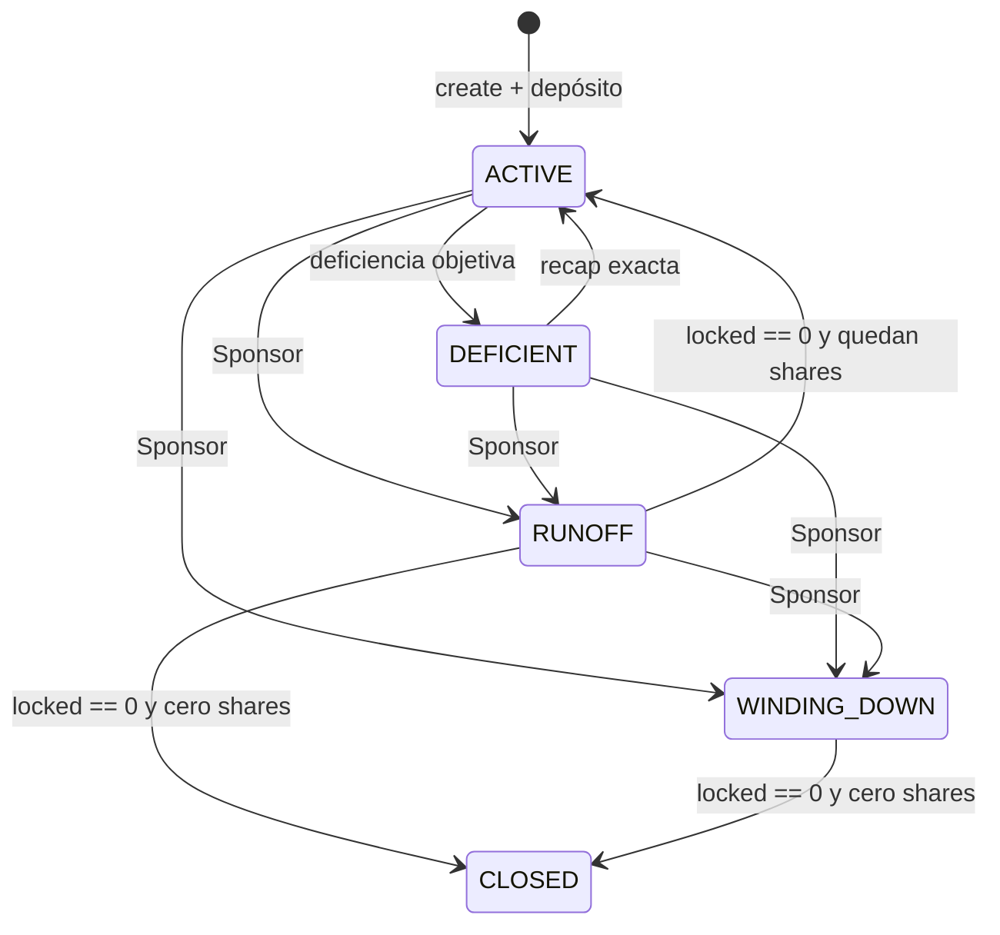

# PluriSwap — Protocolo

Este es **el** documento del protocolo: visión, espíritu, diseño y decisiones de implementación. Absorbe y reemplaza la documentación que vivía en archivos separados: `ARCHITECTURE.md`, `STATE_MACHINE.md`, `ENCODING.md`, `PACKAGES.md`, `PROTECTION.md`, `PRIVACY.md`, `PRIVACY_IMPL.md`, `POOLS.md`, `POOL_SHARES_IMPL.md`, `POOL_IMPL.md`, `RAMPS.md`, `IMPLEMENTATION.md`, `PLAN.md`, `REVIEW.md`, `TESTNET_PLAN.md`. El historial de cada uno queda en git; el mapa de citas legacy está en el Apéndice A.

Un archivo queda fuera del monolito por necesidad operativa, no por fragmentación:

- `KLEROS_POLICY.md` — la policy que leen los jurados de Kleros. Se pinea a IPFS como `KLEROS_POLICY_URI` (parte V.8). Es un artefacto servido a un tribunal, no documentación de protocolo.

Cómo leerlo. Parte I (visión) y II (espíritu) son el porqué. Parte III es el diseño normativo: si un comportamiento no está ahí, está prohibido. Parte IV es el registro de decisiones cerradas, fechado. Parte V es la implementación. Los conflictos se resuelven hacia arriba: una decisión posterior (IV) pisa el diseño (III); el espíritu (II) le gana a todo.

---

## Parte I — Visión

### 1.1 Qué es PluriSwap

Un escrow de principal cripto contra fiat offchain. Dos personas acuerdan fuera de la chain — una entrega stablecoins, la otra paga fiat — y el protocolo custodia la pata cripto hasta que el acuerdo se cierra: pago probado, acuerdo firmado, reloj vencido o veredicto. El protocolo no toca fiat, no autentica pagos por sí solo y no conoce a las personas.

### 1.2 El mundo que quiere

Comercio cripto↔fiat persona a persona sin un intermediario que te conozca, te catalogue o pueda cerrarte la puerta. Las ramps custodiadas exigen entregar identidad e historial a cambio de acceso; el OTC "de confianza" sin escrow es una estafa esperando turno. PluriSwap existe para que dos extraños hagan negocio sin que ninguno — ni un tercero — rinda su privacidad.

Mercado inicial: Europa y Latam. El dolor es compartido: cuentas congeladas por recibir transferencias de terceros, debanking del que vende cripto, KYC que convierte cada trade en un registro permanente. La respuesta de diseño es doble: un protocolo que nadie controla y una capa de reputación que no expone personas.

### 1.3 Los cuatro pilares

1. **Kernel muerto.** Un contrato sin dueño, sin pausa, sin allowlist, sin upgrade. La neutralidad no es un estilo: es la defensa legal del protocolo y la garantía de que nadie puede cerrar el recinto.
2. **Privacidad como valor de diseño.** Reputación sin identidad: sujetos desvinculables, stats ocultas, divulgación voluntaria. La privacidad no es un feature que se agrega; es un constraint que decide la arquitectura.
3. **Todo opt-in por firma.** Protección, fees, tribunales: nada se impone. El deal nombra `packageId`s; lo que no se firmó no existe para ese deal.
4. **Sin entidad detrás del protocolo.** Quien monetiza u opera puntos de acceso es visible y asumido: la DAO administra fees, Labs provee infraestructura, los Sponsors operan pools. El protocolo en sí no tiene a quién demandar.

### 1.4 Quién es quién

| Actor | Qué es | Qué no es |
| --- | --- | --- |
| Protocolo (kernel) | Máquina de estados + caja, inmutable | Una empresa, una plataforma, un servicio |
| Partes del deal | Holder, Provider, Controller | Usuarios "de" alguien |
| DAO | Gnosis Safe M-de-N, recipient de fees | Un operador, un gate, un actor del escrow |
| PluriSwap Labs | Entidad de infraestructura (paquetes, backend, frontend) bajo MSA con la DAO | El dueño del protocolo, un exchange, un custodio |
| Sponsors de pool | Operadores de liquidez de terceros, responsables de su propio cumplimiento | Perfiles del kernel |
| Kleros / Human Passport | Dependencias externas, elegidas por firma en el `packageId` | Partes del protocolo |

### 1.5 La pata fiat

Offchain, siempre. El protocolo autentica proofs (ZK), espera acuerdos (dual-sign), respeta relojes o recibe veredictos (Kleros). La finalidad del fiat — chargebacks, Pix MED, transferencias reversibles — es riesgo de las partes, declarado en la política de disputas: la pata cripto es final, la pata fiat no lo es nunca.

---

## Parte II — Espíritu

Catorce principios. Si un diseño propuesto viola uno, no es una extensión: es otro protocolo.

1. **El kernel está muerto.** Sin dueño, sin pausa, sin allowlist, sin upgrade, constructor vacío. Neutralidad = defensa legal.
2. **Mandatory Core.** Cualquier Holder y cualquier Provider activan, fondean y llegan a terminal sin paquetes, pool, rampa, DAO ni frontend. Core no es un modo degradado: es el recinto.
3. **Publicar ≠ usar.** Cualquiera publica un paquete compatible (PERM-03); usarlo exige que las partes firmen ese `packageId` (TRUST-02).
4. **Privacidad por diseño.** Sujeto ≠ wallet. Dos deals del mismo sujeto no se linkean on-chain. Disputar = salir a la luz: declarado, raro y caro.
5. **Quien firma es quien cobra.** Las addresses de firma son los destinos. No hay campo receiver, no hay payout redirigido, el Controller nunca cobra principal.
6. **El dinero se mueve con culpa probada o acuerdo probado.** Sin veredicto no hay slash — el bond no se mueve nunca por inacción. Pero abandonar una pelea que abriste **es** el acuerdo: el que la abre y la deja vencer la pierde, y el principal va entero a la otra parte. Antes esto era un 50/50, y un 50/50 sobre un he-said-she-said le paga al que no puso nada.
7. **El happy path es gratis; desviarse cuesta.** Contest fee no-cero y sin devolución al ganador (una disputa implica que ambas partes fallaron en elegir contraparte). Completion fee sólo si el Provider cobró algo y el terminal no es `STALEMATE`. Refund y stalemate nunca pagan; un dispute abandonado sí, porque un trade cerró.
8. **La DAO es recipient, nunca actor.** El kernel no la nombra. Sin verbo on-chain sobre nada. Fee policy nueva = módulo nuevo + `packageId` nuevo + firmas nuevas.
9. **Labs es infraestructura, no plataforma.** Backend read-only, open source, corrible por terceros, sin custodia de fondos ni claves, sin matching, sin contacto fiat. Cobra por MSA a la DAO; nunca es `feeRecipient`.
10. **Los pools son de sus Sponsors.** El protocolo no cobra por pools ni opera el descubrimiento. El cumplimiento de cada pool es local a quien lo abre.
11. **Fees en el paquete, no en el deal.** El deal nombra IDs; los paquetes nombran montos y recipients. Un clon con fee cero es otro hash.
12. **Un escritor, un motor.** El escrow escribe todo estado del deal y mueve todo principal. Credit-first: un `transfer` fallido no reescribe el terminal. EP-POST nunca revierte el escrow.
13. **Los relojes son de las partes y los ejecuta cualquiera.** Duraciones firmadas, timeouts permissionless, sin liveness privilegiada. Los derechos no caducan porque un keeper no actuó.
14. **Completitud.** Una transición no definida está prohibida; un rol no tiene autoridad no definida y consentida; un movimiento económico no definido está prohibido. En una carrera, gana la primera transacción exitosa.

---

## Parte III — Diseño

### 3.1 Recinto y capas

El recinto de settlement es **una chain y un deployment**. Hoy: Arbitrum, dominio EIP-712 `PluriSwap` / `1`.

```
                    ┌─────────────────────────────────────┐
  Holder ──pull──►  │  Escrow = máquina + caja del deal   │
  Provider ◄─credit │  único escritor de estado Core      │
  Controller opera  │  único que mueve principal          │
                    └──────────────┬─────────────────────┘
                                   │ verbos (unidireccional)
                                   ▼
                    cualquier impl compatible (opt-in por deal)
                    Passport / Reputation / Bonds / ZK / Court
                    BondVault es otra caja (skin, no principal)

  Pool  = Holder-contrato (EIP-1271 + pull). No es un perfil del kernel.
  Rampa = composer delante o detrás. No tiene verbo.
  DAO   = recipient que *un* paquete puso en su hash. Nunca caller.
```

Cinco capas. El kernel no absorbe las otras.

| Capa | Qué es | Qué no es |
| --- | --- | --- |
| **Kernel** | Máquina + custodia de principal. Consentimiento, catálogo, pull exacto, créditos, clocks | Identidad, tribunal, verifier, NAV, bridge, catálogo de vendors |
| **Paquetes** | Módulos opt-in detrás de verbos y *kinds* nombrados. El deal nombra `packageId`s | Escritores de estado Core. Cajas de principal. Un allowlist del constructor |
| **BondVault** | Caja de skin, keyeada por sujeto | El escrow. Un fee. La DAO |
| **Pool** | Servicio de liquidez que *es* el Holder | Un perfil `POOL`, un mandato, un fee de Controller en el kernel |
| **Rampa** | Composer de token hacia/desde el Holder | Estados `BRIDGING_*`. `invoice` de protocolo |

Reglas de borde:

- El kernel llama a los paquetes. Los paquetes no llaman al kernel para escribir el deal.
- Un paquete no devuelve receivers, outcomes ni destinos de principal.
- Un pool no abre otro catálogo. Produce el mismo `HolderAuthorization`.
- Una rampa termina antes de `activate` o después de `withdraw`.
- Upgrade, pause o delisting de un paquete no mutan un deal ya snapshotado. Las salidas Core siguen.
- No hay registry como gate de `activate`. Anunciar impls es un servicio; ejecutar no lo pide.

El kernel no tiene dueño, no pausa, no lista paquetes, no endosa impls. Cualquiera despliega un escrow. Cualquiera publica un paquete. Las partes eligen IDs. El relayer trae las addresses. El kernel verifica y snapshottea.

### 3.2 Superficie del kernel

El kernel ve tres roles: **Holder**, **Provider**, **Controller**. No ve Sponsor, LP, rampa ni DAO.

**Qué guarda.** Por `dealId`: status, `DealTerms`, orígenes de reloj, sujetos (si hay), addresses resueltas de los módulos de *ese* deal, bitmap de kinds, `holderAmt`/`providerAmt` al terminal, outcome paramétrico (`closeH`/`closeP`/`bondAction`), bits post-terminal pendientes. Por firmante: `used[signer][nonce]`. Por token y beneficiario: créditos maduros.

No guarda un set mundial de paquetes. No guarda fees ni receivers: viven en el `packageId`.

**Entrypoints por clase:**

| Clase | Quién | Ejemplos |
| --- | --- | --- |
| Activación | Relayer cualquiera | `activate` (módulos en calldata, no en el digest) |
| Autoridad de rol | Provider o Controller snapshotado | `markFiat`, `cancelByProvider`, `release`, `openDisputed`, `openCourt` |
| Permissionless | Cualquiera | `timeoutFiat`, `claim`, `forceDisputeTimeout`, `forceArbitrationTimeout`, `verifyProof` |
| Dual-sign | Relayer; firman Provider + Controller | `mutualCancel`, `coSignedRelease`, `mutualSplit` |
| Lectura de extensión | Cualquiera, si el perfil está on | `readRuling` |
| Crédito | Beneficiario | `withdraw` |
| Nonce | `msg.sender` | `cancelNonce` |
| Post-terminal | Cualquiera | `retryPostTerminal` — reintenta los consumidores EP-POST que fallaron en `_close` |

**Dependencias.** El kernel no importa implementaciones: habla interfaces. OpenZeppelin sólo para crypto, ERC-20 y reentrancy. El borde con los paquetes (`resolve`, `engage`, invoice, `runPostTerminal`) vive en la librería externa `Packages` (DELEGATECALL, mismo contexto de storage y custodia): reparto de bytecode, no de confianza. El constructor del escrow no recibe paquetes: un escrow vacío es un recinto Core completo.

**Lectura — `IEscrow`.** Cualquier contrato (paquete, pool, rampa, indexer) lee el recinto por `src/interfaces/IEscrow.sol`: `terms`, `clocks`, `subjects`, `modules`, `kinds`, `settlementOf`, `status`, `creditOf`, `domainSeparator`, `used`, `dealOf`. `notifyTerminal` recibe el sujeto snapshotado, no re-identifica.

### 3.3 Resolución permissionless de `packageId`

`DealTerms.packageIds`: identidades content-addressed, canónicas (únicas, orden ascendente). El deal no firma addresses, `daoFee` ni amounts.

En `activate`, el calldata trae `PackageMods` — cinco slots, uno por kind, no firmados: `passport | reputation | bonds | zk | court`. Por cada slot no nulo, el kernel:

1. Lee la policy pública del módulo (getters que entran al hash).
2. Recomputa `id = PackageId.kind(address, policy)`.
3. Exige que `id` esté en `terms.packageIds`.
4. Si hay Reputation o Bonds, exige `module.passport() == mods.passport`.

Y exige que **cada** `packageIds[i]` haya sido reclamado por exactamente un slot: si sobra un ID o un módulo, reject. Core-only: array vacío, slots nulos.

`packageId = hash(kind, address del módulo, policy)`. La fórmula es del kernel, no un catálogo de vendors: cualquier impl cuyo hash esté firmado resuelve. Un relayer no puede colar otro módulo: el ID firmado bindea la address. Un módulo en el slot equivocado produce otro kind-hash y no matchea. Mentir sobre la policy solo produce *otro* ID; si las partes no lo firmaron, no hay deal.

Incompatibles al resolver: ZK + ARBITRATION. Reputación sin Passport. Bonds sin Passport + Reputación.

**Snapshot y drift.** En `FUNDED` quedan las addresses resueltas y el bitmap. Los verbos posteriores usan ese snapshot. El kernel re-verifica el ID contra los getters en vivo en cada invoice y dispose: un módulo que deriva su policy (proxy, fee mutable) pierde el cobro — fee 0 en completion, fail-open en la disposición de bonds — y `verifyProof`/`openCourt` lo rechazan (`PackageDrift`). Las salidas Core del deal siguen (KERNEL-04).

| Invariante | Significado |
| --- | --- |
| PERM-03 | Cualquiera publica un contrato que cumple la interfaz, sin pedir permiso |
| PERM-05 / PERM-08 | Endoso, frontend o registry no son gate de `activate` |
| TRUST-02 | Usarlo exige que las tres partes firmen ese `packageId` |
| EXT-10 | El kernel snapshottea address (+ kinds) en activación; drift posterior no muta el deal vivo |
| KERNEL-04 | Sin paquete, o paquete hostil: las salidas Core de *ese* deal siguen; un fee que no cabe en el leftover (`fee >= left`, igualdad incluida) se omite |

### 3.4 Contrato de paquete (interfaces)

Los *kinds* son la superficie cerrada de extensión (EXT-01). Cinco. Un kind nuevo es versión nueva de kernel. Las impls de cada kind son permissionless.

| Interfaz | Kind | Verbos | Policy que entra al `packageId` |
| --- | --- | --- | --- |
| `IPassport` | PASSPORT | `identify` | address del adapter (decoder y `minScore` inmutables) |
| `IReputation` | REPUTATION | `admit`, `invoiceActivation`, `invoiceCompletion`, `invoiceContest`, `notifyTerminal` | module, feeRecipient, activationFee, completionFee, contestBps, contestFloor |
| `IBondVault` | BONDS | `reserve`, `unlock`, `slash`, `burn` | vault, sink, lock bps |
| `IPaymentProof` | ZK | `verifyProof`, `invoiceVerify` | module, verifier V, feeRecipient, verifyFee |
| `IVerifier` | (no es paquete) | `verify → (dealId, nullifier)` | — |
| `ICourt` | ARBITRATION | `openCourt`, `readRuling`, `packageBinding` | adapter, partner, key |

`admit` / `notifyTerminal` / `verifyProof` / `reserve` / `dispose` / `openCourt` los llama el kernel. Un extraño no es el kernel. Cada impl bindea un `operator` inmutable (el escrow) al deploy.

### 3.5 Roles y consentimiento

| Rol | Dueño de | Sobre el deal puede | No puede |
| --- | --- | --- | --- |
| **Holder** | El principal | Producir la autorización EIP-712; ser fuente y destino del principal | Redirigir el retorno tras activación; operar si no es también Controller |
| **Provider** | El fiat (offchain) | Firmar términos; marcar fiat, cancelar antes de fiat, dual-sign, claim tras deadline | Claim antes del deadline; marcar fiat sin activar |
| **Controller** | Nada del principal | Obtener la autorización del Holder y operar: activar, release, `DISPUTED`, dual-sign, abrir arbitraje si está seleccionado | Inventar la firma del Holder; recibir principal; cambiar Holder o Provider |

Persona a persona es el caso degenerado: `Holder == Controller`, una sola firma holder-side. Un pool es el caso contractual: el contrato es el Holder y nombra a un Controller en el mismo typed data. El kernel no tiene un path "pool" y otro "wallet".

**Consentimiento.** El Controller recolecta: `HolderAuthorization` (EIP-712 del Holder, ECDSA o EIP-1271) + firma del Provider (mismos términos) + `ControllerAcceptance` (solo si `Holder ≠ Controller`, para no colgar el rol a quien no lo pidió). Activación atómica: verifica firmas → pull exacto desde el Holder → `FUNDED`. Después de `FUNDED`, el Holder no vuelve a firmar; el Controller hace todo el lado holder.

La verificación es la misma para EOA y contrato: `ecrecover == Holder` o `IERC1271.isValidSignature(digest, bytes) == MAGICVALUE`. El kernel no interpreta las `bytes`.

**Pull exacto.** El kernel verifica el digest y observa un movimiento exacto desde el Holder hacia sí mismo, en la misma tx. Cómo el Holder se volvió pullable es local: `approve` + `transferFrom`, Permit2, o transfer del propio contrato. ERC-2612 no alcanza si el Holder es un contrato. Fee-on-transfer y rebase no activan: el delta tiene que ser exacto.

**Qué no cubre la autorización.** Redirigir holder-gross, nombrar otro payout del Provider, cambiar Holder/Provider después, reusar el nonce en otro fill, autorizar otro principal u otro Controller. Pull sin digest válido o digest con pull incompleto: rechaza atómico, sin nonce consumido.

**Factibilidad.** Este recorte es un patrón existente (Safe, Permit2, Seaport). No es bloqueo de máquina: un 1271 que dice sí a todo solo puede vaciar *ese* Holder; un proxy upgradeable entre firma y activación es riesgo del Holder-contrato (o se bindea code hash en términos y el stale rechaza); tokens no estándar no activan.

### 3.6 Estados

Core (siempre presentes):

| Estado | Clase | Significado |
| --- | --- | --- |
| `FUNDED` | Activo | Principal en custodia; fiat aún no marcado |
| `FIAT_SENT` | Activo | El Provider afirmó envío fiat; corre el release deadline |
| `DISPUTED` | Activo | Freeze abierto por el Controller; claim y release unilateral deshabilitados |
| `RELEASED` | Terminal | Principal al Provider (release, co-signed release, o payment proof) |
| `CLAIMED` | Terminal | Principal al Provider por timeout: fiat marcado, el Controller nunca liberó |
| `RESOLVED_SPLIT` | Terminal | Split dual-firmado |
| `STALEMATE` | Terminal | 50/50 de protocolo: arbitraje rehusado o arbitration timeout. Nadie abandonó nada — el tribunal no decidió. Bonds: se devuelven |
| `ABANDONED` | Terminal | El Controller abrió `DISPUTED` y dejó vencer el reloj sin acordar ni escalar. Principal **entero al Provider**. Bonds: se devuelven |
| `CANCELLED` | Terminal | Principal al Holder (cancel Provider, fiat timeout, o mutual cancel) |

`CLAIMED` es estado propio (valor 10): misma economía que `RELEASED`, distinto origen y distinta lectura para reputación (Provider Peaceful, Holder Silent). `ABANDONED` (valor 11) es el otro: misma economía, y la lectura registra la culpa asumida del que abrió (Provider Peaceful, Holder Stalemate +5). Los valores se agregan al final: un `Status` guardado lo leen pools, el lab e indexers.

Solo perfil ARBITRATION:

| Estado | Clase | Significado |
| --- | --- | --- |
| `ARBITRATION_ACTIVE` | Activo (extensión) | Disputa externa abierta; corre el arbitration deadline |
| `RESOLVED_BY_ARBITRATION` | Terminal (extensión) | Ruling autenticado holder-win o provider-win |

Si ARBITRATION no está seleccionado, esas aristas rechazan o están ausentes. No existen como stubs muertos presentados como capacidad.

### 3.7 Grafo

Líneas sólidas = Mandatory Core. Punteadas = sólo si el perfil está firmado.

```mermaid
stateDiagram-v2
    [*] --> FUNDED: activación atómica
    FUNDED --> FIAT_SENT: Provider marca fiat
    FUNDED --> CANCELLED: cancel Provider, fiat timeout, mutual cancel
    FIAT_SENT --> RELEASED: Controller release o co-signed release
    FIAT_SENT --> CLAIMED: claim tras release deadline
    FIAT_SENT --> RESOLVED_SPLIT: split dual-firmado
    FIAT_SENT --> CANCELLED: mutual cancel
    FIAT_SENT --> DISPUTED: Controller abre DISPUTED
    DISPUTED --> CANCELLED: mutual cancel
    DISPUTED --> RELEASED: co-signed release
    DISPUTED --> RESOLVED_SPLIT: split dual-firmado
    DISPUTED --> ABANDONED: timeout — cualquiera lo ejecuta; el que abrió, perdió
    FUNDED --> RELEASED: payment proof
    FIAT_SENT --> ARBITRATION_ACTIVE: Controller abre arbitraje
    DISPUTED --> ARBITRATION_ACTIVE: Controller abre arbitraje
    ARBITRATION_ACTIVE --> RESOLVED_BY_ARBITRATION: ruling Holder o Provider
    ARBITRATION_ACTIVE --> STALEMATE: refused o arbitration timeout
    ARBITRATION_ACTIVE --> RELEASED: co-signed release
    ARBITRATION_ACTIVE --> RESOLVED_SPLIT: split dual-firmado
    ARBITRATION_ACTIVE --> CANCELLED: mutual cancel
```



Tres caminos Core que cualquier implementación conforme debe ejecutar **sin paquetes**:

1. **Éxito no contestado.** activar → `FUNDED` → `FIAT_SENT` → release del Controller, dual-sign, o claim permissionless tras el release deadline.
2. **Contestación Core.** activar → `FUNDED` → `FIAT_SENT` → Controller abre `DISPUTED` → dual-sign (incluido split), o cualquiera ejecuta el timeout tras `disputeDeadline` y el deal cierra en `ABANDONED`: abrir una pelea y no sostenerla es perderla.
3. **Fiat timeout en `FUNDED`.** Desde `fiatDeadline`, cualquiera cancela y devuelve principal al Holder. Corre contra mark-fiat; no auto-cancela.

Core no tiene tribunal externo. Abrir `DISPUTED` congela el claim; no adjudica si el fiat se pagó.

### 3.8 Relojes

Deadlines sobre el timestamp canónico de la chain. Cada origen se escribe una vez. Las **partes** eligen las duraciones (van en los términos, las cubre la firma, el snapshot las congela). Único bound del kernel: `duration >= 0`. Cero: elegible en cuanto existe el origen. Un reloj de años es riesgo de las partes.

| Reloj | Origen | Efecto permissionless |
| --- | --- | --- |
| `fiatDeadline` | activación + fiat duration | Cualquiera cancela desde `FUNDED` (Holder-favorable). Corre contra mark-fiat |
| Release deadline | `FIAT_SENT` + release duration | Cualquiera claim (silencio = no-contestación). Abrir `DISPUTED`/arbitraje sólo **estrictamente antes** |
| `disputeDeadline` | `DISPUTED` + dispute duration | Cualquiera ejecuta el timeout: el que abrió la disputa la pierde (`ABANDONED`). Abrir arbitraje desde `DISPUTED` sólo **estrictamente antes** |
| Arbitration deadline | `ARBITRATION_ACTIVE` + arbitration duration | Cualquiera ejecuta stalemate. No exige respuesta del adapter |

El timeout de `DISPUTED` paga el principal entero al Provider; no hay bps de residual. Los derechos de timeout no caducan porque un keeper no actuó: siguen ejecutables hasta que otra transición válida gane.

**Un reloj en cero no es un reloj corto.** Que el único bound del kernel sea `duration >= 0` es la decisión correcta —las duraciones son de las partes y la firma las cubre; un kernel con mínimos sería un kernel con una opinión sobre cuánto tarda una transferencia bancaria— pero deja cuatro configuraciones que le regalan el deal a una parte, todas alcanzables con términos que ambas firmaron de buena fe:

| Reloj en 0 | Qué hace la chain | Quién pierde |
| --- | --- | --- |
| `fiatDuration` | `timeoutFiat` es elegible en el bloque de la activación | El Provider que ya mandó el fiat se queda sin escrow |
| `releaseDuration` | `markFiat` + `claim` en el mismo bloque, sin probar nada — y `openDisputed` ya es `TooLate` | El Holder pierde el principal entero y ni siquiera tiene el freeze |
| `disputeDuration` | Abrir `DISPUTED` es un forfeit inmediato: se abandona en el bloque en que se abre | La única defensa del Holder le entrega el principal entero |
| `arbitrationDuration` (con ARBITRATION) | `forceArbitrationTimeout` es elegible en el bloque en que se abre la corte | El tribunal no llega a fallar y el court fee ya salió de la wallet del opener |

Las cuatro están pineadas contra el kernel (`test/ZeroClocks.t.sol` y `Packages.t.sol`), no inferidas de esta spec.

**La protección es obligación del cliente**, y es superficie de protocolo aunque no viva en el bytecode. Un cliente conforme, antes de pedir una firma, revisa los relojes y separa dos cosas que no son la misma afirmación:

- *Peligro* — **un reloj en cero**, en cualquiera de los cuatro casos de la tabla de arriba, con la salvedad de que bajo `PAYMENT_PROOF` sólo `fiatDuration` corre (los otros tres son inertes: §3.12.1) y con ARBITRATION apagado `arbitrationDuration` se ignora. Nunca es intencional. Un cliente conforme **no deja firmar** sin un reconocimiento explícito, y ese reconocimiento se borra en cuanto los términos cambian.
- *Piso de producción* — un juicio, no protocolo, y por eso vive acá como recomendación y no como regla: `fiatDuration >= 30 min` (el Provider tiene que ver el deal, mover fiat por un banco y volver a marcarlo), `releaseDuration >= 2 h` (es el reloj que le paga al Provider por silencio: el Holder tiene que ver el fiat aterrizar, que en un banco tarda de minutos a días), `disputeDuration >= 24 h` (acordar o escalar necesita dos humanos despiertos en husos distintos) y, con ARBITRATION, `arbitrationDuration >= 7 días` (las rondas de Kleros, apelaciones incluidas, tardan días). Un techo también: por encima de un año el principal queda en custodia más de lo que nadie planifica.

El kernel no enforcea nada de esto y no debería: las duraciones son de las partes, y un mínimo de kernel sería una opinión sobre cuánto tarda una transferencia bancaria.

### 3.9 Catálogo Core de transiciones

| Caso | Desde | Quién / qué | Timing | Resultado |
| --- | --- | --- | --- | --- |
| CASE-CORE-01 | Sin deal | Relay de `HolderAuthorization` + firma Provider + pull exacto (+ `ControllerAcceptance` si `Holder ≠ Controller`) | Antes de creation expiry | Activa en `FUNDED` |
| CASE-CORE-02 | `FUNDED` | Provider marca fiat sent | Antes de que gane otra transición | `FIAT_SENT`; arranca release deadline |
| CASE-CORE-03 | `FUNDED` | Provider cancela | Antes de mark-fiat | Principal al Holder; `CANCELLED` |
| CASE-CORE-04 | `FUNDED` | Cualquiera ejecuta fiat timeout | En o después de `fiatDeadline` | Principal al Holder; `CANCELLED` |
| CASE-CORE-05 | `FUNDED` | Relay dual RES-01 (Provider + Controller) | Antes de expiry del payload | Mutual cancel |
| CASE-CORE-06 | `FIAT_SENT` | Controller libera | Antes de otro terminal | `RELEASED` al Provider |
| CASE-CORE-07 | `FIAT_SENT` | Cualquiera claim | En o después del release deadline | `CLAIMED` al Provider |
| CASE-CORE-08 | `FIAT_SENT` | Relay mutual cancel | Antes de expiry | Mutual cancel |
| CASE-CORE-09 | `FIAT_SENT` | Relay split RES-02 | Antes de otro terminal y expiry | `RESOLVED_SPLIT` |
| CASE-CORE-10 | `FIAT_SENT` | Relay co-signed release RES-03 | Antes de otro terminal y expiry | `RELEASED` al Provider |
| CASE-CORE-11 | `FIAT_SENT` | Controller abre `DISPUTED` | Estrictamente antes del release deadline; a lo sumo una vez | `DISPUTED`; arranca dispute deadline |
| CASE-CORE-12 | `DISPUTED` | Mutual cancel | Antes de expiry | Mutual cancel |
| CASE-CORE-13 | `DISPUTED` | Co-signed release | Antes de otro terminal y expiry | `RELEASED` al Provider |
| CASE-CORE-14 | `DISPUTED` | Split dual-firmado | Antes de otro terminal y expiry | `RESOLVED_SPLIT` según bps firmados |
| CASE-CORE-15 | `DISPUTED` | Cualquiera ejecuta el timeout | En o después de `disputeDeadline` | `ABANDONED`: principal entero al Provider; bonds se devuelven |
| CASE-CORE-16 | `DISPUTED` | Release unilateral o claim | Siempre | Rechaza; sin cambio económico |
| CASE-CORE-17 | Cualquier terminal | Cualquier acción que cambie estado | Siempre | Rechaza; sin cambio económico |

Dual-sign exige `MutualCancel` / `MutualSplit` / `CoSignedRelease` EIP-712 del Provider y del Controller snapshotados. Relayer cualquiera; cada uno trae su nonce.

Abrir `DISPUTED` es gratis en Core: sin fee y sin bond. Es el freno defensivo del lado Holder contra un claim no autenticado. No es tribunal, no es un win, no quema principal. Mata el `claim` mientras dura — **y por eso el reloj lo cobra**: si el que abrió no acuerda ni escala antes del `disputeDeadline`, pierde (§3.11 OUT-14). Congelar y esperar termina exactamente donde terminaba no congelar, así que el freno vale lo que tiene que valer: tiempo para acordar o para ir a corte, nada más. Pineado en `test/DisputeIncentives.t.sol`. El paquete de reputación oficial cobra un contest fee no-cero, una vez, de la wallet del opener (§3.14.6). Un clon con fee cero es otro hash. Court-only sin reputación sigue gratis.

Si el deal seleccionó `PAYMENT_PROOF`, CASE-CORE-11 rechaza: ese escrow no entra a `DISPUTED` (§3.12.1).

### 3.10 Carreras

Entre transiciones simultáneamente elegibles, gana la primera que cambia estado. Las incompatibles posteriores rechazan.

| Caso | Competidores |
| --- | --- |
| CASE-RACE-01 | Desde `FUNDED`: mark-fiat, cancel Provider, fiat timeout, mutual cancel; proof si está habilitado |
| CASE-RACE-02 | Desde `FIAT_SENT`: release, claim, abrir `DISPUTED`, dual-sign, proof, abrir arbitraje |
| CASE-RACE-03 | Abrir `DISPUTED`/arbitraje vs claim en el borde del release deadline: opens sólo **antes**; claim sólo **en o después**. Nunca elegibles al mismo timestamp |
| CASE-RACE-04 | Desde `ARBITRATION_ACTIVE`: ruling, timeout, dual-sign |
| CASE-RACE-05 | Desde `DISPUTED`: dual-sign, stalemate tras `disputeDeadline`, abrir arbitraje |
| CASE-RACE-06 | Ruling final vs arbitration timeout: gana el primero |
| CASE-RACE-07 | Relays duplicados: tras éxito, el siguiente cambio de estado rechaza |
| CASE-RACE-08 | Dual-sign vs stalemate en el borde de `disputeDeadline` |

Carrera intencional en `fiatDeadline`: timeout cancel y mark-fiat son elegibles a la vez. Core no auto-cancela. La protección del Holder es **ejecutar** el timeout, no la expiración pasiva.

### 3.11 Outcomes terminales

Un deal produce a lo sumo un resultado económico terminal. Settlement reasigna la posición a créditos irrevocables. El fallo de un `transfer` no reescribe el outcome (credit-first). El Controller no aparece en esta tabla: no es un lado económico.

| Outcome | Estado | Principal | Perfil |
| --- | --- | --- | --- |
| OUT-01 Voluntary release | `RELEASED` | 100% Provider | Core (off si `PAYMENT_PROOF`) |
| OUT-02 Co-signed release | `RELEASED` | 100% Provider | Core |
| OUT-03 Payment-proof release | `RELEASED` | 100% Provider | `PAYMENT_PROOF` |
| OUT-04 Timeout claim | `CLAIMED` | 100% Provider | Core, desde `FIAT_SENT` (off si `PAYMENT_PROOF`) |
| OUT-05 Provider cancel | `CANCELLED` | 100% Holder | Core |
| OUT-06 Fiat-timeout cancel | `CANCELLED` | 100% Holder | Core |
| OUT-07 Mutual cancel | `CANCELLED` | 100% Holder | Core |
| OUT-08 Mutual split | `RESOLVED_SPLIT` | bps firmados, **después** del completion fee sobre el principal completo | Core; también desde `DISPUTED` |
| OUT-09 Arb holder win | `RESOLVED_BY_ARBITRATION` | 100% Holder | `ARBITRATION` |
| OUT-10 Arb provider win | `RESOLVED_BY_ARBITRATION` | 100% Provider | `ARBITRATION` |
| OUT-11 Arb refused | `STALEMATE` | 50/50; **sin** completion fee | `ARBITRATION` |
| OUT-12 Arb timeout | `STALEMATE` | 50/50; **sin** completion fee | `ARBITRATION` |
| OUT-14 Dispute abandonado | `ABANDONED` | 100% Provider; cualquiera lo ejecuta; **con** completion fee — un trade cerró | Core (off si `PAYMENT_PROOF`) |

**Completion fee.** Lo declara el paquete, no un campo del deal. Base: siempre el **principal completo**, nunca la tajada de un split. Se cobra si el Provider cobra algo y el terminal no es `STALEMATE`; nunca en un refund. Si no cabe en el leftover (`fee >= left`, igualdad incluida), **no se cobra** y el terminal commitea igual: un fee igual al pot dejaría en cero a la parte que acaba de ganar. En split: fee sobre el principal entero, deducido primero, bps después. Un split chico no achica el fee.

**Bonds** (si el paquete está seleccionado): viven en el BondVault, no en el escrow. Unlock en todo terminal pacífico, en `STALEMATE` y en `ABANDONED`. Slash sólo en OUT-09/OUT-10: lock del perdedor a la address de firma del ganador (nunca el Controller). **Ningún camino del kernel quema**: `BondAction.Burn` existía sólo para el viejo 50/50 del timeout de `DISPUTED`, donde era el parche económico que hacía costar un 10% congelar y esperar; con el forfeit el disuasivo es estructural y el parche se queda sin productor. Detalle en §3.14.5.

Claim no autentica fiat. Fiat timeout no es culpa del Provider. `ABANDONED` sí asigna culpa, pero asumida, no probada: por eso mueve el principal (que la parte que no abandonó habría cobrado igual sin la pelea) y no el bond, que sólo se mueve con veredicto (II.6). En un deal ZK, fiat timeout es la única salida sin proof: esperado, no un fallback extra.

### 3.12 Puntos de extensión

Tres clases. Sólo la primera añade estados o aristas. Las otras tocan activación, reservas o consumidores post-terminal **sin** abrir el catálogo. Delegar el proceso en un Controller **no** es una extensión: es Core (§3.5).

#### 3.12.1 EP-EDGE-PROOF — `PAYMENT_PROOF`

Habilita release automático autenticado. El deal firmó un verifier V: sólo un proof de V cuenta; cualquier otro se ignora.

Si el perfil está seleccionado, el escrow es **proof o timeout**. No entra a `DISPUTED`; tampoco hay claim ni release unilateral del Controller. El grafo de ese deal: `FUNDED` + proof de V → `RELEASED`; `FUNDED` + `fiatDeadline` (o cancel/mutual cancel) → `CANCELLED`. Si el fiat no se prueba a tiempo, el principal vuelve al Holder: las partes acordaron V y una no cumplió. El Provider que pagó offchain y no obtuvo proof no tiene claim.

| Caso | Desde | Quién | Resultado |
| --- | --- | --- | --- |
| CASE-PAY-01 | `FUNDED` | Cualquiera con proof autenticado de V | `RELEASED` al Provider |

Contrato de extensión:

- Verifier y policy inmutables en los términos (identidad de paquete, no un address suelto). El verifier autentica evidencia; decodificar claims del caller no es verificación.
- Public inputs incluyen el `dealId` de este escrow. Un proof de otro deal no verifica.
- `paymentNullifier` del receipt autenticado: un pago liquida a lo sumo un deal bajo V. Gastado → reject. Distinto del nullifier de Passport.
- Autenticación, consumo de nullifier, transición, principal y fee ZK commit o revert juntos.
- El fee ZK se cobra **al verificar**, no en activación. Timeout: no hubo verificación, no hay fee.
- El verifier no redirige settlement ni cambia términos.

#### 3.12.2 EP-EDGE-ARB — `ARBITRATION`

Tribunal externo opcional. No reemplaza `DISPUTED`: escala a un ruling autenticado cuando las partes eligieron esa dependencia.

| Caso | Desde | Quién | Resultado |
| --- | --- | --- | --- |
| CASE-ARB-01 | `FIAT_SENT` | Controller paga fee y abre | `ARBITRATION_ACTIVE` |
| CASE-ARB-02 | `DISPUTED` | Igual, estrictamente antes de `disputeDeadline` | `ARBITRATION_ACTIVE`; **retira** el dispute timeout Core |
| CASE-ARB-03 | `ARBITRATION_ACTIVE` | Adapter autentica holder win | `RESOLVED_BY_ARBITRATION` |
| CASE-ARB-04 | `ARBITRATION_ACTIVE` | Adapter autentica provider win | `RESOLVED_BY_ARBITRATION` |
| CASE-ARB-05 | `ARBITRATION_ACTIVE` | Adapter autentica refused | `STALEMATE` 50/50 |
| CASE-ARB-06 | `ARBITRATION_ACTIVE` | Cualquiera ejecuta arbitration timeout | `STALEMATE` 50/50 |
| CASE-ARB-07..09 | `ARBITRATION_ACTIVE` | Dual-sign cancel / split / co-signed release | Terminal Core correspondiente |

Contrato de extensión:

- Adapter y policy inmutables en los términos. Sin selección, abrir arbitraje rechaza.
- **Sólo el Controller** abre corte. El Provider no. Un relayer sólo transporta el open del Controller.
- Espacio de rulings cerrado: holder win, provider win, refused. Ruling parcial, receptor alterno o fee discrecional rechazan.
- El adapter no mueve custodia: comunica un significado; el kernel aplica el mapa económico predeterminado.
- Fee de corte lo paga la **wallet del opener** (ETH a KlerosCore), no el principal ni el Holder.
- Abrir desde `DISPUTED` abandona el stalemate Core y lo reemplaza por el mapa de arbitraje.
- Si el adapter o el tribunal desaparecen, el timeout de arbitraje es la liveness de ese path. El costo de arbitraje ya pagado no se recupera.
- Delisting, pause o overwrite de policy no pueden hacer que el protocolo rechace un ruling auténtico bajo la policy snapshotada, ni deshabilitar las salidas Core.

#### 3.12.3 EP-HOOK — ganchos acotados, sin nuevos estados

No añaden nodos al grafo. Reservan, validan o enriquecen. El kernel sigue siendo el único escritor y el único que ejecuta fórmulas de settlement.

**EP-HOOK-ACTIVATE (EXT-02, EXT-04).** La activación crea custodia sólo cuando consentimiento, nonce/expiry, funding exacto y reservas seleccionadas succeden atómicamente. Hooks permitidos: `BONDS` reserva colateral con fórmula de slash snapshotada; admission progresiva reserva exposición para deals futuros. Un hook no puede devolver destinos, receivers, outcomes, estados, predicados ni disposiciones arbitrarias. Si una reserva o hook requerido falla, Core rechaza: no hay activación parcial, no se consume nonce, bond/fee sin cambio.

**EP-HOOK-DISPUTE (DISPUTE-06).** La transición base CASE-CORE-11 es Core y ejecuta sin paquete. Un paquete puede exigir fee/bond de contest **sólo** si el deal lo seleccionó, y añadir evidencia enhanced fallando closed. No puede hacer de su disponibilidad un prerrequisito de abrir `DISPUTED`, ni inyectar duraciones no firmadas, ni convertir el open gratis de Core en peaje.

**EP-HOOK-SLOTS (EXT-11).** Los términos llevan slots para proof, arbitration, bonds, humanity/reputation. Con el perfil apagado, ausentes o inertes: no se cobran ni se enforzan.

**EP-HOOK-ADMISSION (EXT-10).** Todo componente custody-adjacent bindea chain, rol, address, identidad de código runtime, policy hash, terms hash y la autorización de admission **en activación**. El kernel snapshottea y no depende de approval posterior. Upgrade de proxy, pause de admin, delisting o drift no reescriben el snapshot ni deshabilitan las salidas Core. Admission gobierna deals futuros, no vivos.

#### 3.12.4 EP-POST — consumidores post-terminal (EXT-12)

Tras el commit, el kernel emite exactamente un terminal record inmutable (`settlementOf(dealId)` → `status`, `holderAmt`, `providerAmt`). En el mismo settlement atómico, reasigna la posición a créditos de beneficiario (EXT-08). El record se commitea **antes** de cualquier consumidor opcional y antes de un `transfer` que pueda revertir.

Consumidores permitidos, permissionless, idempotentes, a lo sumo una vez: ledgers de exposición, materializers de reputación, journals locales de un Holder-contrato (pool) que reconcilia su tesorería. Su fallo no revierte settlement, no bloquea deals ajenos, no muta principal activo. Callbacks de un Holder-contrato no corren en el path de settlement Core.

**El fallo se anuncia y se recupera.** `_close` corre una sola vez (la escritura de `status` hace revertir todo verbo posterior), así que un consumidor que falla ahí quedaría perdido si el kernel no guardara la deuda: `Deal.postPending` es un bitmask de llamadas pendientes, y `closeH`/`closeP`/`bondAction` conservan el outcome que las parametriza (no derivable de `status`: `STALEMATE` mapea a dos pares close/bond distintos y `RESOLVED_BY_ARBITRATION` a dos). `retryPostTerminal(dealId)` es permissionless e idempotente: reintenta sólo los bits pendientes; un bit se limpia únicamente cuando su propia llamada tuvo éxito, así que un reintento no puede aplicar dos veces un delta ni disponer dos veces un lock.

Dos límites deliberados. El bit de bond se **abandona** si el vault derivó de su `packageId` o dejó de responder: TRUST-03 lo hace fail-open permanente con el lock quedando en el vault. El bit de reputación **no** se abandona: una notificación no es un cobro, y soltarla en silencio escondería la fuga de capacidad del sujeto (`inFlight` consumido por un deal cerrado). Sin pendientes no se escribe storage: un terminal limpio o un deal Core-only no pagan el camino de retry.

Los dos casos son observables (§3.19), porque `postPending` es un getter y sólo lo lee quien ya sabe que el deal existe. `PostTerminalPending` anuncia la deuda cada vez que cambia; `BondDisposalAbandoned` anuncia el fail-open de TRUST-03, que hace falta aparte justamente porque limpia el bit igual que un éxito — `postPending == 0` no distingue "se entregó" de "se perdió el lock para siempre".

#### 3.12.5 Qué un punto de extensión nunca puede hacer

| Prohibición | Por qué |
| --- | --- |
| Escribir estado del deal | KERNEL-07: un solo escritor |
| Mover principal Core | Sólo el escrow, según el catálogo |
| Bloquear, retrasar o tasar un path obligatorio | KERNEL-04 |
| Inventar outcome, receptor o transición no listada | DEC-02, regla de completitud |
| Pausar una salida válida de un deal activo | DEC-04 |
| Mutar el snapshot de un deal vivo | DEC-03, EXT-05 |
| Exigir un server/keeper/signer del protocolo para una transición elegible | DEC-07 |
| Hacer endorsement, registry o frontend un gate de ejecución | PERM-05, PERM-08 |
| Inyectar fee DAO o de paquete en un deal que no lo seleccionó | EXT-03 |
| Callback de paquete después del commit terminal | EXT-04, EXT-06 |
| Presentar una arista de perfil apagado como capacidad | §3.6 |
| Quemar principal en un timeout Core | DISPUTE-05 |
| Meter gestión de pool, mandato o fee de Controller en el kernel | El kernel ve tres roles y `HolderAuthorization` |

### 3.13 Encoding EIP-712

Principio: **el envelope es estable; la extensión es un array de `packageId`**. Un paquete nuevo no cambia el typehash de Core. Un campo nuevo de Core es versión nueva de dominio (deployment nuevo, deals viejos intactos).

**Dominio.** `EIP712Domain(name "PluriSwap", version "1", chainId, verifyingContract)`. Sin `salt`. Replay cross-chain y cross-deploy lo corta el dominio. `version` es la del kernel, no la de un paquete. Verificación: `SignatureChecker.isValidSignatureNow` — EOA y EIP-1271, el mismo digest.

**Qué se firma y qué no.** Se firma lo que el kernel snapshottea. No se firma: fees (viven en el `packageId`), receivers (las addresses de firma son los destinos), `dealId` (nace en activación), sujeto/score/cap. Tres mensajes de activación, un struct de negocio compartido. Dual-sign, después de `FUNDED`, son types distintos: el deal ya existe, se firma `dealId` + acción.

**`DealTerms`:**

```solidity
struct DealTerms {
    address holder;
    address controller;
    address provider;
    address token;
    uint256 principal;
    uint256 fiatDuration;
    uint256 releaseDuration;
    uint256 disputeDuration;
    uint256 arbitrationDuration; // ignorado si ARBITRATION no está en packageIds
    bytes32[] packageIds;        // vacío = Core-only
}
```

Reglas: `principal > 0`; duraciones `>= 0`; `holder != provider`; `controller` puede ser `holder` pero no `provider`; `packageIds` **únicos y ordenados ascendente** (el kernel rechaza si no: el mismo set no tiene dos hashes). Cada `packageId` es el hash de contenido (código + policy + fees + sink/V/adapter). Si ZK está en el set, `DISPUTED` apaga; ZK + ARBITRATION juntos rechazan la activación.

`termsHash = hashStruct(DealTerms)` según EIP-712, nested: las wallets ven token, principal, roles, relojes y paquetes. Un `bytes32` opaco sería igual de extensible e ilegible para el firmante; campos de paquete sueltos romperían el typehash en cada experimento.

**Nonce por party.** Cada firma de activación trae **su** nonce; el mapa es `used[signer][nonce]`, no secuencial: cada address elige el número. Sin nonce del Provider, el mismo `ProviderAgreement` llenaría N deals idénticos: eso no es un OTC, es una orden abierta. Si la activación revierte, no se marca ninguno. `cancelNonce(nonce)` invalida el del `msg.sender` sin activar. Dual-sign también lleva nonce por party: el `dealId` bindea el deal, el nonce impide reusar el payload, el estado terminal corta el replay.

**Mensajes de activación:**

```
HolderAuthorization(DealTerms terms, uint256 nonce, uint256 deadline)
ProviderAgreement (DealTerms terms, uint256 nonce, uint256 deadline)
ControllerAcceptance(DealTerms terms, uint256 nonce, uint256 deadline)  // sólo si holder ≠ controller
```

`HolderAuthorization` autoriza pull exacto de `terms.principal` de `terms.token` desde `terms.holder` hacia el escrow, si se activa antes de `deadline` (expiry de la *autorización*, no reloj del deal). Si `holder == controller`, esa firma cubre ambos roles.

**`dealId`**, determinístico, nace en activación:

```
dealId = keccak256(abi.encode(
    DOMAIN_SEPARATOR,
    hashStruct(terms),
    holderNonce,
    providerNonce,
    holder == controller ? uint256(0) : controllerNonce
))
```

Bindea el fill completo (las tres nonces), no un contador de bloque. Es precomputable: el patrón prepare-then-activate de §3.15.3 lo necesita y lo tiene.

**Dual-sign (post-`FUNDED`).** Types distintos; firman el Provider y el Controller snapshotados; relayer cualquiera; mismas reglas de verificación. Cada party firma el mismo type con el mismo `dealId` y `deadline`, y su nonce. El kernel exige `dealId` y `deadline` idénticos entre copias; consume `used[provider][nonceP]` y `used[controller][nonceC]`.

```
MutualCancel(bytes32 dealId, uint256 nonce, uint256 deadline)
CoSignedRelease(bytes32 dealId, uint256 nonce, uint256 deadline)
MutualSplit(bytes32 dealId, uint16 providerBps, uint256 nonce, uint256 deadline)
```

`MutualSplit.providerBps` (0..10000) se aplica al resto **después** del completion fee. `providerBps = 10000` no sustituye a `CoSignedRelease`: type distinto, el wallet muestra otra intención. No hay dual-sign de "cambiar Holder". No hay payout. Cancel unilateral del Provider en `FUNDED` no usa estos types: es una llamada.

**Invariantes de encoding.** Un solo domain separator por escrow. `DealTerms` es la unidad de acuerdo. `packageIds` vacío = Core-only, orden canónico. Nonce por party, elegido. Destinos = `holder` y `provider` del struct. Dual-sign nombra `dealId`, no re-firma `DealTerms`. Bump de `EIP712Domain.version` = otro kernel.

### 3.14 Paquetes

Todos opt-in. Core-only no los necesita. El deal nombra **identidades de paquete**; amount, recipient y momento de cada fee viven en ese hash. Si el fee fuera parámetro del deal, se pondría a cero y se usaría el módulo gratis.

#### 3.14.1 Qué hace cada uno

| Paquete | Para qué | Punto en la máquina | Cobra | Dónde va el fee |
| --- | --- | --- | --- | --- |
| Human Passport | Raíz anti-Sybil | Admisión | No | — |
| Reputación | Cap del principal y fee de acceso | Activación (cap + fee); contest-open; completion; post-terminal (score) | Sí (oficial: no-cero) | Lo que diga el paquete (oficial: DAO) |
| Bonds | Suben el cap; skin-in-the-game | Activación (reserva); terminal (suelta/slash/quema) | No es fee: colateral | Slash: address de firma del ganador; quema: sink inmutable |
| ZK / payment proof | Auto-release autenticado; apaga `DISPUTED` | `FUNDED` → `RELEASED` | Sí, al verificar | Lo que diga el paquete (oficial: DAO) |
| Arbitraje | Tribunal cuando no hay ZK | `FIAT_SENT`/`DISPUTED` → `ARBITRATION_ACTIVE` | Court fee al abrir, de la wallet del opener | El tribunal |
| DAO | Recipient | — | No cobra por sí | — |

#### 3.14.2 Orden en activación

Si están seleccionados: (1) Passport identifica al sujeto (sin fee). (2) Reputación calcula `cap(score, bond)` y cobra su fee de activación; si `principal > cap`, no hay deal. (3) Bonds lockean en el vault. (4) ZK no cobra todavía. (5) Pull exacto del principal → `FUNDED`. Sin estos paquetes: sin cap, sin fee, sin Passport; el recinto Core sigue abierto.

#### 3.14.3 ZK: proof o timeout

El deal firmó el verifier V. Sólo V. Otro proof se ignora. Salidas: proof de V → `RELEASED` (ahí cobra el paquete ZK); `fiatDeadline` / cancel / mutual cancel → `CANCELLED` (no hubo verificación, no hay fee ZK).

**Un proof, un deal.** Dos amarres en la misma tx que `verifyProof`: el `dealId` va en los public inputs (las mismas bytes en otro deal fallan) y el `paymentNullifier` del pago fiat (rail + receipt, o nullifier del circuito) queda gastado: un segundo proof, aunque tenga otro `dealId`, no puede liquidar el mismo pago. Si el nullifier está gastado o el `dealId` no es el del escrow, `verifyProof` rechaza y el deal no cambia. Autenticación, consumo, `RELEASED` y fee commit o revert juntos.

#### 3.14.4 Disputa sin ZK y tribunal Kleros

`DISPUTED` se usa cuando el deal **no** seleccionó ZK: el Controller congela un claim no autenticado. Desde `DISPUTED`, en paz: mutual cancel (todo al Holder), co-signed release (todo al Provider), split (bps firmados; no es un veredicto, es un acuerdo parcial). Timeout de `DISPUTED` sin arbitraje: cualquiera, tras `disputeDeadline`, cierra en `ABANDONED` y el principal va entero al Provider — abrir una pelea y no sostenerla es perderla. El split dual-firmado, el co-signed release o abrir corte son las salidas *antes* de ese reloj.

**Kleros V2 (tribunal oficial).** PluriSwap toca a Kleros dos veces por deal: **abrir** (`Escrow.openCourt{value: arbitrationCost}(dealId)` desde `FIAT_SENT` o `DISPUTED`; sólo el kernel llama `KlerosAdapter.openCourt` → `createDispute` en KlerosCore, 2 opciones, evento `DisputeRequest` con `externalDisputeID = uint256(dealId)`) y **recibir** (los jurados votan, se agotan apelaciones, `KlerosCore` llama `KlerosAdapter.rule(disputeId, ruling)`; el adapter guarda 0→3 rehúsa, 1→Holder, 2→Provider; cualquiera llama `Escrow.readRuling` y el kernel cierra).

La evidencia no pasa por PluriSwap: las partes la suben en la Court dapp, ligada al caso por el `externalDisputeID`. Apelaciones, votos y períodos son de Kleros. Si el tribunal nunca contesta, `arbitrationDuration` permite cerrar por timeout.

Lo que ve el jurado: el adapter registra al construirse un *dispute template* (KIP-99) — título, pregunta, tres respuestas, `arbitratorChainID`/`arbitratorAddress`, `policyURI` obligatorio — con placeholders que el dapp llena con una llamada a `KlerosAdapter.caseOf(externalDisputeID)`: `dealId`, Holder, Provider, token y monto legible, leídos de `IEscrow.terms`. La política que leen los jurados es `KLEROS_POLICY.md` (parte V.8), pineada en IPFS.

Direcciones por chain en `script/KlerosConfig.s.sol` (KlerosCore, DisputeTemplateRegistry, overrides `KLEROS_*`). Otra corte u otro `extraData` es otro adapter y otro `packageId`. **Whitelist en Arbitrum One:** el `KlerosCore` de mainnet sólo acepta `createDispute` de arbitrables listados por la gobernanza de Kleros (`ArbitrableNotWhitelisted()`): hasta que Kleros liste el adapter, `openCourt` revierte en mainnet. Sepolia no tiene whitelist. El evento `DisputeRequest` se emite en ambas formas (producción 5 args, rama dev 3 args) para sobrevivir a la actualización.

#### 3.14.5 Bonds: vault global y locks

El bond no vive en el escrow del deal: principal y colateral son custodia distinta. Un **BondVault** del paquete BONDS, keyeado por sujeto y token. `deposited[sujeto]`, `locked[sujeto]`, `available = deposited − locked`. Depósito cuando quiera; withdraw sólo de `available`.

Lock por deal al activar: `lockAmount * 10 >= principal` (10% de ese deal); `available' >= 0` o no hay deal. La suma de locks cubre el 10% del `inFlight`. Dura hasta el terminal de ese deal; los relojes del escrow lo sueltan. No hay withdraw paralelo, no hay admin que lo libere.

Terminal, atómico con el commit Core (`runPostTerminal`):

| Terminal | Qué hace el vault |
| --- | --- |
| Pacífico (release, split, ZK, cancel, fiat timeout, claim) | Unlock → vuelve a `available` |
| Culpable (arb win/loss) | Slash: lock del perdedor → address de firma del ganador. Unlock del ganador |
| Sin veredicto (tribunal rehúsa, arbitration timeout) | Unlock de ambos: sin culpa probada no se mueve dinero |
| Dispute abandonado (`ABANDONED`) | Unlock de ambos. El principal ya carga la consecuencia; el bond se mueve con veredicto, no con culpa asumida |

Principio: el dinero sólo se mueve con culpa probada o con negativa probada a resolver. El score registra el resto. El `sink` y `BondAction.Burn` siguen en la interfaz de `IBondVault` —es una superficie publicada, y otra impl u otro kernel pueden usarla— pero **este** kernel ya no los produce: la quema era el precio que hacía poco atractivo el 50/50, y el 50/50 ya no existe. Si el slash por abandono fuera al counterparty, convendría estancar toda negociación para cazar el bond ajeno; devolverlo cierra eso. Un split puede slashear de más sólo si **ambas partes lo firman**: eso es acuerdo, no culpa de protocolo. En un deal ZK no hay tribunal: el bond sirvió para subir el cap y se devuelve.

#### 3.14.6 Momentos de fee y contest

Lista cerrada. Un paquete no inventa un quinto momento.

| Momento | Cuándo | De dónde |
| --- | --- | --- |
| Activación | Al entrar a `FUNDED` | Extra al principal (Holder). Reputación usa este |
| Abrir contest | Al abrir `DISPUTED` o arbitraje desde `FIAT_SENT` | Wallet del opener, una vez (`contestPaid`), y **cada paquete seleccionado cobra el suyo**: la reputación `max(principal × 1%, contestFloor)` (`contestBps=100`, piso bajo por paquete) y el tribunal su `contestFee` plano. Core-only: 0. Fail-closed si no alcanza; fail-open si un módulo drifted. Muerto en deals ZK |
| Al verificar | Proof ZK → `RELEASED` | Lo declara el paquete ZK |
| Completion | Cualquier terminal donde el Provider cobre algo y no sea `STALEMATE` | Sobre el **pot completo**, deducido antes de partir |

Un deal con ARBITRATION **siempre** cuesta abrir la pelea, tenga o no paquete de reputación: si no, congelar es gratis para la única parte que puede congelar. Por eso el precio vive en el `ICourt` y entra a su `packageId`, en vez de acoplar ARBITRATION a REPUTATION — eso arrastraría un Passport a todo deal que sólo quería tribunal, y la identidad no debería ser el precio de poder ir a corte.

Refund al Holder y `STALEMATE`: no hay completion fee. No hubo operación (o no hubo completion). Varios paquetes: cada uno cobra lo suyo. Si en activación no alcanza, no hay deal. En el terminal, si un fee no cabe en el leftover, se omite; el escrow no revierte.

**Contest fee — decisiones cerradas (2026-09-20):**

1. **Piso bajo, por paquete.** El piso fijo de 10 USDC era regresivo — en el deal chico de un T1 (cap 250) podía ser el 20% del principal. Corrección contra el bytecode: `contestFloor` es un getter stateless que entra al `packageId`, y `admit`/`identify` no reciben `dealId`, así que un piso por deal o por tier **no** es implementable sin bump de kernel. **v1 (kernel intacto):** el paquete oficial declara un piso bajo global (del orden de 2 USDC); los deals grandes pagan el 1% con el piso irrelevante. Opcional: ladder de paquetes con pisos distintos (otro piso = otro `packageId`). **v2 (sólo si el ladder no alcanza):** bump de kernel con piso por deal snapshotteado en `engage`.
2. **No se devuelve al ganador.** El opener paga y el `feeRecipient` se lo queda. Una disputa implica que **ambas** partes fallaron en elegir contraparte; el happy path es gratis y todo desvío le cuesta a quien lo provoca. No reintroducir un refund "al ganador". La quema de bonds en stalemate se mantiene como disuasivo principal.

#### 3.14.7 Passport, tiers, score

Passport, reputación y bonds van **juntos**. Sin Passport no hay sujeto, no hay score, no hay cap que sube. Core-only no mira reputación: el recinto sigue abierto, el tamaño no se raciona, el score no se mueve. Con el paquete, Holder y Provider pasan el cap por separado: gana el más chico.

**Human Passport (público).** No cobra. Identifica al sujeto: el adapter oficial puntúa **addresses** vía el `GitcoinPassportDecoder` (Arbitrum One `0x2050…B43`; stamps a 90 días, `maxScoreAge`; proxy upgradeable y pausable del equipo de Passport). `isHuman = score >= threshold` (4 decimales, 20.0 = `200000`); el adapter puede fijar `minScore` inmutable. Decoder y umbral quedan bindeados por `PackageId.passport(adapter)`. Cualquier revert del decoder (sin attestation, expirado, pausado) lee como `NoPassport`: admisión fail-closed, deals vivos intactos (sujetos snapshotados). Dependencia de liveness declarada: `withdraw` del vault público exige `identify` vigente. Anti-Sybil: un stamp cuenta para una sola address a la vez; dos wallets son "humanas" a la vez sólo con dos juegos de stamps disjuntos. **El sujeto público es la wallet** — la limitación que la capa privada de §3.15 corrige.

**Tiers** (caps en unidades enteras del token; concurrentes: `inFlight + principal <= cap`; lifetime volume no es el cap):

| Tier | Score mínimo | Cap base | Cap con bond |
| --- | ---: | ---: | ---: |
| T1 | 0 | 250 | 400 |
| T2 | 10 | 500 | 700 |
| T3 | 25 | 1_000 | 1_500 |
| T4 | 50 | 2_000 | 5_000 |
| T5 | 100 | sin límite | sin límite |

T5 no usa bond para el cap (el bond sigue como skin). Cada lado se evalúa solo: un Provider T5 no obliga al Holder T1 a un deal de 2000.

**Bond del 10%.** Para la columna con bond, tras el lock: `locked * 10 >= inFlight + principal`. Sin división; cada deal traba `lockAmount * 10 >= principal` de ese deal. Si `available` no alcanza, no hay deal (o cap base). El bond vive en el BondVault; withdraw sólo de `available`.

**La curva, medida.** `script/ReputationLadder.s.sol` la camina on-chain y la narra; los números de acá salen de esa corrida, no de la aritmética de esta sección. Un deal al tope del cap vale **2 puntos** (+1 de count, +1 de volumen porque el cap de T1 *es* el `UNIT`), así que:

| Deals cerrados al tope | Score | Cap |
| ---: | ---: | ---: |
| 0 | 0 | 250 |
| 5 | 10 | 500 |
| 10 | 25 | 1.000 |
| 15 | 50 | 2.000 |
| 21 | 104 | sin límite |

Veintiún deals limpios de T1 a T5, y el ritmo se acelera solo: a cap más alto, cada deal aporta más volumen. Un stalemate o un dispute abandonado resta 5 — dos deals y medio al tope de T1 — y **puede bajarte de tier en el acto**: score 10 con cap 500, un abandono, score 5 y cap 250 otra vez. Lento de ganar, rápido de perder, a propósito.

**El cap es concurrente, no por deal.** `inFlight + principal <= cap` se chequea contra todo lo que siga abierto: en T2 podés tener un deal de 500 o dos de 250, nunca dos de 500. Es la confusión más común y la escalera la demuestra pidiendo un tercer deal de 1 token con el cap lleno.

**Score — computable en Solidity.** Tres enteros por sujeto, sin loops, sin log, sin decaimiento; se calcula en un `view`:

```
UNIT  = 250 * 10^decimals     // un "lote" = cap T1
score = satSub(successCount + volume / UNIT, penalty)
```

Por qué `UNIT = 250`: un deal al tope de T1 suma +1 de count y +1 de volumen. Cinco deals limpios de 250 → score 10 → T2. No se salta a T5 con un trade: T1 no deja poner 10_000. En el terminal: a lo sumo tres `SSTORE` y se suelta `inFlight`. En activación: un `SSTORE` y comparaciones. O(1).

**Qué suma:**

| Terminal | Count / volume | Penalty |
| --- | --- | --- |
| Release (Controller, co-signed, ZK) | `+1` y `+principal` (ambos sujetos) | — |
| Split dual-firmado | `+1` y `+principal` (ambos) | — |
| Claim por silencio | Provider: `+1` y `+principal`. Holder: nada | — |
| Cancel, fiat timeout | nada | — |
| Dispute abandonado | Provider: `+1` y `+principal`. Holder: nada | `+5` el que abrió |
| Stalemate (tribunal rehúsa) | nada | `+5` ambos |
| Arbitration timeout | nada | — (la falla es del tribunal) |
| Arb win | nada extra de volumen | — |
| Arb loss | nada | `+15` el perdedor |

Claim y cancel no fabrican reputación. Un stalemate (+5) puede devolverte de T2 a T1; el cap de deals **vivos** no se toca (ADM-05); el siguiente deal mira el score nuevo.

### 3.15 Privacidad

La dirección: la privacidad es un valor de diseño, no un feature. El mecanismo: sujetos-commitment con pruebas ZK, sin tocar el kernel. Todo vive en paquetes nuevos con otros `packageId`; el kernel y sus interfaces no cambian. Los verificadores ZK de los módulos privados son internos al módulo; el slot ZK del kernel sigue siendo el de payment proofs.

#### 3.15.1 El problema

Hoy `subject = bytes32(uint160(wallet))`. `stats(subject, token)` es público; `inFlight` es público; los eventos publican las tres addresses y el monto por deal; el BondVault publica deposits/locks/slashes/burns por sujeto; en disputa, el template de Kleros publica `dealId`, partes, token y monto, y la evidencia va a IPFS público y permanente. Combinado, un indexer reconstruye por sujeto: volumen, contrapartes, éxitos, penalizaciones, disputas. Eso vincula a una persona con su actividad económica, permanente y sin rectificación ni borrado. Incompatible con el espíritu (II.4) y con GDPR (arts. 16/17; EDPB guidelines sobre blockchain).

Solidity no ofrece una primitiva que arregle esto solo: `keccak256(wallet)` es un seudónimo determinista que cualquiera que conozca la address puede recomputar y correlacionar. Encriptar on-chain es público por definición.

#### 3.15.2 Decisión: sujeto = commitment

El sujeto deja de ser la wallet y pasa a ser **un commitment** — `hash(secreto)` que sólo el usuario conoce. Reputación y bonds se keyean por ese commitment. Mismo secreto → mismo sujeto: el usuario entrelaza sus deals sin que el protocolo, ni un observador, sepa de qué wallet se trata. Nadie "lee" la reputación: el usuario **prueba en ZK** los hechos que el deal necesita.

#### 3.15.3 Primitivas

Todo Poseidon sobre BN254:

```
sk_id          secreto off-chain del usuario (nunca sale de su dispositivo)
S              = Poseidon(sk_id)                          // la cuenta; jamás on-chain en claro
hn             = Poseidon(anchor, registryId)             // nullifier de humanidad; anchor = address con Passport vigente
dealSubject    = Poseidon(sk_id, dealId)                  // seudónimo POR deal; lo único que el kernel ve
leafRep        = Poseidon(S, count, volume, penalty, inFlight, token, leafSalt, version)
leafSalt       = Poseidon(sk_id, "leaf", version)          // DERIVADO, exigido in-circuit
noteBond       = Poseidon(sk_id, token, amount, salt)     // note de balance del vault; token-específica (F3: sin token, un note de USDC pagaría un lock de ETH)
nullRep        = Poseidon(sk_id, "rep", version)          // un uso por versión de la cuenta
nullBond       = Poseidon(sk_id, "bond", noteSalt)        // un uso por note gastada
handleCommit   = Poseidon(sk_id, "handle", handleSalt)    // rotable
```

**Codificación canónica (fijada en V0).** Tres lenguajes deben producir el mismo hash byte a byte — el circuito Noir que prueba, el JS del prover que genera, la Solidity on-chain que referencia. Las reglas:

- *Regla mod-p:* todo input `bytes32` se interpreta **mod p** (el escalar BN254). Los IDs derivados de `keccak256` (dealId, sales, registryId) viven por encima de p; ninguna reducción previa — circomlibjs, poseidon-solidity (aritmética `addmod`/`mulmod`) y Noir reducen igual, y los vectores lo fijan con inputs crudos ≥ p.
- *Chaining:* una commitment multi-campo encadena PoseidonT3 en fold izquierdo fijado, en el orden de campos del spec: `h0 = f0`, `hi = PoseidonT3(h(i-1), fi)`. La notación `Poseidon(a, b, …)` de arriba se lee así — nunca un sponge ad-hoc. El primer paso de `lockCommit` es exactamente `dealSubject`: el lock se ata al deal.
- *Tags:* los literales `"rep" | "bond" | "handle" | "leaf" | "note" | "lock"` son las constantes de campo fijadas `1 | 2 | 3 | 4 | 5 | 6`, respectivamente.
- *Salts derivados:* **ningún salt del protocolo lo elige el cliente**, salvo el del handle. La hoja de cuenta usa `Poseidon(sk_id, "leaf", version)` y los seis circuitos que la construyen o la prueban lo **exigen** (`register_account`, `prepare_passport`, `prepare_admit`, `claim`, `attest_base`, `reveal_advanced`). Reconstruir tu hoja exige reproducir su salt; mientras fue un parámetro libre, el salt vivía únicamente en el estado local del cliente, así que una cuenta no se recuperaba desde su secreto sino desde una base de datos — que se pierde mucho más fácil que una frase semilla, y se lleva puestas la reputación, el tier y los bonds gateados por `claimed`. **Los salts del vault se derivan por la misma razón y con más en juego** (2026-09-23): una note tiene tokens y su salt es lo que la gasta (`nullBond` se toma sobre el salt), así que un salt que sólo vivía en el cliente era plata que se moría con la laptop. La regla es una sola — *el salt de una note se deriva de aquello de lo que la note salió*: el deposit no tiene padre y usa un índice por cuenta (`noteSalt(sk_id, index)`, acotado bajo 2³² in-circuit para que el barrido de recuperación tenga espacio finito); todo lo demás es cambio y se siembra con el **nullifier** que publicó el gasto del padre (`prepare_bond`, `withdraw`, `reabsorb`); el lock se deriva de su deal (`lockSalt(sk_id, dealId)` — un lock por deal por sujeto), lo que deja el witness privado de `reabsorb` reducido a `sk_id` y nada más. Derivarlos no cuesta privacidad: el nullifier es público pero sin `sk_id` no abre nada, y quien pueda recomputar un salt ya es el dueño. **Y alcanza para recuperar**: cada transición publica su propio delta (un deposit publica `(token, amount)`, un withdraw su `amount`, un split su `lockAmount`, un reabsorb el `amount` del record), así que el monto de cada hija es el del padre menos algo que la chain dice, y el camino termina en los deposits, que son públicos enteros. Salts derivados + montos derivables = el vault se reconstruye desde `sk_id` y la chain (`circuits/js/lib/notes.ts` es ese camino, y `notes.test.ts` lo corre contra el ciclo completo comprometido). Se exige en vez de convenir porque un usuario de un cliente no conforme se entera el día que necesita recuperar, que es el único día en que no tiene arreglo — y agregarlo después no es una migración incómoda sino notes ajenas sin proof posible. **El salt del handle sigue siendo libre a propósito**: rotarlo *es* la funcionalidad (§3.15.7).
- *Vectores:* `test/fixtures/vectors.json` (generado por `bun circuits:vectors` desde el twin JS) pinnea cada builder en los tres lenguajes: el circuito (`nargo test` en `circuits/`), el twin Solidity (`forge test --match-contract PrivacyCommitmentsTest`) y el twin JS (zero gate del generador). Los parámetros Poseidon son los de circomlib (NO `std::hash::poseidon` de Noir), pinneados por el vector `poseidonperm_x5_254_3([1, 2])` — el mismo que pinnea a poseidon-solidity on-chain. Los tres twins: `circuits/js/lib/commitments.ts`, `circuits/crates/pluri_commitments/src/commitments.nr`, `src/packages/libraries/PrivacyCommitments.sol`.

`S` vive dentro del hash del leaf: la cuenta es el leaf, no hay árbol de identidad separado. `dealId` es precomputable (§3.13).

**Árboles.** Un contrato `PoseidonTree`: insert incremental, ventana de raíces, sets de nullifiers. Árbol de cuentas (PrivateReputation, depth 32) y árbol de notes (PrivateBondVault, depth 20). Los proofs referencian una raíz de la ventana; el nullifier decide el replay.

**La ventana de raíces.** `rootHistory` por árbol (default del protocolo: 4096; mínimo 64, máximo 65536), *membership* por mapping y ring sólo para la evicción. Dos cosas la fijan ahí:

- *Es liveness, no seguridad.* El replay lo cortan los nullifiers (`nullRep`, `nullBond`), nunca la frescura de la raíz: una raíz vieja sólo prueba membership de una hoja que efectivamente estuvo, y su versión se gasta una sola vez. Una ventana larga no debilita nada.
- *El árbol es compartido.* Cada `prepare` y cada `claim` de cualquier sujeto inserta una hoja, así que la ventana se mide en deals **ajenos**. Un deal privado de dos lados son ~4 inserts: 64 raíces eran ~16 deals de tolerancia entre que el prover arma la prueba y que entra — menos de un minuto de tráfico, y una prueba que pierde su ventana es una activación fallida, no un reintento.

Por eso el lookup es O(1) y no un scan: `isKnownRoot` está en el camino caliente de todo prepare, claim, withdraw y register-verify (siete call sites on-chain), y un scan de N slots cuesta N SLOAD fríos — 139.630 gas medidos con N=64, lineal desde ahí. Con el mapping son 3.854. El costo se paga en el insert (+6%: 633.927 → 672.018 gas a depth 32), que ocurre ~4 veces por deal contra las 6–8 lecturas.

**Registro.** Bundle de dos llamadas en una tx: `PrivatePassport.register(πh)` — prueba humanidad (*"conozco `anchor` con score ≥ umbral en el decoder"*, vía storage proof/coprocesador o registry estilo Semaphore, sin revelar `anchor`), emite `hn`, lo marca — y `PrivateReputation.register(πh', leaf0)` — misma `hn`, inserta la hoja inicial. Un humano (una ancla) = una cuenta; dos anclas disjuntas = dos cuentas: el mismo límite sybil de Passport.

#### 3.15.4 Prepare-then-activate

`identify(address)` es `view` y no recibe `dealId`; `admit` recibe la wallet y es mutante. El ZK entra por un **bundle en la misma tx de activación**, compuesto por el relayer (que ya recolecta las firmas EIP-712; ahora recolecta además los proofs):

```
tx de activación =
    passport.prepare(...)   ×  {holder, provider}
    vault.prepare(...)      ×  {holder, provider}   (si hay bonds)
    reputation.prepare(...) ×  {holder, provider}   (si hay reputación)
    escrow.activate(...)
```

Todo atómico: si `activate` revierte, los inserts de árboles y los nullifiers revierten con él. No hay `cancelPrepare` porque no hay prepare fuera de la tx.

**Firma de wallet.** Cada prepare incluye la firma de la wallet sobre `(dealId, dealSubject, módulo, deadline)`. Sin ella, un compositor malicioso podría colgar el subject de A bajo la wallet de B: préstamo de cap o atribución de penalties ajenos.

**Pasaporte.** `π` prueba: *"conozco `sk_id` con `S` en una hoja actual, y `dealSubject = Poseidon(sk_id, dealId)`"*. Guarda `preparedPassport[wallet] = dealSubject`. El kernel llama `identify(wallet)` y recibe eso.

**Bond.** `π` gasta una `noteBond` del token del deal y la parte en `{lockCommit = Poseidon(sk_id, dealId, lockAmount, salt), changeNote}`. Guarda `preparedBond[dealId][dealSubject] = (token, lockAmount, lockCommit)`. `lockAmount` sigue §3.14.5, y tanto `lockAmount` como `token` son public inputs (F3): `reserve` los cross-chequea — un `lockAmount` oculto dejaría un split que no cubre su propio lock y el vault insolvente el día del slash.

**Reputación.** `π` prueba la transición: hoja `v` → `inFlight + principal ≤ cap` (el tier se computa **in-circuit**, tabla §3.14.7; con `lockCommit` como public input si se usa la columna bond) → hoja `v+1` + `nullRep(v)`. Inserta la hoja nueva ahora (atómico con la activación).

**Consumo.** En `engage`, el kernel llama `admit(wallet, token, principal, vault)`. El módulo valida el match, cross-chequea `preparedPassport[wallet] == preparedAdmit[wallet].dealSubject` y **borra el buffer**. Ese delete mata el replay de cap: sin prepare fresco no hay segundo deal contra la misma transición de hoja. `identify` es view y no puede borrar; el invariant `REP ⇒ PASSPORT` garantiza el paso por `admit` en el set canónico. `reserve(subject, token, dealId, principal)` consume `preparedBond[dealId][subject]` y escribe el lock record público.

**Orden de composición:** passport → vault → reputación → activate. **Serialización:** preparaciones contra la misma cuenta se serializan por versión. **Limitación aceptada:** un deal PASSPORT-only privado no consume el buffer (identify es view); reusar un prepare viejo linkea dos `dealSubject` — fuga de privacidad, no de fondos. El frontend no ofrece passport-privado sin reputación-privada.

```mermaid
sequenceDiagram
    participant U as Usuario
    participant M as Modulos
    participant K as Kernel
    U->>M: prepare(dealId, pruebas ZK + firma wallet)
    Note over M: passport: dealSubject<br/>vault: split note, lockCommit<br/>rep: hoja v+1, nullifier v
    U->>K: activate (mismo bundle)
    K->>M: identify / admit / reserve
    Note over M: consume lo preparado;<br/>admit borra el buffer
    K-->>K: FUNDED, snapshot dealSubjects
    K->>M: notifyTerminal(Close)
    Note over M: pending[dealSubject] = delta
    U->>M: claim(dealId, prueba)
    Note over M: delta atomico a la hoja,<br/>claimed = true
    U->>M: reabsorb / withdraw
    Note over M: gated por claimed
```

#### 3.15.5 Terminal y claim

`notifyTerminal(subject, token, principal, Close)` — el kernel pasa el `dealSubject` snapshotado. El módulo escribe `pending[dealSubject] = (Close, principal, token)` y nada más: no sabe cuál es la cuenta oculta. `try`/`retryPostTerminal` como siempre.

El dueño claima después: `claim(dealId, π)` — `π` prueba el binding `dealSubject ↔ dealId` + membership de la hoja `v` + la hoja `v+1` con el delta aplicado (los valores del delta son public inputs que el contrato saca de `pending`). Verifica, inserta, gasta `nullRep(v)`, marca `claimed[dealSubject] = true`.

**El delta es atómico**: `count`/`volume`/`penalty`/`inFlight` se aplican juntos o no se aplica nada. No claimar el penalty significa no liberar el `inFlight`: el cap queda consumido para siempre. La cuenta se castiga sola; no hace falta nadie que castigue.

| `Close` | Delta |
| --- | --- |
| `Peaceful` | `count+1`, `volume+principal`, `inFlight−principal` |
| `Silent` | `inFlight−principal` |
| `Stalemate` | `penalty+5`, `inFlight−principal` |
| `ArbWin` | `inFlight−principal` |
| `ArbLoss` | `penalty+15`, `inFlight−principal` |

#### 3.15.6 `PrivateBondVault`

- `deposit(token, amount, note, proof)`: transfer público wallet→vault; inserta `noteBond` **con proof**. Es el único punto donde entra valor fresco al mundo de notes, y el único donde un note debe quedar pineado al monto público: sin proof, un depósito de 10 podría insertar un note de un millón (todo gasto posterior es conservación-bounded, pero la fuente misma sería una máquina de acuñar). Monto y wallet depositante públicos (como hoy); el dueño del note no.
- Locks: record público por `dealId` (deal-scoped): `lockOf[dealId][subject] = (token, lockAmount, lockCommit, released)`. `available`/`locked` **revierten `HiddenBalances`**: un agregado por sujeto linkearía todos los deals de un sujeto, y la columna bond del cap se prueba in-circuit (`prepare_admit` con `lockCommit`), no se lee aquí. Consecuencia: el vault público y el privado no son mezclables en un mismo set — la reputación pública necesita `available`, la privada nunca la llama.
- `reserve` (kernel): consume `preparedBond[dealId][subject]` (sin split → `NoPrepare` → la activación falla cerrada), cross-chequea `token` y `lockAmount == (principal+9)/10` (§3.14.5), escribe el record.
- `unlock` (kernel, pacífico): marca released; los tokens quedan estacionados. El usuario `reabsorb(dealId, π)` después. **Gating: `reputation.claimed(dealSubject)`** — sin claim del delta, el lock no vuelve. El proof de reabsorb no lleva raíz ni membership: el lock record es estado del contrato, no una hoja.
- `slash` (kernel): tokens del lock del loser → address de firma del ganador; el record del loser se consume (nunca reabsorbable). El lock propio del winner queda released — reabsorb después, mismo gating. El loser sigue necesitando su claim para liberar `inFlight`.
- `burn` (kernel): ambos locks → sink inmutable.
- `withdraw(token, dest, amount, changeNote, π)`: prueba de ownership de un note, lo nullifica, transfer a `dest`. **Sin `passport.identify`**: la prueba reemplaza la identificación — el vault no tiene dependencia de liveness de ningún decoder (testeado con un passport muerto cuya vista `identify` siempre revierte). `changeNote == 0` consume el note entero; si no, el resto vive como change note.
- Solvencia: los notes nacen sólo de un deposit (proof-pineado al monto retirado), del change de un split (conservación in-circuit) o de un reabsorb (exactamente el monto del record released, que el split cubrió); los tokens salen sólo por withdraw (valor del note), slash o burn (el monto del record). Un prepare que nunca se reserva stranding el valor de su lockCommit en el vault: sobre-colateralizado, pérdida del dueño, nunca de otro.
- Peers: `passport()` satisface el chequeo del kernel; un `reputation` inmutable para el gating (bindeado por address vía `packageId`, igual confianza que `sink`). **Binding recíproco (F3)**: `PrivateReputation.bondsVault` inmutable — `admit` acepta a lo sumo ese vault (o ninguno). La contraparte firma un deal BONDS confiando en que el lock existe; un vault foráneo bajo la misma reputación falsificaría esa protección. Deploy: el árbol de notes (depth 20) se lo despliega el propio vault — nadie más lo lee ni lo escribe, no hay dirección que predecir; el vault se despliega antes que la reputación, con la dirección predicha de ésta para el gating.

- **Recuperabilidad del vault (2026-09-23).** Ningún salt de esta capa lo elige el cliente: el de una note se deriva de aquello de lo que la note salió (índice del deposit, o el nullifier del gasto del padre para todo cambio), y el del lock, de su deal. Con eso más los deltas que cada transición publica, el vault entero se camina desde `sk_id` y la chain — ver §3.15.3 *Salts derivados* y `circuits/js/lib/notes.ts`. Efecto medible: el witness privado de `reabsorb` es hoy `sk_id` y nada más.

#### 3.15.7 Divulgación selectiva (frontend)

La reputación se ve donde las partes eligen contraparte: el listado. Sin historiales públicos que indexar.

> Guía para quien **consume** esta reputación (frontend, integrador, otra dapp): [`REPUTACION.md`](./REPUTACION.md). Acá está lo normativo; allá, lo que hace falta para usarla — incluidas las cuatro trampas al mostrarla y los cuatro chequeos que quedan del lado del consumidor.

- **Handle.** `handleCommit` — seudónimo de mercado, opt-in, rotable (otro salt = otro handle; el viejo muere sin linkage).
- **Stats base (listado).** `attest_base`: prueba off-chain verificable `{handleCommit, tier, count, volumeBand, penaltyBand, expiry, repRoot}`. El listado muestra attestations frescas, no historiales. **Lo público son agregados**: los dos bands informan sin identificar, donde el número crudo sería una huella digital. El *volumeBand* mide en **lotes** (`UNIT = 250·10^decimals`, la misma unidad con la que el score compra tier), así que se lee igual en cualquier token y escala — pisos de 250 / 1.000 / 5.000 / 20.000 / 100.000 en tokens enteros; el *penaltyBand* corta por eventos (0 limpio / 1..5 / 6..15 / 16+).
- **Stats avanzadas (perfil).** `reveal_advanced`: prueba `{handleCommit, campos elegidos (count, volume), penalty en crudo, repRoot}`, entregada sólo al requester (bind opcional a su pubkey efímera) o publicada bajo el handle. **Sin handle no hay consulta**: el handle es la capability; el backend no enumera perfiles avanzados. El perfil es EXACTO donde el listado es cota: `out = mask·campo`, el valor propio de la hoja, no un piso.
- **El penalty no se esconde (2026-09-23).** Es el único campo obligatorio de las dos vistas, y con direcciones opuestas: en el listado va como **band** y el circuito exige `band_claimed >= band_real` (la única afirmación cuya dirección honesta es hacia ARRIBA — subestimar un castigo no es una afirmación más débil, es falsa; exagerarlo sigue siendo posible y sólo le cuesta a quien lo hace); en el perfil va **crudo y fuera de la máscara** (`out_penalty == penalty`, sin bit que lo apague), porque un reveal puede publicarse bajo el handle sin attestation base detrás y dejarlo opcional reabriría la puerta que el band cierra. La razón es que el tier ya netea el penalty: un T2 castigado cae a T1 y se vuelve indistinguible de un novato honesto — justo la distinción que más necesita una contraparte, y la que un sistema de préstamos u otra dapp leyendo esta reputación necesitaría todavía más.
- **Consistencia.** Toda stat revelada lleva prueba contra el árbol. El backend de Labs sirve y verifica; no puede inventar.
- **Cadena (F4 as-built).** Un historial es una secuencia de snapshots que el usuario ELIGE entregar — cada elemento una afirmación verdadera sobre un estado real: el árbol ES la cadena (sus roots son los bloques, insertados sólo por el contrato, sólo bajo pruebas), y el attestation es una vista sin estado de un root — no un evento con timestamp. No hay schedule protocolar que "sincronizar": la cadence la compromete el consumer con sus receipts (timestamps de recepción), y el precio de un hueco es su política — el protocolo no codifica sospecha por ausencia. La lib de referencia (`circuits/js/lib/chain.ts`) certifica lo entregado: una sola `handleCommit` en la serie y monotonía component-wise de los campos crudos (count — `count` del listado y `out_count` del perfil son el MISMO contador —, volume donde la máscara lo revela, y el penalty siempre, porque el perfil lo lleva fuera de la máscara) — count/volume/penalty nunca bajan (§3.15.5), así que una serie que baje es fabricación detectada. Además cruza band contra crudo: un listado no puede reclamar un band por debajo de un penalty que la misma serie ya reveló exacto (al revés sí — exagerar es verdadero y sólo le cuesta al autor). El tier NO es monótono (un stalemate puede bajar el tier a mitad de cadena, y la cadena honesta lo muestra): se chequean los crudos, no el ordinal.

Nada de esta capa toca el kernel ni los árboles. El handle ↔ `dealSubject` no existe on-chain: la única copia vive en la cabeza del usuario.

#### 3.15.8 Modelo de amenaza

| Público (se acepta) | Oculto |
| --- | --- |
| Montos, timings, eventos del deal | `sk_id`, `S`, el historial de la cuenta |
| Fee flows (activación, completion, contest) | Grafo de deals del sujeto |
| `dealSubject` de cada deal (en `subjects`) | Ownership de notes de bond |
| Deposits al vault (wallet depositante + monto) | Stats sin handle + prueba |
| Locks por `dealId`; slash a la address del ganador | |
| Claims, si no se usa relayer | |

**Dónde empieza a buscar el dueño.** Encontrar tus propios deals exige recomputar `dealSubject` contra cada activación: el sujeto es indistinguible para cualquiera sin el secreto, así que **ningún indexer te lo puede angostar**. Es el modelo funcionando en la dirección incómoda — la privacidad que aguanta contra un observador aguanta también contra un ayudante. Lo que sí lo acota es que tus deals son posteriores a tu registro, y tu registro se encuentra desde el secreto solo: la hoja génesis se computa, y el log dice en qué bloque aterrizó (`registrationBlock`). **No hace falta emitir un marcador, y emitirlo sería peor**: un token en manos de una wallet publicaría wallet↔cuenta, que es el único vínculo que esta sección existe para romper. El marcador ya existe y es la hoja propia.

**Y el vault se camina igual** (2026-09-23). Las notes no se buscan de a una contra el árbol: se **derivan en cadena** desde los deposits, que son públicos enteros. El salt de cada note sale de aquello de lo que la note salió — un índice para el deposit, el nullifier del gasto del padre para todo lo demás — y el monto de cada hija es el del padre menos un delta que la transacción publicó. Así que el barrido real es: encontrar tus deposits (probar índices contra los eventos, que ya dicen `(token, amount, note)`), y de ahí seguir los nullifiers hacia adelante. Lo único que un dueño tiene que recordar es `sk_id`.

Higiene operativa: `claim`/`reabsorb`/`withdraw` por relayer o wallet burner. Reclamar desde la wallet del deal linkea wallet↔`dealSubject` de ese deal; reclamar desde tu wallet de identidad doxxea todos tus claims. Disputar = salir a la luz, por diseño y por disclosure. GDPR: con sujetos desvinculables, lo on-chain deja de ser dato personal (argumento, no sentencia); handles y attestations los controla el usuario — rotar handle = retirar del mercado.

#### 3.15.9 Circuitos y stack

| Circuito | Public inputs | Cuándo |
| --- | --- | --- |
| `register` | `hn`, `leaf0` | Registro (una vez) |
| `prepare_passport` | `dealSubject`, `repRoot` | Bundle de activación |
| `deposit` | `token`, `amount`, `note` | Depósito en el vault (F3: el único punto de entrada de valor) |
| `prepare_bond` | `dealSubject`, `dealId`, `token`, `lockAmount`, `lockCommit`, `changeNote`, `nullBond`, `bondRoot` | Bundle (si hay bonds) |
| `prepare_admit` | `dealSubject`, `newLeaf`, `nullRep(v)`, `token`, `principal`, `lockCommit`, `repRoot`, `decimals` | Bundle (si hay rep) |
| `claim` | `dealId`, `dealSubject`, `newLeaf`, `nullRep(v)`, `kind`, `token`, `principal`, `repRoot` | Post-terminal |
| `reabsorb` | `dealId`, `dealSubject`, `token`, `amount`, `lockCommit` (leídos del record), `newNote`, `nullBond` | Vault (sin raíz: no hay membership) |
| `withdraw` | `token`, `dest`, `amount`, `changeNote`, `nullBond`, `bondRoot` | Vault |
| `attest_base` | `handleCommit`, `tier`, `count`, `volumeBand`, `penaltyBand`, `expiry`, `repRoot` + `token`, `decimals` (as-built F4: `volumeBand` es el agregado de volumen en lotes, cota inferior como tier/count; `penaltyBand` es el agregado de castigo con cotas invertidas — `band_claimed >= band_real`; la hoja es por token y `UNIT = 250·10^decimals` — un `decimals` privado inflaría el score por 10⁴; mismo patrón que `prepare_admit`, y el consumer cross-chequea contra el ERC-20) | Off-chain |
| `reveal_advanced` | `handleCommit`, `fields_mask`, `out_count`, `out_volume`, `out_penalty`, `requester`, `token`, `repRoot` (as-built F4: bit0 count / bit1 volume, `out = mask·campo` — selector aritmético; el penalty queda FUERA de la máscara y se revela crudo siempre; `requester` = pubkey hash del requester, 0 = pública bajo el handle) | Off-chain |

Stack recomendado: **Noir + Barretenberg (UltraHonk)**, verificador en Arbitrum. Lo que esta spec congela es la **superficie contractual** (árboles, nullifiers, forma de los public inputs, interfaz del verifier); el stack es reemplazable sin tocar contratos si la interfaz se mantiene. Storage proof de Passport vía coprocesor (Axiom/Brevis) o registry estilo Semaphore: confianza declarada, decisión de deploy.

#### 3.15.10 Pools y privacidad

El sujeto privado del **operador** lleva la reputación y el bond de los deals del pool: el skin pasa a ser capital del operador, no de los LPs. La composición `authorize`→`activate` bundlea los prepares del operador; el resto del borde no cambia.

#### 3.15.11 Fases (TDD) e invariantes

| Fase | Contenido | Hecho cuando |
| --- | --- | --- |
| F0 | Higiene de direcciones: docs + frontend. Sin código | Documentado y facilitado |
| F1 | `PoseidonTree` + `register` (insert, replay de `hn`, ring buffer) | Árbol y registro verdes (2026-09-20) |
| F2 | `prepare`/`admit`/`claim`: cap in-circuit, consumo único, delta atómico | Capa contractual verde contra el kernel real con mocks (2026-09-21); verifier real V2 (2026-09-21) |
| F3 | Vault: split, `reabsorb` con gating, `withdraw` sin passport | Cierre contractual (2026-09-21): los 4 verbos del kernel ejercitados (`slash` vía ruling real), invariants de conservación verde; verifier real V3 (2026-09-21) |
| F4 | Attestations verificables off-chain | Cerrado (2026-09-22): los dos circuitos de §3.15.9 son Noir/UltraHonk y verifican off-chain — sin contratos, sin adapters; proofs y VKs viven como fixtures comprometidos (`test/fixtures/proofs/` + `vks/`). El consumer corre el `bb` pineado (lib `circuits/js/lib/verify.ts`, el backend de Labs sirve y verifica) + los checks semánticos que el circuito no puede hacer: `expiry` contra su reloj, `decimals` contra el ERC-20, `repRoot` vivo contra `isKnownRoot`; la lib de cadena (`chain.ts`) certifica una-handle + monotonía de los crudos. Las cotas: `tier`/`count` son LOWER bounds (subestimar sí, exagerar no — el tier se computa in-circuit con el penalty neteado); el binding de los public inputs es parte del statement Honk y los tamper tests lo pinean empíricamente. **Enmienda 2026-09-23**: el penalty deja de ser ocultable — `penaltyBand` público en el listado con la cota invertida (`band_claimed >= band_real`) y `out_penalty` crudo fuera de la máscara en el perfil (el mask pasa a bit0 count / bit1 volume). Suite 38 tests de Noir + 66 de bun (stubs en CI, el path real-bb se auto-salta sin toolchain) |

Mocks de verifier detrás de la misma interfaz para integración — y el caveat de siempre: **un mock no es un proof**; el path de testnet con mock verifier no es privacidad. Cerrado (2026-09-21): los nueve verifiers son reales en todo wiring de la capa privada; los mocks sobreviven sólo en los tests de nivel kernel (PrivateDeal.t.sol), donde el `dealId` derivado del kernel no puede ser el de un fixture comprometido — los fixtures ejercen los edges del módulo exactamente como el kernel los llama, y el relayer genera los proofs por-deal off-chain.

Invariantes: dos deals del mismo sujeto son desvinculables on-chain; el cap se enforcea in-circuit; el replay de prepare muere en `admit`; el delta es atómico; el lock no se reabsorbe sin `claimed`; un humano = una cuenta; toda stat publicada lleva prueba; los tokens del vault nunca aparecen ni desaparecen (conservación exacta, campaign `fail_on_revert`); los claims vivos (notes + buffers + locks) nunca exceden los tokens en custody (solvencia; el stranding sólo sobre-colateraliza).

Riesgos abiertos: custodia de `sk_id` (pérdida = pérdida de reputación y bonds; la **cuenta** ya se recupera desde el secreto solo desde que el salt se deriva, pero el secreto no se recupera de nada — recuperación social = trabajo futuro). Los salts de **notes** siguen libres: un note se recupera desde el estado local, no desde `sk_id`, así que los bonds todavía arrastran el riesgo que la cuenta dejó de tener; gas de inserts (re-medido sobre el singleton pineado de §5.1, depth 32: 0,93M el primero y 0,65M los siguientes, ~24k por nullifier — la medición F1 sobre la library compilada acá daba 1,3–2,2M; registro es one-shot por humano, viable en Arbitrum; el gas de `verify` medido con proofs reales: 1.7–2.1M por adapter (register 1.7–2.0M, prepare 2.0M, vault 1.7–2.1M), viable en Arbitrum); relayer de claims (censorable, no bloqueante: self-serve desde burner); confianza del coprocesador; auditoría de circuitos antes de mainnet (tocan dinero); UX de serialización por versión.

### 3.16 Pools

Un pool **no** es parte del kernel. Es un servicio de liquidez que cualquiera puede desplegar y gobernar a su gusto. El kernel sólo ve Holder, Provider, Controller y `HolderAuthorization`. Implementar un pool no exige un path nuevo: el pool es un Holder-contrato — `isValidSignature` sobre el mismo digest que una wallet, y un pull exacto. El pool no escribe estado Core, no inventa outcomes, no mueve custodia de principal activo.

```
pool  =  Holder (contrato que custodia principal)
pool  →  kernel   (HolderAuthorization vía EIP-1271 + pull exacto)
kernel →  pool     (holder-gross al Holder en terminal; record canónico para la tesorería)
```

**Cumplimiento.** Cada pool es responsabilidad de sus Sponsors. El protocolo no cobra por pools, no los opera, no curatea cuál aparece. Quien despliega un pool abierto con LPs es el único responsable de su cumplimiento (MiCA, AIFM, VASP/PSAV, UIF, lo que aplique en su jurisdicción). La factory es tooling neutral (`PoolFactory` sin owner, sin fee, sin allowlist); ese tooling no transfiere responsabilidad al protocolo.

#### 3.16.1 Tipos, roles y gates

La constitución oficial es **un** vault con shares internas no transferibles. "Pool normal" es el mismo contrato con depósitos cerrados. Un token de settlement por pool; cambiar token exige identidad nueva.

| Gate | Quién deposita | Economía |
| --- | --- | --- |
| Privado | `depositors[]` fijo en el `create` | Shares sobre NAV |
| Abierto | Cualquiera | Igual |

Roles del vault (no del kernel): **LP** (tiene shares; depositar no da derecho a operar deals), **Sponsor** (uno o más, escritos en el `create`, **inmutables**; todo Sponsor es agente), **Designado** (wallet extra que un Sponsor pone o saca del roster), **Controller** (rol de **un** deal; tiene que ser Sponsor o designado). Un LP que no es Sponsor ni designado no puede ser Controller. Cualquier Sponsor, solo, suma o saca designados; no puede echar a otro Sponsor. Otro set de Sponsors = otro pool.

"Custom" sigue existiendo: otra constitución, untrusted, otro bytecode. El kernel no la implementa. Oficial = clone de esta impl (`extcodehash` vía `factory.isOfficial`).

#### 3.16.2 El borde con el kernel

`HolderAuthorization` + pull exacto. El digest es el mismo que firmaría una EOA: bindea token, principal, deal, Controller y expiry. El kernel no interpreta las `bytes`. Cómo el pool se vuelve pullable (approve, Permit2, transfer propio) lo elige el pool; ERC-2612 no alcanza.

Revocar a un Controller en el pool corta **deals futuros** (`isValidSignature` deja de aceptar digests que lo nombran). No silencia al Controller ya snapshotado en un deal vivo: kick futuro-only, garantizado por el kernel al congelar al Controller. El Controller puede ser un pésimo comercial; no puede redirigir principal. Timeouts, claim y payment proof no dependen de que siga vivo.

#### 3.16.3 Ciclo de un deal y tesorería local

| Momento | Pool | Kernel |
| --- | --- | --- |
| Activación | Valida el digest (EIP-1271) y entrega principal por pull exacto | `FUNDED`; snapshot |
| Deal activo | Idle liquidity en el vault; principal activo es receivable, no liquidez local | Catálogo Core |
| Terminal | Consume el record canónico para su tesorería | Holder-gress al Holder; Provider-gross al Provider |

Categorías locales: **Idle** (no reservado), **Locked** (principal + reservas de fees propias de deals activos), **Consumed** (lo que salió para siempre), **Credits** (holder-gross terminal aún no reasignado; `reconcile` lo pasa a idle; `nav()` previewa un terminal no flusheado). Un crédito cuenta una vez. Settlement Core commitea el record **antes** de cualquier journal del pool; un callback del pool no corre en el path de settlement; si el journal local revierte, el outcome del deal no se toca. Fee de arbitraje: lo paga la wallet del Controller que abre, no el vault.

#### 3.16.4 Vida del servicio

Máquina **del pool**, no del deal. Gobierna si valida digests nuevos y si se deposita o redime.



| Estado | Digest / deals nuevos | `deposit` | `redeem` |
| --- | --- | --- | --- |
| `ACTIVE` | Sí, si hay idle exacto | Según gate | Sí, si payout ≤ idle |
| `DEFICIENT` | No | Sí (recap) | No |
| `RUNOFF` | No | No | Sí, si payout ≤ idle |
| `WINDING_DOWN` | No | No | Igual |
| `CLOSED` | No | No | No |

`nav = idle + credits + locked`. Redeem paga `shares * nav / totalShares` y revierte si supera idle: salir a NAV completo con deals vivos exige esperar (`RUNOFF`). Si `nav == 0`, redeem quema shares y no paga. Deficiencia: `onHand < idle + credits`; un `deposit` tapa primero el agujero (sin mint de shares) y después invierte el resto. El principal en escrow es receivable, no liquidez. `WINDING_DOWN` y `CLOSED` no vuelven a `ACTIVE`; `RUNOFF` sí. Un `authorize` pendiente cuyo digest ya no validaría se `unlock`ea sin esperar el deadline.

#### 3.16.5 Economía de shares

Primer depósito 1:1 con piso `MIN_FIRST = 1e6` (contra el ataque de inflación del primer mint + donate). Después `sharesOut = amount * totalShares / nav` (abajo, a favor del vault). Redeem `assetsOut = sharesIn * nav / totalShares` (abajo), revert si `assetsOut > idle`. Un withdrawal no toca `locked`.

#### 3.16.6 Fee de Controller y knobs

El fee del Controller no entra al escrow: el Core parte Holder/Provider; el vault paga al agente después de leer el record. `controllerFeeBps` vive en el pool (0..10000); cualquier Sponsor puede cambiarlo para **deals nuevos**; el `authorize` snapshottea el fee en el `Auth`.

- `fee = principal * controllerFeeBps / 10000`, reservado de idle en `authorize` (el escrow no hace pull del fee).
- En `reconcile`: si el deal consumió algo (`holderAmt < principal`) → se paga a `terms.controller`; si el retorno es entero → vuelve a idle, salvo `payControllerOnFullReturn` (paga también en refund total).
- `reimburseContest` (default false): si true, `authorize` reserva el contest-open due y `reconcile` lo devuelve al Controller sólo si `escrow.contestPaid(id)`. Default: el Controller lo paga de su wallet — su skin in the game.
- Invoice de activación (reputación): se reserva en `authorize`; al existir `dealOf`, salió hacia el recipient del paquete (de `locked` a `consumed`). El approve al escrow es la suma exacta de `principal + activationFee` de auths vivos, no `max`.

**No es success-fee sobre el spread. Es take de operador sobre principal cuando el deal consumió algo.** `0 bps` cubre el desk que no cobra on-chain.

`authorize` corre el mismo `Packages.resolve` del kernel **antes** de reservar nada: todo `packageId` firmado tiene que quedar matcheado (un deal con REPUTATION no se autoriza con el slot vacío: `UnknownPackage` sin haber movido un token). Lo que se reserva es lo que se cobra, en tres capas: `resolve` valida el id, `_activationFee` lo recomputa antes de reservar, y `Packages.engage` lo recomputa otra vez antes del pull (necesaria porque `admit` no es `view`). Un módulo que cambia de opinión en el medio hace revertir `engage` con `PackageDrift`, la activación entera, sin nonce consumido.

#### 3.16.7 Historia y estado de pools

El recorte **owned v1** (tesorería `idle/locked/consumed/credits`, `ACTIVE→DEFICIENT/CLOSING→CLOSED`, `reconcile` con `returned` del caller porque el escrow no exponía el payout) llegó a estar desplegado en Sepolia; el vault con shares (esta spec) lo reemplaza: sin `owner`, sponsors inmutables, `settlementOf` del escrow, `reconcile` sin `returned`. La historia queda en git — el registro de aquel deploy se borró con el resto del stack de Sepolia el 2026-09-23.

#### 3.16.8 Invariantes del servicio

- El pool es un Holder. El deal no sabe que es un pool.
- Un solo borde hacia Core: `HolderAuthorization` (EIP-1271) + pull exacto. Un solo borde de vuelta: holder-gross + record canónico.
- Holder-gross nunca va al Controller.
- Kick de Controller es futuro-only.
- Pool insolvente o cerrado: no hay digest nuevos; deals vivos siguen.
- Callback del pool no revierte settlement Core.
- Assets de un pool no subsidián a otro.
- Core-only, sin pool, permanece completo.
- Implementar el pool no abre un path Solidity nuevo: EIP-1271 + pull es suficiente y existente.

### 3.17 Rampas

Una rampa es un composer opt-in que mueve stables hacia el Holder en Arbitrum y, si el usuario quiere, saca el crédito terminal a otra chain. No hay estados `BRIDGING_*`, no hay verbo de bridge, no hay `invoice` de rampa. Termina **antes** de `activate` o **después** del terminal. Si Stargate está caído, los deals fondeados siguen el catálogo Core.

Superficie v1: **stables que Stargate lista** en Arbitrum. ETH después. El kernel no es un catálogo de Stargate: el filtro de máquina sigue siendo pull exacto; un deal Core-only con un vanilla ERC-20 ya en Arbitrum no está prohibido por la máquina, no está en la superficie oficial. Otra rampa (CCTP, Across) es otro composer, otra identidad.

**Costo.** La rampa no cobra para el protocolo: cero bps, cero recipient DAO. El usuario paga sólo infraestructura: fee de Stargate (o de la otra rampa), gas, slippage. Un composer que se quede un spread no es esta rampa; es otro producto.

Estado actual del bytecode: taxi only, sin compose (la spec lo permite; `StargateV2Ramp` no lo implementa). No habla con el escrow.

### 3.18 Verbos kernel→paquete y fallos

El kernel, en un punto nombrado, hace una de estas cosas. Nada más.

| Verbo | Cuándo | Qué espera | Si falla |
| --- | --- | --- | --- |
| `identify` | Activación | Sujeto por Holder y por Provider | Reject atómico; no hay deal |
| `admit` | Activación | `cap` del sujeto; `ok` si `inFlight + principal <= cap` | Reject atómico |
| `invoice` | Activación / contest-open / verificar / completion | `(amount, recipient, payer)` del **paquete**; en contest-open, de cada paquete seleccionado que lo declare | Reject si no se puede cobrar |
| `reserveBond` | Activación | Lock `dealId → amount` en el vault del sujeto | Reject atómico |
| `verifyProof` | `FUNDED` + ZK | `dealId` ok + `paymentNullifier` fresco de V | Ignore / reject; el deal no cambia |
| `openCourt` | `FIAT_SENT` o `DISPUTED` | Disputa creada bajo adapter snapshotado | Reject; estado igual |
| `readRuling` | `ARBITRATION_ACTIVE` | holder_win / provider_win / stalemate | Ignore si no es de esa terna |
| `runPostTerminal` (bonds) | Terminal | Unlock, slash al ganador, o quema | El terminal Core ya commitió |
| `notifyTerminal` | Después del commit | Sujeto snapshotado, no `identify` en vivo | Fallo no revierte el escrow |

Reglas duras: el paquete no devuelve receivers, outcomes, estados ni destinos de principal. El kernel cobra con los getters que entran al `packageId`; `invoice*` no puede mentir un amount distinto; el deal no los pisa. La DAO no aparece como verbo. `notifyTerminal` es EP-POST: si revierte, el escrow ya es terminal; se reintenta.

**Secuencia de activación** (orden fijo; un paso que falla revierte todo: nonce intacto, sin principal, sin fee, sin bond, sin `inFlight`):

```
1. Verificar HolderAuthorization + Provider (+ ControllerAcceptance)
2. identify     Passport → sujetoH, sujetoP
3. admit        Reputación: cap(sujeto, bond?) ≥ inFlight + principal (por separado; gana el más chico)
4. invoice      Reputación: fee de activación → recipient del paquete
5. reserveBond  lock en BondVault (10% de este principal)
6. Pull exacto del principal desde el Holder
7. Snapshot de paquetes, sujetos, clocks. Destinos = addresses de firma
8. FUNDED
```

Sin paquetes: pasos 2–5 no existen. Firma + pull → `FUNDED`.

**Secuencia terminal** (un solo commit):

```
1. Kernel escribe el terminal record y emite Settled
2. El escrow acredita Holder / Provider / fee invoiced (credit-first)
3. runPostTerminal, primera pasada: disposición de bonds y notifyTerminal,
   cada llamada en try; la que falla deja su bit en Deal.postPending
4. retryPostTerminal(dealId): permissionless e idempotente
```

**Tabla de fallos:**

| Situación | Comportamiento |
| --- | --- |
| Paquete requerido ausente, revert o stale en activación | No hay deal |
| ZK no produce proof | Fiat-timeout / cancel; no `DISPUTED` |
| Adapter de arbitraje mudo | Arbitration timeout → `STALEMATE`; cualquiera lo ejecuta |
| `notifyTerminal` revierte | Escrow intacto; bit pendiente y retry permissionless. Si el módulo no vuelve, el bit queda (no esconder la fuga de `inFlight`) |
| `unlock`/`burn`/`slash` revierte | Bit pendiente y retry. Si el vault derivó o no responde, el bit se **abandona**, el lock queda en el vault (TRUST-03) y se emite `BondDisposalAbandoned` |
| Paquete deriva su policy post-activación | `verifyProof`/`openCourt`: reject (`PackageDrift`). Completion: fee 0. Bonds: fail-open, lock en el vault |
| Paquete deriva **durante** la activación | `engage` recomputa el id con los valores que está por cobrar y revierte `PackageDrift`; la activación entera, sin nonce consumido |
| Fee de verificación/completion ≥ leftover | No se cobra. El terminal commitea. Nunca revierte |
| Paquete no seleccionado | Su arista o hook rechaza o está ausente; Core sigue |
| Usuario pone fee 0 en los términos | Irrelevante: el fee no vive ahí |

### 3.19 Observabilidad y versionado

| Evento | Cuándo |
| --- | --- |
| `Activated(dealId, holder, provider, controller, token, principal)` | CASE-CORE-01 |
| `Transitioned(dealId, from, to)` | Todo cambio de estado |
| `Settled(dealId, status, holderAmt, providerAmt)` | Commit terminal |
| `PostTerminalPending(dealId, pending)` | La deuda post-terminal cambió: en `_close` si quedó algo sin entregar, y después de cada `retryPostTerminal` — incluido el cero que le dice al keeper que pare. Silencio = nunca se debió nada |
| `BondDisposalAbandoned(dealId, vault)` | TRUST-03 falló abierto: el vault dejó de responder o derivó, el bit se limpia como si hubiera tenido éxito y el lock queda adentro para siempre. Se anuncia porque `postPending` en cero no distingue eso de un éxito |

`settlementOf(dealId)` es el mismo record on-chain. Sin callback de pool en el terminal.

| Cambio | Qué se bumpa |
| --- | --- |
| Campo nuevo en `DealTerms`, reloj Core, verbo o *kind* nuevo | Kernel `version` y contrato nuevo |
| Paquete nuevo (otro V, otro fee, otro sink, otro adapter) | Otro `packageId`. Mismo escrow, mismo typehash |
| Constitución de pool | Otra impl + otra factory |
| Otra rampa | Otro composer |
| Recorte de bytecode | Nada |

Upgrade del escrow = deployment nuevo. Deals viejos intactos. No hay proxy.

---

## Parte IV — Decisiones

Registro fechado de decisiones cerradas. Una entrada posterior pisa a una anterior. No reabrir sin una entrada nueva.

| Fecha | Decisión | Detalle |
| --- | --- | --- |
| 2026-09-08 | Primera revisión spec↔código | Brechas 1–3 y 5 de la revisión cerradas (IEscrow en Core, binding de peers, `_takeCompletionFrom` no revierte, pool: credits + reserva + approve exacto + `nonReentrant`). Ítem 4 parcial: Passport y court oficiales listos; verifier ZK sigue mock. Ítem 6 resuelto vía librería externa `Packages` (Escrow 22.2 KB → 16.4 KB) |
| 2026-09-12 | Completion fee | Se cobra sobre el pot entero en cualquier terminal donde el Provider cobra algo y no es `STALEMATE`; nunca en refund. `claim` cobra completion y cierra en `CLAIMED` |
| 2026-09-12 | `Status.CLAIMED` | Terminal propio: Provider Peaceful, Holder Silent, bonds unlock |
| 2026-09-12 | Slash | Siempre a la address de firma del ganador (Holder o Provider); `controller == provider` pasa a ser inválido en `Terms`. Tribunal que rehúsa o no contesta: unlock de ambos. Sólo el stalemate de `DISPUTED` quema |
| 2026-09-13 | Tribunal oficial | `KlerosAdapter` parametrizado por chain (`KlerosConfig`), template KIP-99 válido para la Court UI (`policyURI`, `caseOf` como mapping); PluriSwap sólo abre y recibe; la evidencia va por la dapp de Kleros. Pendiente externo: whitelist en Arbitrum One y pineado de la policy |
| 2026-09-17 | Contest-open | Reputación oficial no-cero (`contestBps=100`, floor), una vez, opener paga, fail-closed si no alcanza, drift → fee 0, muerto en deals ZK, compartido entre `openDisputed` y `openCourt` desde `FIAT_SENT` |
| 2026-09-20 | DAO | Gnosis Safe M-de-N en Arbitrum, firmantes diversificados mayoría fuera de Labs, tesorería chica, **recipient-only**. Cambio de fee policy = módulo nuevo + `packageId` nuevo. **El kernel no nombra a la DAO** (la neutralidad del kernel es la defensa legal) |
| 2026-09-20 | PluriSwap Labs | Entidad separada, proveedora de infraestructura (paquetes, backend, frontend) bajo **MSA** con la DAO. La DAO paga a Labs por invoice. Labs nunca es `feeRecipient`. Backend read-only/analytics, open source, corrible por terceros, sin custodia de fondos ni claves, sin contacto fiat, sin matching/ejecución, listado de pools por criterios objetivos. Labs absorbe, por diseño, la exposición legal que el kernel no puede tener |
| 2026-09-20 | Pools y cumplimiento | Cada pool es responsabilidad de sus Sponsors; el protocolo no cobra por pools ni opera el descubrimiento; la factory es tooling neutral |
| 2026-09-20 | Privacidad | Valor central del producto. Sujeto = commitment (no wallet); reputación y bonds privados vía ZK (spec en §3.15); divulgación selectiva: stats base en el listado vía attestations, avanzadas sólo con handle. Modelo aprobado: reputación oculta on-chain + capa de presentación con pruebas |
| 2026-09-20 | Contest floor | Corregido: piso bajo por paquete (~2 USDC) v1; por-tier por deal no implementable sin bump de kernel (`contestFloor` getter stateless en el hash; `admit`/`identify` sin `dealId`). Ladder de paquetes opcional. v2 = bump de kernel sólo si el ladder no alcanza |
| 2026-09-20 | Contest fee sin devolución | Confirmado: no se devuelve al ganador. Una disputa implica que ambas partes fallaron en elegir contraparte. Quema de bonds en stalemate se mantiene |
| 2026-09-20 | Documentación | `PLURISWAP.md` absorbe toda la documentación de protocolo (monolito). `KLEROS_POLICY.md` y `LAB_UI.md` quedan como artefactos operativos. Citas legacy resueltas por el Apéndice A |
| 2026-09-20 | Privacidad F1 | `PoseidonTree` (insert incremental, ring de 64 raíces, nullifiers, owner-only, cero-hoja rechazada) + `PrivatePassport.register`/`PrivateReputation.register` (bundle passport→reputation, replay de `hn`, árbol de cuentas depth 32 propiedad del módulo). Poseidon: `poseidon-solidity` (chancehudson/vimwitch, MIT) — circomlib-compatible, el test fija el vector oficial de circomlibjs. 25 tests TDD. El kernel y los `packageId` vivos quedan intactos: nada de esto entra aún en `Packages.resolve` (F2) |
| 2026-09-21 | Privacidad F2 | Capa contractual de prepare/admit/claim contra el kernel intacto (resolve/engage/postTerminal sin cambios): bundle atómico verificado (4 prepares + `activate` en una tx; un `activate` que falla revierte inserts y nullifiers), `admit` borra el buffer (muere el replay de cap) y cross-chequea contra el passport, `notifyTerminal` → `pending[dealSubject]`, `claim` aplica el delta una vez y marca `claimed` (gating de F3). Árbol standalone con owner predicho (CREATE) para romper la circularidad passport↔árbol. Firma EIP-712 de wallet sobre `(dealId, dealSubject, módulo, deadline)`, dominio "PluriSwap"/"1" por módulo. Edge documentado: el mismo humano a ambos lados de un deal → el segundo notify falla cerrado (la cuenta se castiga sola). El set privado firma `packageIds` ordenados (`Terms`). 35 tests nuevos, suite 435/0. F2 no está cerrada: los mocks de verifier no son privacidad; falta el verifier real (Noir/BB) |
| 2026-09-21 | Privacidad F3 | `PrivateBondVault` detrás de `IBondVault`, kernel intacto (engage reserva, postTerminal unlock/slash/burn, peer checks responden): `deposit` con proof (única entrada de valor al mundo de notes), `prepare` bond en el bundle (quema `nullBond`, inserta el change note dentro de la tx de activación, buffer `(token, lockAmount, lockCommit)` con firma EIP-712 de wallet sobre el dominio del vault), `reserve` cross-chequea `token` y `lockAmount == (principal+9)/10` — §3.14.5; un `lockAmount` oculto dejaría el vault insolvente el día del slash —, `unlock` marca released (tokens estacionados), `slash` paga al winner y consume el record del loser (el del winner queda released, mismo gating), `burn` → sink, `reabsorb` gated por `reputation.claimed` (sin raíz: el record es estado, no hoja), `withdraw` sin `passport.identify` (testeado con un passport muerto: la prueba reemplaza la identificación, cero dependencia de liveness). `available`/`locked` revierten `HiddenBalances` (un agregado por sujeto linkearía sus deals; la columna bond del cap es in-circuit). **Enmiendas de spec**: note token-específica `Poseidon(sk_id, token, amount, salt)` (sin token, un note de USDC pagaría un lock de ETH); `token` y `lockAmount` como public inputs de `prepare_bond`; circuito `deposit` nuevo en §3.15.9; `changeNote == 0` = consumo entero en `withdraw`. **Binding recíproco** rep↔vault: `bondsVault` inmutable en `admit` (la contraparte firma BONDS confiando en que el lock existe; un vault foráneo lo falsificaría). Árbol de notes depth 20 auto-desplegado por el vault (nadie más lo toca → sin predicción); el vault se despliega antes que la rep, con la dirección predicha de ésta. 46 tests nuevos, suite 481/0. F3 no está cerrada: los mocks no son privacidad; falta el verifier real (Noir/BB) |
| 2026-09-21 | Cierre F3 | Las dos brechas del cierre contractual, cerradas: (1) `slash` — el único verbo de `IBondVault` que el kernel nunca había ejercitado contra el vault privado — corre ahora vía ruling real: el `KlerosAdapter` de producción sobre `MockArbitratorV2`, ruling 1 (HolderWins) → el kernel pasa `(subjectP, subjectH, token, dealId, t.holder)`: lock del loser a la address de firma del winner (refund + slash al holder), record del loser consumido, lock propio del winner released y reabsorbible tras su claim (gating verificado pre y post claim; deltas ArbWin/ArbLoss pendeados). (2) Suite de invariantes del vault (`test/invariant/PrivateVault.invariant.t.sol`; handler autosuficiente que juega el lado prover con firmas reales y el lado operator, `fail_on_revert`): conservación exacta de tokens (balance == depósitos − retiros − slashes − burns), respaldo de claims (balance ≥ notes + buffers + locks — el stranding de un latest-wins sólo sobre-colateraliza), y equivalencia records↔modelo deal por deal, lado por lado. El handler modela el circuito honesto (cada split conserva su note, cada merge es exacto): eso prueba la mitad contractual de la solvencia; la otra mitad — que un prover deshonesto no pueda falsificar esas conservaciones — es el verifier real, que sigue pendiente externo. La campaña detectó dos bugs de higiene del handler (overflow `seed + d` con seeds ≈ uint256.max en los pickers; notas de cambio con valor 0 rompían `bound`), no del vault. Suite 485/0. **F3 contractual cerrada; la privacidad no lo está hasta el verifier real (Noir/BB)** |
| 2026-09-21 | Verifier real (V0–V3) | Los nueve circuitos de §3.15.9 son Noir/Barretenberg UltraHonk y verifican on-chain: register_humanity/register_account (V1), prepare_passport/prepare_admit (V2), deposit/prepare_bond/claim/reabsorb/withdraw (V3). Toolchain pineado por sha256 (circuits/README.md); proofs, verifiers y initcode viven como fixtures comprometidos — CI corre sin nargo/bb, con un gate de drift que regenera los vectors con el twin JS y exige `git diff --exit-code`. Los adapters (fail-closed: blob malformado, deploy fallido o revert interno leen `false`, nunca pass con forma de revert) despliegan el Honk verifier desde initcode comprometido — el árbol main no compila los dispatchers generados bajo `via_ir`, de ahí el subproyecto `verifiers/`. **Paridad**: la tabla §3.14.7 pineada en cuatro lenguajes (Reputation.sol, tiers.nr, el twin JS y el mirror de test); la tabla §3.15.5 igual (claim in-circuit, el generador JS, el mirror); el cero gate de Poseidon contra el vector de circomlib. **E2E con proofs reales** (VaultRealProof.t.sol): register → deposit → bundle de tres prepares en una tx → admit → reserve → notifyTerminal → claim → unlock → reabsorb → withdraw; los cinco Close kinds probados in-circuit contra las filas comprometidas. Boundary documentado: el `dealId` del kernel se deriva de los terms y nonces, así que los fixtures (que pinean un dealId canónico) ejercen los edges del módulo tal como el kernel los llama; los tests de nivel kernel siguen con mocks y el relayer genera proofs por-deal. **Hallazgos de codegen** (bisectados con el pipeline pineado, ver circuits/README.md): un statement-if de guard negado alrededor de un cuerpo constraineado hace que el verifier EVM `--optimized` de bb rechace sus propios proofs válidos — los circuitos usan sentinel y selectores aritméticos sin control flow (T5 = 2^128−1; el delta §3.15.5 como `count + (kind == 0)`; el consumo entero de withdraw como máscara `(1−whole)·noteBond`); las direcciones en pubs son field elements right-aligned (los adapters comparan `bytes32(uint256(uint160(token)))`, nunca `bytes32(bytes20)`); los IDs keccak-derived ≥ p se reducen mod p en el adapter, como el dominio del registry en V1. Gas de verify con proofs reales: 1.7–2.1M por adapter (register 1.7–2.0M, prepare 2.0M, deposit 1.7M, bond 2.0M, claim 2.0M, reabsorb 1.8M, withdraw 2.0M); inserts ya medidos en F1. Suite 558/0, 26 tests de Noir. Ningún mock de verifier queda en ningún wiring de la capa privada |
| 2026-09-23 | El listado también muestra cuánto movió | Pedido de producto con una razón atendible: el volumen es lo que una contraparte lee como *skin*, y el listado no lo mostraba en ninguna forma — quedaba entero del lado del perfil, que hay que pedir. `attest_base` gana `volumeBand` público, mismo patrón que el penalty pero con **la cota en la dirección de las buenas**: `band_claimed <= band_real`, subestimar sí, exagerar no tiene witness. Lo que cierra el diseño es de dónde salen los cortes: son **lotes** (`UNIT = 250·10^decimals`), la misma unidad con la que el score compra tier, así que el escalón no es un número inventado ni atado a un token — 1, 4, 20, 80 y 400 lotes, que en tokens enteros son pisos de 250, 1.000, 5.000, 20.000 y 100.000. Que `decimals` sea público es lo que hace que la afirmación signifique algo: con una escala privada, polvo compraría el band más alto (el mismo argumento que ya obligaba a publicarlo por el score). Ahora el listado tiene **tres pisos y un techo**: tier, count y volumen son cotas inferiores de lo que la cuenta es, el band de castigo es una cota superior de lo que le pasó — todo lo bueno sólo se puede subestimar, todo lo malo sólo se puede exagerar, y las dos direcciones se llaman igual: honestas. Consumer side: la lib lo nombra como piso (`250 USDC+ moved`) y nunca como cifra, con el cuidado de que band 0 dice *menos de un lote* y no *cero volumen* — la misma trampa que el campo oculto del perfil; `chain.ts` lo hace monótono como el count. Trade-off asumido y anotado: cada campo público angosta el conjunto de anonimato, y count + volumen juntos insinúan el ticket promedio. El band es la versión barata del pedido. Tests: 49 de Noir (los cortes anclados a ambos lados, la paridad por decimales — el mismo raw es band 1 a 6 y band 0 a 18 — y el negativo de exagerar), 79 de bun, forge 607/0 |
| 2026-09-23 | Los salts del vault se derivan, y el vault se recupera | La decisión que quedaba antes de cualquier deploy con usuarios. La hoja de cuenta ya derivaba su salt; las notes no, y ahí hay **tokens**: el salt de una note es lo que la gasta (`nullBond` se toma sobre el salt), así que un salt que sólo vivía en el estado local del cliente era plata que se moría con la laptop. Una sola regla cierra los cinco casos — *el salt de una note se deriva de aquello de lo que la note salió*: el deposit no tiene padre y usa un índice por cuenta (`noteSalt(sk_id, index)`, acotado bajo 2³² in-circuit para que el barrido tenga espacio finito); el cambio de un split, de un withdraw y la note de un reabsorb se siembran con el **nullifier que publicó el gasto del padre**; y el lock se deriva de su deal (`lockSalt(sk_id, dealId)` — un lock por deal por sujeto). Efecto lateral que mide el cambio: el witness privado de `reabsorb` queda reducido a `sk_id` y nada más — todo lo demás lo trae el record público. **Lo que no sabía cuando lo anoté es que derivar alcanza**: cada transición publica su propio delta (deposit `(token, amount)`, withdraw `amount`, split `lockAmount`, reabsorb el `amount` del record), así que el monto de cada hija es el del padre menos algo que la chain dice, y el camino termina en los deposits, que son públicos enteros. Salts derivados + montos derivables = **el vault entero se reconstruye desde `sk_id` y la chain**, sin memos cifrados ni nada guardado al costado. `circuits/js/lib/notes.ts` es ese camino como funciones puras sobre hechos públicos, y `notes.test.ts` lo corre contra el ciclo completo comprometido (deposit → split → reabsorb + withdraw) partiendo de cuatro números públicos; el twin Solidity lo espeja (`test_aVaultIsRebuiltFromTheSecretAlone`). De paso: `prepare_passport` era el último circuito que todavía tomaba el salt de la hoja como witness libre — la membership ya forzaba el valor honesto (nada más está en el árbol), pero una regla aplicada en cinco de seis lugares es la peor forma de tenerla. **Por qué ahora y no después**: el assert no se puede agregar más tarde sin dejar sin proof a toda note preexistente. Hoy es regenerar fixtures; con valor adentro es plata ajena trabada. Tags nuevos `"note"=5` y `"lock"=6`, pinneados en los tres lenguajes. Tests: 44 de Noir (incluido el negativo que importa — un salt elegido no tiene proof — y el barrido de índices in-circuit), 74 de bun, forge 607/0, e2e verde |
| 2026-09-23 | El penalty deja de ser ocultable | La divulgación tenía una asimetría al revés: `tier` y `count` eran cotas inferiores (bien: subestimar es una verdad más débil) pero el penalty era **opcional en las dos vistas** — un bit de máscara apagado en el perfil y ninguna presencia en el listado. Y el tier ya netea el penalty, así que un T2 castigado cae a T1 y **se vuelve indistinguible de un novato honesto**: justo la distinción que más necesita una contraparte, y más todavía si esta reputación termina leyéndose chain-wide (un sistema de préstamos u otra dapp). El split que cierra eso: **lo público muestra agregados, lo avanzado muestra crudo**. `attest_base` gana `penaltyBand` público (0 limpio / 1..5 / 6..15 / 16+ — los cortes son eventos, no números redondos: +5 un stalemate o una disputa abandonada, +15 una derrota en tribunal) con la **cota invertida**: `band_claimed >= band_real`, la única afirmación de todo el sistema cuya dirección honesta es hacia arriba, porque subestimar un castigo no es una afirmación más débil sino falsa (exagerar sigue siendo posible y sólo le cuesta a quien lo hace). `reveal_advanced` saca el penalty de la máscara (`out_penalty == penalty`, incondicional) y la máscara pasa a bit0 `count` / bit1 `volume` — el perfil ahora revela también el count exacto donde el listado sólo da un piso. El band en el listado en vez del crudo es deliberado: un contador crudo es una huella digital ("47 deals, 12.350 de volumen" identifica más de lo que informa); el band informa sin identificar, y quien quiera el número exacto pide el perfil. **Por qué el perfil también lo obliga**: un reveal puede publicarse bajo el handle sin attestation base detrás, así que un penalty opcional ahí reabriría la puerta que el band cierra. Consumer side: la lib nombra el band con la historia que hay atrás en vez de un grado, y `chain.ts` gana el cruce que hace honesto al agregado — un listado no puede reclamar un band por debajo de un penalty que la misma serie ya reveló exacto (al revés sí), y `out_count` entra en la misma monotonía que el `count` del listado porque son el mismo contador. **Encontrado de paso**: `prove.ts` escribía tres Prover.toml con claves muertas (`salt`, `new_salt` de cuando el salt era un parámetro libre) y nargo sólo se queja de las que FALTAN — las que sobran las acepta callado; ahora un test parsea las firmas `fn main` de los once crates contra lo que el generador emite, en ambas direcciones, más el orden de los public inputs que nombra el consumer (un nombre fuera de orden es la falla silenciosa: el proof verifica contra un statement que nadie quiso decir). Tests: 38 de Noir (bandas con los cortes anclados a ambos lados y contra los vectores del twin JS), 66 de bun (dos tamper tests nuevos con bb real: un band subestimado y un penalty puesto en cero rompen la verificación), forge 604/0 intacto — nada de esto toca Solidity |
| 2026-09-23 | La recuperación, demostrada | `circuits/js/lib/account.ts`: `leafFor` reconstruye la hoja desde el secreto y el estado —sin salt guardado, sin base local—, `locate` la encuentra en el árbol reconstruido y devuelve el path contra la raíz **actual**, y `scanDeals` identifica qué deals fueron tuyos recomputando `dealSubject = Poseidon(sk_id, dealId)` contra lo que el kernel guardó. Ese scan es la única forma de encontrar tu propio historial: el `dealSubject` es indistinguible para cualquiera sin el secreto, así que lo tiene que hacer el dueño y no se lo puede servir un indexer — que es exactamente la propiedad de privacidad de §3.15.8 funcionando en la dirección incómoda. Probado contra una chain con una cuenta registrada de verdad: el secreto encuentra su hoja, el path pliega contra la raíz que reporta el contrato, y un estado equivocado o un secreto ajeno devuelven `null` en vez de una hoja falsa. Entra a `e2e.sh` |
| 2026-09-23 | El salt de la hoja se deriva y el circuito lo exige | Encontrado al construir el prover: el `salt` de `leafRep` era un parámetro libre que no derivaba **nada** —ni la spec, ni Noir, ni el twin JS— así que reconstruir tu hoja exigía reproducir un valor que sólo vivía en el estado local del cliente. Una cuenta no se recuperaba desde `sk_id`: se recuperaba desde una base de datos, que se pierde mucho más fácil que una frase semilla y se lleva puestas reputación, tier y los bonds gateados por `claimed`. Peor todavía en la versión cero, cuyo salt era `hsk` — un **segundo** secreto — sin que eso comprara nada: el binding humano↔cuenta lo da el assert de `hn`, que ya exige conocer `hsk`. Ahora `leafSalt = Poseidon(sk_id, "leaf", version)` (tag 4) en las cuatro lenguas, **exigido in-circuit** por `register_account`, `prepare_admit` y `claim` — se exige en vez de convenir porque un usuario de un cliente no conforme se enteraría el día que necesita recuperar, el único día sin arreglo. No cuesta privacidad: la hoja ya se esconde detrás de `S`, y quien recompute el salt ya tiene `sk_id`. El salt del **handle** sigue libre a propósito: rotarlo es la funcionalidad. Los dos `salt` privados salen de los inputs de ambos circuitos, así que los public inputs no cambian y los adapters tampoco — sí cambian VK e initcode, regenerados con la toolchain pineada (hashes verificados contra `circuits/README.md`). Se hizo ahora porque cambia el commitment de la hoja: hoy es regenerar fixtures, con usuarios sería una migración de árbol. 11 crates de Noir verdes, forge 604/0 |
| 2026-09-23 | El prover: leer la chain | La capa privada estaba **verificada pero no usable**. `circuits/js/prove.ts` lo dice en su primera línea —*proof-fixture generator*— y arma cada witness desde `vectors.json`; **nada en `circuits/js/` leía una chain**. O sea: los nueve circuitos verifican on-chain con proofs reales y aun así ningún usuario podía generar un proof para su propio deal. El relayer que asume §3.15.4 no existía. Primera mitad construida: `lib/tree.ts` mantiene el set de hojas y produce un path contra la raíz **actual**, y `lib/indexer.ts` reconstruye un `PoseidonTree` desplegado desde su propio log de eventos, cerrando con el chequeo que hace confiable todo lo demás — la raíz plegada localmente tiene que ser la que reporta el contrato, así que un log truncado o un twin que derive fallan ahí y no como un rechazo inexplicable después. **Hallazgo que lo motivó:** `proofOf` del twin incremental devuelve los siblings del momento del insert, y cada insert posterior reescribe los de toda hoja anterior; los fixtures funcionan porque prueban contra la raíz de su momento, pero un usuario probando días después necesita el path recomputado — y con `rootHistory` finito la raíz vieja termina saliendo del ring. Y `script/PrivateRegister.s.sol` registra la cuenta de muestra con los proofs comprometidos: **la primera vez que la capa privada corre en una chain y no en un test**, lo que además le da al indexer un árbol real que leer. Los dos entran a `e2e.sh` |
| 2026-09-23 | Todos los caminos, on-chain | Faltaba todo lo que está **río abajo de un veredicto**, que Core no puede alcanzar porque Core no tiene tribunal: los dos slashes, los dos stalemates, y qué hace un dispute abandonado con bonds sobre la mesa. `script/ArbitrationPaths.s.sol` los corre los cinco y assertea las cuatro cosas que importan por terminal — quién cobró el principal, dónde fue cada lock, qué hizo el score, si el contest se cobró. Con eso los **trece outcomes de §3.11 se ejercitan on-chain**, no sólo en tests. El tribunal es `ArbitrationMock` a propósito: rinde cualquier veredicto a pedido, que es la única forma de ejercitar un ruling perdedor y un rehúse en la misma corrida, y lo que se verifica es el mapa del **kernel** de veredicto a plata, que no sabe qué corte habló — `KlerosAdapter` tiene su cobertura aparte en fork contra el KlerosCore vivo. Confirma dos asimetrías que la spec afirma y nadie había visto correr: un refund no paga completion fee pero un payout sí, y un tribunal que **rehúsa** marca a los dos con +5 mientras uno que **no contesta** no marca a nadie. Entra a `e2e.sh`; el informe de cobertura queda en `INFORME.md` |
| 2026-09-23 | La reputación, caminada on-chain | La reputación es la única parte del protocolo cuyo comportamiento es una **curva** y no una transición, así que ningún deal suelto muestra lo que hace — y no tenía cobertura on-chain de ningún tipo. `script/ReputationLadder.s.sol` la recorre y la narra: gana los tiers cerrando deals al tope, choca contra los dos rechazos que sorprenden (un deal por encima del cap, y un tercer deal con el cap lleno — porque el cap es **concurrente**, no por deal), muestra lo que agrega un bond, y después lo tira todo con un solo dispute abandonado. Sujetos salteados por corrida (`LADDER_RUN`), así que es repetible sobre una chain con historia. Números medidos, no derivados: 5 deals al tope → T2, 21 → T5; un abandono cuesta 5 y baja de tier en el acto. Y hace visible una propiedad que el diseño implica pero que no estaba escrita: en un dispute abandonado la contraparte cobra el principal entero **y** el mismo crédito de reputación que un trade limpio (+2), mientras el que abandonó pierde 5 — un swing de 7 puntos. No es vector de farmeo (un release limpio da +2 a los dos lados y sale más barato), pero sí es un incentivo a no aceptar acuerdos si sabés que el otro va a abandonar. Entra a `e2e.sh` |
| 2026-09-23 | Borrado el stack de Sepolia | El doctor encontró siete fallas repartidas por todo el registro, la más vieja un escrow anterior a `retryPostTerminal`. No se arregla incrementalmente: se borra. **Leer un registro stale es peor que no leer ninguno**, porque parece autoritativo — alguien apunta un pool a ese escrow, firma contra ese dominio y descubre el problema cuando ya hay plata adentro. La historia queda en git; `deployments/README.md` explica qué vive ahí y por qué está vacío de testnet. El próximo deploy es el primero hecho con la cadena entera en un solo comando, que es para lo que se esperó |
| 2026-09-23 | Un deployment se audita, no se supone | Antes de redesplegar a Sepolia hacía falta saber qué había quedado viejo, y no había forma de preguntarlo. `script/Doctor.s.sol` es read-only y apuntable a cualquier chain: presencia (¿hay código?), **forma** (¿contesta cada getter que el kernel llama?) y consistencia (¿los `packageId` y los peer bindings recomputan desde los getters vivos, como haría `resolve` en una activación?). Para verbos que mutan estado la presencia no se detecta llamando —un `staticcall` falla exista o no la función— así que se escanea el dispatcher buscando el selector. Contra el Sepolia actual: **7 fallas de 41** — el escrow no tiene `forceDisputeTimeout` *ni* `retryPostTerminal` (o sea que es anterior incluso a esta rama), la reputación no tiene los getters de contest (anterior al 2026-09-17) y los dos courts no tienen `contestFee` (anterior a ayer). Contra una chain recién construida: 42 de 42. Dos de los hallazgos iniciales eran **falsos positivos míos** y se corrigieron antes de reportarlos: `officialCodehash` es el hash del clon EIP-1167, no el de la implementación, y la ausencia de `PoseidonT2` es un prerequisito que el script de deploy resuelve, no un registro roto. El doctor cierra `e2e.sh`, que además pasa a ser apuntable a una chain real (`RPC_URL` + `DEPLOY_KEY`) y ahí agrega la rampa Stargate, el único componente sin camino en anvil. Y se corrigió que `DeployKlerosPackages` desplegaba el court con `contestFee = 0`, que contradecía la decisión del día anterior |
| 2026-09-23 | Fuera la UI, por ahora | La consola de laboratorio (`lab/`) y su referencia (`LAB_UI.md`) salen del repo: primero se cierra la parte técnica y después se decide cómo se demuestra. No es abandono — git guarda todo y volver es un `git revert`. Lo que **no** sale con ella: `script/Paths.s.sol`, `CatalogDeals.s.sol` y `Mint.s.sol`, que son scripts on-chain y hoy además el backbone del gate e2e; y el skill `deploy-pool`, que es `cast send` contra la factory. **Consecuencia que había que resolver antes de borrar:** §3.8 declaraba una obligación de cliente —revisar los relojes antes de pedir una firma— y apuntaba a `lab/src/consent/termsReview.ts` como implementación de referencia. Borrar el lab habría dejado la obligación colgando de un archivo inexistente, así que §3.8 se reescribió para **sostenerse sola**: ahora enumera los cuatro peligros, los pisos de producción recomendados con su razón, el techo, y qué relojes quedan inertes bajo `PAYMENT_PROOF`. Un cliente conforme se implementa desde la spec, sin leer código. Las cuatro conductas siguen pineadas contra el kernel en `test/ZeroClocks.t.sol` y `Packages.t.sol`, que es donde importa: si el kernel cambia, fallan los tests, no la prosa. CI pierde el job de la consola; conserva los otros siete |
| 2026-09-22 | Los scripts también son código | `forge test` ejercitaba los contratos; **nada** ejercitaba los scripts de deploy y de catálogo, y dos estaban rotos hacía meses sin que se notara: `Paths` seguía afirmando que un claim por timeout aterriza en `RELEASED` (roto desde que `CLAIMED` es terminal propio, 2026-09-12) y `PoolDeal` seguía listando a un Sponsor como controller designado (roto desde que el vault con shares reemplazó a owned v1, porque un Sponsor ya es agente). Ninguno de los dos aparece en un unit test: son fallas de *cableado*, y sólo las encuentra una chain fría. `script/e2e.sh` levanta anvil, despliega el stack entero en orden —core → paquetes → pool → capa privada—, camina CASE-CORE-03..15 y después **lee los eventos que aterrizaron**: doce terminales, cada uno conservando el principal, y el abandono pagando el pot entero al Provider. Corre en CI en cada push, y un desarrollador corre exactamente lo mismo. Los `deployments/31337*.json` pasan a gitignore: anvil es descartable y el script los reescribe en cada corrida |
| 2026-09-22 | Un deal con tribunal cuesta pelear | Segunda mitad de la decisión anterior. El contest-open vivía sólo en el paquete de reputación, así que un deal que seleccionaba ARBITRATION pero no REPUTATION abría la pelea **gratis** — y congelar gratis es exactamente lo que la otra mitad estaba corrigiendo. Ahora el `ICourt` declara su propio `contestFee` plano y su `feeRecipient`, ambos dentro de `PackageId.arbitration`: un precio distinto es otro paquete, y las partes lo firmaron. Se cobra en el mismo momento cerrado de §3.14.6, de la wallet del opener, una sola vez — `contestPaid` es compartido, así que congelar y después escalar no cobra dos veces — y con varios paquetes cada uno cobra lo suyo. **Por qué no acoplar ARBITRATION a REPUTATION**, que hubiera sido una línea en `resolve`: arrastraría un Passport a todo deal que sólo quería tribunal, y la identidad no debería ser el precio de poder ir a corte. Fail-open en drift, como el de reputación, para no brickear un `openDisputed` Core (KERNEL-04). Suite 595/0 |
| 2026-09-22 | **CERRADA** — el equilibrio de disputa de Core | Hallazgo de la revisión, verificado contra el kernel: un Provider que cumplió al 100% tenía como techo unilateral el 50%. `openDisputed` es gratis en Core, lo abre sólo el lado Holder, mata el `claim` —la única salida unilateral del Provider— y todo lo que paga más de la mitad desde `DISPUTED` necesita la firma del Controller; seleccionar ARBITRATION no lo cambiaba, porque abrir corte también es Controller-only. El 1% del contest compraba la **opción** sobre el 50%, no un juicio. **Decisión (dos partes).** (1) *Quién abre queda como está*: sólo el Controller, y no se reabre — el Provider no necesita disputar, porque contra un Controller ausente el release deadline le paga el 100% sin permiso de nadie. (2) *Abandonar una disputa la pierde*: el timeout de `DISPUTED` deja de ser un 50/50 y pasa a un terminal propio, `ABANDONED` (valor 11, agregado al final), con el principal entero al Provider. Con eso congelar-y-esperar termina exactamente donde terminaba no congelar, y la opción desaparece sin darle al Provider ningún verbo nuevo. **Knock-ons decididos por principio, no por conveniencia:** el completion fee **se cobra** (un trade cerró, misma lectura que `CLAIMED`); los bonds **se devuelven**, porque el abandono es culpa *asumida* y II.6 sólo mueve el bond con veredicto — y porque pagarle el bond del que abandonó a la contraparte le daría incentivo a estancar toda negociación; la reputación marca `+5` al que abrió y `Peaceful` al otro. **Consecuencia que se declara en vez de esconderse:** `BondAction.Burn` existía **sólo** para este terminal, donde era el parche económico que hacía costar un 10% tomar la mitad; con el forfeit el disuasivo es estructural y ningún camino del kernel quema (el `sink` y `burn` siguen en `IBondVault`, que es superficie publicada). **Y el precio:** en Core-only un Provider que nunca pagó y rehúsa todo acuerdo ahora se lleva el 100% en vez del 50%. Core no tiene tribunal por construcción (II.2) y no puede distinguir las dos historias; la decisión es dejar de fingir que un 50/50 era un juicio. Ése es el argumento para ARBITRATION, y II.6 se reescribió para decir lo que el código hace. Suite 592/0 |
| 2026-09-22 | La deuda post-terminal se anuncia | `postPending` era sólo un getter: una deuda que únicamente descubría quien ya sabía que el deal existía. Y los bits de reputación no se abandonan nunca a propósito (EXT-12), así que un módulo que no vuelve los deja prendidos para siempre — eso es capacidad del sujeto fugándose, en silencio. Dos eventos: `PostTerminalPending(dealId, pending)` cada vez que la deuda cambia (incluido el cero que le dice al keeper que pare; un terminal limpio no emite nada), y `BondDisposalAbandoned(dealId, vault)` en el fail-open de TRUST-03, que hace falta aparte precisamente porque limpia el bit igual que un éxito y `postPending == 0` no puede distinguir "se entregó" de "el lock se perdió para siempre". Escrow 16.448 → 16.526 B. También se cerró el wart de §5.6: los predicados del lab ya apagaban los cuatro verbos `_requireNotZk`, pero sólo `markFiat` estaba testeado — ahora hay test de paridad contra la lista del kernel |
| 2026-09-22 | Relojes en cero: revisión obligatoria del cliente | Cuatro configuraciones de reloj le regalan el deal a una parte, todas firmables de buena fe: `fiatDuration=0` (cancel en el bloque de activación), `releaseDuration=0` (markFiat+claim en un bloque **y** sin freeze, porque `openDisputed` ya es `TooLate`), `disputeDuration=0` (la defensa del Holder es un 50/50 instantáneo) y `arbitrationDuration=0` con ARBITRATION (timeout antes de que el tribunal falle, con el fee ya pagado). El kernel **no** cambia: el bound `duration >= 0` se mantiene, porque las duraciones son de las partes y un mínimo de kernel sería una opinión sobre los rails de fiat. Lo que se agrega es una obligación de cliente declarada en §3.8, con implementación de referencia pura (`lab/src/consent/termsReview.ts`): dos severidades —*peligro* (un cero, nunca intencional, bloquea la firma hasta reconocimiento explícito) y *piso de producción* (un juicio, que los paths del catálogo del lab rompen a propósito para poder recorrerse en una sesión)—. Las cuatro conductas quedan pineadas contra el kernel en `test/ZeroClocks.t.sol` + `Packages.t.sol`, así que si el kernel cambia, las afirmaciones del cliente fallan primero. 12 tests de vitest, 5 de forge |
| 2026-09-22 | La capa privada, desplegable | F1–F4 estaban cerradas *en tests* y nunca habían tocado una chain: sin deploy script, sin deployment, sin lab. `script/DeployPrivate.s.sol` despliega §3.15 entera —singletons Poseidon, `HumanityRegistry`, los nueve adapters Honk desde initcode comprometido, y el triángulo passport/reputación/vault— rompiendo el círculo de wiring (el árbol lo posee la reputación, la reputación bindea el vault, el vault gatea en la reputación) por predicción CREATE sobre el nonce del deployer, con **assert** de que las dos predicciones aterrizaron. El wiring vive en `deployStack`, separado de env/broadcast/JSON, y `test/DeployPrivate.t.sol` lo llama directo y le mete los proofs de register comprometidos: el wiring desplegado y el testeado no pueden divergir. Chains de test solamente — el decoder off-Arbitrum-One es `PassportDecoderMock` (setter sin auth) y, más allá del mock, los circuitos siguen sin auditar y tocan dinero (§3.15.11). `REGISTRY_ID` default al dominio canónico de los vectors, así el stack se puede smoke-testear en testnet con los proofs comprometidos y sin prover. Simulado contra el estado real de Arbitrum Sepolia: 68,7M gas en 19 txs, la mayor 7,1M (bien bajo el límite por tx), ~0,009 ETH. Confirma en la chain destino lo que §5.1 asumía: `PoseidonT3` ya está, `PoseidonT2` lo pone el script. Pendiente: el broadcast y el wiring del lab |
| 2026-09-22 | Ventana de raíces: 4096, por árbol, O(1) | El ring de 64 raíces de F1 era demasiado chico para un árbol compartido — ~16 deals ajenos de tolerancia — y no se podía agrandar: `isKnownRoot` escaneaba la ventana entera, 139.630 gas medidos con N=64 y lineal desde ahí, en el camino caliente de siete call sites. Dos cambios juntos: la membership pasa a un mapping (`_knownRoot`) y el ring queda **sólo** para decidir la evicción → 3.854 gas, constante en la ventana; y `rootHistory` pasa a ser parámetro inmutable por árbol, acotado a [64, 65536], con default de protocolo 4096 (~1000 deals). Justificación de que agrandar no debilita: la ventana es liveness, no seguridad — el replay lo cortan los nullifiers, no la frescura de la raíz. Costo: +6% en el insert (633.927 → 672.018 a depth 32), que corre ~4 veces por deal contra 6–8 lecturas. Nada cambia del lado de los circuitos: la prueba sigue siendo contra *una* raíz, y quién la acepta es del contrato. Tests: mecánica de evicción en el mínimo, ventana human-scale (300 inserts) en el default, cota de gas que falla si alguien vuelve a escanear, y bounds del constructor |
| 2026-09-22 | Poseidon por deployment, no por library | El árbol privado dejaba de ser desplegable: compilado acá `PoseidonT3` mide 29.315 B, **4.739 B pasado EIP-170**, y el gate de bytecode de CI lo venía marcando (cualquier margen negativo aborta) mientras la suite pasaba porque el EVM de Foundry no aplica el límite en tests. Decisión: el protocolo **no compila** poseidon-solidity. Llama el deployment determinístico de upstream por address y selector (`src/packages/libraries/Poseidon.sol`), el mismo tratamiento que los verificadores Honk: bytecode ajeno que nunca compilamos. Las direcciones se **derivan** por `CREATE2(0x4e59…, salt, initcode)` del initcode del submodule pineado — `bun poseidon:fixture` las re-deriva y falla si discrepan, con gate de drift en CI. Fail-closed en toda la superficie: `PoseidonUnavailable` si el singleton no está, y como el constructor de `PoseidonTree` siembra `zeros` hasheando, un árbol no puede existir sin hasher. **Efecto medido, no previsto:** el build canónico de upstream es mucho más barato que el nuestro — insert depth 32 de 2,23M a 0,93M gas (−58%), deploy del árbol de 1,33M a 1,04M, y el bundle privado de tres prepares de 9,73M a 7,64M. `PoseidonT3` ya está vivo en Arbitrum One y Sepolia; `PoseidonT2` todavía no, y `script/Poseidon.s.sol` lo pone (idempotente). Tests: derivación CREATE2 vía el proxy real, cotas EIP-170, vector de circomlib, paridad de runtime contra la chain (fork), y el negativo que importa — toda ruta de hash revierte en una chain sin el singleton. Suite 565/0 |
| 2026-09-22 | Cierre F4 | La capa de divulgación de §3.15.7 es real: `attest_base` y `reveal_advanced` (Noir/UltraHonk, el mismo toolchain pineado) verifican **off-chain** — sin contratos, sin adapters, sin toques al kernel ni a los árboles; los proofs y los VKs viven como fixtures comprometidos (`test/fixtures/proofs/` + `test/fixtures/vks/`), y el consumer corrobora con el mismo `bb` pineado. **Cotas**: `tier`/`count` son lower bounds (subestimar es una afirmación verdadera más débil; exagerar no tiene witness — el tier se computa in-circuit desde los stats propios de la hoja con el penalty ya neteado: 12 deals + 3 lotes − 5 penalty = score 10, T2, nunca el T3 que el count crudo sugeriría); la enmienda as-built de la tabla §3.15.9 añade `token`+`decimals` a `attest_base` (la hoja es por token y `UNIT = 250·10^decimals` — sin `decimals` pub el prover inflaría el score por 10⁴; el consumer cross-chequea contra el ERC-20) y `fields_mask`/`out_*`/`requester` a `reveal_advanced` (bit0 volume / bit1 penalty, `out = mask·campo` — el patrón de máscara de withdraw; requester 0 = pública bajo el handle). **Consumer side** (`circuits/js/lib/verify.ts` + `chain.ts`): `bb verify` + los checks semánticos que el circuito no puede hacer (`expiry` contra el reloj del consumer, `decimals` contra el ERC-20, `repRoot` vivo contra `isKnownRoot` — todos fail-closed, resultados con errores nombrados, no booleanos), y la cadena certifica una sola `handleCommit` + monotonía de los crudos (count siempre; volume/penalty donde la máscara revela) — el tier NO es monótono y la lib lo dice. El modelo de cadence queda explicitado en §3.15.7: el árbol es la cadena, los attestations son vistas sin estado, los receipts y el precio de los huecos son del consumer. **Binding empírico**: los tamper tests pinean que un pub editado (tier exagerado, requester re-targeteado) rompe `bb verify` — los public inputs son parte del statement Honk. Suite: 31 tests de Noir (11 crates), 32 de bun (semántica con stubs en CI; el path real-bb se auto-salta sin toolchain), forge 558/0 intacto — F4 no toca Solidity |

---

## Parte V — Implementación

### 5.1 Stack

Foundry, Solidity `0.8.28`, `evm_version = "cancun"`, `via_ir = true`. OpenZeppelin v5 (`EIP712`, `SignatureChecker`, `SafeERC20`, `ReentrancyGuardTransient`). Poseidon BN254: **el deployment determinístico** de `poseidon-solidity` (chancehudson/vimwitch, MIT), no la library compilada en este árbol. `src/packages/libraries/Poseidon.sol` la llama por address y selector — `PoseidonT2` en `0x2223…A4db`, `PoseidonT3` en `0x3333…3B93` —, nunca linkeada, igual que los verificadores Honk. Motivo: compilada acá (solc 0.8.28, `via_ir`, runs 200) `PoseidonT3` ocupa 29.315 B, 4.739 B **por encima de EIP-170**: es un contrato que ninguna chain que aplique el límite acepta, y sólo el EVM de test —que no lo aplica— la dejaba pasar. Las direcciones son el `CREATE2(0x4e59…, salt, initcode)` del initcode pineado en el submodule, derivado (no afirmado) por `bun poseidon:fixture` → `test/fixtures/poseidon.json` bajo gate de drift en CI; `script/Poseidon.s.sol` las pone en una chain que no las tenga. Ambas ya están vivas en Arbitrum One y Arbitrum Sepolia. Fail-closed: un `staticcall` a una address sin código *tiene éxito* con returndata vacío, así que cada llamada chequea el tamaño de retorno y una chain sin el singleton revierte `PoseidonUnavailable` en el primer hash — que para `PoseidonTree` es su propio constructor. Circomlib-compatible, verificado contra el vector oficial `poseidonperm_x5_254_3([1,2])` de circomlibjs, y el runtime instalado localmente es byte a byte el que ya tiene Arbitrum (`test/fork/Poseidon.fork.t.sol`). Token de settlement: ERC-20, 6 decimals. Chain: Arbitrum (Sepolia `421614` hoy). No Hardhat. No `Pausable`/`Ownable` sobre settlement. No proxy.

### 5.2 Recorte de bytecode

OpenZeppelin casi todo `internal` (se inlinea; sirve para no reescribir crypto, no achica el blob). La lógica **nuestra** se parte en libraries `external` (DELEGATECALL, storage en el escrow) o en contratos ya acordados (BondVault, paquetes, pool, rampas).

| Capa | Visibilidad | Para qué |
| --- | --- | --- |
| OpenZeppelin | `internal` (la de ellos) | Crypto, ERC-20, reentrancy |
| Libraries de protocolo | `external`/`public` linkeada | Consent, Terms, Settlement, Clocks, PackageId, Packages |
| `Escrow.sol` | fino | Storage, entrypoints, `nonReentrant`, orquesta |

| Usar | Dónde | Por qué |
| --- | --- | --- |
| `SignatureChecker.isValidSignatureNow` | Consent | Un solo path EOA + EIP-1271: el borde wallet/pool |
| `EIP712` + `MessageHashUtils` | Consent / dominio | Sin esto hay replay |
| `SafeERC20` | Settlement | `safeTransferFrom` en el pull; `trySafeTransfer` en el push opcional |
| `ReentrancyGuardTransient` | Escrow, Pool | Arbitrum tiene EIP-1153 |

| No usar en Core | Por qué |
| --- | --- |
| `Pausable` | DEC-04 |
| `Ownable`/`AccessControl` como gate de settlement | PERM-01 / DEC-07 |
| `ERC20` mintable | El protocolo no emite el stable |
| Proxy en el escrow | Kernel inmutable; upgrade = deployment nuevo |
| `SafeMath` | 0.8 ya chequea overflow |

Permit2 es un path de pull opt-in del Holder, no una dependencia del escrow.

**Settlement.** Pull: `safeTransferFrom` + chequeo de delta `== principal` (un token que miente o descuenta no activa). Push: `trySafeTransfer`; si falla, el crédito queda y el outcome ya commitió. Withdraw: `safeTransfer` al beneficiario; si falla, el crédito sigue.

### 5.3 Layout

```
src/Escrow.sol              kernel
src/interfaces/IEscrow.sol  read surface para packages, pools, ramps
src/libraries/              Consent, Terms, Settlement, Clocks, Types, PackageId, Packages (external)
src/packages/               módulos opt-in detrás de interfaces
src/pools/                  Holder-contrato vault + factory
src/ramps/                  composers (Stargate)
script/                     deploy y deal scripts (`Poseidon.s.sol` asegura los singletons de §5.1;
                            `DeployPrivate.s.sol` despliega la capa privada de §3.15 entera;
                            `ReputationLadder.s.sol` camina la curva de §3.14.7 on-chain;
                            `ArbitrationPaths.s.sol` los terminales de veredicto de §3.11;
                            `Doctor.s.sol` audita un deployment vivo; `e2e.sh` corre la cadena entera)
deployments/                addresses, no secrets
test/                       un área de catálogo por archivo
test/fuzz/                  propiedades stateless
test/invariant/             handlers stateful (solvency, conservation, immutability, books)
test/fork/                  checks on-chain (Human Passport decoder, Kleros core + registry; opt-in vía *_RPC_URL)
mocks/                      TestToken, FeeOnTransferToken, RevertingReceiver, Mock1271, VerifierMock, ZkMock, ArbitrationMock, PassportDecoderMock, PassportMock, HumanityVerifierMock, AccountVerifierMock, PreparePassportVerifierMock, PrepareAdmitVerifierMock, ClaimVerifierMock, DepositVerifierMock, PrepareBondVerifierMock, ReabsorbVerifierMock, WithdrawVerifierMock, DeadPassportMock, GatingMock, RelayerMock
```

### 5.4 Calidad y CI

```shell
forge build
forge test                       # unit + fuzz (256 runs) + invariants (32 x 256)
FOUNDRY_PROFILE=ci forge test    # fuzz 2048, invariants 128 x 512
```

CI (`.github/workflows/ci.yml`), en push y PR: `forge fmt --check`, `forge build --sizes` con gate de margen de bytecode (Escrow ≥ 1 KB bajo EIP-170; ~16.5 KB hoy), `forge test`, Slither (`--fail-medium`), Aderyn (`--fail-high`), y **`script/e2e.sh`**: anvil limpio, despliega el stack entero (core → paquetes → pool → capa privada), camina CASE-CORE-03..15, verifica contra los eventos que aterrizaron que hay doce terminales y que cada uno conserva el principal, y cierra con `Doctor.s.sol`. Con `RPC_URL` + `DEPLOY_KEY` el mismo script apunta a una chain real y agrega la rampa Stargate, que no puede existir en anvil; con `ETHERSCAN_API_KEY` además verifica el source en el explorer. Un deploy de testnet no debería ser ocho comandos tipeados en el orden correcto, ni dejar un muro de bytecode sin verificar. `forge test` ejercita los contratos; nada ejercitaba los *scripts*, y dos estuvieron rotos meses por eso (§5.6). Nightly con perfil `ci`. Exclusiones de análisis estático triaged inline en `slither.config.json` / `aderyn.toml`; los Low restantes (zero-checks, shadowing) son decisiones abiertas del kernel, no supresiones.

Invariant handlers con `fail_on_revert = true`: guardan sus propias precondiciones, así que cualquier revert en campaña es hallazgo de kernel. Fork tests sólo con `ARBITRUM_RPC_URL`; `HUMAN_WALLET` agrega el path positivo de Passport.

**Ley de TDD.** No hay código de producción sin un test que haya fallado primero por la razón correcta. Compilar no cuenta como rojo. Un ciclo: RED (un test) → ver que falla bien → GREEN (mínimo) → REFACTOR → siguiente. El orden histórico (fases 0–11: bootstrap → consent/terms → settlement harness → activate → markFiat/release/cancel → clocks/claim/race → dispute/stalemate → dual-sign → credit-first → sizes+Sepolia → paquetes → rampa/pool) está en git (`PLAN.md` absorbido); las fases vivas nuevas son las de §3.15.11.

### 5.5 Identidad y corte oficiales (hoy)

**Passport.** `src/packages/HumanPassport.sol` sobre el `GitcoinPassportDecoder` de Human Passport (ex Gitcoin). `script/PassportPicker.s.sol`: Arbitrum One → `HumanPassport` sobre `0x2050…B43`; `PASSPORT_DECODER=<addr>` → `HumanPassport` sobre ese decoder (`PASSPORT_MIN_SCORE` opcional); resto → `PassportMock` (lab, `setHuman` sin auth, **nunca** identidad de producción). `src/mocks/PassportDecoderMock.sol` reproduce la superficie de reverts para tests y testnets.

**Kleros.** `src/packages/KlerosAdapter.sol` + `script/KlerosConfig.s.sol` (core/registry por chain, overrides `KLEROS_*`; `KLEROS_POLICY_URI` obligatorio en Arbitrum One). Template `PluriSwapKlerosTemplate`. Pendiente externo: whitelist del adapter por gobernanza Kleros.

### 5.6 Hallazgos abiertos

| Ítem | Estado |
| --- | --- |
| Verifier ZK real | El camino ZK de testnet usa `VerifierMock` (acepta cualquier `abi.encode(dealId, nullifier)`): no es un proof. Pendiente de circuito real |
| Whitelist Kleros Arbitrum One | `openCourt` revierte en mainnet hasta que la gobernanza de Kleros liste el adapter |
| Pineado de `KLEROS_POLICY.md` | `KLEROS_POLICY_URI` (IPFS multiaddr) requerido en Arbitrum One |
| Zero-checks / shadowing (Low) | Decisiones abiertas del kernel, no supresiones |
| Liveness de Passport | El decoder es proxy upgradeable/pausable de un tercero: de facto kill-switch externo de admisiones (fail-closed). El vault público estaciona bonds con passport vencido; el vault privado (§3.15.6) lo elimina |
| Privacidad F0–F4 | Fases cerradas con verifiers reales (§3.15.11): F1–F3 on-chain, F4 off-chain. Lo que queda abierto no es una fase: la auditoría de circuitos antes de mainnet (tocan dinero) y la custodia de `sk_id` |
| Capa privada sin desplegar | `script/DeployPrivate.s.sol` existe y simula limpio contra el estado real de Arbitrum Sepolia (68,7M gas, 19 txs, la mayor 7,1M). Falta el broadcast y falta el wiring del lab: la consola todavía no conoce las direcciones privadas |
| Poseidon `T2` en Arbitrum | `PoseidonT3` ya está desplegado en One y Sepolia; `PoseidonT2` no. `script/Poseidon.s.sol` lo despliega antes de cualquier deploy de la capa privada |
| Equilibrio de disputa de Core | Decisión **ABIERTA** de la Parte IV (2026-09-22): el techo unilateral de un Provider que cumplió es el 50%. Es el catálogo funcionando; lo que está sin resolver es si ese catálogo es el que queremos |
| Compose de rampa | `RAMPS` spec lo permite; el bytecode es taxi-only |
| Scripts sin gate (cerrado) | `script/e2e.sh` corre el stack entero sobre una chain fría en CI. Cerró dos scripts rotos hacía meses (`Paths`, `PoolDeal`) |
| Deploy script en dry-run escribe el JSON | `forge script` sin `--broadcast` igual ejecuta `vm.writeJson`, así que una simulación pisa el registro de deployments. Wart conocido: correr dry-runs con el árbol limpio |

### 5.7 Deployments

**Auditar un deployment vivo.** `forge script script/Doctor.s.sol:Doctor --rpc-url $RPC` — read-only, sin key, apuntable a cualquier chain. Un deployment no falla ruidosamente cuando queda viejo: simplemente deja de describir el código que se supone que lo maneja. El doctor pregunta tres cosas, y la segunda es la que paga:

- *Presencia* — toda address del registro sigue teniendo código.
- *Forma* — todo getter que el kernel llama contesta. Un módulo desplegado antes de que existiera un getter de policy revierte acá; ésa es la firma de un deployment stale. Para verbos que mutan estado la presencia no se puede probar llamando (un `staticcall` falla exista o no), así que se escanea el dispatcher buscando el selector.
- *Consistencia* — los `packageId` y los peer bindings recomputan desde los getters **vivos**, exactamente como lo haría `Packages.resolve` en una activación. Un paquete cuyo `packageId` guardado no coincide con su propia policy no puede ser nombrado por ningún deal firmado.

JSON bajo `deployments/` (ver `deployments/README.md`): un archivo por script de deploy, keyeado por chain. Los `31337*` son de anvil y están gitignoreados — chain descartable, los reescribe cada corrida de `e2e.sh`. Un stack empaquetado despliega su propio escrow, así que más de un escrow puede convivir en una chain (core-only vs packaged vs Kleros): hay que apuntar cada pool al escrow contra cuyo dominio EIP-712 se firmaron sus `HolderAuthorization`. No mezclar ABIs entre registros. Los deploys de paquetes en testnet usan placeholders (`feeRecipient 0xFEE`, `sink 0xdeaD`, `TRIBUNAL 0x71B`): nunca son identidad de producción.

**Un registro dice dónde se puso algo, nunca que siga coincidiendo con lo que `src/` dice hoy.** Eso se pregunta con el doctor. El stack de Sepolia se borró el 2026-09-23 justamente por eso: había derivado lo suficiente como para ser un pasivo en vez de una referencia, y leer un registro stale es peor que no leer ninguno porque parece autoritativo.

### 5.8 Artefactos operativos

- **`KLEROS_POLICY.md`** — policy que leen los jurados (versión 1.0). Se pinea a IPFS; el multiaddr es `KLEROS_POLICY_URI` al deployear `KlerosAdapter`. Contenido: qué se decide (quién recibe el escrowed amount; opciones Holder/Provider/Refuse; sin award parcial), partes e identificadores, standard de decisión (balance of probabilities; carga del Provider), guía (montos y recipientes sí, formato no; late ≠ absent; reversals; pagos parciales; wrong recipient; silencio; promesas off-platform), cuándo rehusar, post-ruling, y manejo de evidencia (pública y permanente; redactar datos personales innecesarios).
- **Skills** — `deploy-pool` (factory on-chain, `cast send`, sin forge, sin POST a backend).

### 5.9 Apéndice A — Mapa de citas legacy

El código cita los documentos viejos en comentarios. Hasta que los contratos se vuelvan a tocar, resolvé así:

| Cita vieja | Nueva ubicación |
| --- | --- |
| `ARCHITECTURE.md` (cualquier §) | Parte III: §3.1–3.4 (capas, superficie, resolución), §3.19 (observabilidad/versionado) |
| `STATE_MACHINE.md` §3–4 | §3.5 (roles/consentimiento) |
| `STATE_MACHINE.md` §5–8 | §3.6–3.9 |
| `STATE_MACHINE.md` §9 | §3.12 |
| `STATE_MACHINE.md` §11–12 | §3.10–3.11 |
| `STATE_MACHINE.md` §13–14 | §3.11, §3.12.5, Parte II |
| `ENCODING.md` | §3.13 |
| `PACKAGES.md` §1–8 | §3.14 |
| `PACKAGES.md` §9–10 | §3.14.7 |
| `PROTECTION.md` §1–5 | §3.18 (verbos, secuencias, fees) |
| `PROTECTION.md` §6 | Parte I.4, Parte II.8–9, Parte IV (2026-09-20) |
| `PROTECTION.md` §7–9 | §3.18, §3.12.5 |
| `PRIVACY.md` | §3.15.1–3.15.2, §3.15.8 |
| `PRIVACY_IMPL.md` | §3.15.3–3.15.11 |
| `POOLS.md` | §3.16.1–3.16.4, §3.16.8 |
| `POOL_SHARES_IMPL.md` | §3.16.4–3.16.7 |
| `POOL_IMPL.md` | §3.16.7 (historia owned v1) |
| `RAMPS.md` | §3.17 |
| `IMPLEMENTATION.md` | §5.1–5.2 |
| `PLAN.md` | §5.4 (ley de TDD; orden histórico en git) |
| `REVIEW.md` | Parte IV (decisiones) + §5.6 (abiertos) |
| `TESTNET_PLAN.md` | §5.4 |
