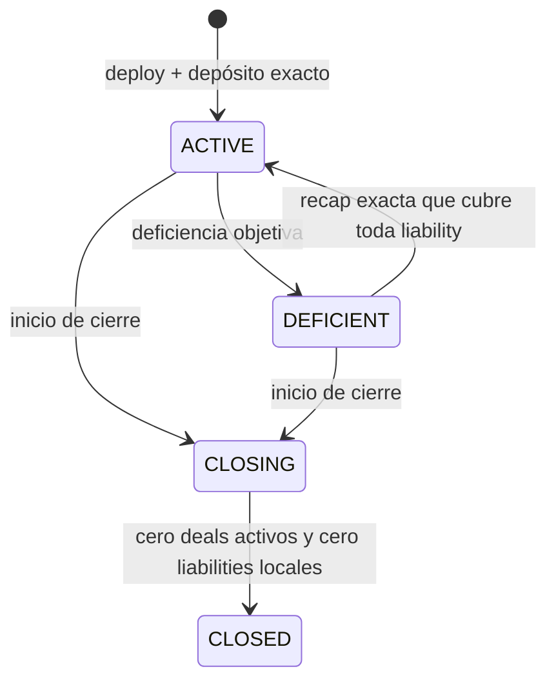

# Pools

Un pool **no** es parte del kernel. Es un servicio de liquidez que cualquiera puede desplegar y gobernar a su gusto. El kernel solo ve lo que está en `STATE_MACHINE.md`: Holder, Provider, Controller, y `HolderAuthorization` (EIP-712, ECDSA o EIP-1271).

Este archivo destila, desde `pluriswap/PROTOCOL.md` §§15–16, lo que sigue siendo útil como constitución de un servicio de pool. No redefine la máquina del deal. Si hay conflicto sobre estados o transiciones del escrow, manda `STATE_MACHINE.md`. Si hay conflicto sobre meter pools en el kernel, manda este archivo.

Implementar un pool **no** exige un path nuevo en Solidity. El pool es un Holder-contrato: `isValidSignature` sobre el mismo digest que una wallet, y un pull exacto. Ver `STATE_MACHINE.md` §3.5–3.6.

```
pool  =  Holder (contrato que custodia principal)
pool  →  kernel   (HolderAuthorization vía EIP-1271 + pull exacto)
kernel → pool     (holder-gross al Holder en terminal; record canónico para la tesorería del pool)
```

El pool no escribe estado Core, no inventa outcomes, y no mueve custodia de principal activo. Cómo elige al Controller, qué le paga, y cómo lleva NAV o deposits es indiferente al escrow.

---

## 1. Relación con el kernel

El kernel no tiene perfil `POOL`, ni mandato, ni operator fee, ni bits de release/contest.

Un deal “de pool” y uno “de wallet” son el mismo deal. En persona a persona, `Holder == Controller` y `HolderAuthorization` cubre ambos roles. En un pool, el contrato es el Holder y nombra a un Controller en ese mismo typed data.

| Lo que el kernel snapshottea | Lo que el pool decide solo |
| --- | --- |
| Holder (el contrato del pool) | Constitución, deposits, withdrawals, solvencia |
| Controller (quien sigue el deal) | Quién puede ser Controller y por cuánto tiempo |
| `HolderAuthorization` para ese deal | Fee del Controller, kick, reputación interna |
| Principal vuelve al Holder | Cómo reparte ese retorno entre LPs / owner |

El único borde es `HolderAuthorization` + pull exacto. El digest bindea token, principal, deal, Controller y expiry. El Controller acepta el rol. Holder-gross vuelve al Holder, nunca a la wallet del Controller. ERC-2612 del token **no** es ese borde: el `permit` clásico no sirve cuando el owner es un contrato.

Nombres: en el kernel, **Controller** es el agente del deal. El dueño del pool no se llama Controller. Aquí es **owner** (owned/custom) o **sponsor** (crowdfunded). Si se mezclan, “controller” vuelve a significar dos cosas.

---

## 2. Qué es un pool

Un pool es un contrato Holder con una interfaz definida por el protocolo de liquidez — no por la máquina de escrow — que:

- custodia token de settlement de varios deals;
- valida `HolderAuthorization` vía EIP-1271 para deals concretos;
- recibe el holder-gross cuando el deal termina Holder-positivo;
- lleva su tesorería (idle, exposición activa, consumed) sin escribir estado Core.

Cualquiera puede desplegar uno compatible. Un registry puede anunciar implementaciones; no otorga permiso de transacción. Interfaz conforme no es evidencia de solvencia ni de contabilidad honesta. Un pool malicioso puede dañar a su owner y a sus LPs; no puede gastar principal de otro deal ni assets de otro pool.

No hay fee, tax ni licencia de protocolo por ser pool. El Controller puede cobrar: eso lo paga el pool, fuera del settlement Core.

---

## 3. Tipos

Tres constituciones típicas. El kernel no las distingue.

| Tipo | Holder económico | Quién nombra al Controller | Producción |
| --- | --- | --- | --- |
| Owned | El contrato; el owner aporta y posee los assets | El owner, bajo reglas locales | Servicio; no es Core |
| Custom | Igual, con constitución propia | Lo que esa constitución diga | Permissionless, untrusted |
| Crowdfunded | El contrato; varios funders con shares pro-rata | El sponsor, bajo reglas locales | Gated en el charter §16; el kernel no lo implementa |

Común a los tres:

- Un token de settlement por pool. Cambiar token exige identidad nueva.
- Deals concurrentes acotados por liquidez disponible exacta.
- Core no implementa shares, NAV, epochs ni wind-down. Crowdfunded se engancha por el mismo `HolderAuthorization` y el mismo record terminal.

---

## 4. `HolderAuthorization` y el pull

El kernel no tiene un “permit de pool”. Tiene el typed data de `STATE_MACHINE.md` §3. El pool, como Holder-contrato, lo valida con EIP-1271 y se deja hacer pull.

```
owner/sponsor configura quién puede ser Controller
        →  el Controller recolecta HolderAuthorization
        →  el pool.isValidSignature(digest, bytes) == MAGICVALUE
        →  pull exacto desde el pool (approve, Permit2, o transfer propio)
        →  deal en FUNDED con Holder = pool, Controller = agente
```

El digest es el mismo que firmaría una EOA. El kernel no interpreta las `bytes`: pueden ser vacías, un proof de mandato, o lo que la constitución defina.

Sin deal en el digest, el Controller reusa autorización en otro trade. Sin `ControllerAcceptance`, se le cuelga el rol a alguien que no lo pidió.

**Cómo el pool se vuelve pullable** (elige una; el kernel no):

- `token.approve(escrow, principal)` y el escrow hace `transferFrom`;
- Permit2 (1271 sobre el mismo estilo de digest);
- el pool transfiere al escrow en la misma transacción de activación.

ERC-2612 del token no alcanza. Una wallet no puede auto-aprobarse los fondos del pool: el contrato tiene que optar.

Revocar al Controller en el pool corta **deals futuros**: `isValidSignature` deja de aceptar digest que lo nombran. No silencia al Controller ya snapshotado en un deal vivo. Eso es el “kick solo a futuro”, y lo garantiza el kernel al congelar al Controller, no un mandato dentro del escrow.

El Controller puede ser un pésimo comercial (soltar de más, no contestar). No puede redirigir principal. Timeouts, claim y payment proof no dependen de que siga vivo.

Un 1271 que dice sí a todo, o un proxy que cambia entre firma y activación, solo puede dañar a *ese* pool. No es razón para meter constitución de pool en el kernel. Opcional: bindear code hash en los términos para que un upgrade stale rechace.

---

## 5. Ciclo de un deal, visto desde el pool

El grafo es el de `STATE_MACHINE.md`. El pool no añade aristas.

| Momento | Pool | Kernel |
| --- | --- | --- |
| Activación | Valida el digest (EIP-1271) y entrega principal por pull exacto | `FUNDED`; snapshot Holder / Provider / Controller |
| Deal activo | Idle liquidity en el vault. Principal activo es receivable, no liquidez local | Catálogo Core con el Controller snapshotado |
| Terminal | Consume el record canónico para su tesorería | Holder-gross al Holder; Provider-gross al Provider |

Si el pool está insolvente, en cierre o en default, **no** valida digest nuevos. Los deals ya fondeados siguen hasta terminal. El kernel no tiene estados `DEFICIENT` ni `CLOSING`.

Fee de arbitraje: la paga la wallet del Controller que abre, no el vault del pool. Reembolso offchain entre owner y Controller, si existe, es constitución local.

---

## 6. Tesorería local

El pool lleva, para sí, categorías que el kernel no conoce:

| Categoría | Significado |
| --- | --- |
| Idle | Assets no reservados a un deal |
| Locked | Principal (y lo que el pool reserve de su bolsillo para fees propias) de deals activos |
| Consumed | Lo que salió para siempre: provider-positive, fees locales pagadas |
| Credits | Holder-gross ya terminal, aún no reasignado a idle |

Un crédito del pool cuenta una vez. Vuelve a estar disponible para un deal nuevo solo cuando el mismo vault puede reasignarlo sin preservar el crédito viejo.

Settlement Core commitea el record **antes** de cualquier journal del pool. Un callback del pool no corre en el path de settlement. Si el journal local revierte, el outcome del deal no se toca.

Owned y crowdfunded pueden derivar NAV de ese record en la misma transacción. Un custom untrusted puede consumir el record después, una vez, autenticando el pool exacto. Su fallo es su problema.

---

## 7. Ciclo de vida del servicio (owned / custom)

Máquina **del pool**, no del deal. Gobierna si valida digest nuevos.



| Estado | Digest / deals nuevos | Deals ya fondeados |
| --- | --- | --- |
| `ACTIVE` | Sí, si hay liquidez exacta | Máquina Core |
| `DEFICIENT` | No | Siguen hasta terminal |
| `CLOSING` | No | Siguen hasta terminal |
| `CLOSED` | No | N/A; la identidad no reabre |

Deficiencia: idle + créditos reutilizables menores que las liabilities locales. El principal en escrow es receivable, no liquidez. `CLOSING` y `CLOSED` son monotónicos. Otra actividad exige identidad nueva.

Depósito y withdrawal son reglas del owner. Un withdrawal no puede invadir principal de un deal activo.

---

## 8. Crowdfunded

Constitución aparte, gated en el charter. El kernel no la implementa. Mismo borde: `HolderAuthorization` + record terminal.

Shares internas no transferibles, claim sobre NAV, no un amount de token garantizado. El sponsor pone capital mínimo y nombra Controllers. Otro sponsor u owner exige wind-down e identidad nueva.

Estados locales: `ACTIVE`, `WITHDRAWAL_RUNOFF`, `DEFAULTED`, `WINDING_DOWN`, `CLOSED`. Los tres últimos no vuelven a `ACTIVE`. Deals ya fondeados no se congelan.

El roce con el escrow es práctico, no de máquina: un epoch de withdrawal no debería finalizar mientras haya principal activo, porque el NAV todavía se mueve. Eso lo enforza el pool al no snapshotear la generación; el kernel no tiene un estado de epoch.

---

## 9. Rate, fees y lo que no entra al kernel

Validar un quote contra un oracle o una banda es política del pool al decidir si `isValidSignature` dice sí. Un deal persona a persona ya bindea principal y fiat exactos y no lo necesita.

Fee del Controller, fee de aceptación, kick, reputación de quien opera: constitución del pool. El settlement Core parte principal entre Holder y Provider. Si el pool quiere pagar al Controller, lo hace de idle o de su propio consumed, después de leer el record.

`RATE_POLICY`, mandato con bits, y operator acceptance fee como canal Core son el leak que este recorte saca del kernel.

---

## 10. Invariantes del servicio

- El pool es un Holder. El deal no sabe que es un pool.
- Un solo borde hacia Core: `HolderAuthorization` (EIP-1271) + pull exacto. Un solo borde de vuelta: holder-gross + record canónico.
- Holder-gross nunca va al Controller.
- Kick de Controller es futuro-only porque el kernel congeló al agente, no porque el pool tenga un mandato en el escrow.
- Pool insolvente o cerrado: no hay digest nuevos; deals vivos siguen.
- Callback del pool no revierte settlement Core.
- Assets de un pool no subsidian a otro.
- Core-only, sin pool, permanece completo: `Holder == Controller`, una sola `HolderAuthorization`.
- Implementar el pool no abre un path Solidity nuevo. EIP-1271 + pull es suficiente y existente.

---

## 11. Interfaz mínima hacia el kernel

Lo que un pool tiene que saber hablar. El resto es suyo.

1. Ser el Holder: una address desde la que el escrow puede hacer pull exacto.
2. Implementar EIP-1271 sobre el digest de `HolderAuthorization` (mismos campos que una EOA: Controller, token, principal, deal, expiry, nonce).
3. Volverse pullable: `approve` al escrow, Permit2, o transfer en la misma tx. No ERC-2612 como único camino.
4. Recibir holder-gross en esa misma address. No hay payout distinto del Holder.
5. Opcional: consumir el terminal record para su tesorería, sin callback en el path Core.

Quién es Controller, cuánto cobra, y cómo se deposita o se cierra el vault no aparecen en esa lista.
