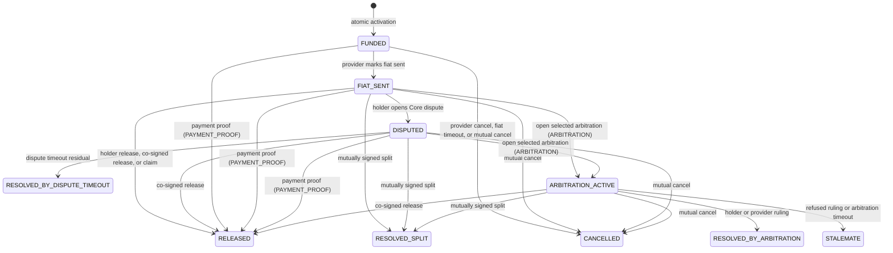

# PluriSwap Protocol

## Business Source of Truth

**Ratification status:** Public review and `RAT-002` protocol ratification remain pending; no release gate is claimed complete.

**Target protocol version:** 2

**Document authority:** Highest-level definition of PluriSwap business behavior

**Last substantive review:** 2026-07-31 (Mandatory Core production-remediation freeze: sole custody-boundary role, per-boundary Q128 nominal-exposure cap, semantic reconciliation outcomes, bounded conservative Q128 terminal materialization, typed signed pool-kind authority, fault-predicate reservations, split-only dynamic disposition, and no in-place predecessor upgrade)

**Current control objective:** Freeze a production-conformant V2 Core before `RAT-002`; prototype code or a prior deployment is not promoted by this document.

### Document-control history

| Date | Control change |
| --- | --- |
| 2026-07-28 | Economic review closed; reference SKU v1, REP-014, party/operator court-skin, PAY-013 hybrid payment-proof sequence, Arbitrum access, Human Passport, and Kleros recorded |
| 2026-07-29 | Custody/deficit authorities and independent-review repairs reconciled for production remediation: sole vault, quarantine-absorbed versus deficit-checkpointed reconciliation, signed pool-kind authority, fault-predicate reservations, split-only dynamic disposition, independent Core dispute, Core-owned timeout, and complete terminal deltas |
| 2026-07-30 | Restored charter/technical authority separation: business outcomes and abstract Core roles remain here; contract names, wire codes, ABI preimages, and implementation acceptance artifacts remain in subordinate architecture and technical specifications |

---

## 1. Authority and interpretation

### 1.1 Purpose of this document

This document defines what the PluriSwap Protocol is, what it does, who may use it, which outcomes it permits, and which guarantees every conforming implementation must preserve.

It is intentionally implementation-independent. Contract names, ABI layouts, event signatures, storage layouts, deployment scripts, frontend behavior, and chain-specific addresses belong in subordinate technical documents.

### 1.2 Precedence

The documentation hierarchy is:

1. This document defines normative business behavior.
2. The technical specification defines exact data, formulas, interfaces, signatures, events, and state representation.
3. Executable requirements derive testable statements from this document and the technical specification.
4. Architecture decision records explain accepted technical choices without overriding this document.
5. Code, tests, audits, and deployments provide conformance evidence; they do not redefine the protocol.
6. Readmes, guides, plans, reviews, and historical documents are explanatory or operational only.

If a subordinate document or implementation conflicts with this document, the subordinate artifact is non-conformant until the conflict is resolved explicitly.

### 1.3 Normative language

MUST, MUST NOT, REQUIRED, SHALL, and SHALL NOT are mandatory. SHOULD and SHOULD NOT express a strong default whose exception requires published rationale. MAY is optional.

Stable rule and case identifiers SHALL NOT be reassigned to different meanings. A removed rule remains reserved and is marked superseded.

Unless a rule explicitly requires an immediate external transfer, words such as "pay," "receive," "return," and "allocate" mean creation of an irrevocable beneficiary credit under Section 17.2. Withdrawal of that credit is a separate operation and cannot change the completed outcome.

In this document, "canonical" applied to protocol records, journals, vectors, obligations, or timestamps means **protocol-authoritative**. Ecosystem advisory status uses **endorsed** or **recommended**, never as an execution gate.

### 1.4 Completeness rule

The case catalog in this document is closed:

- A state transition not defined here is forbidden.
- A role has no authority unless that authority is defined here and bound by signed or onchain consent.
- A fee, slash, transfer, or accounting movement not defined here is forbidden.
- A failed required step MUST leave protocol state and economic accounting unchanged.
- When multiple valid actions race, the first successful transaction determines the result and later incompatible actions MUST reject.

### 1.5 Changing the protocol

Every proposed change to this document MUST state:

- the business problem;
- the rules and cases affected;
- whether signed consent, custody, settlement, or economic outcomes change;
- compatibility with active and historical deals;
- migration and versioning consequences;
- added, removed, or changed risks;
- required evidence before ratification.

Any change to signed meaning, custody, state transitions, settlement, fee eligibility, bond consequences, pool accounting, proof interpretation, or arbitration mapping requires a new protocol version and opt-in deployment. No document edit can change an active deal.

---

## 2. Mission

### 2.1 What PluriSwap is

PluriSwap is a permissionless protocol for escrowed crypto against an offchain fiat agreement. **Mandatory Core** is the constitutional bar for permissionlessness and trust minimization: any addresses may open and complete a direct escrow with deterministic custody and exits, without identity, reputation, bonds, payment proof, arbitration, pool admission, DAO approval, or an endorsed frontend.

Stronger fraud, Sybil, or fiat-assurance properties are available only through **explicitly selected** extension profiles or ecosystem packages—including ARBITRATION (for example Kleros) when parties want an **external court ruling** on `FIAT_SENT`, and PAYMENT_PROOF when they want authenticated automatic release. Mandatory Core itself includes a holder-opened `DISPUTED` freeze with dual-signed settlement and a signed residual split on dispute timeout (Section 8). Those packages MAY introduce additional trust assumptions or participation friction for deals that opt in; they MUST NOT redefine Core validity or become hidden gates of base escrow (Section 5, `PERM-005`, `PROFILE-002`).

The protocol:

- holds crypto principal under pre-agreed rules;
- records the parties' consent in signed, replay-resistant terms;
- gives the parties and permissionless executors deterministic Core paths to a terminal result;
- supports direct liquidity and, when selected, reusable pool liquidity;
- attaches optional proofs, arbitration, bonds, identity, and reputation only at defined extension points;
- makes custody, fees, pool exposure, bond consequences, and terminal outcomes independently reconstructable.

### 2.2 What PluriSwap does not do

PluriSwap does not:

- custody fiat;
- guarantee that a fiat transfer is lawful, irreversible, or recoverable;
- claim that Core alone authenticates fiat payment or unique-human counterparties;
- provide a central limit order book or mandatory matching service;
- set market prices or guarantee quote quality;
- guarantee the honesty or solvency of a counterparty, verifier, arbitrator, pool, token issuer, attester, or interface;
- make an identity credential true merely because it is encoded onchain;
- endorse a token, module, pool, verifier, or arbitrator merely because the protocol can interact with it;
- reverse completed settlements because of offchain chargebacks;
- recover lost keys or bypass a signed receiver;
- force users to migrate to a newer deployment;
- provide cross-chain settlement in the mandatory core;
- require DAO fees, identity, bonds, or other guardrails for Core-only deals.

### 2.3 Business objective

**Core success.** Two parties who do not share a trusted operator can agree to terms, place crypto under deterministic custody, and reach one final economic result through Core exits—without a proprietary backend, privileged keeper, administrator, identity gate, or mandatory ecosystem package.

**Assured-trade success.** Parties who want stronger linkage between fiat performance and crypto release, or stronger Sybil/fraud resistance, opt into inspectable packages (for example payment proof, bonds, arbitration, or progressive admission). Ecosystem clients MAY recommend such packages; recommendation never becomes a Core execution condition.

**Core silence default.** Mandatory Core treats holder silence after `FIAT_SENT` as non-contest: permissionless claim allocates full principal (and success fees) to the provider without authenticating that fiat was sent. That is the intentional provider-liveness tradeoff. It is not a guarantee of honest fiat performance. Holders who need a unilateral Core contest path open free `DISPUTED` under DISPUTE-007. Parties who need an external court select ARBITRATION (and, for bilateral bond protection on unresolved court outcomes, BONDS) through an assured-trade or other explicit package under PROFILE-008.

**Fiat-timeout active exit.** While a deal remains `FUNDED`, `fiatDeadline` enables a permissionless cancel that returns principal holder-side. That exit is intentional and holder-favorable, but it is **active**, not passive: Core does not auto-cancel and does not freeze provider mark-fiat at the clock. At and after the deadline, timeout cancel and mark-fiat race; the first successful transition wins. A holder who wants the timeout outcome submits it—or relies on any address executing that predetermined cancel—before mark-fiat succeeds. Leaving the deal idle after the deadline is holder non-execution of that exit, not a protocol loophole (TIME-005, CASE-CORE-005, CASE-RACE-001).

Core remains usable and complete on its own. Packages minimize trade-offs against permissionlessness by concentrating friction in voluntary venues rather than in base escrow.

---

## 3. Constitutional guarantees

### 3.1 Permissionlessness

**PERM-001 — Participation.** Any address MAY negotiate, sign, fund, relay, or execute a valid direct deal without protocol-governance approval.

**PERM-002 — Liquidity.** Any address MAY deploy a compatible pool, provide liquidity under that pool's rules, or offer pool liquidity without obtaining endorsed or recommended status.

**PERM-003 — Extensions.** Any address MAY implement a compatible verifier, arbitration adapter, pool, attester, indexer, keeper, relayer, or user interface.

**PERM-004 — Execution.** Every deadline-based exit MUST be executable by any address at or after its signed deadline. The executor chooses neither the receiver nor the outcome.

**PERM-005 — No mandatory endorsement.** Audited, attested, endorsed, recommended, or listed status is advisory. It MUST NOT be a mandatory execution gate for bilateral deals whose participants explicitly selected compatible components.

**PERM-006 — User-selected risk.** Applications MAY warn about or hide assets and extensions they consider unsafe. Application policy does not redefine protocol validity.

**PERM-007 — Objective rejection only.** The protocol may reject an action only because an objective signed, cryptographic, state, timing, solvency, compatibility, or accounting condition fails—not because an actor lacks institutional permission.

**PERM-008 — Closed compatibility.** Base compatibility consists only of published immutable interface and code identity, valid consent, exact funding, state, timing, failure isolation, and accounting checks defined by this protocol version. Membership in a governed registry, endorsement list, commercial program, frontend catalog, or attester set MUST NOT be a base execution condition.

### 3.2 Decentralization

**DEC-001 — Immutable custody.** Core custody and state-machine rules are immutable within a protocol deployment.

**DEC-002 — No custody administrator.** No owner, DAO, multisig, governor, operator, backend, registry, verifier, arbitrator, or token curator may seize principal, redirect a receiver, invent an outcome, or execute an unlisted transition.

**DEC-003 — Active-deal immunity.** Once a deal is active, no governance or policy change may alter its token, amounts, parties, receivers, deadlines, fees, bonds, proof semantics, arbitration semantics, pool context, or valid exits.

**DEC-004 — No settlement pause.** No emergency power may pause, freeze, or delay a valid exit from an active deal.

**DEC-005 — Opt-in evolution.** A code or business-rule upgrade is a new deployment and protocol version. Users choose whether to use it. Existing deployments and active deals remain independently executable.

**DEC-006 — Forkability.** Anyone may reproduce, deploy, index, and provide interfaces for a protocol version from published source and artifacts.

**DEC-007 — No privileged liveness.** Once a transition's intrinsic signed, state, proof, ruling, timing, and funding conditions are satisfied, its execution MUST NOT require an additional protocol-owned server, secret, signer, relayer, or keeper.

**DEC-008 — Legal forkability.** Exact production source, interfaces, build scripts, and required non-vendored inputs MUST be available under an OSI-approved license that permits commercial and noncommercial use, modification, deployment, redistribution, and independent interfaces. A source-visible but deployment-restricted license does not satisfy forkability.

### 3.3 Trust minimization

PluriSwap is not universally trustless. Fiat payment, token behavior, identity credentials, rate sources, and external arbitration necessarily introduce chosen trust assumptions. Core itself does not assume those components; it assumes only chain execution, signed consent, and the selected token's disclosed behavior.

**TRUST-000 — Core bar.** Mandatory Core MUST NOT require identity, reputation, bonds, payment proof, arbitration, rate policy, pool admission, or a DAO/package fee recipient. Core has **no external dispute court** and invents no factual finding about fiat. Core **does** include a holder-opened `DISPUTED` freeze, dual-signed bilateral exits, and a permissionless dispute-timeout residual allocation fixed in signed terms (`disputeTimeoutProviderBps`). External arbitration, payment proof, bonds, and similar guardrails remain opt-in extensions or packages and MUST leave the Core path to a terminal result executable when those guardrails are absent or fail.

**TRUST-001 — Explicit selection.** Every trust-bearing component that can affect a deal MUST be explicitly selected in signed terms or inherited from a pool policy that the provider explicitly accepts.

**TRUST-002 — Immutable meaning.** A referenced policy identifier MUST be content-addressed or otherwise immutable. Its meaning may never be overwritten.

**TRUST-003 — Future-only deactivation.** A component or policy may be discouraged or rejected for new deals without affecting active deals that already reference it.

**TRUST-004 — Inspectability.** Trust assumptions, including finality, reversibility, evidence, issuer, court, appeal, rate, token-admin, and fault rules, MUST be inspectable before consent.

**TRUST-005 — Failure isolation.** Failure or malice in one optional extension MUST NOT spend another deal's assets or change an unrelated deal's state.

**TRUST-006 — Bound executable identity.** Every custody-adjacent module selected for an active deal binds chain, address, runtime code hash, immutable configuration, policy semantic hash, and the module-admission authorization required to execute it. A proxy upgrade, administrator pause, registry delisting, or caller revocation MUST NOT change or disable active-deal execution. A module unable to provide that guarantee is permitted only as an optional input producer whose failure leaves every mandatory core fallback executable.

**TRUST-007 — Availability boundary.** Immutability preserves accepted meaning; it does not guarantee that an external rail, issuer, verifier, court, arbitrator, RPC, or token administrator will cooperate. Every such dependency MUST have a disclosed failure result, and no dependency failure may remove the bounded core path to a terminal outcome.

### 3.4 Design premise: incentives over nanny constraints

Protocol design prefers **chosen trust, attributable actions, future exit, and optional packages** over Core rules that assume every delegate is adversarial. This premise guides product and economic choices; it does not weaken the hard Core duties in Sections 3.1 through 3.3 and 7.

**PREMISE-001 — Chosen trust.** When a party selects a counterparty, pool, operator, verifier, arbitrator, token, or package, that selection is an explicit trust edge. Core makes the edge inspectable and the resulting economics deterministic; it does not pretend the edge is trustless.

**PREMISE-002 — Rule of thumb.**
- If the failure mode is **"someone we chose behaved badly,"** prefer **exit for future deals**, **reputation**, **optional bonds**, disclosure, and market choice—not a new Core prohibition that freezes every honest deployment.
- If the failure mode is **"the machine paid the wrong person, mixed assets, invented an outcome, or lost a path to terminal,"** fix it in **Mandatory Core** (or the enabled profile's hard rules).

**PREMISE-003 — Incentives and packages.** Stronger Sybil resistance, reputation, progressive admission, and bond schedules belong in opt-in packages. Core supplies canonical, reconstructable facts so those packages can score behavior without becoming hidden execution gates for base escrow.

**PREMISE-004 — What Core still must do.** Regardless of the premise, Core and enabled custody paths MUST preserve: exact funding and isolation; principal and fee conservation rules; no admin redirect of principal or receivers; permissionless timeouts with predetermined economics; active-deal immunity; immutable snapshotted authority and policy meaning for live deals; and a closed transition catalog with a bounded path to terminal without proprietary infrastructure.

**PREMISE-005 — What Core deliberately does not do.** Core does not parent every operational staffing choice, re-litigate offchain honesty, auto-fire a pool operator mid-deal, refund a pool's activation toll because an accepted deal later aborted, charge a Core toll or bond merely to open `DISPUTED`, invent a fiat-truth court, or encode a full social credit system. Residual risk from a chosen operator, counterparty, pool constitution, or package is accepted at consent and managed by future mandate exit, trade bounds, optional bonds, fee amount, residual bps, and reputation packages.

**PREMISE-006 — Reviews and conformance.** Economic reviews, audits, and conformance passes MUST apply PREMISE-002. They MUST NOT treat as Core defects, when the cited rules hold:

- a chosen operator with disclosed contest or arbitration permission affecting pool capital on snapshotted deals (POOL-OP-002 through POOL-OP-009);
- a pool-paid nonzero activation fee remaining consumed after provider cancel, fiat timeout, mutual cancel, or other abort (FEE-H-003, FEE-H-008, FEE-H-009, POOL-FUND-002A)—including when poor operator selection or acceptance quality caused repeated aborts;
- free holder-side open of Core `DISPUTED` without a Core fee or bond (DISPUTE-001, DISPUTE-007), including that a malicious holder can open after real fiat and force residual risk sharing—that is signed residual / counterparty risk, not a missing Core toll;
- a signed absolute completion fee that, after the gross cap, leaves little or zero provider net on a small provider share (FEE-P-004, FEE-P-008)—parties and packages chose that amount at consent;
- non-reimbursement of the external arbitration open fee from principal or protocol fees, win or lose (ARB-003, ARB-003B)—court costs of an opt-in external path, distinct from free Core contest;
- fee rules and bond rules diverging (ECON-012, BOND-000): fees as tolls/spam/package/court costs without fault; bonds as skin for wrongdoing or explicit signed stakes—including default bond **release** on residual and arb no-decision when no fault formula applies (BOND-008);
- default bond **release** on fiat-timeout cancellation (CASE-OUT-005) with provider inactivity slash limited to provider-initiated cancel (CASE-OUT-004) under OUT-007A and BOND-008A—not a missing inactivity penalty on timeout;
- arbitration open fee paid by the **opening caller's own balance**, not auto-debited from pool principal or deal escrow, on pool-origin deals (ARB-003C);
- progressive-admission raw exposure using a conservative upper bound that can exceed realized abort loss (HUM-ADM-008A);
- crowdfunding punitive default where slash and late recovery may both benefit the pool when that profile is enabled (CF-DEF-009)—not loss-only insurance;
- Core omitting “assured-trade” defaults (fee-to-open contest, non-default residual, court-skin bonds including burn-on-stalemate, reputation tier caps) that belong only in selected packages (PROFILE-008, Section 5.3);
- reference assured rungs charging a contest-open **fee** (not bond-to-open), burning both party bonds on arb stalemate/refuse/timeout, and gating exposure with five fixed reputation tiers (REF-PKG-003 through REF-PKG-007)—conforming package design, not missing Core economics.

They MUST still flag missing isolation, any implementation that **refunds** a successfully charged activation fee, a Core path that cannot reach a terminal result, or post-activation authority mutation.

---

## 4. Actors and assets

### 4.1 Actors

| Actor | Business role | Powers | Prohibited powers |
| --- | --- | --- | --- |
| Holder | Supplies crypto principal in a direct deal | Signs terms, funds, releases from `FIAT_SENT`, co-signs cancellation, split, or release; opens Core `DISPUTED` from `FIAT_SENT`; opens selected arbitration when that profile is enabled | Cannot rewrite terms after activation; cannot unilaterally seize principal or invent an outcome outside the closed Core machine |
| Provider | Sends fiat and receives crypto on a provider-positive outcome | Signs terms, marks fiat sent, cancels before fiat, co-signs cancellation or split, claims after deadline | Cannot unilaterally claim before the signed deadline |
| Pool | Supplies and receives holder-side liquidity in a pool-origin deal | Funds principal, receives holder-positive returns, accounts for its beneficiaries | Cannot create escrow liability without exact funding |
| Pool controller | Configures a pool and appoints operators under its constitution | Sets future pool policy and mandates | Does not personally own active pool-origin principal unless it is also the pool beneficiary under the pool constitution |
| Operator | Pool-chosen operational delegate for a pool | May quote offchain and, only as authorized by the active mandate and deal snapshot: accept deals, release from `FIAT_SENT`, open Core `DISPUTED`, and/or open selected arbitration | Cannot withdraw liquidity, change receivers, seize principal, rewrite terms, or exceed its mandate; cannot be stripped of snapshotted authority on an already active deal by later revoke |
| Module-admission authority | Deployment-scoped authorization surface for Core and enabled profiles | Binds which custody-adjacent modules may execute for future deals on that deployment; appears in provider acceptance and executable-identity checks | Does not hold shared user principal; cannot invent outcomes, redirect receivers, or act as a custody administrator |
| Funder | Contributes assets to a crowdfunded pool extension | Receives shares and exercises withdrawal rights | Cannot withdraw locked exposure or jump a pro-rata queue |
| Bond sponsor | Supplies collateral for a party or role | Authorizes a precise reservation and receives unused collateral | Cannot change the sponsored deal or reclaim reserved collateral early |
| Relayer | Submits signed actions | Pays gas and transports already-authorized messages | Chooses no terms, receivers, or outcomes |
| Keeper | Executes public deadline transitions | Pays gas after objective eligibility | Receives no custody authority |
| Payment verifier | Authenticates a payment proof under a selected policy | Returns an authenticated result and receipt-bound nullifier | Cannot redirect settlement or change deal terms |
| Humanity verifier | Authenticates an identity credential under a selected policy | Returns credential-bound status or nullifier | Cannot release escrow principal |
| Arbitration adapter | Translates a final external ruling under a selected policy | Creates one dispute and returns authenticated final meaning | Is not an administrator and cannot issue an unlisted result |
| Attester | Publishes an opinion about code, policy, or risk | Signs advisory metadata | Cannot grant execution permission |
| Treasury or fee recipient | Receives fees explicitly defined by signed economics | Holds and spends its own received funds | Cannot touch active principal or pool liquidity |
| Ecosystem governance | Manages non-custodial shared resources and recommendations | May govern treasury, attestations, endorsed interfaces, and release recommendations | Cannot mutate core or active deals |

Holder and provider are opposing economic roles and MUST use distinct signing addresses. The base protocol cannot determine whether different addresses share beneficial control. One address MAY occupy multiple non-conflicting operational roles only when every relevant consent and prohibition remains satisfied.

Legacy shared-custodian pools (Section 14.2) are migration infrastructure in which one historical control component held commingled pool assets. That model is not the target V2 custody separation.

### 4.2 Assets and accounting terms

- **Principal:** crypto amount held for the trade. Principal excludes all fees and bonds.
- **Activation fee (holder fee):** optional Core fee charged for creating an active escrow at FUNDED. It is paid at activation and is non-refundable by design (including on cancel, timeout, stalemate, dispute timeout, and holder-win). Amount MAY be zero; zero is a valid Core configuration and is not an anti-spam mechanism. When nonzero, it is an activation toll: the consented cost of creating funded escrow exposure—not a success fee and not refundable working capital. On pool-origin deals the pool is `holderFeePayer` and the same non-refundable rule applies. Reference assured rungs derive the absolute from deal principal via REF-PKG-012.
- **Completion fee (provider fee):** optional Core fee charged from the provider's gross crypto share whenever that gross is positive at terminal settlement (FEE-P-001). Amount MAY be zero; zero means no completion fee is due on any path. When the signed amount is positive, no terminal may route principal to the provider without collecting the fee (capped by provider gross). Reference assured rungs derive the signed absolute from deal principal via REF-PKG-012; settlement still applies the provider-gross cap.
- **Operator acceptance fee:** pool-funded fee reserved at activation for an enabled operator role. When eligible and without authenticated operator fault, it is paid in full if provider gross is 100 percent of principal, or proportionally when provider gross is a positive partial share (FEE-O-005, FEE-O-006). "Reserved," "eligible," and "paid" are statuses of this same fee. It compensates the operator role; it is not a second protocol or platform access fee.
- **Profile or package fee:** any additional fee channel defined only by an enabled extension profile or ecosystem package identity (for example contest-open fee or arbitration court fee at escalation). Absent that selection, the channel does not exist. Reference contest-open fees use REF-PKG-012.
- **No pool access fee:** Protocol version 2 defines no separate fee, tax, or license for deploying a pool or using the protocol as a pool beyond the ordinary deal fee channels above. Permissionless pool deployment does not require a protocol payment.
- **Bond:** collateral reserved separately from principal and fees to secure a defined role.
- **Pool available liquidity:** pool assets not consumed, reserved, queued for an earlier obligation, or required for active exposure.
- **Pool locked exposure:** principal and fee exposure reserved for active deals.
- **Pool consumed exposure:** pool assets that permanently left pool availability through fees, provider-positive settlement, or realized loss.
- **Liability:** an amount the protocol owes to a deal, receiver credit, fee credit, bond recipient, or pool.
- **Active deal:** a deal that has activated and has not yet reached a terminal state. Matured credits after a terminal state are open liabilities, not active deals.

---

## 5. Mandatory core and optional extensions

### 5.1 Mandatory core profile

Mandatory Core is a closed escrow state machine with named extension points. Two parties MUST be able to activate, fund, and reach a terminal economic result using only Core transitions—without payment proof, arbitration, bonds, pools, reputation, humanity, rate policy, a DAO fee recipient, or any ecosystem frontend.

Every conforming PluriSwap deployment MUST support:

- direct deal activation from bilateral signed terms;
- exact principal custody;
- the Core state machine and Core-only success path in Section 8;
- voluntary release from `FIAT_SENT`;
- provider cancellation before fiat is marked;
- permissionless fiat-timeout cancellation;
- holder-opened Core `DISPUTED` freeze from `FIAT_SENT` before the release deadline;
- dual-signed cancellation, dual-signed release, and dual-signed split from `FIAT_SENT` and from `DISPUTED`;
- permissionless dispute-timeout residual allocation after `disputeDeadline` under signed `disputeTimeoutProviderBps`;
- permissionless claim after the release deadline **only while still in `FIAT_SENT`**, treating holder silence (no release, no mutual resolve, no open `DISPUTED`, and no open arbitration) as non-contest of the fiat-sent assertion under the signed timeouts;
- optional Core activation and completion fee channels under Section 10, including zero-fee deals;
- immutable receivers and economics;
- permissionless execution and independent indexing.

Mandatory Core has **no external dispute court**. It **does** provide a Core contest path: the holder-side authority may open `DISPUTED`, after which principal moves only by dual-signed cancel, dual-signed release, dual-signed split, an enabled extension exit (payment proof or arbitration when selected), or the signed dispute-timeout residual. An external court ruling on `FIAT_SENT` still requires the ARBITRATION profile. Extension-point transitions (payment-proof release, arbitration open and rulings) are OUT_OF_SCOPE for Mandatory Core conformance unless the corresponding profile is enabled. When a profile is disabled, those edges MUST reject or be absent.

### 5.2 Optional extension profiles

An implementation MAY support any of the following independently. Each attaches at a defined extension point on the Core machine or at activation/settlement accounting; none is required for a successful Core-only escrow. The Core surfaces those packages may depend on are frozen in Appendix C.

| Profile | Capability | Primary extension point |
| --- | --- | --- |
| POOL | Reusable owned or custom pool liquidity | Activation / holder-side authority |
| PAYMENT_PROOF | Authenticated payment-proof release | FUNDED, FIAT_SENT, or DISPUTED → RELEASED |
| ARBITRATION | Selected external dispute provider (for example Kleros) | FIAT_SENT or DISPUTED → ARBITRATION_ACTIVE → terminal |
| BONDS | Reserved role collateral and predetermined consequences | Activation reservation / terminal side-effects |
| REPUTATION | Deterministic event-derived reputation and future deal limits | Future admission only |
| HUMANITY | Authenticated credential-based uniqueness or eligibility | Future admission only |
| CROWDFUNDED_POOL | Multi-funder pool shares, withdrawal epochs, recapitalization, default, and wind-down (Section 15; not ratified for initial V2 — OUT_OF_SCOPE until CF-GATE) | Pool funding and NAV |
| RATE_POLICY | Optional EXTERNAL or package-defined MANUAL quote validation for pool-origin acceptance | Pool acceptance; not required for every POOL |

**PROFILE-001 — Explicit opt-in.** A deal depends only on extension profiles selected in its signed terms or accepted pool policy.

**PROFILE-002 — Zero dependency.** Base escrow MUST remain usable without payment proof, arbitration, bonds, reputation, humanity, pool liquidity, rate policy, a DAO or ecosystem fee recipient, or an endorsed frontend.

**PROFILE-003 — Honest claims.** A deployment MUST NOT claim support for an extension until all business cases and production gates for that extension conform.

**PROFILE-004 — Independent failure.** Non-custodial analytics or reputation side effects MAY be deferred. Custody, principal liabilities, required fee accounting, bond accounting, proof nullifier consumption, and the terminal result MUST remain coherent.

**PROFILE-005 — Execution-package independence.** `BATCH_EXECUTION` is an optional execution package, not an authority-bearing deal profile. It MAY aggregate independently authorized calls under `OFF-005` and `OFF-006`, but no deal selects it, commits it in signed terms, or depends on its deployment or availability. Every batched item remains executable through its native protocol entrypoint.

**PROFILE-006 — Package-bound fee schedules.** An ecosystem or reference package MAY publish an immutable package identity whose semantic hash binds required fee moments, amounts or caps, and recipients (including a disclosed DAO wrapper) for deals that select that package or its bundled profiles. The protocol enforces only the exact signed fee fields; it never injects a DAO address, global tax, or package fee into a deal that did not select that package. Independent publishers MAY offer zero-fee or different-recipient packages. Frontends and clients that offer a named package MUST construct and display that package's bound fee fields; they are not an alternate collection path and cannot be the sole guarantee of payment.

**PROFILE-007 — Profile fees only when enabled.** Arbitration fees, contest-open fees, bond reservations, operator acceptance fees, progressive-admission package charges, and any other profile-specific economics exist only when the corresponding profile or package is selected. When the profile is off, those channels are absent and MUST NOT be charged.

**PROFILE-008 — Assured-trade and venue defaults are package-only.** Stronger commercial defaults than Mandatory Core—examples include fee to open contest, fixed or constrained `disputeTimeoutProviderBps`, required PAYMENT_PROOF or ARBITRATION, operator contest only with bond, stalemate or court-skin bond formulas (including burn), progressive admission, and reputation tier caps—exist **only** when a deal or pool selects an immutable package or profile that binds them (PROFILE-006, DISPUTE-006, BOND-000, Section 5.3). Core MUST remain usable without those defaults. Reviewers MUST NOT treat their absence from Core as incomplete economics; they MUST treat injection of such defaults into deals that did not select them as non-conformant.

**PROFILE-009 — Hybrid profiles and reference SKUs.** Extension profiles (Section 5.2) are reusable capabilities with parameters open within this charter. Ecosystem **reference SKUs** (Section 5.3) are immutable product packages that bind a required profile set plus stronger defaults and fee schedules. Independent publishers MAY offer competing packages or raw profile composition without a reference SKU. Clients that advertise a named reference SKU MUST construct that SKU's bound schedule (PROFILE-006, FEE-PKG-002).

### 5.3 Reference assured ladder (ecosystem SKUs)

The DAO-sponsored reference ecosystem MAY publish the following ascending **assured ladder** of immutable package identities. Rung 0 is Mandatory Core and is not a package. Selecting a higher rung requires every lower rung's required profiles (cumulative). Exact package identifiers, semantic hashes, and numeric parameter values live in the technical specification and package preimage; this section freezes business composition and default shape.

| Rung | Package identity (stable stem) | Display name | Required profiles (cumulative) |
| --- | --- | --- | --- |
| 0 | *(none — Mandatory Core)* | Core | — |
| 1 | `pluriswap.ref.assured.r1` | Assured Court | HUMANITY + BONDS + ARBITRATION |
| 2 | `pluriswap.ref.assured.r2` | Assured Reputation | Rung 1 + REPUTATION |
| 3 | `pluriswap.ref.assured.r3` | Assured Pool | Rung 2 + POOL |
| 4 | `pluriswap.ref.assured.r4` | Assured Proof | Rung 3 + PAYMENT_PROOF |

**REF-PKG-001 — Opt-in only.** No reference rung is a Mandatory Core execution condition. Core-only deals remain valid with zero package fees and no humanity, bonds, arbitration, reputation, pool, or payment-proof requirement (PROFILE-002).

**REF-PKG-002 — Bound defaults.** Each published reference rung version MUST bind, in its immutable semantic preimage at least: required profiles; contest-open fee schedule (REF-PKG-003, REF-PKG-012); fixed `disputeTimeoutProviderBps = 5_000` (REF-PKG-013); deal-sized symmetric party bonds and court-skin / win-loss formulas (REF-PKG-004, REF-PKG-005, REF-PKG-014); activation and completion fee schedules under REF-PKG-012 with one global disclosed DAO-wrapper recipient for both channels (REF-PKG-006); and, from rung 2 upward, the five-tier reputation exposure caps (REF-PKG-007). Initial v1 numeric values are REF-PKG-015; funnel reputation weights are REF-PKG-016. Rung 3 additionally binds operator-contest-requires-bond. Rung 4 additionally binds the selected payment-proof verifier/policy class.

**REF-PKG-003 — Contest open is fee-only.** Reference rungs that enable Core `DISPUTED` and/or ARBITRATION MUST charge a **package contest-open fee** (toll) to open contest or escalate under the SKU schedule. That fee is not a bond reservation. Bonds are reserved for outcome skin under REF-PKG-004, REF-PKG-005, and REF-PKG-014, not for the privilege of opening. The contest-open amount follows REF-PKG-012 (percentage of deal principal with minimum base). Independent packages MAY choose different open-cost instruments; reference SKUs MUST NOT use bond-to-open.

**REF-PKG-004 — Slash on dispute loss.** Under reference rung bond schedules, authenticated arbitration **loss** slashes the **entire** reserved loser party bond to the winner side (holder win → full provider bond to holder side; provider win → full holder/pool-side bond to provider side). The winner's party bond releases in full. When an operator bond is reserved on that deal, it uses the **same severity as a party bond**: the full operator bond is also slashed to the **winner** side on a decisive holder or provider win (not limited to authenticated operator-fault). Partial loss slashes are not used by reference SKUs (REF-PKG-014).

**REF-PKG-005 — Stalemate / refuse / timeout burn both.** For reference rungs, arbitration refused, no-decision, and arbitration timeout are one economic class (`STALEMATE`). Principal remains protocol 50/50 (CASE-OUT-011, CASE-OUT-012). The bound court-skin formula MUST slash the **entire** reserved amount of **both** party bonds—and the **entire** reserved operator bond when one exists—and route those amounts to a disclosed **immutable burn sink** (not the DAO, not either party, not a fee recipient). The burn sink MUST be a nonzero, publicly disclosed address suitable as a slash recipient under BOND-007 and TOKEN-010A; it MUST NOT be `address(0)`. The technical specification fixes the exact well-known burn address for reference SKUs. The intent is that stalemate is worse for both than a clear win and is not a profitable stall. This package burn of **bond** skin does not authorize burning Core dispute-timeout **principal** (DISPUTE-005). Default BONDS without a selected stalemate formula remains release (BOND-008).

**REF-PKG-006 — One DAO fee recipient.** Reference rungs that charge activation, completion, or contest-open fees MUST use one disclosed DAO-wrapper recipient address (per chain) for those package fee channels (activation, completion, and contest-open). External arbitration court fees remain outside this recipient (ARB-003*). The DAO MUST NOT be the court-skin burn sink or otherwise receive stalemate bond slashes under REF-PKG-005. Independent packages may use other recipients or zero fees.

**REF-PKG-007 — Five-tier reputation caps.** From rung 2 upward, reference reputation policy is both **advisory** (scores and rankings for display and selection) and an **admission gate** on maximum new exposure. Caps are **five fixed token-amount tiers** keyed by reputation band; tier 5 is **infinite**. Caps apply in **both** `INSTANCE_*` (deployment/instance) and `POOL` scopes when those scopes are in use; initial v1 amounts are in REF-PKG-015. Caps constrain new activation only (REP-009, HUM-ADM-005).

**REF-PKG-008 — Reference adapters.** Reference ARBITRATION uses **Kleros** as the court adapter family under the closed ruling map (ARB-011). Reference HUMANITY uses **Human Passport** (formerly Gitcoin Passport) as the credential verifier family under HUM-001 through HUM-008. Reference PAYMENT_PROOF follows the hybrid sequence in PAY-013: protocol-owned verifier interface; first Assured Proof SKU may integrate the ZKP2P / Peer attestation family; a later SKU may bind a PluriSwap-operated rail under a new policy hash. Exact adapter, policy, and code identities are bound per deployment and SKU version in the technical specification; a name alone carries no semantics (VER-008).

**REF-PKG-009 — Core ready for future packages.** An immutable Mandatory Core deployment that claims ladder readiness MUST expose the Appendix C surfaces so reference rungs and independent packages can be deployed later without a Core upgrade or new Core surface. Absent profiles reject; optional slots and reservation hooks remain present.

**REF-PKG-010 — Parameters and versioning.** Initial reference SKU v1 numeric parameters are published in REF-PKG-015. Technical documents for a **future** SKU version MAY list still-open fields as `UNSET` until that version's economic ratification. An on-chain or published package identity MUST NOT be selectable until every required bound field in REF-PKG-002 is concrete. Changing a bound value requires a new package version and opt-in.

**REF-PKG-011 — Crowdfunding not on the ladder.** `CROWDFUNDED_POOL` remains gated by Section 15 / CF-GATE and is not a rung of this ladder.

**REF-PKG-012 — Deal-sized package fees (pct + minimum).** For reference assured rungs, **activation**, **completion**, and **contest-open** fees each scale with deal principal under the same shape. The SKU preimage MUST bind a **separate** nonnegative `(feeBps, minBase)` pair for each of those three channels (settlement-token units for `minBase`). The required amount for a channel is:

`feeAmount = max(minBase, floor(principal × feeBps / 10_000))`

where `principal` is the deal's signed principal. Pairs are independent parameters: a later SKU version MAY change one channel without the others. Equalization across channels is not a protocol requirement. An initial reference SKU version MAY publish the **same starting** `(feeBps, minBase)` for all three channels as a package parameterization choice; that sameness is not Mandatory Core and MUST NOT be inferred by Core. Clients MUST compute, display, and place the resulting **absolute** amounts into signed terms before consent. Activation and completion absolutes are snapshotted at activation and enforced thereafter (FEE-H-*, FEE-P-008). Contest-open uses that channel's pair on the immutable deal principal at open time under FEE-PKG-004. This is **not** a terminal-bps rewrite of completion fee against provider gross: settlement still collects `min(snapshottedCompletionFee, providerGross)` (FEE-P-001, FEE-P-008). Core-only deals remain free to use zero or any explicit absolute. Independent packages MAY use other shapes.

**REF-PKG-013 — Residual fixed at 5000.** Reference assured rungs MUST bind `disputeTimeoutProviderBps = 5_000` exactly. When such a SKU is selected, activation MUST reject any other residual value. Core without that SKU retains the full `0..10_000` range and the recommended client default `5_000`. Opening ARBITRATION from `DISPUTED` still abandons this residual for the arbitration terminal map under ARB-013A.

**REF-PKG-014 — Deal-sized symmetric party bonds.** Reference assured rungs MUST size holder-side and provider party bonds equally from deal principal. The SKU preimage binds one shared nonnegative `(bondBps, minBase)` pair for those two roles (settlement-token units for `minBase`). The required reservation per party role is:

`bondAmount = max(minBase, floor(principal × bondBps / 10_000))`

Both roles MUST reserve that exact amount at activation (subject to sponsor consent rules). Initial v1 `(bondBps, minBase)` is in REF-PKG-015. On arbitration loss, slash the loser's full `bondAmount` to the winner side and release the winner's bond (REF-PKG-004). On stalemate/refuse/timeout, burn both full party `bondAmount`s (REF-PKG-005). When a reference rung-3+ deal includes an operator with contest and/or arbitration permission, that operator MUST reserve an **operator bond** under the same deal-sized shape and initial v1 parameters as the party bond (REF-PKG-015). That operator bond follows the **same court-skin and loss severity as party bonds** under REF-PKG-004 and REF-PKG-005 (full slash to winner on decisive arb win; full burn on stalemate/refuse/timeout)—not an operator-fault-only schedule. On non-arb terminals, release the operator bond unless another signed operator-fault rule applies. Independent packages MAY use other bond shapes.

**REF-PKG-015 — Initial reference SKU v1 numeric parameters.** The first published version of each reference assured rung (`pluriswap.ref.assured.r1` through `r4`) binds the following economics unless a later SKU version replaces them. **Units:** `feeBps` / `bondBps` are basis points of signed principal. `minBase` and reputation tier caps are **whole settlement-token major units** (one unit = one whole token of the deal's settlement asset, e.g. one USDC); the technical specification encodes them with that token's decimals. These values are package parameters, not Mandatory Core.

| Parameter | Value |
| --- | --- |
| Activation `(feeBps, minBase)` | `50` (0.5%), `minBase = 1` |
| Completion `(feeBps, minBase)` | `50` (0.5%), `minBase = 1` |
| Contest-open `(feeBps, minBase)` | `100` (1%), `minBase = 1` |
| Party bond `(bondBps, minBase)` | `1_000` (10%), `minBase = 1` |
| Operator bond `(bondBps, minBase)` (rung 3+ when operator has contest and/or arbitration permission) | `1_000` (10%), `minBase = 1` (same shape as party bond) |
| `disputeTimeoutProviderBps` | `5_000` (REF-PKG-013) |
| Reputation max-exposure tiers (rung 2+; instance and pool scopes) | Tier1 `250`, Tier2 `500`, Tier3 `1_000`, Tier4 `2_000`, Tier5 **infinite** |
| Reputation score thresholds (min score → tier) | `0 → T1`, `10 → T2`, `25 → T3`, `50 → T4`, `100 → T5` (REF-PKG-016) |
| Court-skin burn sink | Nonzero immutable well-known burn address (not `address(0)`, not DAO); exact address in the technical specification (REF-PKG-005) |

DAO recipient addresses remain per-chain deployment facts under REF-PKG-006 and ECO-007. Funnel reputation event deltas are REF-PKG-016.

**REF-PKG-016 — Initial reference reputation v1 weights.** Reference rung 2+ SKUs use REP-013 and REP-014 with the following fixed integer deltas (provider / holder). Unlisted role cells are `0`. For pool-origin deals, the same provider-column deltas accrue to the operator's **pool-scoped** score and the controller's **pool-scoped** score as attributed by the deal snapshot (REP-014); they do **not** silently write the subject's instance-global score under a pool label. No decay. No principal weighting.

| Canonical event | Provider Δ | Holder Δ |
| --- | --- | --- |
| Activate `FUNDED` | `0` | `0` |
| Mark `FIAT_SENT` | `+1` | `0` |
| Provider cancel before fiat | `−4` | `0` |
| Fiat-timeout cancel | `−2` | `0` |
| Mutual cancel | `−1` | `0` |
| Clean complete (voluntary / co-signed / proof release) | `+3` | `+3` |
| Timeout claim | `+1` | `−2` |
| Open Core `DISPUTED` | `0` | `−1` |
| Arbitration win | `+2` | `+2` |
| Arbitration loss | `−10` | `−10` |
| Arbitration stalemate / refuse / timeout | `−6` | `−6` |
| Core dispute-timeout residual | `−3` | `−3` |

Arbitration win/loss deltas apply to the winning/losing party respectively (winner `+2`, loser `−10`). Proof release from `FUNDED` without a prior `FIAT_SENT` still grants the clean-complete deltas and MUST NOT require a synthetic mark-fiat for scoring. Changing any delta or threshold requires a new SKU version (REF-PKG-010).

---

## 6. Consent and deal activation

### 6.1 Signed business terms

Before a direct deal can become active, both parties MUST consent to one complete, versioned set of terms containing at least:

- ratified protocol identity, charter hash, technical-specification hash, protocol version, chain, and escrow deployment identity;
- holder, provider, and their settlement receivers;
- token, custody-boundary identity and sharing scope, and token-risk identity;
- positive principal amount;
- holder fee, provider fee, their recipients, and every applicable signed cap;
- contest-open fee, recipient, and applicability (Core `DISPUTED` and/or ARBITRATION open) when a package binds FEE-PKG-004 / REF-PKG-003;
- unique nonce and absolute creation expiry;
- fiat duration, release duration, and dispute duration (all strictly positive);
- `disputeTimeoutProviderBps` in `0..10_000` inclusive (Core client default and recommended residual is `5_000`; reference assured rungs require exactly `5_000` under REF-PKG-013);
- arbitration duration when ARBITRATION is enabled;
- fiat currency, amount, payment method, payee commitment, payment reference commitment, and quote semantics;
- payment-proof policy, payer mode, receipt namespace, and nullifier authority when automatic release is enabled;
- arbitration adapter, policy, fee token, fee-quote policy, maximum arbitration fee, and stalemate semantics when ARBITRATION is enabled;
- all bond amounts, owners, sponsors, exact per-outcome slash formulas, penalty caps, and recipients when bonds are enabled;
- reputation or humanity policy when it affects eligibility or limits;
- every optional extension identifier, version, semantic hash, and compatibility constraint that can affect the deal.

The signature domain MUST prevent replay across chains, deployments, and protocol versions.

### 6.2 Deal activation

**ACT-001 — Atomic activation.** A deal becomes active only when signature validation, expiry and nonce checks, token compatibility, exact funding, holder-fee payment or credit, required bond reservations, and deal storage all succeed atomically.

**ACT-002 — Exact custody.** Activation MUST create a principal liability only after the escrow boundary receives the exact principal amount.

**ACT-003 — One-time consent.** A signed nonce may activate at most one deal.

**ACT-004 — Safe receivers.** Parties and settlement receivers MUST be nonzero. Holder and provider MUST use different signing addresses. The base protocol does not claim to detect common beneficial ownership across addresses.

**ACT-005 — Positive principal.** Zero-principal deals are invalid.

**ACT-006 — Relay neutrality.** Any address may relay activation, but the relayer cannot change terms and cannot fund from a holder without valid token authority.

**ACT-007 — Failure rollback.** Failure of any required activation step MUST leave the nonce unused, bonds unreserved, fees unpaid, pool exposure unchanged, and no deal active.

**ACT-008 — Boundary nominal-exposure limit.** Token and position amount fields remain `uint256`, but one Mandatory Core custody boundary `(chain, version, Ledger, token)` MUST never have aggregate nominal exposure above `2^128 - 1` smallest token units. After every applicable funding request and authorization is validated, but before the first token pull, same-Ledger position debit, funding-nonce use, position creation, or funding-accounting effect, the custody role MUST compute the checked aggregate nominal units introduced by all external-wallet funding legs in that atomic activation. Principal, activation fee, and reservation legs funded by an external wallet add their full nominal amounts; a same-Ledger position leg only reassigns existing units and adds zero. Arithmetic overflow or `currentNominal + addedUnits > 2^128 - 1` rejects the complete activation with useful typed current/added/max data and leaves every authorization reusable. The cap is independent for each token boundary; a same-boundary reallocation remains valid at the cap when it adds zero.

**TIME-001 — Protocol clock and horizon.** Deadline eligibility uses the canonical chain timestamp
observed by the settling deployment. Because Mandatory Core stores timestamps and deadlines as
`uint64`, every deadline and liveness guarantee in this section is scoped to
`block.timestamp <= type(uint64).max`. Once the chain timestamp itself exceeds that horizon, every
action that would write a timestamp or terminal record MUST reject before state change; the protocol
does not claim that a timeout remains executable beyond the representable horizon.

**TIME-002 — Deadline origins.** Fiat deadline equals successful activation timestamp plus signed fiat duration. Release deadline equals the successful FUNDED-to-FIAT_SENT transition timestamp plus signed release duration. Dispute deadline equals the successful FIAT_SENT-to-DISPUTED transition timestamp plus signed dispute duration. When ARBITRATION is enabled, arbitration deadline equals the successful transition into ARBITRATION_ACTIVE (from `FIAT_SENT` or from `DISPUTED`) plus signed arbitration duration.

**TIME-003 — Valid duration and origin-time arithmetic.** Every Core duration (fiat, release, dispute) and every enabled profile duration MUST be strictly positive and fit the technical specification's immutable numeric range. Activation validates its actual chain-time origin, derives the fiat deadline from that origin, and prechecks release-plus-dispute arithmetic from the same current origin before exposure is created. Because release and dispute origins are established by later successful transitions, each such transition MUST recheck its actual origin and every deadline it establishes before changing state; activation does not reserve a future representable timestamp. `disputeTimeoutProviderBps` MUST be an integer in `0..10_000` inclusive. Creation expiry MUST be strictly later than the activation transaction's chain timestamp. While the current timestamp is representable, failure to represent a downstream deadline rejects that transition before state change, and any fallback whose own timing and timestamp write remain valid and representable remains available. Thus a representable late mark-fiat whose release/dispute horizon overflows leaves `FUNDED` unchanged and may still be followed, at the same or a later representable timestamp, by the existing fiat-timeout cancellation. Once `block.timestamp > type(uint64).max`, TIME-001 applies instead: all timestamp-writing actions reject and no fallback-executability claim is made.

**TIME-004 — Immutable timestamps.** Each origin and derived absolute deadline is recorded once. A later block timestamp, policy change, or external-service delay cannot rewrite it.

**TIME-005 — Fiat-timeout threshold.** `fiatDeadline` enables a permissionless, holder-favorable timeout cancellation from `FUNDED`: any address may cancel and return principal holder-side at or after that deadline (`CASE-CORE-005`). This is Core's intentional **active** holder exit when the provider has not yet marked fiat sent. It is not a passive auto-cancel, and it does not independently expire provider mark-fiat or an otherwise valid authenticated payment-proof transition. At and after the boundary, a technically representable mark-fiat (and payment-proof when enabled) remains eligible and races timeout cancellation from the still-current `FUNDED` state; the first successful transition wins (`CASE-RACE-001`). A holder who wants the timeout outcome MUST submit it—or rely on any address executing that predetermined cancel—before mark-fiat succeeds. Choosing not to execute timeout after the deadline, or losing that race, leaves mark-fiat available **by design** while its actual-origin arithmetic remains representable. If mark-fiat's downstream arithmetic rejects at a representable timestamp under TIME-003, fiat timeout remains available only while its own terminal timestamp is still representable; no TIME-005 liveness guarantee extends past the TIME-001 horizon.

**TIME-006 — Dispute-timeout threshold.** `disputeDeadline` enables permissionless CASE-CORE-025 residual allocation from `DISPUTED`. Dual-sign payloads and payment-proof exits remain eligible until another terminal action wins. Opening arbitration from `DISPUTED` is valid only strictly before `disputeDeadline`; dispute timeout is valid at or after it, so those two are never both eligible at the same observed chain timestamp. Dual-sign versus dispute timeout at the boundary follows CASE-RACE-008.

### 6.3 Pool-origin consent

For a pool-origin deal:

- the economic holder is the pool contract or isolated pool account, not the controller's personal wallet;
- the pool constitution provides holder-side consent and defines who may authorize operations;
- the provider MUST accept the exact pool identity, implementation or policy identity, pool terms, final deal terms, release authority, operator, operator fee recipient, operator fee, and acceptance expiry;
- the complete pool-deal context identifies the pool itself as `holderFeePayer` in the initial V2 pool profiles and binds the exact holder-fee amount and recipient accepted by the provider;
- any operator action MUST fit an active mandate at acceptance time;
- active deal authority and economics are snapshotted and do not change if a mandate is later revoked or pool control changes;
- holder-positive settlement returns value to the funding pool or its escrow-controlled pool credit; neither controller nor provider may redirect it.

### 6.4 Third-party bond sponsorship

**BOND-CONSENT-001.** Bond role ownership is derived from the deal, never caller-labeled: the direct holder and provider own their respective roles; a pool deal uses the economic pool for the holder-side role, the signed provider for the provider role, and only a deal-accepting operator for the operator role. The sponsor is the collateral balance debited and may differ from that owner only under separate sponsor authorization; sponsorship never changes who the role represents.

**BOND-CONSENT-002.** Sponsor authorization MUST bind the sponsor, role, token, maximum amount, exact deal or deal-terms hash, expiry, nonce, and protocol domain.

**BOND-CONSENT-003.** A deposited bond balance alone is not consent to reserve or slash it. An all-zero separate sponsor authorization is valid only when the collateral owner personally signed the exact final deal terms and bond consequence for that same role. A pool controller's constitution, deployment authorization, pool terms, or operator mandate cannot authorize reservation or slashing of collateral owned by the operator or another third party. Every other use requires that collateral owner's distinct replay-protected sponsor or consequence authorization.

### 6.5 Mutual-resolution authorizations

**RES-001 — Mutual cancellation payload.** A mutual-cancellation authorization binds the signing domain, ratified protocol identity and version, deployment, exact deal identifier, action type, resolution nonce, and absolute expiry. It introduces no alternate receiver, activation fee, completion fee, or other economic allocation: principal returns to the predetermined holder side and any enabled bond rules for mutual cancel apply. There is no separate mutual-cancel fee channel in protocol version 2.

**RES-002 — Split payload.** A split authorization binds every field in RES-001 plus provider-share basis points, each non-default bond slash amount and recipient, any asserted operator-fault classification and its evidence hash, and every additional signer required by RES-004. Provider share MUST be between zero and 10,000 basis points inclusive. Holder share, provider fee, operator fee, and rounding derive deterministically from the signed deal and Section 9; the payload cannot rewrite them. Inability to cut the snapshotted completion fee on a small split is intentional under FEE-P-008.

**RES-002A — Co-signed release payload.** A co-signed release authorization binds every field in RES-001 with action type co-signed release. It introduces no alternate receiver and no rewrite of fees or bonds beyond the ordinary voluntary-release economics in Section 9: provider receives 100 percent principal gross, completion and operator fees follow provider-positive release rules, and bond release/slash follows the voluntary-release bond row. Co-signed release is available from `FIAT_SENT`, from `DISPUTED`, and—when ARBITRATION is selected—from `ARBITRATION_ACTIVE`. While `DISPUTED` or `ARBITRATION_ACTIVE`, unilateral holder release and permissionless claim are unavailable. Co-signed release is the only **Core dual-sign** path that allocates 100 percent principal to the provider without waiting for dispute or arbitration timeout. When enabled, authenticated payment-proof release (CASE-PAY-002A) and arbitration provider win (CASE-OUT-010) are additional full-provider paths from or after contest; they are not dual-sign paths and do not make co-signed release optional for parties that lack those profiles.

**RES-003 — Two-sided authorization.** Mutual cancellation, co-signed release, and split require fresh authorization from the provider and the exact holder-side authority snapshotted at activation. For a direct deal that authority is the holder. For a pool-origin deal it is the pool's defined EIP-1271 or onchain authorization path. Anyone may relay the completed authorization.

**RES-004 — Affected collateral.** A split cannot slash third-party or operator-owned collateral, redirect its compensation, or establish operator fault unless the affected collateral owner personally signed that exact deal consequence, supplied a distinct sponsor/consequence authorization, or separately authorizes the split. A controller-signed pool constitution, deployment authorization, pool terms, or operator mandate is not the operator's or another sponsor's collateral consent. Without the affected owner's authorization, a payload requesting the consequence MUST reject rather than partially apply.

**RES-005 — Replay and atomicity.** Resolution nonces are action-specific and one-use. An expired, replayed, cross-deal, cross-version, cross-chain, cross-deployment, malformed, incompletely authorized, or out-of-bounds resolution rejects with no state or economic effect.

**RES-006 — DISPUTED dual-sign only.** While a deal is in `DISPUTED`, principal allocation requires a fresh dual-signed RES-001 cancel, RES-002A co-signed release, or RES-002 split (or an enabled extension exit under Section 8). Unilateral holder release and permissionless claim are invalid in `DISPUTED`.

---

## 7. Economic safety

**ECON-001 — Conditional per-token asset coverage.** For every token that continues to satisfy its signed exact-balance compatibility assumptions, total protocol liabilities MUST NOT exceed assets controlled by the corresponding custody boundary. In Mandatory Core, one physical custody boundary for a token includes both active deal principal positions and matured beneficiary credits held by the same custody-accounting role; labels or internal accounts cannot claim isolation from other liabilities sharing the same physical token balance. The protocol never treats the market value of a token or an issuer promise as an asset.

**ECON-002 — Deal isolation.** No protocol action may use assets attributable to one deal, pool, fee credit, or bond reservation to satisfy another party's liability unless the original owner explicitly authorized shared pool accounting. An issuer-caused fungible-token deficit is a shared external loss only within the exact custody boundary and follows the deterministic recovery ledger in TOKEN-015 through TOKEN-019; it is not permission to subsidize another boundary.

**ECON-003 — Exact transfers.** A balance-delta mismatch during funding, fee collection, pool transfer, or bond deposit MUST reject the action.

**ECON-004 — Principal conservation.** Every terminal outcome MUST allocate exactly the original principal between holder-side and provider-side receivers, subject only to the signed provider fee taken from provider gross.

**ECON-005 — Fee separation.** Activation, completion, and operator acceptance fees are separate from principal and from one another.

**ECON-006 — Activation fee once.** A nonzero activation fee is charged exactly once at activation and is not refunded by a later outcome.

**ECON-007 — Completion fee cap.** The completion fee is charged at most once and never exceeds provider gross.

**ECON-008 — Operator acceptance fee source.** An operator acceptance fee is paid only from exposure reserved for that fee; it is never taken from unrelated principal.

**ECON-009 — Rounding.** Fractional provider shares and fees round down. Any principal remainder goes to the holder side. Rounding MUST never create value or exceed a signed cap.

**ECON-010 — No implicit recovery.** Unsolicited token transfers do not create user liabilities. The protocol makes no general promise to recover them.

**ECON-011 — Accounting conservation.** Protocol actions MUST conserve nominal token liabilities even if a token issuer later violates the selected asset assumptions. An external token mutation is not hidden by changing credits, reallocating another token, or using another pool's assets.

**ECON-012 — Fees versus bonds (different jobs).** Fees and bonds MUST NOT be designed or reviewed as interchangeable.

- **Fees** (activation, completion, operator acceptance, package schedules, and—when ARBITRATION is selected—the external arbitration open fee) are **consented economic transfers**: anti-spam / activation tolls, success or package tolls, operator compensation, and court filing costs. They do **not** require a finding that a party did something wrong. They follow fee rules in Section 10 (and ARB-003 for court costs), including non-refundable activation, provider-gross completion collection, and free Core `DISPUTED` open.
- **Bonds** are **optional skin-in-the-game collateral**. Slash is for when a party (or role) is treated as **at fault or otherwise subject to an explicit signed consequence** for that outcome—authenticated or mutually signed fault, inactivity where the schedule defines it, or another formula the bond schedule names. Bonds are never Mandatory Core. They do **not** automatically track who received principal or whether a fee was due.

It is therefore correct that fee cells and bond cells in Section 9.2 **follow slightly different rules**. Reviewers MUST NOT require bond slashes to mirror fee collection, residual principal shares, or “symmetry” with fee anti-spam design.

**ECON-013 — Q128 boundary domain.** The `2^128 - 1` aggregate nominal cap is an immutable accounting-safety property of each Mandatory Core custody boundary, not a token-field narrowing, governance quota, recommendation list, or per-user limit. Settlement, claims, withdrawals, exact recovery, quarantine, and same-Ledger reassignment do not introduce nominal units and MUST retain their specified behavior. The cap closes the initial wide-boundary Q128 precision-collapse case only; it does not by itself ratify repeated-checkpoint, saturation, dust, or fairness behavior.

---

## 8. Core state machine

The protocol defines one Core state machine. Optional profiles attach only at the extension points marked below. Core alone is a complete bilateral escrow path.

After `FIAT_SENT`, Core offers:

- unilateral holder release;
- dual-signed cancel, co-signed release, or split;
- holder-opened `DISPUTED` freeze (strictly before the release deadline);
- permissionless claim after the release deadline **only if the deal is still in `FIAT_SENT`** (holder silence = non-contest under signed timeouts).

While `DISPUTED`, claim and unilateral holder release are **disabled**. Principal moves only by dual-signed cancel, co-signed release, or split; by an enabled extension exit; or by permissionless dispute-timeout residual allocation under snapshotted `disputeTimeoutProviderBps`. Core invents no finding about whether fiat was paid. An external court ruling still requires ARBITRATION.

### 8.1 States

**Core states:**

- FUNDED
- FIAT_SENT
- DISPUTED
- RELEASED
- RESOLVED_SPLIT
- RESOLVED_BY_DISPUTE_TIMEOUT
- CANCELLED

**Extension-point states (ARBITRATION profile only):**

- ARBITRATION_ACTIVE
- RESOLVED_BY_ARBITRATION
- STALEMATE

RELEASED, RESOLVED_SPLIT, RESOLVED_BY_DISPUTE_TIMEOUT, RESOLVED_BY_ARBITRATION, STALEMATE, and CANCELLED are terminal. A deal in a terminal state is no longer an active deal; any matured credits are open liabilities under Section 17.2.

CLAIMED is an economic outcome of a RELEASED state, not a separate state. It is distinct from credit withdrawal claims and crowdfunding withdrawal claims. DISPUTE_TIMEOUT is an economic outcome of `RESOLVED_BY_DISPUTE_TIMEOUT`; it MUST remain distinguishable from mutual split, arbitration stalemate, and claim.

Reserved identifiers CASE-CORE-010 and CASE-CORE-013 through CASE-CORE-019 (former removed Core dispute/escalation paths with different semantics) are superseded and MUST NOT be reassigned. The Core `DISPUTED` state and cases CASE-CORE-021 through CASE-CORE-027 define the current contest freeze, dual-sign, residual-timeout, and rejection path. CASE-OUT-008 remains reserved and MUST NOT be reassigned; dispute-timeout economics use CASE-OUT-013.

### 8.2 State graph

Solid transitions are Mandatory Core. Dashed transitions exist only when the named profile is enabled.

**Core-only success path (uncontested).** activate → FUNDED → FIAT_SENT → holder RELEASE, dual-signed cancel/release/split, or permissionless CLAIM after release deadline (silence = non-contest under signed timeouts).

**Core contest path.** activate → FUNDED → FIAT_SENT → holder opens DISPUTED → dual-signed cancel, co-signed release, or split; or anyone executes DISPUTE_TIMEOUT residual after `disputeDeadline`.

**Fiat timeout while FUNDED.** At or after `fiatDeadline`, any address may cancel and return principal holder-side. That path is Core's intentional active holder-favorable exit before mark-fiat. It races mark-fiat rather than auto-disabling it; see TIME-005 and CASE-RACE-001.

**Silence after FIAT_SENT.** When the provider has marked fiat sent and the holder neither releases, mutual-resolves, opens `DISPUTED`, nor opens selected arbitration before the release deadline, permissionless claim allocates principal to the provider side. The parties agreed to that clock in signed terms. Claim does not authenticate that fiat was actually sent. Opening `DISPUTED` disables claim for the life of that deal.

**Dispute timeout residual.** Parties bind `disputeTimeoutProviderBps` at activation (recommended Core default `5_000`). On dispute timeout, provider gross is `floor(principal × disputeTimeoutProviderBps / 10_000)` and holder gross is the remainder. This is residual risk sharing when bilateral consent fails—not a finding that fiat was or was not paid. It is extensible: packages and venues constrain allowed bps without new Core states. Burn sinks are not a Core timeout outcome.

### 8.3 Valid transition cases

#### Core transitions

| Case | Start | Trigger and authority | Timing | Result |
| --- | --- | --- | --- | --- |
| CASE-CORE-001 | No deal | Anyone relays valid bilateral terms and funding | Before creation expiry | Activate in FUNDED |
| CASE-CORE-002 | FUNDED | Provider marks fiat sent | Before another transition wins | Enter FIAT_SENT and start release deadline |
| CASE-CORE-004 | FUNDED | Provider cancels | Before fiat is marked | Return principal holder-side; cancel |
| CASE-CORE-005 | FUNDED | Anyone executes fiat timeout | At or after fiatDeadline | Return principal holder-side; cancel (intentional active holder-favorable exit; races mark-fiat under TIME-005) |
| CASE-CORE-006 | FUNDED | Anyone relays fresh two-sided authorization under RES-001 through RES-005 | Before cancellation payload expiry | Return principal holder-side; mutual cancel |
| CASE-CORE-007 | FIAT_SENT | Holder-side authority releases | Before another terminal action wins | Release to provider side |
| CASE-CORE-009 | FIAT_SENT | Anyone claims | At or after release deadline; deal still FIAT_SENT | Release to provider side with CLAIMED outcome (non-contest under signed timeouts) |
| CASE-CORE-011 | FIAT_SENT | Anyone relays fresh mutual cancel under RES-001 through RES-005 | Before cancellation payload expiry | Return principal holder-side; mutual cancel |
| CASE-CORE-012 | FIAT_SENT | Anyone relays a fresh split under RES-002 through RES-005 | Before another terminal action wins and before payload expiry | Execute signed split |
| CASE-CORE-021 | FIAT_SENT | Snapshotted holder-side authority opens Core dispute | Strictly before release deadline; at most once per deal | Enter DISPUTED; record dispute open timestamp; start dispute deadline |
| CASE-CORE-022 | DISPUTED | Anyone relays fresh mutual cancel under RES-001 through RES-005 | Before cancellation payload expiry | Return principal holder-side; mutual cancel |
| CASE-CORE-023 | DISPUTED | Anyone relays fresh co-signed release under RES-002A through RES-005 | Before another terminal action wins and before payload expiry | Release to provider side |
| CASE-CORE-024 | DISPUTED | Anyone relays a fresh split under RES-002 through RES-005 | Before another terminal action wins and before payload expiry | Execute signed split |
| CASE-CORE-025 | DISPUTED | Anyone executes dispute timeout | At or after dispute deadline | Allocate principal by snapshotted `disputeTimeoutProviderBps`; enter RESOLVED_BY_DISPUTE_TIMEOUT with DISPUTE_TIMEOUT outcome |
| CASE-CORE-026 | FIAT_SENT | Anyone relays fresh co-signed release under RES-002A through RES-005 | Before another terminal action wins and before payload expiry | Release to provider side |
| CASE-CORE-027 | DISPUTED | Unilateral holder release or claim | Always | Reject without economic change |
| CASE-CORE-020 | Any terminal state | Any later state-changing action | Always | Reject without economic change |

**DISPUTE-001 — Holder-side opener.** Only the snapshotted holder-side authority may open Core `DISPUTED`: the direct holder, or for a pool-origin deal the snapshotted controller or an operator whose snapshotted mandate includes **contest** permission as a distinct bit (POOL-OP-003). Release permission alone does not imply contest. Opening does not require bonds, arbitration, or a fee channel in Core. On pool deals, granting an operator contest permission is an **explicit pool trust choice** under Section 3.4 and Section 14.4; it is not a Core omission.

**DISPUTE-002 — One open.** A deal may enter `DISPUTED` at most once. A second open rejects.

**DISPUTE-003 — Freeze.** While `DISPUTED`, permissionless claim and unilateral holder release MUST reject. Dual-signed RES paths, dispute timeout, and enabled extension exits remain as defined.

**DISPUTE-004 — Residual formula.** On CASE-CORE-025, `providerGross = floor(principal × disputeTimeoutProviderBps / 10_000)` and `holderGross = principal - providerGross`. Completion and operator acceptance fees follow Section 9.1 and Section 10 whenever `providerGross` is positive (capped or proportional as applicable); when `providerGross` is zero, completion fee is none and unpaid operator acceptance fee unlocks to the pool. Bonds follow the dispute-timeout bond row.

**DISPUTE-005 — No burn sink.** Protocol version 2 Core dispute timeout NEVER routes principal to a burn, null, or non-party sink. Extensibility of residual risk uses `disputeTimeoutProviderBps` and optional profiles, not destruction of principal.

**DISPUTE-006 — Packages.** A package or pool policy MAY constrain allowed `disputeTimeoutProviderBps` or dispute duration for deals that select it. It MUST NOT inject a bps or duration into a deal that did not bind that value in signed terms. A package or pool policy MAY require a fee, bond, or other cost to open contest **only for deals that select that package or policy**; it MUST NOT become a hidden Core gate for deals that did not. Any selected deterministic contest toll is enforced from signed terms by Core itself. Package-module validation may add an optional enhanced evidence path and fail that enhancement closed, but module availability or acceptance MUST NOT become a prerequisite for the base `openDispute` transition. Reference assured rungs use **fee-only** contest open under REF-PKG-003; they MUST NOT require a bond reservation merely to open; and they require `disputeTimeoutProviderBps = 5_000` exactly under REF-PKG-013.

**DISPUTE-007 — Free Core open is intentional (no dispute toll in Core).** Protocol version 2 Mandatory Core deliberately charges **no** fee and reserves **no** bond merely to open `DISPUTED`. That is not an incomplete anti-grief design.

**Why free open.**

1. **Defensive brake against claim.** After `FIAT_SENT`, silence lets anyone execute timeout claim for 100 percent provider gross without authenticating fiat (`OUT-002A`). Free `DISPUTED` is the holder's only Core-costless way to stop that path before the release deadline. A Core open toll would tax the party who may already be responding to a false fiat-sent assertion and would price thin holders out of self-defense.
2. **Core has no fiat court.** Opening contest freezes claim; it does not adjudicate who paid. Truth, when wanted, is PAYMENT_PROOF, ARBITRATION, dual-sign, or package bonds—not a fee to enter the freeze.
3. **Hold-up after real fiat is residual risk, not a machine bug.** A holder (or contest-enabled operator) who opens after honest fiat and refuses dual-sign can force residual allocation under signed `disputeTimeoutProviderBps`. That is **chosen-counterparty / pre-agreed residual risk** under PREMISE-002—the same class as other offchain honesty failures—not “the machine paid the wrong person.” Parties who need stronger provider protection select packages (proof, arbitration, fee-to-open contest, residual bounds, court-skin), counterparties, and residual bps at consent; Core does not invent a toll that fails to create truth.
4. **Same premise as abort tolls.** Core does not babysit bad counterparties with nanny fees on every defensive action. Frivolous or strategic contest is attributable onchain (open + terminal outcome) for **reputation and optional package** consequences; it is not fixed by a Mandatory Core open tax that hits honest and dishonest openers alike.

**What free open is not.** It is not a finding that fiat was unpaid, not a holder win, not a burn, and not a substitute for dual-sign or selected extensions. Reviewers, audits, and economic analyses MUST NOT require a Core dispute-open fee or bond as a condition of conformance, and MUST NOT flag free open as a missing fee channel or incomplete anti-hold-up design when DISPUTE-001 through DISPUTE-006 and residual rules hold.

#### PAYMENT_PROOF extension-point transitions

Enabled only when the deal selects PAYMENT_PROOF. Otherwise those transitions are OUT_OF_SCOPE and MUST reject. The authoritative cases are CASE-PAY-001 through CASE-PAY-002A in Section 12.2. Reserved identifiers CASE-CORE-003 and CASE-CORE-008 are superseded and MUST NOT be reassigned.

| Case | Start | Trigger and authority | Timing | Result |
| --- | --- | --- | --- | --- |
| CASE-PAY-001 | FUNDED | Anyone submits an authenticated selected payment proof | Before terminal state | Release to provider side |
| CASE-PAY-002 | FIAT_SENT | Anyone submits an authenticated selected payment proof | Before terminal state | Release to provider side |
| CASE-PAY-002A | DISPUTED | Anyone submits an authenticated selected payment proof | Before terminal state | Release to provider side |

#### ARBITRATION extension-point transitions

Enabled only when the deal selects ARBITRATION (adapter and policy bound in terms). Otherwise opening arbitration is OUT_OF_SCOPE and MUST reject; Core continues with release, claim (from `FIAT_SENT` only), `DISPUTED`, dual-sign paths, and dispute timeout. Authoritative detail cases are in Section 13.2. Reserved identifiers CASE-CORE-013 and CASE-CORE-016 through CASE-CORE-019 are superseded and MUST NOT be reassigned.

| Case | Start | Trigger and authority | Timing | Result |
| --- | --- | --- | --- | --- |
| CASE-ARB-001 | FIAT_SENT | Holder-side authority pays the selected arbitration fee and opens the bound external dispute | Strictly before release deadline | Create one dispute; enter ARBITRATION_ACTIVE; start arbitration deadline |
| CASE-ARB-001A | DISPUTED | Holder-side authority pays the selected arbitration fee and opens the bound external dispute | Strictly before dispute deadline | Create one dispute; enter ARBITRATION_ACTIVE; start arbitration deadline; Core dispute timeout no longer applies |
| CASE-ARB-004 | ARBITRATION_ACTIVE | Selected adapter authenticates final holder win | Before another terminal action wins | Resolve holder-side |
| CASE-ARB-005 | ARBITRATION_ACTIVE | Selected adapter authenticates final provider win | Before another terminal action wins | Resolve provider-side |
| CASE-ARB-006 | ARBITRATION_ACTIVE | Selected adapter authenticates refused or no-decision ruling | Before another terminal action wins | Execute stalemate economics with arbitration provenance |
| CASE-ARB-008 | ARBITRATION_ACTIVE | Anyone executes arbitration timeout | At or after arbitration deadline | Execute stalemate economics |
| CASE-ARB-016 | ARBITRATION_ACTIVE | Anyone relays fresh mutual cancel under RES-001 through RES-005 | Before cancellation payload expiry | Return principal holder-side; mutual cancel |
| CASE-ARB-017 | ARBITRATION_ACTIVE | Anyone relays fresh split under RES-002 through RES-005 | Before another terminal action wins and before payload expiry | Execute signed split |
| CASE-ARB-018 | ARBITRATION_ACTIVE | Anyone relays fresh co-signed release under RES-002A through RES-005 | Before another terminal action wins and before payload expiry | Release to provider side |

### 8.4 Race semantics

| Case | Competing actions | Rule |
| --- | --- | --- |
| CASE-RACE-001 | From FUNDED: mark fiat, provider cancel, fiat-timeout cancel, or mutual cancel; and payment proof only if PAYMENT_PROOF is enabled | Every action is checked against its own authority, profile enablement, and timing; among simultaneously eligible transactions, the first successful state-changing transaction wins and every now-incompatible transaction rejects |
| CASE-RACE-002 | From FIAT_SENT: holder release, claim, open DISPUTED, mutual cancel, co-signed release, or mutual split; payment proof if PAYMENT_PROOF is enabled; open arbitration if ARBITRATION is enabled | Every action is checked against its own authority, profile enablement, and timing; among simultaneously eligible transactions, the first successful state-changing transaction wins and every now-incompatible transaction rejects |
| CASE-RACE-003 | Open DISPUTED or open arbitration versus claim at the release boundary | Opening DISPUTED and opening arbitration from FIAT_SENT are valid only strictly before the release deadline; claim is valid at or after it while still FIAT_SENT, so claim is never eligible at the same observed chain timestamp as those opens |
| CASE-RACE-004 | From ARBITRATION_ACTIVE: final ruling, arbitration timeout, mutual cancel, co-signed release, or mutual split | Applies only when ARBITRATION is enabled. Among simultaneously eligible transactions, the first successful state-changing transaction wins and every now-incompatible transaction rejects |
| CASE-RACE-005 | From DISPUTED: dual-sign cancel/release/split, dispute timeout; payment proof if enabled; open arbitration if enabled | Every action is checked against its own authority, profile enablement, and timing; first successful state-changing transaction wins |
| CASE-RACE-006 | Final arbitration ruling versus arbitration timeout | Applies only when ARBITRATION is enabled. At or after the arbitration deadline either may be submitted; the first successful terminal transaction wins and the other rejects |
| CASE-RACE-007 | Duplicate relays | Every state-changing transition call submitted after its transition already succeeded MUST reject without economic effect; read-only queries are outside the transition catalog |
| CASE-RACE-008 | Dual-sign settlement versus dispute timeout at the dispute boundary | Dual-sign is valid before another terminal wins and before payload expiry; dispute timeout is valid at or after dispute deadline; among simultaneously eligible transactions, the first successful terminal transaction wins |

Timeout rights do not expire merely because no keeper acted immediately. They remain executable until another valid transition wins.

**Fiat-deadline race (intentional).** At or after `fiatDeadline` while still `FUNDED`, timeout cancel and provider mark-fiat are simultaneously eligible. Timeout is the holder-favorable path and returns principal holder-side if it wins; mark-fiat enters `FIAT_SENT` and starts the release clock if it wins first. Core does not auto-cancel at the deadline and does not freeze mark-fiat. Holder protection after `fiatDeadline` is therefore active execution of timeout (by the holder or any address), not passive clock expiry. See TIME-005 and Section 2.3.

---

## 9. Terminal outcomes and value movement

### 9.1 Common calculation rules

For a partial outcome, provider gross is the principal multiplied by the applicable provider basis points, rounded down. Holder gross is the principal remainder. Provider fee collected is the lesser of the signed provider fee and provider gross. Provider net is provider gross minus provider fee collected.

Applicable provider basis points are:

- the dual-signed split bps for mutually signed split;
- the snapshotted `disputeTimeoutProviderBps` for Core dispute timeout (CASE-OUT-013);
- `5_000` for arbitration refused/no-decision and arbitration-timeout stalemate (fixed protocol 50/50), with any indivisible remainder assigned to the holder side.

**Provider-gross fee rule.** At every terminal, after principal is allocated into provider gross and holder gross:

- if `providerGross == 0`, completion fee collected is zero and any reserved operator acceptance fee unlocks unpaid (subject to operator-fault rules that already set paid amount to zero);
- if `providerGross > 0`, completion fee collected is `min(signedCompletionFee, providerGross)` and, when an operator acceptance fee is reserved and eligible without authenticated operator fault, operator acceptance fee paid is the full reserved amount when `providerGross == principal`, else `floor(reservedOperatorFee × providerGross / principal)`, with any unpaid remainder unlocked to the pool.

This rule applies to full release, claim, proof release, arb provider win, mutual split, arbitration stalemate, and Core dispute timeout alike. **No terminal may route a positive principal share to the provider while leaving a nonzero signed completion fee uncollected** (beyond the gross cap). A signed completion fee of zero means packages and parties chose no completion toll; Core does not invent one.

Outcome labels (claim vs residual vs stalemate vs release) remain distinct for reputation and bond formulas; they do **not** create a fee-free path for positive provider gross. Fee columns implement ECON-012 fee jobs; bond columns implement fault or explicit signed bond consequences—not a second fee schedule.

### 9.2 Complete outcome matrix

This matrix is the authoritative terminal settlement table. Section 11.2 is the bond-focused view of the same outcomes and MUST NOT disagree. When BONDS is not enabled, every bond cell is a no-op. When no operator role exists, every operator-acceptance-fee cell is a no-op. CASE-OUT-002 and CASE-OUT-009 through CASE-OUT-012 apply only when the corresponding PAYMENT_PROOF or ARBITRATION profile is enabled. CASE-OUT-008 (former removed Core dispute-stalemate identifier) is reserved and superseded. Core dispute-timeout residual is CASE-OUT-013 and MUST NOT be labeled arbitration stalemate. CASE-OUT-001A covers co-signed release (economically identical to voluntary release for principal and fees). Completion and operator fee cells follow the provider-gross fee rule in Section 9.1; “full” means the signed amount capped by 100 percent provider gross; “proportional” means the Section 9.1 partial formula.

| Case | Outcome | Principal allocation | Completion fee (provider fee) | Operator acceptance fee | Party bonds | Operator bond |
| --- | --- | --- | --- | --- | --- | --- |
| CASE-OUT-001 | Voluntary release | Provider receives 100 percent gross | Full signed fee, capped by gross | Full reserved fee if eligible | Release | Release |
| CASE-OUT-001A | Co-signed release | Same as voluntary release | Same as voluntary release | Same as voluntary release | Release | Release |
| CASE-OUT-002 | Authenticated payment-proof release | Same as voluntary release | Same as voluntary release | Same as voluntary release | Release | Release |
| CASE-OUT-003 | Timeout claim | Provider receives 100 percent gross | Full signed fee, capped by gross | Full reserved fee if eligible | Release all deal bonds unless a signed timeout liveness stake formula applies | Release |
| CASE-OUT-004 | Provider cancellation before fiat | Holder side receives 100 percent | None (`providerGross = 0`) | None; unlock reserved exposure | Apply provider inactivity penalty; release holder bond | Release |
| CASE-OUT-005 | Fiat-timeout cancellation | Holder side receives 100 percent | None (`providerGross = 0`) | None; unlock reserved exposure | Release both party bonds (no default slash; timeout is not provider fault) | Release |
| CASE-OUT-006 | Mutual cancellation | Holder side receives 100 percent | None (`providerGross = 0`) | None; unlock reserved exposure | Release | Release |
| CASE-OUT-007 | Mutually signed split | Provider receives signed share; holder receives remainder | Lesser of signed fee and provider gross | Provider-share-proportional amount unless signed operator fault is true; if fault is true, pay zero and unlock remainder | Apply only mutually signed slashes within snapshotted caps; release remainder | Slash only when signed operator fault exists; else release |
| CASE-OUT-009 | Arbitration holder win | Holder side receives 100 percent | None (`providerGross = 0`) | None; unlock reserved exposure | Apply provider-fault penalty; release holder bond | Slash only when authenticated fault exists; else release |
| CASE-OUT-010 | Arbitration provider win | Provider receives 100 percent gross | Full signed fee, capped by gross | Full reserved fee if eligible unless authenticated operator fault exists | Apply holder-fault penalty; release provider bond | Release absent authenticated fault |
| CASE-OUT-011 | Arbitration refused or no decision | Protocol 50/50 stalemate | Lesser of signed fee and provider gross | Provider-share-proportional if eligible; else unlock remainder | Apply snapshotted stalemate bond formula if any; default release both (no dual fault) | Release |
| CASE-OUT-012 | Arbitration timeout | Protocol 50/50 stalemate | Lesser of signed fee and provider gross | Provider-share-proportional if eligible; else unlock remainder | Apply snapshotted stalemate bond formula if any; default release both (no dual fault) | Release |
| CASE-OUT-013 | Core dispute timeout | Provider gross by snapshotted `disputeTimeoutProviderBps`; holder receives remainder | Lesser of signed fee and provider gross (zero if residual bps yields zero gross) | Full if residual 100 percent and eligible; else proportional if provider gross positive and eligible; unlock remainder | Apply snapshotted dispute-timeout bond formula if any; default release both party bonds | Release |

### 9.3 Outcome rules

**OUT-001 — One terminal result.** Every deal produces at most one terminal economic outcome.

**OUT-002 — State versus outcome.** A claim uses terminal state RELEASED but MUST remain distinguishable from voluntary, co-signed, or proof release for reputation and any optional bond formulas. Core dispute timeout uses terminal state `RESOLVED_BY_DISPUTE_TIMEOUT` and outcome DISPUTE_TIMEOUT and MUST remain distinguishable from mutual split and from arbitration STALEMATE even when `disputeTimeoutProviderBps` equals `5_000`.

**OUT-002A — Claim is non-contest under signed timeouts.** Timeout claim allocates principal to the provider because the deal remained in `FIAT_SENT` and the holder did not release, mutual-resolve, open `DISPUTED`, or open selected arbitration before the release deadline. It is the agreed Core default for silence after `FIAT_SENT`. It does not authenticate that fiat was sent. Claim is unavailable after `DISPUTED` is opened.

**OUT-002B — Dispute timeout is residual risk, not truth.** CASE-OUT-013 allocates by signed `disputeTimeoutProviderBps` because bilateral dual-sign settlement did not complete before `disputeDeadline`. It does not authenticate fiat performance, slash by fault, or burn principal. Fees still follow the provider-gross fee rule (Section 9.1, FEE-P-001): residual extremes `0` and `10_000` charge completion fee only when provider gross is positive, never as a fee-free full transfer when a nonzero completion fee was signed. Combined with free Core open (`DISPUTE-007`), residual is the deliberate Core answer to unresolved contest without a court—not a bug to be “fixed” by taxing the open.

**OUT-003 — Holder-side pool return.** In a pool-origin deal, holder gross returns to the funding pool or its escrow-controlled credit, not to the controller's personal wallet.

**OUT-004 — Arbitration provenance.** A refused ruling that produces stalemate MUST remain distinguishable from an arbitration-timeout stalemate. Both MUST remain distinguishable from Core DISPUTE_TIMEOUT.

**OUT-005 — Historical facts.** Mutual cancellation after `DISPUTED` or arbitration was opened does not erase that fact, but it does not imply fault without signed or authenticated evidence.

**OUT-006 — No invented operator fault.** A timeout, claim, or Core dispute timeout alone does not establish operator fault. Operator fault exists only through evidence defined in the signed split or arbitration policy.

**OUT-007 — Bonds optional on claim.** Default BONDS behavior on timeout claim is release of all deal bonds. A package or signed bond schedule MAY define an explicit timeout liveness stake; that stake is not Core and MUST NOT be labeled as authenticated holder fault.

**OUT-007A — Fiat-timeout is not provider inactivity.** CASE-OUT-005 (permissionless fiat-timeout cancel from `FUNDED` at or after `fiatDeadline`) returns principal holder-side because fiat was never marked sent in time. That exit is holder-favorable and races mark-fiat (TIME-005); it is **not** a finding that the provider cancelled, ghosted, or otherwise did something wrong. Default BONDS behavior is **release of both party bonds and the operator bond**. Default inactivity slash applies only to CASE-OUT-004 (provider-initiated cancel before fiat). Packages MAY attach an explicit signed stake on fiat-timeout only when the deal selects that schedule; they MUST NOT relabel fiat-timeout as default provider fault.

**OUT-008 — Operator fee on signed fault in split.** When CASE-OUT-007 records signed operator fault as true, operator acceptance fee paid is zero and every unpaid reserved portion unlocks to the pool.

---

## 10. Fee policy

Core defines two optional fee channels (activation/holder fee and completion/provider fee). Amounts MAY be zero. Recipients are whatever addresses appear in signed terms or an accepted package schedule—including a disclosed DAO wrapper—never an injected protocol constant. Profile-specific fees exist only when that profile or package is selected (PROFILE-006, PROFILE-007). Pool-origin deals use the same closed fee set: there is no additional mandatory protocol fee for being a pool or for pool liquidity to interact with Core.

### 10.1 Activation fee (holder fee)

**FEE-H-001.** The activation fee pays for successful activation of an escrow at FUNDED, not for a favorable terminal outcome.

**FEE-H-002.** When nonzero, it is transferred or credited to the snapshotted signed recipient exactly once during activation.

**FEE-H-003.** It is non-refundable after successful activation, including provider cancellation, fiat-timeout cancellation, mutual cancellation, arbitration stalemate, Core dispute timeout, holder-win outcomes, and every other terminal path. Non-refundability is intentional protocol design, not an incomplete refund path.

**FEE-H-004.** If activation reverts, no activation fee remains charged.

**FEE-H-005.** The base protocol imposes no governance-selected activation-fee schedule or global cap and does not require a DAO recipient. The exact nonnegative amount and recipient are part of explicit consent; conforming clients MUST display both before signing. Pool-origin terms additionally enforce the pool's accepted cap and recipient policy. A zero amount is a valid Core-only configuration.

**FEE-H-006.** A DAO-sponsored reference package that charges an activation fee MUST bind the disclosed DAO legal wrapper as its signed recipient under PROFILE-006. An independently published package may select its own disclosed recipient or zero fee. Endorsement or recommended status never creates a protocol-wide DAO tax, changes a signed recipient, or prevents a competing zero-fee deployment.

**FEE-H-007.** Activation-fee routing does not subsume completion fees, arbitration fees, operator acceptance fees, bond movements, or other separately defined economics. No hidden or automatic onchain split to PluriSwap, the DAO, a frontend, or an infrastructure provider is permitted.

**FEE-H-008 — Activation toll purpose (when nonzero).** A **nonzero** activation fee is the parties' (or package's) consented toll for successfully creating **funded** escrow exposure. It can deter spam and **abortive** funded deals by making activation itself economically meaningful; it is not charged on failed or unfunded activation attempts (ACT-001, FEE-H-004). A **zero** activation fee is valid Core and provides no such toll. Reviewers, conformance records, and implementations MUST NOT treat retention of a successfully charged nonzero activation fee after cancel, timeout, or other non-provider-positive outcomes as a defect, fee-drain bug, or missing refund requirement.

**FEE-H-009 — Pool payer, same rule; operator filters aborts.** When the pool is `holderFeePayer`, a successfully charged activation fee is consumed from pool assets under the same non-refundable rule as a direct-deal holder fee. That consumption is an accepted cost of offering pool liquidity under the signed amount and recipient.

**Abort risk is operational, not a Core refund duty.** Provider cancel and fiat-timeout cancel return principal and unlock unpaid operator acceptance fee, but **keep** the activation fee consumed. Finding counterparties and deal shapes that are unlikely to abort is part of the **operator's job** (and of the controller who appointed the operator and set fee size, trade bounds, and admission). Core MUST NOT babysit bad acceptance quality with an activation-fee refund, an automatic operator penalty for abort alone, or a special pool-only exception to FEE-H-003. Pools that want stronger abort protection use higher activation fees (to deter spam), tighter operator mandates, optional bonds, reputation packages, or replace the operator for **future** deals (POOL-OP-005)—not a protocol refund path.

Reviewers MUST NOT flag "abort burns the pool's holder fee" as missing economics, griefing that Core must close, or insolvency. Flag only if the fee was charged without successful activation, refunded after success, or taken outside signed terms.

**FEE-H-010 — No second pool protocol fee.** Protocol version 2 does not define, and conforming implementations MUST NOT invent, a separate pool-deployment fee, pool-registration fee, pool-access fee, or mandatory protocol tax on pools beyond the ordinary signed deal fee channels in this section and enabled profile fees. Operator acceptance fees compensate an enabled operator role; they are not a substitute platform access fee.

### 10.2 Completion fee (provider fee)

**FEE-P-001 — Gross-triggered completion fee.** The completion fee is taken from provider gross at terminal settlement whenever `providerGross > 0`. Collected amount is `min(signedCompletionFee, providerGross)`. This includes voluntary and co-signed release, payment-proof release, timeout claim, arbitration provider win, mutually signed split, arbitration stalemate (CASE-OUT-011 and CASE-OUT-012), and Core dispute timeout (CASE-OUT-013)—including residual `10_000` bps. **No fee-free provider routing:** a terminal that assigns positive principal to the provider MUST collect the signed completion fee up to that gross. Packages that require a nonzero completion fee therefore cannot be avoided by choosing residual timeout, stalemate, or any other path that still pays the provider.

**FEE-P-002.** It is charged at most once per deal.

**FEE-P-003.** It is zero when `providerGross == 0` (provider cancel, fiat-timeout cancel, mutual cancel, arbitration holder win, and residual or split bps that yield zero provider gross). A signed amount of zero also yields zero collected fee on every path.

**FEE-P-004.** On every partial provider allocation (split, stalemate, residual), the fee is capped by provider gross even if the signed nominal fee is larger. The signed amount is an **absolute token amount** agreed at deal signature (or bound by a selected package schedule), not a protocol-invented basis-point of terminal gross unless the parties encoded that intent in the signed absolute fields.

**FEE-P-005.** The fee recipient is snapshotted no later than activation and cannot be changed for the active deal.

**FEE-P-006.** The base upper bound is principal. Any lower direct-deal limit is explicit signed policy; any lower pool-origin limit is also enforced by accepted pool terms. Governance cannot substitute a fee schedule after consent. A zero amount is a valid Core-only configuration.

**FEE-P-007.** A package that requires a completion fee to a disclosed DAO or other recipient binds that requirement only for deals that select the package (PROFILE-006). The protocol enforces the signed fields at activation and **collects** them under FEE-P-001 on every terminal with positive provider gross; frontends that offer the package MUST populate and display them and are not an alternate collection mechanism.

**FEE-P-008 — Absolute fee at signature is intentional.** Protocol version 2 completion fee enforced at settlement is the **exact nonnegative amount** in signed terms (subject to the principal upper bound and any lower signed or pool cap). Dual-sign split, residual, and stalemate **cannot rewrite** that amount (`RES-002`); they only apply the gross cap (`min(signedFee, providerGross)`). Consequently, a large signed fee relative to a small provider share can leave provider net near zero on that terminal. That outcome is **not** a rounding bug, incomplete fee design, or reason for Core to switch to mandatory bps-of-**terminal**-gross or mid-deal fee renegotiation. It is the commercial bargain the parties (or package) accepted when they signed. A reference package MAY **derive** that absolute at consent from deal principal via REF-PKG-012 (`max(minBase, floor(principal × feeBps / 10_000))`); after signing, only the absolute is authoritative for settlement. Clients MUST display the schedule inputs, the derived absolute, and the gross-cap effect on partial outcomes before consent. Reviewers MUST NOT require Core to redefine completion fee as terminal-bps or allow unsigned fee cuts on split.

### 10.3 Operator acceptance fee

**FEE-O-001.** Direct deals have no operator acceptance fee in protocol version 2.

**FEE-O-002.** A pool operator acceptance fee MUST be calculated from a valid mandate, remain within the pool's published cap, and require the operator's deal-acceptance authorization to be consumed at activation.

**FEE-O-003.** The fee amount and recipient are snapshotted at pool-deal activation.

**FEE-O-004.** The protocol controls the pool-funded complete operator-acceptance-fee exposure before activation succeeds.

**FEE-O-005.** The fee is paid at most once, only when `providerGross > 0`, and only without authenticated operator fault. Eligibility follows the snapshotted acceptance work, not the address that later calls release, proof, claim, residual timeout, stalemate, or settlement. Paths with positive provider gross—including mutual split, arbitration stalemate, and Core dispute timeout—use the same pay-or-unlock rule as full release; they are not fee-free for the operator when the provider receives principal.

**FEE-O-006.** When `providerGross == principal`, pay the full reserved operator acceptance fee if eligible. When `0 < providerGross < principal`, pay `floor(reservedOperatorFee × providerGross / principal)`. When `providerGross == 0` or the operator is ineligible, pay zero.

**FEE-O-007.** Every unpaid portion unlocks to the pool.

**FEE-O-008.** The complete maximum operator acceptance fee MUST be placed in deal-scoped protocol-controlled custody at activation. It never remains a revocable promise of the pool and never comes from a shared control-component balance or unrelated principal.

**FEE-O-009.** No operator address, recipient, mandate, or fee means zero operator acceptance fee.

### 10.4 Package and profile fee enforcement

**FEE-PKG-001.** The protocol never routes value to a DAO, frontend, or infrastructure provider unless that address is the snapshotted signed recipient of an enabled fee channel.

**FEE-PKG-002.** When a deal selects a package or profile whose immutable identity binds fee moments, amounts or caps, and recipients, activation, escalation, or settlement MUST reject if those signed fields are missing, altered, or underpaid relative to the bound schedule.

**FEE-PKG-003.** Clients and frontends that advertise a package are responsible for constructing consent that includes the package fee schedule. Direct protocol interaction without that package remains valid when objective Core and selected-profile conditions hold, including zero-fee Core-only deals.

**FEE-PKG-004 — Contest-open fee channel.** When a selected package binds a contest-open fee (REF-PKG-003), opening Core `DISPUTED` and/or opening ARBITRATION under that package MUST collect the exact bound toll from the opener (or reject) before the state transition succeeds. That channel is distinct from activation, completion, operator acceptance, and external arbitration court fees (ARB-003*). It is a consented package toll, not a bond and not a finding of fault. When the package is not selected, the channel is absent and MUST NOT be charged.

**FEE-PKG-005 — Reference deal-sized fee shape.** When a deal selects a reference assured rung, activation, completion, and contest-open amounts MUST equal REF-PKG-012 for that SKU's per-channel `(feeBps, minBase)` and the deal principal. Underpayment, omission, or substitution of a different shape rejects. Independent packages are not required to use this shape.

---

## 11. Bond extension

### 11.1 Bond purpose and consent

**BOND-000 — Skin for wrongdoing (or explicit signed stake), not a fee.** Bonds are optional collateral. They exist so a role can post **skin in the game** that is slashed when that role **did something wrong** under the snapshotted schedule (fault, inactivity, mutually signed slash, authenticated operator fault) or when the schedule defines another **explicit non-fee stake** for a named outcome (for example an optional timeout liveness stake or an optional mutual court-skin formula). Bonds:

- do **not** prove that fiat was paid and do not grant settlement authority;
- are **not** anti-spam tolls (that job is fees under ECON-012 and Section 10);
- are **not** required to slash merely because principal went to the other party, a completion fee was collected, or residual/stalemate shared principal without a fault finding.

Default matrix rows that say **release** mean: no wrongdoing (and no optional stake) is attributed by that outcome alone. Packages MAY attach stronger formulas only by explicit signed bond schedules.

**BOND-001 — Separate custody.** Bonds are deposited and accounted separately from principal and fees.

**BOND-002 — Explicit consent.** A role owner or authorized sponsor MUST consent to the exact maximum reservation before it can be reserved.

**BOND-003 — Reservation.** Every required bond is reserved atomically during deal activation and cannot be withdrawn while reserved.

**BOND-004 — Snapshot.** Amounts, tokens, roles, exact per-outcome release and slash formulas, caps, recipients, and outcome consequences are snapshotted for the deal. Labels such as inactivity, timeout liveness stake, fault, or stalemate do not grant discretion beyond those formulas. BONDS is never part of Mandatory Core.

**BOND-005 — No registry discretion.** A bond manager or governance actor cannot invent a slash outside the snapshotted state-machine outcome.

**BOND-006 — Conservation.** At terminal settlement, released amount plus slashed amount equals the original reserved amount for every bond.

**BOND-007 — Pull compensation.** Slash recipients MUST receive an accounting credit claimable separately so a failing receiver cannot block core settlement.

**BOND-008 — No dual fault on court no-decision.** Arbitration refused/no-decision and arbitration timeout do **not** by themselves establish that both parties did something wrong. Default party bonds on those outcomes are **release**. A package MAY define an explicit stalemate or court-skin formula in the signed schedule; that is consented stake for choosing the court path, not a Core finding of bilateral misconduct. Core dispute timeout likewise defaults to release: residual risk sharing is not fault (`OUT-002B`).

**BOND-008A — Fiat-timeout default release.** Default BONDS does **not** slash the provider (or holder) bond on CASE-OUT-005 fiat-timeout cancellation. Principal already returns holder-side; the timeout does not authenticate holder non-payment or provider wrongdoing. Provider inactivity penalty is reserved for CASE-OUT-004 provider cancel (`OUT-007A`).

**BOND-008B — Reference court-skin burn.** When a deal selects a reference assured rung (Section 5.3), the snapshotted stalemate formula for CASE-OUT-011 and CASE-OUT-012 MUST burn both full reserved party bonds—and the full reserved operator bond when present—to the disclosed immutable nonzero burn sink under REF-PKG-005 and REF-PKG-014. That formula is an explicit signed stake for choosing the court path, not a Core finding that both parties committed misconduct. Slash recipients under BOND-007 for that formula are the burn sink (irrevocable destruction or equivalent non-party sink), never the DAO fee recipient and never `address(0)`. Win/loss outcomes slash the loser's full party reservation to the winner side and, when reserved, the full operator bond to the winner side under REF-PKG-004. Independent packages MAY choose other stalemate recipients or retain default release.

### 11.2 Default bond outcome matrix

This table restates the bond columns of Section 9.2. If the two disagree, Section 9.2 controls and this table MUST be corrected. When BONDS is disabled, every cell is a no-op. Defaults implement BOND-000, BOND-008, and BOND-008A: slash on fault or named stake, release when the outcome invents no wrongdoing (including fiat-timeout cancellation).

| Outcome | Provider bond | Holder or pool-side bond | Operator bond | Default compensation side |
| --- | --- | --- | --- | --- |
| Voluntary, co-signed, or proof release | Release | Release | Release | None |
| Timeout claim | Release | Release (unless signed timeout liveness stake) | Release | None by default; stake recipient if signed |
| Provider cancel before fiat | Apply inactivity penalty | Release | Release | Holder side |
| Fiat-timeout cancellation | Release (no default slash) | Release | Release | None |
| Mutual cancel | Release | Release | Release | None |
| Signed split | Follow mutually signed bounded consequences | Follow mutually signed bounded consequences | Slash only when signed operator fault exists | As mutually signed |
| Core dispute timeout | Apply snapshotted dispute-timeout formula if any; default release | Apply snapshotted dispute-timeout formula if any; default release | Release | None by default; as signed if any |
| Arbitration holder win | Apply provider-fault penalty | Release | Default: slash only when authenticated fault exists; **reference rungs:** full operator bond to holder side (REF-PKG-004) | Holder side |
| Arbitration provider win | Release | Apply holder-fault penalty | Default: release absent authenticated fault; **reference rungs:** full operator bond to provider side (REF-PKG-004) | Provider side |
| Arbitration refused or timeout | Apply snapshotted stalemate formula if any; default release; reference rungs burn both (REF-PKG-005, BOND-008B) | Apply snapshotted stalemate formula if any; default release; reference rungs burn both (REF-PKG-005, BOND-008B) | Default release; reference rungs burn full operator bond with parties (REF-PKG-005) | None by default; burn or other non-party sink if formula slashes; reference rungs MUST burn (not DAO) |

### 11.3 Bond cases

| Case | Condition | Required behavior |
| --- | --- | --- |
| CASE-BOND-001 | Party uses its own sufficient available bond | Reserve exact amount at activation |
| CASE-BOND-002 | Third-party sponsor provides valid authorization | Reserve no more than authorized maximum for the bound deal and role |
| CASE-BOND-003 | Sponsor consent is absent, expired, replayed, or mismatched | Reject activation |
| CASE-BOND-004 | Available bond is insufficient | Reject activation atomically |
| CASE-BOND-005 | Withdrawal exceeds unreserved balance | Reject withdrawal |
| CASE-BOND-006 | Terminal outcome releases the bond | Make released amount available exactly once |
| CASE-BOND-007 | Terminal outcome slashes the bond | Credit the predetermined recipient and release remainder exactly once |
| CASE-BOND-008 | Slash exceeds reservation or cap | Reject the terminal action without partial effects |
| CASE-BOND-009 | Duplicate terminal bond action | Reject without repeated value movement |
| CASE-BOND-010 | Reference-rung stalemate/refuse/timeout with bound court-skin | Burn both full reserved party bonds and full reserved operator bond (if any) to the disclosed burn sink; no DAO or party credit (REF-PKG-005, REF-PKG-014) |
| CASE-BOND-011 | Reference-rung arbitration holder or provider win | Slash loser's full reserved party bond and full reserved operator bond (if any) to winner side; release winner's full party bond (REF-PKG-004, REF-PKG-014) |
| CASE-BOND-012 | Reference-rung activation with unequal holder/provider party bond amounts or amount ≠ REF-PKG-014 | Reject activation |
| CASE-BOND-013 | Reference-rung terms with `disputeTimeoutProviderBps` ≠ `5_000` | Reject activation (REF-PKG-013) |

---

## 12. Payment-proof extension

### 12.1 Scope

Payment proof is an optional automatic release path. It is more security-sensitive than an ordinary fiat-sent assertion because a valid proof moves principal without fresh holder approval.

**PAY-001 — Explicit selection.** A deal enables payment-proof release only by selecting an exact verifier and immutable policy.

**PAY-002 — Inspectable policy.** Before signing, participants MUST be able to inspect payment method, fiat currency, proof format, canonicalization, issuer or rail, receipt identity, payee binding, finality, reversibility, freshness, revocation, and failure assumptions.

**PAY-003 — Authentication.** A verifier MUST authenticate its underlying evidence. Decoding caller-supplied claims is not verification.

**PAY-004 — Intent binding.** A valid proof MUST bind the signed currency, minimum fiat amount, payment method, payee commitment, payment-reference commitment, immutable receipt identifier, payer rule, and selected policy.

**PAY-005 — Receipt identity.** The nullifier MUST derive from the authenticated immutable receipt identifier, not merely a user-entered reference.

**PAY-006 — Receipt namespace.** Every payment policy MUST declare a canonical receipt namespace and nullifier authority. Policies that recognize the same rail and canonical receipt-identity semantics MUST use the same namespace under that authority. The nullifier derives from that namespace and authenticated receipt identifier, not from the policy identifier, deal, method, or user-entered reference.

**PAY-007 — Single use and scope.** One authenticated receipt settles at most one deal under a nullifier authority, including across different policies that share its receipt namespace. The proof authorization separately binds chain, deployment, and deal so a proof cannot be replayed directly. Preventing independent re-verification of the same real-world receipt under another chain, deployment, or nullifier authority is not guaranteed unless the selected policy uses a shared authority that spans those domains; this limitation MUST be disclosed before signing.

**PAY-008 — Atomic consumption.** Proof authentication, nullifier consumption, state transition, principal allocation, fees, canonical pool terminal record and protocol-controlled pool liabilities, and required bond accounting commit or revert together. Optional pool-local journal consumption remains asynchronous under POOL-SET-005 and POOL-SET-006.

**PAY-009 — No proof, no automatic release.** If proof is unavailable or invalid, the manual release, claim (from `FIAT_SENT` only), Core `DISPUTED` path, dual-sign paths, cancellation, timeouts, and—when selected—arbitration paths remain as defined by state.

**PAY-010 — Reversibility disclosure.** Protocol settlement is final even if the external rail later reverses or charges back a payment. The selected policy MUST disclose this risk.

**PAY-011 — Payer rule.** Signed terms MUST select exactly one payer mode: authenticated provider, provider-authorized third party, or payer-agnostic. The default and mandatory client-safe mode is authenticated provider. A third-party or payer-agnostic receipt is valid only when explicitly selected; it counts as the provider's performance, gives the payer no protocol rights, and attributes deal outcome and reputation to the provider.

**PAY-012 — Optional-path availability.** Policy deactivation or delisting cannot make the core reject a proof that otherwise authenticates under the immutable active policy. The selected verifier or its external evidence source can nevertheless fail or disappear. Payment-proof release is therefore best-effort; the mandatory Core release, claim, mutual, cancellation, and timeout exits remain the liveness guarantee.

**PAY-013 — Reference hybrid rail sequence.** The PAYMENT_PROOF profile interface (verifier, immutable policy, nullifier authority, intent binding, atomic release) is protocol-owned and MUST remain usable by independent attestation families. For the DAO-sponsored reference ecosystem:

1. **Interface first.** Technical specifications freeze a Peer-/ZKP2P-compatible attestation shape (for example EIP-712 payment attestation + onchain verifier + nullifier) without requiring ownership of any third-party marketplace or escrow.
2. **Integrate first (rung 4 v1).** The first selectable reference Assured Proof SKU MAY bind an external attestation family (initially the ZKP2P / Peer verifier and attestation-service family, or a disclosed successor) as the policy's trust root, with full PAY-002 trust disclosure.
3. **Build or replace later.** A later reference SKU version MAY bind a PluriSwap-operated attestation service and verifier under a **new** policy and package semantic hash. Existing deals retain their snapshotted policy (TRUST-002, DEC-003). Migration is opt-in only.

Integrating an external family MUST use PluriSwap Core deal edges only—not a third-party intent book or escrow as custody. Default payer mode remains authenticated provider (PAY-011).

### 12.2 Payment-proof cases

| Case | Condition | Required behavior |
| --- | --- | --- |
| CASE-PAY-001 | Authenticated proof matches a FUNDED deal | Record fiat metadata, consume nullifier, and release atomically |
| CASE-PAY-002 | Authenticated proof matches a FIAT_SENT deal | Consume nullifier and release atomically |
| CASE-PAY-002A | Authenticated proof matches a DISPUTED deal | Consume nullifier and release atomically |
| CASE-PAY-003 | Wrong policy, currency, method, amount, payer mode or identity, payee, reference, receipt namespace, or receipt | Reject and preserve state |
| CASE-PAY-004 | Forged, malformed, expired, revoked, or unauthenticated evidence | Reject and preserve state |
| CASE-PAY-005 | Receipt or nullifier already used | Reject and preserve state |
| CASE-PAY-006 | Verification succeeds but a mandatory settlement step fails | Revert all effects and leave nullifier unused |
| CASE-PAY-007 | Verifier reverts or is unavailable | Preserve state; other lifecycle exits remain available |
| CASE-PAY-008 | Policy is discouraged or delisted after activation | Preserve active-deal proof semantics and fallback exits; do not require current endorsement |
| CASE-PAY-009 | Proof arrives after a competing terminal action | Reject as terminal replay |

---

## 13. Arbitration extension

### 13.1 Arbitration policy

External arbitration is the optional **external court** path for `FIAT_SENT` or `DISPUTED`. It is selected in deal terms (adapter and policy—for example Kleros) and is not protocol administration. Without it, Core still offers release, claim (from `FIAT_SENT`), Core `DISPUTED` freeze, dual-signed cancel/release/split, and dispute-timeout residual allocation. Arbitration does not replace Core `DISPUTED`; it escalates to an authenticated ruling when parties selected that trust dependency.

**ARB-001 — Explicit selection.** Arbitration is available only when the deal selects an exact adapter and immutable policy at consent time.

**ARB-001A — Reference court family.** Reference assured rungs that require ARBITRATION (Section 5.3) use **Kleros** as the court adapter family under REF-PKG-008 and the closed ruling map in ARB-011. Exact adapter, policy, and code identities are bound per SKU version.

**ARB-002 — Published meaning.** The policy MUST disclose arbitrator, jurisdiction or court, evidence rules, appeal rules, finality rule, the closed ruling mapping in ARB-011, operator-fault schema, timeout, fee token, fee-quote policy, maximum signed fee, and policy content hash.

**ARB-003 — Separate bounded fee.** When opening arbitration from `FIAT_SENT` or `DISPUTED`, the adapter quotes the exact arbitration fee under the signed immutable quote policy. The action is valid only when the quoted token matches and the amount does not exceed the deal's signed maximum. The opener supplies that exact fee separately; active principal and protocol fees do not reimburse it. A quote above the maximum leaves the deal in its current state (`FIAT_SENT` or `DISPUTED`); Core exits for that state remain available.

**ARB-003A — Exact fee custody.** The opening caller is the fee payer. The immutable quote policy fixes one disclosed fee receiver outside every principal, pool, bond, and withdrawal custody boundary. Opening atomically observes an exact payer decrease and receiver increase for the quoted ERC-20 amount before the selected adapter creates the dispute. A short, taxed, excess, wrong-recipient, principal-funded, or self-reported payment rejects; if dispute creation fails, the transfer, quote nonce, and state transition all revert.

**ARB-003C — Pool-origin payer: caller's wallet, not pool escrow.** On a pool-origin deal, holder-side authority to **open** arbitration (snapshotted controller or operator with arbitration permission under ARB-012) does **not** make the pool, deal principal, reserved operator fee, or pool idle liquidity the automatic fee source. The **transaction caller that opens** pays the exact quoted fee from that caller's own token balance and allowance under ARB-003A. Protocol version 2 does **not** debit the economic pool as `holderFeePayer`-style funding for court costs. Consequences:

- if the controller opens, the controller's wallet pays;
- if an authorized operator opens, the operator's wallet pays (unless that same address happens to also fund from a personal balance they control—still not pool escrow);
- a relayer cannot open without being the authorized holder-side opener and cannot force the pool to fund the fee;
- principal-funded, pool-vault-funded, or self-reported “pool will pay” opens reject.

Offchain reimbursement between controller, operator, and funders is outside the protocol. A later version or package that wants pool-treasury court funding MUST define a separate explicit mechanism; until then, “pool pays arbitration” is **not** a V2 rule. Clients MUST display that court costs are paid by the opening wallet. Reviewers MUST NOT flag missing pool-auto-pay of arbitration fees as a defect.

**ARB-003B — Court costs, not Core dispute toll; no winner reimbursement in V2.** Distinguish:

| Path | Cost to open / escalate | Who pays | Reimbursed from principal or protocol fees? |
| --- | --- | --- | --- |
| Core `DISPUTED` | **None** in Mandatory Core (DISPUTE-001, DISPUTE-007) | N/A | N/A |
| ARBITRATION open | External court / adapter fee under signed max | Opening caller's own balance (ARB-003A, ARB-003C); not pool escrow | **No** |

The arbitration fee is the **price of the selected external court**, like filing fees in a real court: paid by the party who opens, **win or lose**, and never clawed back from deal principal, completion fee, activation fee, operator fee, or bond releases unless a **later protocol version** defines an explicit cost-shift outcome. Protocol version 2 does **not** award the arbitration fee to the winner. That is intentional: Core remains court-free and free to open `DISPUTED`; ARBITRATION is an opt-in trust dependency whose external costs stay outside escrow economics. Reviewers MUST NOT treat non-reimbursement as missing settlement logic, require a Core dispute-open fee for “symmetry,” require winner cost-shift, or require pool-treasury payment of court costs for ARBITRATION conformance. Packages MAY disclose expected court costs; they MUST NOT hide that the fee is sunk under this version.

**ARB-004 — One dispute.** A deal may create at most one external dispute.

**ARB-005 — Final authentication.** Only the selected adapter may authenticate a final executable ruling for the bound dispute and policy.

**ARB-006 — No direct custody.** The arbitrator and adapter communicate a ruling; the protocol applies the predetermined economic mapping.

**ARB-007 — Appeals.** When appeals exist, the deal remains ARBITRATION_ACTIVE until the ruling is final and executable or the signed arbitration timeout permits stalemate.

**ARB-008 — Refusal.** A refused or no-decision ruling uses the protocol stalemate result while preserving arbitration provenance.

**ARB-009 — Censorship fallback.** If no final ruling arrives, anyone may execute stalemate at or after the arbitration deadline.

**ARB-010 — Active-policy continuity.** Policy overwrite, governance status, or adapter delisting cannot make the protocol reject an otherwise authentic final ruling under the bound policy. The selected adapter or external arbitrator can nevertheless fail or disappear; arbitration is therefore an explicitly selected trust dependency and the immutable arbitration-timeout stalemate is the liveness guarantee for that path. Core claim/release/`DISPUTED`/dual-sign/dispute-timeout paths remain the liveness guarantee when ARBITRATION is not selected.

**ARB-011 — Closed ruling space.** Protocol version 2 accepts exactly three final arbitration meanings: holder win, provider win, or refused/no decision. A partial ruling, alternate receiver, discretionary fee, or any other mapping is unsupported and rejects. Parties that want a partial outcome MUST use the mutually authorized split (from `FIAT_SENT`, `DISPUTED`, or `ARBITRATION_ACTIVE`) or accept Core dispute-timeout residual bps when still in `DISPUTED`.

**ARB-012 — Holder-side opener.** Only the snapshotted holder-side authority (direct holder, or pool controller/operator with arbitration permission) may open arbitration. From `FIAT_SENT`, opening is valid only strictly before the release deadline. From `DISPUTED`, opening is valid only strictly before the dispute deadline. A deal creates at most one external dispute.

**ARB-013 — Escalation from DISPUTED.** Successful open from `DISPUTED` enters `ARBITRATION_ACTIVE` and supersedes the Core dispute-timeout clock: CASE-CORE-025 MUST reject after arbitration is opened. Dual-sign paths remain available from `ARBITRATION_ACTIVE` under CASE-ARB-016 through CASE-ARB-018.

**ARB-013A — Residual economics change on escalation.** Opening arbitration replaces Core dispute-timeout residual allocation (`disputeTimeoutProviderBps`) with the ARBITRATION terminal map: holder win, provider win, or fixed protocol 50/50 stalemate (CASE-OUT-011 / CASE-OUT-012) if the court refuses or times out. A deal that had, for example, residual `8_000` bps to the provider under Core timeout does **not** retain that residual after a refused or timed-out arbitration; stalemate is fixed 50/50 principal, with completion and operator fees still following the provider-gross fee rule on that half share. Clients MUST display this economic consequence before parties select ARBITRATION or open it from `DISPUTED`.

### 13.2 Arbitration cases

| Case | Condition | Required behavior |
| --- | --- | --- |
| CASE-ARB-001 | Valid open from FIAT_SENT before release deadline with exact bounded fee | Create one dispute and enter ARBITRATION_ACTIVE |
| CASE-ARB-001A | Valid open from DISPUTED before dispute deadline with exact bounded fee | Create one dispute, enter ARBITRATION_ACTIVE, and retire Core dispute timeout |
| CASE-ARB-002 | Arbitration disabled, late for the current state, wrong adapter or fee token, fee above signed maximum, inexact fee, unauthorized opener, principal- or pool-funded fee attempt, or duplicate | Reject and remain in the current state (FIAT_SENT or DISPUTED) |
| CASE-ARB-003 | External dispute creation reverts | Revert open and do not retain the failed fee |
| CASE-ARB-003B | Pool-origin open with fee pulled from deal principal, reserved operator fee, or pool vault rather than opener wallet | Reject without state change (ARB-003C) |
| CASE-ARB-004 | Final holder ruling authenticates | Execute holder-win outcome |
| CASE-ARB-005 | Final provider ruling authenticates | Execute provider-win outcome |
| CASE-ARB-006 | Final refused ruling authenticates | Execute stalemate with arbitration provenance |
| CASE-ARB-007 | Ruling is partial, unsupported, non-final, mismatched, or unauthenticated | Reject and remain ARBITRATION_ACTIVE |
| CASE-ARB-008 | No ruling by arbitration deadline | Anyone may execute stalemate |
| CASE-ARB-009 | Final ruling races timeout | First successful terminal transaction wins |
| CASE-ARB-010 | Policy changes after activation | Active deal continues under bound policy |
| CASE-ARB-016 | Mutual cancel while ARBITRATION_ACTIVE | Return principal holder-side under RES-001 through RES-005 |
| CASE-ARB-017 | Mutual split while ARBITRATION_ACTIVE | Execute signed split under RES-002 through RES-005 |
| CASE-ARB-018 | Co-signed release while ARBITRATION_ACTIVE | Release to provider side under RES-002A through RES-005 |

---

## 14. Pool extension

### 14.1 Purpose and scope

The pool extension lets reusable liquidity back many deals without requiring a new holder-side signature and funding transaction for each one. It MUST preserve the same escrow guarantees as a direct deal and MUST NOT convert operational delegation into custody power.

The initial production pool profile supports:

- reference owned pools;
- permissionlessly deployed custom pools that satisfy the same objective funding boundary;
- one settlement token per pool;
- one active operator mandate per pool;
- concurrent active deals bounded by exact available liquidity and gas-safe aggregate accounting.

Legacy shared-custodian pools are migration infrastructure, not the target protocol.

**POOL-DOC-001 — Incentive premise for pools.** Pool design follows Section 3.4. The protocol provides a deterministic custody machine, explicit mandate permissions, immutable active-deal snapshots, and future-only operator exit. It does not try to make every operator adversarial-safe in Core. Controllers choose operators and permission bits; providers and liquidity providers choose pools; optional reputation and bond packages supply incentives and selection signals.

**POOL-DOC-002 — Operator is chosen trust.** An operator exists only because the pool constitution and controller appointed one. That appointment is trusted delegation for the powers listed in the mandate. Core does not second-guess the appointment; it binds, snapshots, and attributes the powers.

**POOL-DOC-003 — Acceptance quality and abort tolls.** Deal acceptance is the operator's commercial filter. When a nonzero pool-paid activation fee is consumed and the deal later aborts, that is **expected** economics under FEE-H-009: the pool paid for exposure creation; the operator (and controller) own the quality of who was accepted. Core does not refund the toll, score the abort as operator fault by default, or invent a nanny rule that only "good" deals may activate. Optional packages MAY attach reputation or bond consequences to abort patterns; that is package design, not a Mandatory Core gap.

### 14.2 Pool types

| Type | Definition | Production status |
| --- | --- | --- |
| Reference owned pool | One controller supplies and economically owns all pool assets; ecosystem reference package name, not a higher truth class | Eligible after full pool conformance |
| Custom pool | Independently deployed compatible pool with its own local constitution | Permissionless but untrusted; safety MUST come from isolation and exact funding |
| Reference crowdfunded pool | Multiple funders hold pro-rata internal shares; ecosystem reference package name | Separately gated by Section 15 |
| Legacy shared-custodian pool | Pool assets commingled in an older control-component model | Read and unwind only after modular migration; no new production exposure |

**POOL-001 — Permissionless deployment.** Anyone may deploy and use a compatible pool. A registry or factory may advertise reviewed implementations but does not grant transaction permission.

**POOL-002 — Untrusted custom code.** Interface conformance is not evidence of funding, solvency, honest accounting, or safe callbacks.

**POOL-003 — Failure containment.** A malicious pool may harm its own controller and beneficiaries under its disclosed constitution, but MUST NOT spend another deal's principal, another pool's assets, or shared escrow surplus.

**POOL-DEPLOY-001 — Deterministic deployment descriptor.** Every owned- or crowdfunded-pool release claiming protocol conformance, and every custom-pool release claiming full pool-release conformance, MUST publish a machine-readable, platform-neutral deployment descriptor. The descriptor binds the exact pool release and canonical deployment-intent schema to deterministic planning, validation, simulation, unsigned transaction construction, expected addresses and identities, and post-deployment verification. A compatible custom pool remains permissionlessly usable without this descriptor, but its POOL-DEPLOY requirements have non-CONFORMING status and it cannot claim full conforming pool-release or deployment support.

**POOL-DEPLOY-002 — One deployment-engine semantics.** Claude, ChatGPT, command-line clients, graphical interfaces, and independent third-party tools MUST consume the same public versioned descriptor and deterministic engine semantics. The reference engine is a reproducible public artifact that anyone may execute or independently reimplement against the canonical vectors. A conversational skill is a thin intent-collection and explanation layer; it cannot define alternate constructor meaning, policy defaults, safety checks, or deployment authority.

**POOL-DEPLOY-003 — Canonical intent and review.** Before authorization, the engine MUST produce a canonical deployment intent and user-readable summary covering chain, token and its complete content-addressed risk record, pool type, authenticated predeployment artifact-template identity, controller or sponsor, fee amounts and recipients, extension policies, exposure limits, bonds, lifecycle parameters, immutable surplus and closure recipients, and expected addresses. The target is displayed exactly as `UNDEPLOYED`: it has no deployment identity, `releaseClass`, or `conformanceStatus` until its immutable manifest exists and postdeployment evidence is published. An attributed publisher opinion about the template or a separate existing deployment may be displayed only as advisory context and cannot be represented as the target's status. Unresolved placeholders, unsupported chain or token assumptions, mismatched code identities, and incomplete required policy fields reject before transaction construction.

**POOL-DEPLOY-004 — User-held authorization.** AI tooling, the shared engine, the DAO, and PluriSwap MUST NOT receive or require a seed phrase or raw private key. Deployment produces transactions or typed authorizations for explicit approval by the user's wallet or hardware signer. The signer, not the model or interface, remains the transaction authorizer and the controller or sponsor identified by the canonical intent; a deterministic factory may be the onchain creating address.

**POOL-DEPLOY-004A — Distinct deployment consents.** The initial controller—and the sponsor when crowdfunding—MUST authorize the exact deployment intent even when another address relays it. Positive initial funding additionally requires the exact payer's signed funding authorization; an allowance alone is insufficient. An enabled initial operator mandate requires the controller's mandate signature, while operator-owned or third-party collateral requires its own owner authorization. One role's deployment signature cannot be treated as another role's consent.

**POOL-DEPLOY-005 — Safety gates.** A conversational instruction cannot bypass descriptor validation, simulation, chain and token checks, authenticated artifact-template identity, required acknowledgements, or the prohibition on incomplete configuration. Every new deployment requires separate exact-intent acknowledgements that the target is not yet deployed or qualified and that token guarantees remain conditional on the selected content-addressed token-risk record. Additional acknowledgement codes are derived only from objective committed intent conditions such as custom code, crowdfunding, external policy dependencies, enabled operator authority, or immutable third-party recipients. A token list, template endorsement, previous deployment's maturity, or other advisory qualification cannot waive, add, or substitute for that closed required set. Acknowledgement permits the exact deployment attempt but creates no deployment identity, conformance result, maturity class, endorsement, or guarantee.

**POOL-DEPLOY-006 — Verifiable result.** A successful deployment flow MUST verify the observed chain, addresses, bytecode, immutable configuration, pool identity, and creation transactions against the intent and release manifest, then publish a portable post-deployment manifest. Failure or abandonment leaves no claim of successful deployment. Anyone can perform the same verification without trusting the model, PluriSwap, the DAO, or a proprietary backend.

### 14.3 Pool identity and terms

**POOL-ID-001.** Every pool has a chain-specific immutable identity bound to its contract or isolated account, protocol version, and settlement token.

**POOL-ID-002.** A pool uses exactly one settlement token. Changing token requires a new pool identity.

**POOL-ID-003.** A provider acceptance MUST bind the pool runtime code hash, implementation code hash where applicable, immutable configuration hash, and complete pool-policy semantic hash observed at activation. Disclosure of an upgrade administrator is not a substitute for binding executable identity.

**POOL-ID-004.** A proxy implementation or behavior-changing configuration update creates a new pool implementation identity and terms version. Every acceptance signed against the prior identity rejects after the update. Active deals retain their snapshotted core authority, receiver, economics, and terminal delta regardless of later pool code.

**POOL-TERMS-001.** Published pool terms include token, minimum and maximum trade size, maximum exposure, timeouts, accepted extension policies, bond policy, rate policy, holder-fee cap and recipient policy, provider-fee cap and recipient policy, operator-fee cap and recipient policy, release authority model, and lifecycle state.

**POOL-TERMS-002.** Every terms version has an immutable canonical hash.

**POOL-TERMS-003.** A terms change affects only offers accepted afterward.

**POOL-TERMS-004.** Active deals retain their accepted terms, authority, receivers, fees, policies, deadlines, and bonds even if pool terms, control, recommendations, or code status later change.

**POOL-TERMS-005.** Pool-local policy is controlled under the pool constitution, not by protocol governance.

**POOL-TERMS-006.** Current terms, historical terms hashes, token, controller, mandate, available assets, locked exposure, consumed exposure, pending liabilities, lifecycle state, and active-deal totals MUST be publicly readable.

### 14.4 Operator mandate

**POOL-OP-001.** The initial pool profile permits at most one active operator mandate per pool.

**POOL-OP-002.** A mandate binds the pool, version, operator, fee recipient, fee basis points, independent permissions, owner or controller authorization, nonce, and expiry. Permissions MUST be independently enumerable and publicly readable so counterparties can inspect contest, release, and arbitration powers before acceptance.

**POOL-OP-003.** Independent permissions may include accepting deals, releasing from `FIAT_SENT`, opening Core `DISPUTED` (contest), opening selected arbitration, or performing pool-local operations. Each power is opt-in in the mandate; absence means the operator lacks that power for **new** deals under that mandate. Timeout execution never requires an operator mandate. Granting contest or arbitration permission is a deliberate pool trust choice under PREMISE-001; Core does not forbid it and does not treat its existence as a safety defect when disclosed and snapshotted.

**POOL-OP-004.** A mandate cannot grant withdrawal, ownership transfer, receiver redirection, terms rewriting, arbitrary settlement, or access to another pool.

**POOL-OP-005 — Future-only kick.** Replacing or revoking a mandate ends **future** operator authority immediately: the revoked mandate cannot accept new deals or be snapshotted into new activations. Revocation MUST NOT strip, rewrite, or silence holder-side authority, fee recipient, or permissions already snapshotted into an **active** deal. In-flight deals keep the immutable snapshot of the parties and powers accepted at activation until terminal settlement (POOL-OP-009, POOL-LIFE-005).

**POOL-OP-006.** Every enabled operator MUST personally accept each exact deal attributed to that role, even when its fee is zero. The exact operator, permissions, recipient, calculated fee, and operator-affecting bond, identity, reputation, arbitration-fault, and resolution consequences MUST match the active mandate and provider acceptance. A controller-signed mandate alone cannot impose those consequences on the operator.

**POOL-OP-007.** In protocol version 2, an operator acceptance fee compensates operator-authorized deal acceptance. It is eligible only when the exact operator's acceptance authorization is consumed during activation. The fee is principal multiplied by mandate fee basis points, rounded down, and capped by pool terms. A zero fee does not remove the role-consent requirement. Later release caller or automatic payment proof does not change eligibility; authenticated operator fault does.

**POOL-OP-008.** No valid operator mandate means no operator acceptance fee and no operator-attributed powers on new deals.

**POOL-OP-009 — Active-deal snapshot immutability.** At successful pool-deal activation, the protocol snapshots at least: economic pool identity, controller identity used as holder-side authority, operator address if any, each operator permission bit that can affect the deal, operator fee recipient and amount, release/contest/arbitration authority paths, and fee/bond economics. That snapshot is immutable for the life of the deal. Later mandate revoke, mandate replace, pool terms change, reputation change, or controller policy change cannot alter it.

**POOL-OP-010 — Owner-operator identity.** If the operator address is the same as the controller (or is the sole economic owner under the pool constitution), "kicking the operator" is not a distinct protocol action: control remains with that owner under the pool identity rules. A different controller still requires a new pool identity under POOL-OWN-002. Protocol design does not invent a special self-removal court for owner-operators.

**POOL-OP-011 — Incentives, not Core nannying.** Pools that want tighter operational risk reduce concurrent exposure, shorten mandate expiry, omit contest or arbitration bits, require operator bonds via BONDS packages, or select reputation packages. Core does not mandate those choices. Reviewers MUST NOT require Core to strip operator contest/arbitration as a condition of pool conformance when POOL-OP-002 through POOL-OP-009 hold.

### 14.5 Pool offer and acceptance

**POOL-ACC-001.** The pool consents to future bounded deals through its published terms and active mandate.

**POOL-ACC-002.** The provider signs an acceptance binding version, chain, module-admission authority identity, pool identity, pool terms hash, final deal terms hash, complete pool-deal context hash, and expiry.

**POOL-ACC-003.** A signature over direct deal terms alone is insufficient for a pool-origin deal.

**POOL-ACC-004.** Anyone may relay a valid provider acceptance without gaining authority.

**POOL-ACC-005.** Acceptance MUST reject a mismatch in pool identity or code, terms, token, decimals, trade bounds, timeouts, receivers, extension policies, bonds, rate, operator mandate, holder, provider, or operator fee and recipient, context, lifecycle, version, or expiry.

**POOL-ACC-006.** The final unique deal identifier MUST be derived before liquidity reservation. A shared or zero placeholder reservation is forbidden.

**POOL-ACC-007.** One provider acceptance activates at most one deal.

**POOL-ACC-008.** If accepted terms or authority changed after signing but before execution, the stale acceptance rejects rather than silently adopting new terms.

### 14.6 Pool funding and solvency

**POOL-FUND-001.** Idle modular-pool liquidity remains isolated in the pool or its pool-specific vault.

**POOL-FUND-002.** In the initial V2 pool profiles, the economic pool is the `holderFeePayer`. Activation atomically moves or assigns principal, the exact holder fee, and the complete maximum operator-fee exposure from that pool into deal-scoped protocol-controlled custody; credits the holder fee to its snapshotted recipient; reserves required bonds; and activates the deal. The canonical activation delta records every component and the holder fee's non-refundable consumption under FEE-H-003 and FEE-H-008 through FEE-H-010. Later cancel, fiat timeout, mutual cancel, dispute timeout, or other non-provider-positive settlement MUST NOT reverse that consumption. Reserved operator-fee exposure remains distinct and unlocks when unpaid. A custom pool's promise, balance, or revocable allowance is not a reservation.

**POOL-FUND-002A — Intentional pool fee economics.** Pool participation in the protocol does not require any fee channel beyond the ordinary deal fees in Section 10. The non-refundable holder fee, when nonzero, is the designed activation toll paid by the pool for each successful activation. Implementations, audits, and economic reviews MUST classify abortive deals that leave that fee consumed as **conforming behavior** when every other rule holds—not as protocol insolvency, missing refund logic, an unspecified pool tax, provider griefing that Core must neutralize, or evidence that the operator role is underspecified. Under PREMISE-002 and POOL-DOC-003, repeated aborts after acceptance are a **skill and selection** problem for the operator and controller, solved by better admission, fee size, bounds, bonds, reputation, or future-only operator replacement—not by Core babysitting.

**POOL-FUND-003.** The custody-accounting role MUST independently observe an exact same-transaction token pull from the bound pool into the deal's custody boundary, or an exact same-custody allocation from an already attributed pool position, before creating a principal or operator-fee liability. A canonical pool vault may satisfy the pull only through its immutable purpose-bound funding path into the designated custody boundary, with both source and destination deltas verified in the same transaction. A pre-transfer, unsolicited surplus, concurrent transfer, arbitrary callback or callback return value, allowance alone, or self-reported value is insufficient.

**POOL-FUND-004.** While the token continues to satisfy its signed compatibility assumptions, each per-token custody boundary MUST cover active principal positions and matured credits after every protocol action. Externally caused token deficits follow TOKEN-015 through TOKEN-019 without cross-pool subsidy.

**POOL-FUND-005.** Pool accounting separately identifies idle assets, active principal, reserved operator fees, consumed assets, and withdrawal liabilities.

**POOL-FUND-006.** New exposure cannot exceed exact available assets after all existing exposure, the proposed principal, proposed holder fee, complete maximum operator-fee reservation, and matured withdrawal liabilities are accounted for without overlap.

**POOL-FUND-007.** One pool's assets cannot satisfy another pool's funding, refund, operator fee, or withdrawal.

**POOL-FUND-008.** Multiple deals may remain active concurrently while each has a unique reservation and the pool remains solvent.

**POOL-FUND-009.** Creation, withdrawal, and settlement MUST NOT loop over all pools, active deals, funders, or requests.

**POOL-SOLV-001.** An owned or custom pool is objectively deficient when its attributable controlled idle assets plus reusable pool credits are lower than its local withdrawal, reserved-fee, and other pool liabilities. Standing bonds are separately custodied collateral whose reservation sufficiency is an independent exposure-eligibility check, not a pool liability. Core-funded active principal and fee reserves remain pool book receivables but are never locally available liquidity.

**POOL-SOLV-002.** Any address may demonstrate deficiency from canonical balances and records. While deficient, closing, or closed, the pool cannot create new exposure. Exact recapitalization may return an owned or custom pool from DEFICIENT to ACTIVE only after every attributable liability is fully covered; crowdfunding follows its stricter monotonic default rules.

**POOL-SOLV-003.** A custom-pool accounting failure or token seizure cannot impair already funded core deals. It harms only that pool's idle assets, local liabilities, beneficiaries, and future eligibility, subject to the token failure limits in Section 17.

### 14.7 Pool deal lifecycle and authority

After activation, pool-origin deals use the complete core state machine in Section 8.

**POOL-LIFE-001.** The provider has the same fiat-reporting, claim, Core `DISPUTED`, proof, dual-sign, arbitration, and timeout protections as in a direct deal.

**POOL-LIFE-002.** The pool controller address and operator authority valid at activation are snapshotted as the holder-side operational authorities for that deal under POOL-OP-009.

**POOL-LIFE-003.** A snapshotted controller or operator with release permission may unilaterally release from `FIAT_SENT` after fiat is marked sent. Unilateral release is unavailable from `DISPUTED`; co-signed release or other dual-sign paths apply instead.

**POOL-LIFE-003A.** A snapshotted controller, or an operator whose snapshotted permissions include contest, may open Core `DISPUTED` from `FIAT_SENT` strictly before the release deadline under DISPUTE-001. That power on an in-flight deal is intentional chosen trust, not an authority leak.

**POOL-LIFE-004.** A snapshotted controller or operator with arbitration permission may open selected arbitration from `FIAT_SENT` strictly before the release deadline, or from `DISPUTED` strictly before the dispute deadline, when ARBITRATION is enabled for the deal.

**POOL-LIFE-005 — Kick is future-only; snapshot survives.** Operator-mandate replacement or revocation ends future authority only (POOL-OP-005). It does not silently give a new address authority over an existing deal and does not remove snapshotted contest, release, or arbitration powers on that deal. The snapshotted authority remains valid and irrevocable until the deal terminals. Key-compromise and malice risk on open deals MUST be disclosed before acceptance as residual chosen-trust risk under PREMISE-005. A replacement or recovery authority for an active deal is valid only through exact objective conditions and authorizations accepted **before** activation. The controller itself is fixed for the lifetime of the V2 pool identity under POOL-OWN-002.

**POOL-LIFE-006.** Controller, operator, registry, backend, or governance disappearance cannot remove provider claims (while still `FIAT_SENT`), Core dispute timeout, authenticated proof release, arbitration fallback, already completed mutual authorizations, or permissionless timeout exits.

### 14.8 Pool terminal accounting

**POOL-SET-001.** Each deal produces exactly one immutable pool terminal delta reconciling principal, holder return, provider gross, provider fee, paid operator fee, unlocked operator fee, and realized pool consumption. Core dispute timeout records holder return equal to holder gross under `disputeTimeoutProviderBps`, provider gross to the provider side, completion fee under FEE-P-001 when provider gross is positive, and operator acceptance fee paid or unlocked under FEE-O-005 and FEE-O-006.

**POOL-SET-002.** Holder-side principal returns to the funding pool or pool-specific credit.

**POOL-SET-003.** Provider-positive principal and paid operator fees become consumed pool exposure.

**POOL-SET-004.** Cancellation unlocks returned principal and every unpaid operator-fee amount.

**POOL-SET-005.** Core settlement atomically commits the canonical pool terminal record and all protocol-controlled value and liability changes. A custom-pool callback or pool-local journal is not part of canonical custody correctness and MUST NOT run on the core settlement path. Its failure cannot reverse provider payment, change the terminal outcome, consume the canonical record, or block another deal.

**POOL-SET-006.** Pool-local accounting may consume a permissionlessly retryable terminal record keyed by deployment, pool identity, deal identifier, and record hash. Consumption MUST authenticate the exact pool, apply each record at most once, and be safe in any record order. Wrong-pool, malformed, and duplicate consumption rejects without value movement. Permanent revert, reentrancy, or gas exhaustion harms only that pool and remains publicly visible.

**POOL-SET-007.** Every terminal value movement and pool delta MUST be independently reconcilable from public records.

**POOL-SET-008.** A pool-specific credit is counted once as a pool receivable and protocol liability. It is not idle external balance. It becomes available for a new deal only when the same custody boundary can atomically reassign an exact amount to that new reservation without preserving the old credit; otherwise it remains unavailable until withdrawn.

**POOL-SET-009.** Reference owned and crowdfunded pools derive their authoritative balance, exposure, and NAV journal directly from protocol-controlled accounting updated in the same atomic terminal transition; they have no asynchronously pending economic delta. Before any such pool deposit, withdrawal, new exposure, sponsor check, control change, default, or wind-down action, a mismatch with authoritative terminal records rejects as a conformance defect. Only untrusted custom-pool local journals may consume records asynchronously under POOL-SET-006.

### 14.9 Pool ownership and closure

**POOL-OWN-001.** Pool control is local to the pool constitution; protocol governance does not appoint controllers.

**POOL-OWN-002.** Controller transfer is disabled for every initial V2 pool profile, including when no deal or liability is active. A different controller requires a new pool identity and fresh consent; no governance action, constitution, mandate, migration, or ownership transfer may substitute the controller under the old identity.

**POOL-OWN-003.** Every controller or sponsor bond remains reserved against the deals, defaults, withdrawal obligations, and other liabilities it originally secured until those obligations terminate. Creating a new pool under a different controller cannot substitute, migrate, or release collateral or liabilities attached to the old pool.

**POOL-OWN-004.** A future protocol version may define controller transfer only through a separately approved business rule, profile identity, collateral lifecycle, and implementation boundary. Initial V2 contains no conditional transfer mode or transfer ABI.

**POOL-ASSET-001.** An owned-pool deposit is positive, within the published pool cap, exactly received in one transaction, and authorized for the current controller's pool account. Zero, short, over-cap, unsolicited, or ambiguous prefunding creates no deposit credit.

**POOL-ASSET-002.** An owned-pool withdrawal requires current-controller authorization binding pool, amount, receiver, nonce, expiry, and version. It can consume only exact available liquidity after all reservations, credits, bonds, and liabilities. The caller cannot substitute a receiver.

**POOL-ASSET-003.** Registration requires an unused collision-resistant pool identity and, for a contract pool, deployed code with the bound identity interface. Duplicate identity, mismatched code, or a non-contract address where code is required rejects.

**POOL-CLOSE-001.** Entering closure immediately blocks new deposits, offers, and deals and forbids risk-increasing policy changes.

**POOL-CLOSE-002.** Closure does not block active settlement, permissionless timeouts, withdrawals, or bond compensation.

**POOL-CLOSE-003.** Final closure requires zero active principal, reserved operator exposure, unresolved withdrawal liabilities, unpaid pool credits, and pending bond obligations.

**POOL-CLOSE-004.** A closed pool and its history remain readable.

**POOL-CLOSE-005.** CLOSING and CLOSED are monotonic. A closed identity cannot reopen; resumed activity requires a new pool identity.

**POOL-CLOSE-006.** CLOSING may accept an exact liability-only recapitalization that mints no shares, grants no control, creates no new exposure, and can be used only to cover existing attributable liabilities. It cannot return the pool to ACTIVE.

### 14.10 Rate policy

RATE_POLICY is an optional companion to POOL. Direct deals already bind exact bilateral principal and fiat amounts and do not require it. A POOL deployment MAY omit RATE_POLICY entirely: acceptance then relies only on the provider-accepted principal and fiat amounts in pool terms (plain manual economics without the RATE_POLICY profile). Selecting RATE_POLICY adds the validation modes below.

**RATE-001 — Explicit mode.** When RATE_POLICY is enabled, pool terms select either MANUAL or EXTERNAL rate validation. MANUAL relies only on the provider-accepted fiat amount and principal under the selected rate-policy identity. EXTERNAL additionally selects an immutable source and policy; protocol governance cannot insert one.

**RATE-002 — Canonical representation.** A rate is a positive integer count of quote-currency minor units per one whole settlement token. The policy binds base token and decimals, quote currency and minor-unit decimals, pair direction, source chain and address, source interface plus signer or code identity as applicable, round or observation identity, scale conversion, maximum age, maximum deviation basis points, and policy semantic hash.

**RATE-003 — Deal-implied rate.** For positive principal in token smallest units, `dealRate = floor(fiatMinorAmount × 10^tokenDecimals ÷ principal)`. The signed fiat amount, currency, principal, token decimals, and rounding rule are part of consent; a caller cannot submit a substitute rate.

**RATE-004 — Authenticated observation.** An external observation MUST authenticate the selected source and observation identity, have positive value, have an observation timestamp no later than the activation transaction's chain timestamp, and have age no greater than the signed maximum. Zero, negative, future, stale, missing, or unauthenticated observations reject. Initial V2 observations are detached signed evidence: multiple observations may remain concurrently valid within their signed age and expiry bounds, and publishing a newer observation does not silently supersede an older one.

**RATE-005 — Deviation.** After exact scale normalization, acceptance requires `abs(dealRate - referenceRate) × 10,000 <= referenceRate × maxDeviationBps`. Equality at the boundary passes. A zero reference rate rejects before this calculation.

**RATE-006 — Arithmetic.** Rate multiplication, absolute difference, scale conversion, and mul-div use full-precision checked arithmetic. Overflow, underflow, precision loss outside the specified floor, or unsupported decimals rejects rather than truncating silently.

**RATE-007 — Immutable snapshot.** Activation records source, observation identity, value, timestamp, normalized reference rate, deal rate, deviation, and policy hash. Later source updates cannot change the active deal.

**RATE-008 — Optional fallback.** If pool terms permit MANUAL mode, a provider may accept exact manual economics without an external source. Failure or deactivation of EXTERNAL mode does not silently switch a signed acceptance to MANUAL; a new acceptance is required.

### 14.11 Pool and rate cases

| Case | Condition | Required behavior |
| --- | --- | --- |
| CASE-POOL-001 | Valid owned pool deployment and deposit | Credit exact assets and publish readable terms |
| CASE-POOL-002 | Valid custom pool | Permit use without canonical endorsement while enforcing exact funding and isolation |
| CASE-POOL-003 | Pool lies about funding or sends less principal | Reject activation atomically |
| CASE-POOL-004 | Available liquidity is insufficient | Reject reservation and activation |
| CASE-POOL-005 | Duplicate deal or reservation identifier | Reject activation |
| CASE-POOL-006 | Stale terms, mandate, rate, policy, context, or acceptance | Reject activation |
| CASE-POOL-007 | Valid operator acceptance within mandate | Activate with exact snapshotted authority and fee |
| CASE-POOL-008 | Operator lacks create, release, or arbitration-open permission | Reject that action |
| CASE-POOL-009 | Operator attempts withdrawal or receiver change | Reject without economic effect |
| CASE-POOL-010 | Multiple deals fit available liquidity | Permit concurrent unique reservations without unbounded loops |
| CASE-POOL-011 | Withdrawal would invade active or matured exposure | Reject withdrawal |
| CASE-POOL-012 | Custom pool terminal hook reverts | Preserve canonical terminal settlement and expose retryable local reconciliation |
| CASE-POOL-013 | Pool or implementation loses endorsement | Affect recommendations or future exposure only; preserve active deals |
| CASE-POOL-014 | Owned or custom pool is deficient, closing, or closed; or crowdfunded pool is defaulted, closing, or closed | Reject new exposure even if an old signature remains unexpired |
| CASE-POOL-015 | Controller transfer is attempted under an existing pool identity | Reject without changing authority, nonces, collateral, terms, or exposure; a different controller requires a new pool identity |
| CASE-POOL-016 | Optional rate is fresh and within deviation | Permit acceptance when every other condition passes |
| CASE-POOL-017 | Rate is stale, missing, or outside enforced deviation | Reject acceptance |
| CASE-POOL-018 | Rate publisher tries a custody or operator action | Reject; rate publication grants no other role |
| CASE-POOL-019 | External rate policy is disabled before activation | Reject its acceptance; permit a new provider-signed MANUAL acceptance only when pool terms allow it |
| CASE-POOL-020 | Closure begins with active deals | Stop new exposure; allow all valid active exits and final accounting |
| CASE-POOL-021 | Pool pre-transfers assets, points to surplus, or races another same-token transfer | Create no deal liability unless activation performs an attributable same-call pull or exact custody allocation |
| CASE-POOL-022 | Pool implementation changes after provider signing but before activation | Reject the stale acceptance under the changed implementation identity |
| CASE-POOL-023 | Pool implementation changes after activation | Preserve snapshotted core deal behavior and terminal pool credit; treat changed code as a new identity for future offers |
| CASE-POOL-024 | Operator mandate is revoked or replaced after activation | Reject that mandate's authority over future deals and new activations; preserve the old snapshotted operator address, permissions, and fee recipient on every still-active deal; do not treat surviving snapshot powers as a conformance defect |
| CASE-POOL-024A | Controller attempts to strip snapshotted contest, release, or arbitration power from an active deal without pre-accepted replacement authority | Reject without changing the active deal |
| CASE-POOL-025 | New operator or controller acts on an old deal without preaccepted replacement authority | Reject |
| CASE-POOL-026 | A new pool identity is created under another controller while the old pool still has secured obligations | Keep every old obligation and bond attached to the old identity; never migrate or release them because the new pool exists |
| CASE-POOL-027 | Proof, controller, relayer, or operator settles a provider-positive operator-accepted deal | Pay the same eligible operator acceptance fee regardless of settlement caller, absent authenticated operator fault |
| CASE-POOL-028 | Pool has no enabled operator and activation consumes no operator acceptance | Reserve and pay zero operator acceptance fee; prohibit operator actions, fault, exposure, reputation, and bond attribution |
| CASE-POOL-029 | Objective local deficiency is demonstrated | Enter DEFICIENT and reject new exposure while preserving funded core deals |
| CASE-POOL-030 | Exact recapitalization fully cures an owned or custom pool | Permit future exposure only after public assets cover every attributable local liability |
| CASE-POOL-031 | Terminal record names another pool or is malformed | Reject local consumption without touching the canonical record |
| CASE-POOL-032 | Terminal record is consumed twice or out of order | Apply each authentic record at most once; record order cannot change aggregate accounting |
| CASE-POOL-033 | Custom pool permanently reverts or exhausts gas while consuming | Do not call it from core settlement; leave canonical record available and isolate the failure |
| CASE-POOL-034 | Zero, short, over-cap, unauthorized, or ambiguous owned-pool deposit | Reject or create no deposit credit |
| CASE-POOL-035 | Unauthorized withdrawal, amount above available, replay, expiry, or receiver substitution | Reject without changing pool assets |
| CASE-POOL-036 | Duplicate pool registration, identity collision, mismatched code, or required non-contract registration | Reject |
| CASE-POOL-037 | Attempt to reopen CLOSING or CLOSED pool | Reject; use a new pool identity |
| CASE-POOL-038 | Final closure attempted with unpaid pool credit or standing bond obligation | Reject until every closure condition holds |
| CASE-POOL-039 | Canonical pool accounting is stale, pending, or mismatched with a terminal record | Reject every NAV-, solvency-, deposit-, withdrawal-, exposure-, control-, default-, or wind-down-changing action until canonical protocol accounting reconciles |
| CASE-POOL-040 | Exact liability-only top-up arrives during CLOSING | Credit existing liabilities without shares, control, new exposure, or reopening |
| CASE-POOL-041 | Equivalent canonical intent is supplied through Claude, ChatGPT, or an independent client | Produce the same deployment meaning, expected identities, validation gates, and unsigned authorization through the shared engine |
| CASE-POOL-042 | Prompt asks the model to bypass a release, chain, token, policy, placeholder, acknowledgement, or simulation gate | Reject before transaction construction |
| CASE-POOL-043 | User approves the reviewed unsigned deployment through its own wallet | Deploy under that signer and verify observed identity against the intent and manifest |
| CASE-POOL-044 | Model, interface, engine, DAO, or PluriSwap requests a seed phrase or raw private key | Reject the flow as non-conformant |
| CASE-POOL-045 | Compatible custom pool publishes no conforming deployment descriptor | Preserve permissionless base compatibility; mark its POOL-DEPLOY requirements non-CONFORMING and forbid a full conforming pool-release claim |
| CASE-POOL-046 | Post-deployment bytecode, configuration, address, chain, or transaction differs from expected intent | Fail verification and publish no successful-deployment claim |
| CASE-POOL-047 | Pool cannot exactly fund principal, signed holder fee, and maximum reserved operator fee in the same activation boundary | Reject atomically without charging a fee, reserving exposure, or activating the deal |
| CASE-POOL-047A | Pool-origin deal activates with nonzero holder fee then provider-cancels or fiat-timeouts | Return principal and unlock unpaid operator fee; keep holder fee consumed and credited to its snapshotted recipient; do not refund or reclassify as a defect—abort toll is conforming under FEE-H-009 and POOL-DOC-003 (operator/controller selection risk) |
| CASE-POOL-048 | Crowdfunding controller and sponsor are the same address but only one deployment-role authorization is supplied | Reject; require separate controller/deployer and sponsor typed consents with independent nonce namespaces |
| CASE-POOL-049 | Positive initial funding has an allowance but lacks the exact payer's funding authorization | Reject before component creation, nonce consumption, or token movement |
| CASE-POOL-050 | A new target is shown with a `releaseClass`, `conformanceStatus`, deployed address, or verification result before its immutable manifest exists | Reject the claim and display the target as `UNDEPLOYED`; show separately attributed template or existing-deployment opinions only as advisory context |
| CASE-POOL-051 | A recommended-token list, template endorsement, or another deployment's qualification is offered instead of the exact target/token acknowledgements | Reject; require the closed acknowledgement set derived from the canonical intent |
| CASE-POOL-052 | An acknowledgement is missing, extra, duplicated, out of canonical order, signed by another role, or bound to a substituted subject | Reject before any deployment-role or funding nonce, component creation, or token movement |
| CASE-RATE-001 | Authenticated positive observation matches pair, direction, scale, freshness, and deviation | Record the exact snapshot and permit acceptance when every other condition passes |
| CASE-RATE-002 | Observation is zero, negative, future, stale, missing, has the wrong observation identity, pair, or direction, or is unauthenticated | Reject acceptance |
| CASE-RATE-003 | Decimal normalization, deal-rate calculation, or deviation arithmetic overflows or loses unsupported precision | Reject acceptance |
| CASE-RATE-004 | Deal rate is exactly at maximum deviation | Accept the rate boundary |
| CASE-RATE-005 | Existing active deal's source later changes | Preserve its recorded rate snapshot and deal economics |

---

## 15. Crowdfunded-pool extension

**Ratification status of this section.** Section 15 retains the full intended `CROWDFUNDED_POOL` business design for later enablement. It is **not ratified** as part of the initial V2 Mandatory Core or owned-POOL production scope. Until every CF-GATE below is satisfied and the profile is explicitly enabled in a deployment's conformance record, this entire section is **OUT_OF_SCOPE** for initial V2 qualification: no deployment may claim `conformanceStatus = CONFORMING` for crowdfunding rules or cases, and owned-POOL or Core QUALIFIED status MUST NOT be read as crowdfunding readiness. The text is normative **only** for a future release that enables `CROWDFUNDED_POOL` after the gates clear; it does not change Core or owned-pool behavior today.

### 15.1 Independent release gate

**CF-GATE-001.** Crowdfunded pools are not part of the initial production pool release and are OUT_OF_SCOPE for that release's conformance and `releaseClass` claims.

**CF-GATE-002.** Enabling `CROWDFUNDED_POOL` requires a separately approved subordinate economic conformance specification implementing this section, complete stateful accounting invariants, adversarial withdrawal and wind-down tests, and independent audit. That specification cannot change these business outcomes without a new charter and extension version. Until then, Section 15 remains design-complete but non-ratified for production.

**CF-GATE-003.** Owned-pool production readiness does not imply crowdfunding production readiness. Initial V2 Core and owned-POOL qualification ignore Section 15 for evidence matrices except to record `OUT_OF_SCOPE` / `DISABLED` for the profile.

**CF-GATE-004.** A reference crowdfunded pool is an independent immutable pool system, not an owned pool with extra depositors. Its constitution or control component, pool vault, internal share and NAV journal, withdrawal-epoch ledger, recapitalization and default ledger, standing-bond custody, withdrawal-liability custody, and wind-down recovery ledger are identified separately. It integrates with mandatory core only through the ordinary exact pool-reservation boundary and canonical terminal records.

**CF-GATE-005.** Clients, READMEs, and release metadata MUST NOT describe crowdfunding as production-ready, decentralized, or conforming while this section remains gated. The profile may appear in the closed profile registry only as absent, `DISABLED`, or `OUT_OF_SCOPE` until CF-GATE-002 evidence exists.

### 15.2 Lifecycle, participants, and shares

**CF-LIFE-001 — Closed lifecycle.** The only crowdfunding lifecycle states are ACTIVE, WITHDRAWAL_RUNOFF, DEFAULTED, WINDING_DOWN, and CLOSED. ACTIVE enters WITHDRAWAL_RUNOFF at a withdrawal cutoff and may return to ACTIVE only after a valid finalization-generation commit and every activation condition is restored. ACTIVE or WITHDRAWAL_RUNOFF may enter WINDING_DOWN under CF-WIND-001. Objective default takes precedence over a normal finalization-generation commit and enters DEFAULTED; DEFAULTED proceeds only to WINDING_DOWN and then CLOSED. DEFAULTED, WINDING_DOWN, and CLOSED never return to ACTIVE.

**CF-LIFE-002 — Custody domains.** Idle and otherwise controlled pool assets remain in the pool's dedicated vault. Core-funded active principal and maximum operator-fee exposure are pool receivables held in their protocol custody boundaries. The standing bond and finalized withdrawal liabilities remain in separate dedicated custody and are excluded from available pool liquidity. A raw token balance is never, by itself, authoritative share, NAV, liability, bond, or recovery accounting.

**CF-LIFE-003 — Canonical journal gate.** Every controlled asset, receivable, terminal delta, liability, recapitalization receipt, slash, and recovery is attributed exactly once in the canonical journal. Before any deposit, withdrawal request or finalization, new exposure, sponsor-minimum decision, default, wind-down, claim checkpoint, or closure action, every relevant canonical terminal record MUST be reconciled. A mismatch or pending required record rejects the NAV-changing action without blocking core settlement or fixed-beneficiary withdrawal.

**CF-LIFE-004 — Bounded execution.** Every crowdfunding state transition and account operation is bounded. No transaction may iterate over all funders, shares, requests, deals, epochs, obligations, or claims; aggregate journals and permissionlessly retryable account-local processing provide progress.

**CF-SHARE-001.** A pool sponsor creates the pool, supplies required initial capital, and accepts the pool-controller duties. Other funders contribute the same pool token and receive pro-rata accounting shares.

**CF-SHARE-002.** Shares represent a proportional claim on net asset value, not a guaranteed token amount.

**CF-SHARE-003.** The canonical initial extension uses non-transferable internal shares. Transferable or tokenized shares require a new extension version and separate risk analysis.

**CF-SHARE-004.** Share calculations use full-precision arithmetic, explicit rounding down unless a rule expressly requires rounding up, inflation-attack protection, and deposit and redemption slippage bounds. `economicShareSupply` includes every issued share that still bears pool NAV, including shares locked in pending or rolled withdrawal requests, and excludes burned filled shares and shares already normalized into wind-down units.

**CF-SHARE-005.** The first deposit MUST be made by the sponsor, MUST satisfy the immutable sponsor minimum, and mints `initialShares = exactReceivedTokenUnits`. When shares already exist and pre-deposit NAV is positive, a later exact deposit mints `floor(exactReceivedTokenUnits * economicShareSupply / preDepositNAV)`. If shares exist while NAV is zero, every share-minting deposit or sponsor top-up rejects and wind-down is mandatory. Zero-share output rejects. Deposits bind `minSharesOut`, expiry, pool cap, beneficiary, and purpose, and reject unless the complete amount is received exactly in the same transaction.

**CF-SHARE-006.** Deposits reject above maximum pool size, during default, wind-down, or closure, and whenever post-deposit share minting would place sponsor capital or ownership below its minimum.

**CF-SHARE-007.** Share NAV is `controlled idle and vault assets + active principal and operator-fee-reserve receivables at snapshotted carrying value + matured pool credits - fixed withdrawal liabilities - other external pool liabilities`. These categories are mutually exclusive. Standing bonds are excluded until slashed into the pool; expected fiat and expected recapitalization are excluded. Exact received recapitalization becomes a controlled asset once.

**CF-SHARE-008.** Expected fiat, invoices, reports, quotes, or unverified offchain balances never increase NAV.

**CF-SHARE-009.** Profits and losses accrue pro rata unless a separately versioned and explicitly accepted waterfall defines otherwise.

**CF-SHARE-010.** The accounting journal applies each asset or liability exactly once. Returned principal and unlocked fee reserve move from active receivable to idle asset or pool credit. A provider-positive outcome removes consumed principal and paid operator-fee receivables. Withdrawal finalization leaves backing assets controlled, creates an equal fixed liability, and burns only the corresponding filled shares. Withdrawal payment reduces controlled assets and that liability by the same amount.

**CF-SHARE-011.** A normal withdrawal cannot reduce total shares to zero while active receivables, non-withdrawal NAV, or unresolved recoveries remain. Wind-down uses its fixed snapshot claim basis even after all original shares are normalized or burned.

**CF-SHARE-012.** Assets observed when no shares and no wind-down snapshot exist are orphan surplus, are excluded from NAV, and cannot be captured by a later first depositor. While economic shares exist, an otherwise unattributed exact asset may be checkpointed once as a pro-rata donation to share NAV, but it cannot satisfy deal funding, sponsor capital, recapitalization, or another named obligation merely because it arrived. After wind-down begins, every newly attributable asset follows the fixed wind-down recovery ledger.

**CF-SHARE-013.** The pool constitution binds an immutable `orphanSurplusRecipient`. Only after CLOSED and every pool liability, standing-bond obligation, wind-down entitlement, and closure condition is resolved may any address route remaining orphan surplus to that fixed recipient. No sponsor, governance actor, operator, interface, or administrator may choose a different recipient or exercise a discretionary sweep.

### 15.3 Sponsor minimum and standing bond

**CF-SP-001.** The sponsor maintains an immutable minimum skin-in-the-game mode expressed as a fixed settlement-token value, a minimum ownership basis-point threshold, or both requirements together. An enabled fixed minimum is positive. An enabled `minimumOwnershipBps` is in `1..10_000`; zero is valid only when that dimension is explicitly disabled. Any external-value denomination requires an explicitly selected immutable rate policy and freshness rule.

**CF-SP-002.** The minimum is measured against current NAV and economic shares, not unused maximum capacity. `sponsorValue = floor(currentNAV * sponsorEconomicShares / economicShareSupply)`. Percentage compliance is evaluated without favorable intermediate rounding by requiring `sponsorEconomicShares * 10_000 >= economicShareSupply * minimumOwnershipBps`. A mode containing both fixed and percentage requirements satisfies the minimum only when both inequalities hold.

**CF-SP-003.** Deposit-on-behalf, withdrawal, cancellation, or another indirect action cannot bypass the minimum. A sponsor may withdraw only sponsor shares above the immutable minimum through the common withdrawal-epoch mechanism and has one aggregated sponsor request per epoch. For a candidate common numerator `R`, total requests `Q`, snapshot NAV `N`, snapshot supply `S`, sponsor request `q_s`, and sponsor shares `s`, define `f_s = floor(q_s * R / Q)`. The candidate is sponsor-safe only when every enabled conservative inequality holds: `floor(N * (s - f_s) / S) >= minimumTokenValue` and `(s - f_s) * 10_000 >= (S - f_s) * minimumOwnershipBps`. These checks assume only sponsor shares fill; any non-sponsor filled shares and downward liability floors can only improve the exact post-commit sponsor value or ownership ratio. The selected `R` is the greatest value no higher than the liquidity cap that passes these closed checks; maximality is proved by the cap boundary or failure of `R + 1`. This may deliberately underfill relative to an account-set-dependent exact post-state maximum, but it never gives the sponsor a different ratio or weakens the minimum.

**CF-SP-004.** If losses push sponsor coverage below minimum, new public deposits and new deals stop until an objective sponsor-capital top-up restores the minimum or wind-down begins.

**CF-SP-005.** Public views disclose sponsor capital, standing bond, remaining bond, assets at risk, and the coverage ratio. Coverage MUST NOT be described as insurance unless it covers the full declared liability under enforceable terms.

**CF-SP-006.** A sponsor-capital top-up is an exact token deposit credited to sponsor shares at pre-deposit NAV under the normal anti-inflation and slippage rules. It does not erase a matured recapitalization default.

**CF-SP-007.** A third party may fund a sponsor top-up only under replay-protected sponsor authorization; the resulting sponsor shares remain subject to the minimum. An unauthorized donation mints no shares and does not count as sponsor capital.

**CF-SP-008.** A standing bond is separate collateral and does not count as sponsor shares or capital unless a later version defines and discloses a separate coverage formula.

**CF-SP-009.** Before objective default, the pool returns to ACTIVE only when an exact post-deposit calculation proves every sponsor minimum and pool liability is satisfied. A short, failed, or wrongly attributed top-up leaves exposure blocked.

**CF-SP-010.** Sponsor and controller transfer are disabled in the initial crowdfunding profile, including while no deal is active. A different sponsor or controller requires wind-down and a new pool identity; no offer, acceptance, governance action, mandate, or share transfer can preserve the old pool identity while substituting that role.

### 15.4 Withdrawal epochs

Crowdfunded liquidity has one normal withdrawal mechanism. No immediate withdrawal may bypass it.

**CF-WD-001.** A funder requests withdrawal in shares. Requested shares are locked against transfer, deposit attribution, or duplicate request and remain exposed to NAV changes until filled, cancelled during the permitted window, or normalized into wind-down units.

**CF-WD-002.** Requests enter sequential non-overlapping epochs whose duration, cutoff rule, claimable delay, fixed-token cap, and NAV-percentage cap are immutable pool terms. An enabled fixed-token cap is positive; an enabled `navCapBps` is in `1..10_000`; zero is valid only for an explicitly disabled dimension. The effective epoch cap is the lesser enabled bound: the fixed-token cap and `floor(finalizationNAV * navCapBps / 10_000)`. At least one bound is enabled; absence or zero cannot be interpreted as unlimited.

**CF-WD-003.** Cancellation is permitted only before the cutoff and before that epoch's finalization generation is snapshotted under CF-WD-004.

**CF-WD-004.** An epoch begins one permissionless finalization generation by snapshotting total requested shares, `economicShareSupply`, NAV, available unreserved liquidity, the published epoch cap, and the canonical accounting sequence. Snapshotting requires zero active principal, zero reserved active-deal fee exposure, no unresolved canonical terminal delta, and no objective default eligible at that timestamp. It burns no shares and creates no fixed liability by itself.

**CF-WD-005.** Once CF-WD-004 proves no active exposure, `epochFunding` is the least of aggregate requested NAV value, exact available unreserved liquidity, and the effective epoch cap. With `Q = totalRequestedShares`, `S = economicShareSupply`, and `N = finalizationNAV`, the liquidity numerator bound is `min(Q, floor(epochFunding * S / N))`; `fillNumerator = R` is that bound further capped by CF-SP-003, and `fillDenominator = Q`. Each beneficiary has at most one aggregated request `q_i` in the epoch. A permissionless O(1) processing call records exactly once for that beneficiary and generation: `filled_i = floor(q_i * R / Q)`, `liability_i = floor(filled_i * N / S)`, and `unfilled_i = q_i - filled_i`; it then increases generation-local processed-request, filled-share, and liability aggregates. No prefix, largest-remainder, transaction-order, or request-splitting allocation is permitted. Zero `Q`, `S`, or `N` follows CF-WD-014 without division.

**CF-WD-006.** Every aggregated beneficiary request receives the same pro-rata fill ratio with independent downward rounding. Claim or processing order cannot change any beneficiary's value. Splitting one beneficial request across addresses may only lose additional floor units and gains no protocol entitlement. Initial V2 Humanity/ExposurePolicy applies to deal admission, not crowdfunding deposits, shares, or withdrawal requests, so it provides no beneficial-owner or funder-Sybil guarantee here. Such protection requires a separately specified future crowdfunder-admission profile.

**CF-WD-007.** After every aggregated request in the generation has been processed, any address may commit it once. Commit rechecks the unchanged accounting sequence, zero active exposure, canonical reconciliation, objective default priority, token coverage, and exact sponsor minimum; then atomically burns exactly the generation's `aggregateFilledShares`, reduces `economicShareSupply` by that amount, moves the exact `aggregateWithdrawalLiability` into its dedicated custody, and activates every generation-local beneficiary record. Every unfilled share remains owned by the same funder and rolls deterministically under the same request identity. No share is burned during later claim or roll processing.

**CF-WD-008.** The committed sum of beneficiary liabilities is fully backed in a dedicated withdrawal-liability custody boundary and cannot fund new deals, recapitalization, sponsor minimum, wind-down distributions, or standing-bond obligations. Because commit requires complete active-exposure runoff, each liability remains senior and fixed if a later pool default occurs; unpaid or partly paid balances do not rejoin share NAV.

**CF-WD-009.** Active principal and reserved operator fees are not withdrawable.

**CF-WD-010.** `aggregateWithdrawalLiability = sum(liability_i)` and `aggregateFilledShares = sum(filled_i)` over the processed beneficiary records. Both are known before commit and cannot exceed `epochFunding` or `R`. `epochFunding - aggregateWithdrawalLiability` was never assigned to a withdrawal liability; it remains in share NAV and follows later share or final closure-dust accounting. No request, processing, claim, or transaction order can capture it.

**CF-WD-011.** Epochs are sequential and non-overlapping. A next epoch cannot open until the prior generation commits or is abandoned and every required prior account-local roll record is materialized. Unfilled shares roll into the next epoch under the same request identity and may be cancelled only during that next epoch's pre-cutoff cancellation window. Rolled and newly requested shares receive the same fill ratio in that epoch.

**CF-WD-012.** The cutoff freezes request membership only. Every realized gain, loss, exact deposit, recovery, fee, and liability through the CF-WD-004 snapshot transaction enters that generation's NAV and liquidity. A later canonical accounting change invalidates that generation under CF-WD-018 rather than silently changing its values. Public transaction order cannot move the declared cutoff or commit an epoch twice.

**CF-WD-013.** A withdrawal claim binds beneficiary and optional beneficiary-authorized receiver. Claim order, alternate caller, and same-block commit order cannot change its fixed amount.

**CF-WD-014.** If `economicShareSupply`, total requested shares, or NAV used by a generation is zero, no normal withdrawal value is created and no division occurs. Zero NAV with outstanding economic shares enters the objective loss or wind-down path; arithmetic never invents value.

**CF-WD-015.** When an epoch with nonzero requests reaches cutoff and no default is already eligible, the pool enters WITHDRAWAL_RUNOFF: new deals stop, existing deals retain every exit, and any address may drive their permissionless terminal paths. If default is already eligible, the monotonic default and wind-down rules take precedence. After the generation commits, the pool may return to ACTIVE only if no default, closure, sponsor-minimum, solvency, unfinished roll, or next-cutoff condition blocks it. This bounded runoff replaces side-pocket or vintage accounting in the initial crowdfunding profile.

**CF-WD-016.** Deposits permitted by the sponsor-minimum and solvency rules, exact recapitalization receipts, bond recoveries, and other attributable recoveries may continue during WITHDRAWAL_RUNOFF before a generation snapshot and enter it under CF-WD-012. A receipt that the protocol must accept after snapshot increments the canonical accounting sequence and invalidates that generation; it never rewrites the snapshot or reopens new-deal admission before valid commit.

**CF-WD-017.** After the claimable time, any address may execute or retry payment of a finalized liability to its fixed beneficiary. Only a replay-protected beneficiary authorization may select another receiver. Failure preserves the exact unpaid liability in its dedicated custody boundary and cannot block another beneficiary.

**CF-WD-018.** Every finalization generation has an immutable identifier and is valid only against its snapshotted accounting sequence. Objective default, wind-down, token deficit, canonical NAV or liquidity change, reconciliation mismatch, or failed commit recheck abandons it in O(1). Tentative beneficiary records are keyed by generation and become permanently ineffective without iteration; requested shares remain economic shares until a later valid commit burns their beneficiary-level filled amounts.

**CF-WD-019.** Processing is permissionless, sequential over immutable request indices, and O(1) per beneficiary. Any caller may process the next record, so an absent requester cannot block progress. Completion is proved by the immutable request count and `processedRequestedShares == Q`; no caller asserts completion, skips an index, or processes one beneficiary twice.

### 15.5 Recapitalization and realized profit

**CF-RC-001.** Recapitalization is actual pool tokens returned onchain after offchain activity.

**CF-RC-002.** One immutable recapitalization policy and one obligation owner apply to the entire pool. The policy binds the deterministic obligation formula, accounting-epoch rule, positive recapitalization-deadline offset, completion basis points in `1..10_000`, maximum exposure, immutable late-recovery window or no-expiry selection, and any explicitly selected immutable conversion-rate policy. Pool creation and every deal admission reject unless the maximum possible derived recapitalization deadline plus a finite late-recovery window fits the immutable timestamp type; overflow may never first appear at epoch close or wind-down. Every deal that can consume pool assets binds that exact policy identity and derives its contribution to the canonical obligation from settled amounts and signed quote economics. Selecting another formula, deadline rule, recovery window, or obligation owner requires a new pool identity; a mandate or later terms change cannot create debt for another address.

**CF-RC-003.** At epoch close, canonical deal records determine the aggregate `canonicalObligation`, deadline, and `requiredMinimum = ceil(canonicalObligation * minimumBps / 10_000)` exactly once. No sponsor, operator, reporter, obligation owner, or governance actor supplies or overwrites either amount. A zero aggregate obligation has a zero required minimum, closes successfully, and cannot default.

**CF-RC-003A.** Populated obligation epochs finalize permissionlessly in strict epoch order through bounded one-epoch checkpoints. Each immutable record binds its canonical terminal-record aggregate, obligation, minimum, deadlines, and released exposure. Empty wall-clock epochs with no canonical contribution require no synthetic record. A due unfinalized populated epoch blocks later risk-increasing or closure work until one caller advances it; no transaction loops across missed epochs.

**CF-RC-004.** Any address may supply an exact partial or complete recapitalization payment, but only exact received pool tokens count and each receipt is attributed once to the named obligation owner and epoch. `timelyAttributedRecapitalization` includes only receipts whose successful transaction timestamp is strictly before the immutable recapitalization deadline; a receipt at or after that deadline is late recovery. Recapitalization mints no shares, grants no control, changes no sponsor minimum, and creates no repayment right.

**CF-RC-005.** Valid late recovery accepted at or before its immutable CF-RC-011 recovery-acceptance boundary remains a pool asset but does not erase a historical default. A direct token arrival after a finite boundary is orphan surplus, not recapitalization or wind-down recovery.

**CF-RC-006.** Performance fees are disabled in the initial crowdfunding profile. A later extension that enables them MUST use NAV per share, a capital-flow-adjusted per-share high-water mark, fixed crystallization order, exact fee recipient and cap, explicit rounding and dilution treatment, and MUST charge only realized per-share gains above the prior mark.

**CF-RC-007.** Deposited principal, share issuance, sponsor top-ups, bond compensation, withdrawal funding, and recovery below a per-share high-water mark can never be performance-fee profit.

**CF-RC-008.** Management fees are disabled unless a later extension version fully defines accrual, caps, dilution, recipients, default behavior, and evidence.

**CF-RC-009.** No new or discretionary sponsor, management, performance, or operator acceptance fee accrues during default or wind-down. An operator acceptance fee already placed in deal-scoped custody for a pre-default active deal settles under its snapshotted outcome rules.

**CF-RC-010.** A recapitalization payment is credited once to its exact epoch obligation. `remainingRecapPayment = canonicalObligation - attributedRecapitalization`; prior standing-bond slashes do not reduce this payment obligation or become refundable. Zero, more than `remainingRecapPayment`, wrong-token, wrong-owner, wrong-epoch, future-epoch, replayed, malformed, or balance-delta-mismatched payment rejects atomically. A valid payment may be smaller than the remaining amount and counts exactly; the initial crowdfunding profile has no excess-recapitalization policy.

**CF-RC-011.** Each pool fixes either a positive finite `lateRecoveryWindow` or the no-expiry sentinel `2^64 - 1`. For a finite window, each epoch derives `recoveryAcceptanceDeadline = recapitalizationDeadline + lateRecoveryWindow` using checked arithmetic; valid late recapitalization is accepted only at or before that boundary. After it, the unpaid amount remains historical default evidence but no longer accepts pool-attributed payment and cannot create a future pool recovery. A pool selecting no expiry cannot seal final closure while any canonical obligation remains unpaid. The selected rule and each derived boundary cannot be accelerated, extended, waived, or changed after deployment.

### 15.6 Default and wind-down

**CF-DEF-001.** At or after an epoch's recapitalization deadline, default eligibility is permanently determined by `timelyAttributedRecapitalization < requiredMinimum`. Anyone may assess only the earliest finalized, due, unassessed obligation in deadline/epoch order. A payment at or after the deadline is late and cannot erase eligibility even if it arrives before the assessment transaction. A later epoch cannot be checkpointed or consume standing bond ahead of an earlier eligible but unrecorded default.

**CF-DEF-002.** Default is objective and cannot be erased by editing a report or depositing late.

**CF-DEF-003.** Default blocks new deals, share-minting deposits, sponsor-capital top-ups, risk-increasing terms, control transfer, and discretionary sponsor fees. From the instant the earliest canonical default becomes objectively eligible, whether or not it has been checkpointed, deposits that create new standing-bond units also reject; same-block transaction ordering cannot change scarce coverage after the deadline. Deficit recovery remains permitted because it creates no slashable units, claim priority, or sponsor right. Valid late-recovery receipts remain accepted through their immutable acceptance boundary.

**CF-DEF-004.** Active deals continue through normal escrow settlement.

**CF-DEF-005.** Unfilled pending withdrawal shares join the common wind-down snapshot exactly once. Finalized fixed withdrawal liabilities remain separately backed and senior; a default before a finalization-generation commit prevents or invalidates that commit, while a default afterward cannot confiscate the already segregated claim.

**CF-DEF-006.** Every recorded default has exactly one standing-bond consequence state: `PENDING`, `FULLY_SLASHED`, or `EXHAUSTED`. Only `PENDING` is unresolved for priority. Anyone may resolve only the earliest `PENDING` default by deadline and then epoch identifier. For that default, `defaultPenaltyBase = canonicalObligation - timelyAttributedRecapitalization`, `remainingPenaltyBase = defaultPenaltyBase - priorSlash`, and `slashAmount = min(remainingPenaltyBase, remainingSlashableBond)`. Late recovery never changes these values.

**CF-DEF-006A.** Resolution is one atomic terminal transition. If `priorSlash + slashAmount == defaultPenaltyBase`, the consequence becomes `FULLY_SLASHED`, including when the slash also leaves zero bond. Otherwise `remainingSlashableBondAfter` MUST be zero, the consequence becomes `EXHAUSTED`, and `uncoveredPenaltyBase = defaultPenaltyBase - priorSlash - slashAmount` is recorded permanently. A positive slash reclassifies exact bond units into the fixed pool claim. When no units remain, a permissionless zero-transfer resolution records `EXHAUSTED` without calling the bond vault or creating a token claim. Both terminal states advance priority. `FULLY_SLASHED` describes nominal unit reclassification, not present token backing. Neither later recapitalization nor deficit recovery reopens or reorders a terminal consequence. `uncoveredPenaltyBase` is historical disclosed exposure, not a protocol claim, liability, payment, or insurance promise.

**CF-DEF-007.** Slashed pool-token bond enters pool NAV for all eligible funders pro rata.

**CF-DEF-008.** A defaulted canonical pool cannot return to active operation. A recovered sponsor may create a new pool with new identity and history.

**CF-DEF-009.** Valid late recapitalization after a slash remains a recovery up to `remainingRecapPayment` and through the CF-RC-011 boundary, but it does not undo default, reduce the penalty base, restore or refund the slash, or reorder bond coverage. Bond compensation and later performance may therefore both benefit the pool. This is an **explicitly punitive** default consequence, not loss-only insurance: a minimal miss below `requiredMinimum` may slash up to the full unpaid-at-deadline canonical obligation, and valid later recovery may additionally benefit funders (**slash-plus-recovery double benefit is intentional**). It is **not** a Core economic defect, incomplete refund path, or missing “make whole only” rule. When this section is enabled after CF-GATE, pool terms and deployment summaries MUST display that consequence in plain language. Reviewers MUST NOT require loss-only insurance semantics for standing-bond default under the initial crowdfunding profile. Standing-bond custody follows fixed recovery-unit accounting from deposit onward. Slash atomically reclassifies existing bond units into an irrevocable fixed pool claim and MUST NOT require a token transfer; residual release analogously creates a fixed sponsor credit. New standing-bond deposits stop once any default is objectively eligible, so exhausted coverage cannot be retroactively reopened or reordered. Residual release requires every active deal terminal, every bond consequence `FULLY_SLASHED` or `EXHAUSTED`, every fixed withdrawal disposition resolved, and each canonical obligation paid or past its finite recovery-acceptance boundary. Sponsor withdrawal cannot block beneficiary processing, while every slashed pool claim must be realized or fully accounted into wind-down before sealing.

**CF-WIND-001.** The sponsor may trigger voluntary wind-down from ACTIVE or WITHDRAWAL_RUNOFF without proving default. An affected funder—an account with positive economic shares, including its locked unfilled shares—may trigger wind-down after the immutable applicable grace period expires with a sponsor-minimum or pool-solvency breach still continuously uncured. The grace clock starts at the first canonical checkpoint of that continuous objective breach and clears upon cure. After objective default, any address may trigger wind-down. These rights are fixed in the pool constitution and require no administrator or discretionary approval.

**CF-WIND-002.** Wind-down blocks new exposure and discretionary fees but never active-deal settlement.

**CF-WIND-003.** At the first valid wind-down transition, `totalUnits` is set exactly to the pre-transition `economicShareSupply`; every economic share, including each share locked in an unfilled pending withdrawal request, becomes one fixed wind-down unit exactly once, and `economicShareSupply` becomes zero. Each beneficiary has one immutable aggregate `accountUnits` across its unlocked and request-held economic shares. Finalized fixed withdrawal liabilities, shares burned by a committed generation, and amounts already paid are excluded; an abandoned tentative fill has no effect, and a requested share cannot count twice.

**CF-WIND-004.** Assets and every later recovery distribute pro rata by beneficiary, never by request position and never first come first served. For positive `totalUnits`, each beneficiary has `entitlement = floor(cumulativeDistributable * accountUnits / totalUnits)` and `claimable = entitlement - previouslyClaimed`. Claims may repeat as the cumulative distributable amount increases, and execution order, number of prior requests, or internal position layout cannot change either formula. If `totalUnits == 0`, no entitlement is created and no division occurs; unattributed assets remain orphan surplus and the empty pool may close after every other liability and closure condition is resolved.

**CF-WIND-005.** Returned principal, split proceeds, valid late recapitalization accepted through its immutable boundary, bond compensation, and every other attributable recovery are authenticated, attributed to the pool, and added to `cumulativeDistributable` exactly once. A raw balance increase, payment after a finite recovery boundary, replayed terminal record, or already segregated withdrawal liability cannot be counted as a wind-down recovery.

**CF-WIND-006.** Any address may execute or retry a wind-down claim to the beneficiary's fixed receiver. Only a replay-protected beneficiary authorization may select another receiver. Transfer failure preserves that beneficiary's exact aggregate claimable amount and cannot block recovery accounting or another beneficiary.

**CF-WIND-007.** Final closure first seals one immutable `finalCumulativeDistributable` only after all active deals are terminal, every canonical terminal record is reconciled, every recapitalization epoch and possible default is resolved, no standing-bond consequence remains `PENDING`, every fixed withdrawal liability is paid or converted into an irrevocable fixed-beneficiary credit, every attributable recovery is checkpointed, all slashable standing-bond units are released or reclassified, every standing-bond pool claim is realized and journaled, and either every canonical obligation is paid or its finite CF-RC-011 recovery-acceptance boundary has passed. An immutable `EXHAUSTED` consequence does not by itself block sealing after those other conditions hold. After sealing, permissionless O(1) beneficiary calls materialize each final floor entitlement exactly once. For a processed beneficiary, `finalEntitlement = floor(finalCumulativeDistributable * accountUnits / totalUnits)`; only `finalEntitlement - previouslyClaimed` becomes an exact payment or a fully backed irrevocable fixed-beneficiary credit in separate liability custody, while `processedClosureUnits` increases by its immutable `accountUnits` and `aggregateFinalEntitlements` increases by the full `finalEntitlement`. Closure requires `processedClosureUnits == totalUnits` and every resulting pool-local liability paid or moved to that dedicated credit boundary; the beneficiary may withdraw such a credit after the pool closes. Request positions may contribute to `accountUnits` but never receive separate entitlement or closure rounding. The process never iterates over all beneficiaries in one transaction.

**CF-WIND-008.** If a finalization-generation commit and default could appear to race, objective default eligibility is checked first and blocks or invalidates the commit. Recoveries or bond compensation received before the wind-down snapshot increase pre-snapshot NAV; those received afterward enter cumulative distribution. Either order preserves the same relative entitlement among snapshot holders.

**CF-WIND-009.** The pool constitution binds an immutable `closureDustRecipient`. After CF-WIND-007 is satisfied, `closureDust = finalCumulativeDistributable - aggregateFinalEntitlements`; previously distributed amounts are already included in each full final entitlement and are never subtracted twice. Any address may close the pool and route only that deterministic floor remainder to the fixed recipient. A failed account transfer remains, or is converted into, an exact fully backed fixed-beneficiary credit and is never dust. No sponsor, operator, governance actor, interface, or administrator may accelerate closure, change the recipient, or sweep an unresolved claim.

**CF-WIND-010.** Observable issuer loss inside the wind-down distribution boundary follows TOKEN-015 through TOKEN-019 for interim claims and repeated recovery checkpoints, but it cannot silently write down the CF-WIND-004 or CF-WIND-007 cumulative entitlement. Final sealing is forbidden while the latest loss epoch leaves any outstanding wind-down unit less than fully backed at nominal cumulative entitlement. A recovery may restore that backing without creating new units or payer rights; another issuer loss resets the condition for the remaining units. Until full backing is objectively restored, the pool remains in WINDING_DOWN with every pro-rata interim claim and recovery path available. This conservative initial-V2 rule preserves the single final cumulative formula and never converts an external issuer loss into caller-ordered closure economics.

### 15.7 Crowdfunding cases

| Case | Condition | Required behavior |
| --- | --- | --- |
| CASE-CF-001 | First exact sponsor deposit satisfies immutable minimum | Mint `initialShares = exactReceivedTokenUnits` |
| CASE-CF-002 | Later exact deposit has positive pre-deposit NAV | Mint `floor(exactReceivedTokenUnits * economicShareSupply / preDepositNAV)` subject to `minSharesOut` and expiry |
| CASE-CF-003 | Zero, short, fee-on-transfer, or over-cap deposit | Reject without minting shares |
| CASE-CF-004 | Sponsor falls below minimum | Block new deposits and deals; require an exact sponsor-capital top-up or wind-down |
| CASE-CF-005 | Valid withdrawal request before cutoff | Queue shares for epoch |
| CASE-CF-006 | Valid cancellation before cutoff | Return queued shares to available share balance |
| CASE-CF-007 | Cancellation after cutoff or after the epoch's finalization-generation snapshot | Reject |
| CASE-CF-008 | Epoch has enough liquidity | Fill all requests pro rata and burn filled shares |
| CASE-CF-009 | Epoch is liquidity constrained | Apply one pro-rata fill ratio; carry unfilled shares deterministically |
| CASE-CF-010 | Tiny requester is alone | Pay no more than the NAV of its filled shares |
| CASE-CF-011 | Claims arrive in different order | Pay identical economic entitlements |
| CASE-CF-012 | Recapitalization meets minimum strictly before its deadline | Increase NAV with exact onchain assets and close the obligation without default |
| CASE-CF-013 | Timely recapitalization is short at the deadline | Preserve permanent objective default eligibility; accept later exact assets only as bounded late recovery |
| CASE-CF-014 | Objective default exists | Allow permissionless default and wind-down execution |
| CASE-CF-015 | Active deals exist during wind-down | Continue settlement and attribute every recovery pro rata |
| CASE-CF-016 | Standing bond partially covers the punitive default penalty base | Credit the exact slash, disclose remaining penalty exposure, and do not describe it as loss-only insurance |
| CASE-CF-017 | Final recovery arrives after initial distribution | Allow cumulative pro-rata claim without changing relative entitlement |
| CASE-CF-018 | Attempted first-come drain, double claim, or queue bypass | Reject and preserve common entitlement |
| CASE-CF-019 | Withdrawal epoch reaches cutoff while active deals remain | Enter WITHDRAWAL_RUNOFF, block new deals, and delay finalization until every active exposure and canonical delta resolves |
| CASE-CF-020 | Request is queued before an adverse or favorable active-deal terminal result | Keep all requested shares exposed and include the terminal-adjusted NAV at finalization |
| CASE-CF-021 | Finalization is attempted before a later active-deal result | Reject because any active principal or fee reservation forbids finalization |
| CASE-CF-022 | Default becomes eligible before finalization-generation commit | Reject or invalidate the commit and include every unburned requested share in the wind-down snapshot |
| CASE-CF-023 | Default occurs after a finalization-generation commit but before claim payment | Preserve the exact segregated withdrawal liability outside wind-down shares |
| CASE-CF-024 | Withdrawal claim was partly paid before default | Preserve paid value and the exact remaining fixed liability; do not add either to snapshot shares |
| CASE-CF-025 | Canonical epoch obligation is zero | Close the obligation successfully without default or slash |
| CASE-CF-026 | Recapitalization is a valid exact partial payment no greater than the remaining amount | Count the exact attributable receipt once; count it as timely only strictly before the deadline and preserve permanent default eligibility afterward |
| CASE-CF-027 | Multiple defaults compete for a limited standing bond | Apply bond in deadline then epoch-identifier order, capped once per deficit |
| CASE-CF-028 | Valid late recapitalization arrives after slash but within its acceptance boundary | Treat it as additional recovery; do not reverse default, reduce the penalty base, slash, or priority |
| CASE-CF-029 | Residual standing bond release is requested early | Reject until every possible secured obligation and wind-down condition is resolved |
| CASE-CF-030 | Exact sponsor-funded top-up restores minimum before default | Mint sponsor shares at pre-deposit NAV and resume only after objective post-state checks pass |
| CASE-CF-031 | Authorized third party funds sponsor top-up | Credit sponsor shares under exact authorization; give payer no unstated control right |
| CASE-CF-032 | Sponsor top-up is short, failed, wrongly attributed, or only a standing bond | Preserve blocked exposure and do not count it as sponsor capital |
| CASE-CF-033 | Rolled backlog and new requests enter the next epoch | Apply one common pro-rata fill ratio with only the immutable prefix rounding of indivisible share units |
| CASE-CF-034 | Fresh exact deposit arrives before versus after the finalization transaction | Include a permitted pre-finalization deposit in that epoch's finalization snapshot; include a later deposit only in subsequent accounting and never bypass earlier liabilities |
| CASE-CF-035 | Rolled request cancels during next pre-cutoff window | Restore only its still-unfilled shares; reject cancellation afterward |
| CASE-CF-036 | Same-block finalization calls compete | Apply the first valid finalization once; reject duplicates, and prioritize already-eligible default checks |
| CASE-CF-037 | Deposit, finalization, and withdrawal payment journal is replayed or would double-subtract | Reject and preserve the NAV conservation equation in CF-SHARE-007 and CF-SHARE-010 |
| CASE-CF-038 | Total share supply would reach zero with unresolved NAV or active exposure | Reject normal final burn and preserve the last claim through wind-down |
| CASE-CF-039 | Assets arrive with zero shares before first deposit | Classify as surplus; do not grant them to the first depositor |
| CASE-CF-040 | Valid late recovery arrives after final shares normalize in wind-down but within its acceptance boundary | Allocate through the fixed snapshot denominator |
| CASE-CF-041 | Epoch finalization, bond recovery, and wind-down trigger occur near one another | Enforce objective default priority and fixed transaction journals so ordering cannot change relative snapshot entitlement |
| CASE-CF-042 | Withdrawal finalization observes zero NAV or zero share supply | Create no value, avoid division by zero, and use surplus or wind-down rules as applicable |
| CASE-CF-043 | Public deposit would dilute sponsor below fixed or percentage minimum | Reject atomically without receiving assets or minting shares |
| CASE-CF-044 | Sponsor requests voluntary wind-down without default | Enter WINDING_DOWN and preserve every active-deal exit |
| CASE-CF-045 | Affected funder triggers after an uncured sponsor-minimum or solvency grace period | Enter WINDING_DOWN without discretionary approval |
| CASE-CF-046 | Any address triggers after objective default | Enter WINDING_DOWN permissionlessly |
| CASE-CF-047 | Recapitalization payment exceeds the epoch's remaining canonical obligation | Reject atomically rather than treating excess as recapitalization or donation |
| CASE-CF-048 | Valid partial recapitalization is exact and no greater than the remaining obligation | Credit that epoch once without minting shares or granting control |
| CASE-CF-049 | Sponsor or controller transfer is attempted | Reject; a different sponsor or controller requires wind-down and a new pool identity |
| CASE-CF-050 | Finalized withdrawal claimant or caller order differs | Pay the same fixed beneficiary liability from the dedicated withdrawal-liability custody boundary |
| CASE-CF-051 | Valid attributable recovery arrives after wind-down snapshot | Increase cumulative distributable once and apply the fixed beneficiary-level unit formula |
| CASE-CF-052 | Recapitalization is zero, excessive, wrong-token, wrong-owner, wrong-epoch, future-attributed, replayed, malformed, or balance-delta mismatched | Reject atomically and preserve the obligation and default clock |
| CASE-CF-053 | Valid late recapitalization arrives at or before the immutable recovery-acceptance boundary | Attribute it once as a recovery without erasing default or restoring a slash |
| CASE-CF-054 | Payment arrives after a finite recovery-acceptance boundary | Reject it as pool-attributed recapitalization; preserve historical default evidence and permit closure when every other condition holds |
| CASE-CF-055 | Pool selected no-expiry recovery while a canonical obligation remains unpaid | Keep the pool in wind-down and forbid final closure |
| CASE-CF-056 | Closure is attempted with an active deal, unpaid withdrawal liability, unresolved bond or obligation, unreconciled recovery, or unprocessed entitlement | Reject closure and preserve every claim |
| CASE-CF-057 | Closure conditions are complete and only deterministic floor dust remains | Permit any address to close and route only that dust to the immutable closure recipient |
| CASE-CF-058 | Orphan assets exist before first shares | Exclude them from NAV and, only after resolved closure, permit routing to the immutable orphan-surplus recipient |
| CASE-CF-059 | Deposit, recapitalization, recovery, or bond receipt arrives during WITHDRAWAL_RUNOFF | Attribute it once; include it in a later snapshot or invalidate an already-processing generation, without reopening new deals |
| CASE-CF-060 | Two equal requests compete for one indivisible filled share | Apply the same ratio and independent floor to both; award neither by request sequence and leave the unassigned unit in share NAV |
| CASE-CF-061 | A permissionless caller processes the next beneficiary in a valid finalization generation | Record that beneficiary's tentative floor result once and advance bounded aggregate counters |
| CASE-CF-062 | Default, wind-down, deficit, reconciliation mismatch, or canonical accounting change occurs during generation processing | Abandon the generation in O(1); ignore all generation-keyed tentative records and preserve every unburned share |
| CASE-CF-063 | Every beneficiary result is processed and commit rechecks still pass | Burn the exact aggregate processed filled shares, fund the exact aggregate liability, activate all fixed records once, and preserve every unfilled share |
| CASE-CF-064 | One beneficiary's wind-down units came from unlocked shares and one or more request positions | Aggregate them into one account entitlement and one closure floor; never round per position |
| CASE-CF-065 | Wind-down custody suffers an issuer loss and the latest loss epoch is not fully recovered | Permit TOKEN-015 through TOKEN-019 interim claims and recoveries, but reject sealing and closure until every remaining nominal cumulative entitlement is fully backed |
| CASE-CF-066 | Default penalty exactly equals remaining standing bond | Resolve `FULLY_SLASHED`, record zero uncovered penalty and zero remaining bond, and do not relabel nominal units as presently backed |
| CASE-CF-067 | A later default reaches priority after the standing bond was exhausted | Resolve `EXHAUSTED` with its full uncovered penalty, create no slash claim, and advance priority again |
| CASE-CF-068 | Standing-bond deposit is attempted at or after objective default eligibility before checkpoint | Reject atomically; transaction ordering cannot enlarge post-deadline coverage |

---

## 16. Humanity and reputation extensions

### 16.1 Humanity

**HUM-001 — Optionality.** Humanity proof is never required for mandatory core escrow.

**HUM-001A — Reference verifier family.** Reference assured rungs that require HUMANITY (Section 5.3) use **Human Passport** (formerly Gitcoin Passport) as the credential verifier family under REF-PKG-008. Exact policy and code identities are bound per SKU version; the family name alone is not a substitute for those identities.

**HUM-002 — Authenticated origin.** Humanity status MUST come from an authenticated credential, attestation registry entry, signature, Merkle proof, or zero-knowledge proof under a selected immutable policy. Caller-authored claims are invalid.

**HUM-003 — Subject binding.** A proof MUST bind the subject address or an explicitly defined pseudonymous identity commitment.

**HUM-004 — Credential nullifier.** The nullifier derives from the underlying credential or identity secret, not merely the subject address.

**HUM-005 — Domain separation.** Humanity nullifiers are separate from payment receipt nullifiers and bind chain, verifier policy, purpose, and renewal epoch where applicable.

**HUM-006 — Lifecycle.** Policy metadata discloses issuer, proof format, expiry, renewal, revocation, uniqueness domain, privacy properties, and failure behavior.

**HUM-007 — No personal data.** Raw personal data MUST NOT be placed onchain. Public state is limited to commitments, policy identifiers, timestamps, nullifiers, and necessary status.

**HUM-008 — No custody power.** Humanity status may influence eligibility, limits, or bond policy for future activation only. It cannot release, redirect, or freeze active principal.

### 16.2 Progressive admission and exposure

Mandatory core deliberately provides no one-human, Sybil-resistance, reputation, or exposure-limit guarantee. Participants who require stronger admission assurance opt into an immutable protection profile and accept its extra proof, transaction, dependency, privacy, and fee costs.

**HUM-ADM-001 — Explicit composition.** A Sybil-resistant admission profile identifies an immutable `HumanityVerifier`, `ExposurePolicy`, and `ExposureLedger`, plus every reputation or bond policy it consumes. The selected profile identity, semantic hash, code and configuration identities, dependencies, scope, exposure unit, holder-fee economics where selected, and failure behavior are bound in deal consent or accepted pool terms. The profile creates no generic protocol or module fee channel: any protocol-collected package charge uses the explicitly signed holder-fee channel, while separately defined arbitration, operator, and provider fees retain their own rules. A component name or registry membership is insufficient.

**HUM-ADM-002 — Component boundaries.** The HumanityVerifier authenticates the credential, uniqueness assertion, subject or scoped pseudonym, expiry, and nullifier. The ExposurePolicy deterministically maps those authenticated facts and any selected reputation or bond facts to permitted new and aggregate exposure. The ExposureLedger records admitted and released exposure under that exact policy and scope. None of the three components may choose a receiver, terminal outcome, principal allocation, or active-deal transition.

**HUM-ADM-003 — Closed scopes.** The initial progressive-assurance profile supports only `POOL`, `INSTANCE_TOKEN`, and `INSTANCE_GLOBAL`. `POOL` keys exposure to the subject or scoped pseudonym and exact pool identity; `INSTANCE_TOKEN` keys it to the exact protocol instance and settlement token; `INSTANCE_GLOBAL` keys it to the exact protocol instance across the assets whose comparable exposure-unit semantics the policy defines. State written in one scope cannot be silently read, aggregated, or released in another. A verifier MAY use unlinkable scope-specific pseudonyms when its disclosed proof system supports them.

**HUM-ADM-004 — Atomic fail-closed admission.** When the profile is selected, activation succeeds only if the verifier result is authenticated and current, the policy permits the exact proposed exposure, and the ExposureLedger atomically reserves it under the correct subject, policy, scope, and unique deal identifier. Unavailable, stale, expired, malformed, insufficient, replayed, or mismatched admission evidence rejects activation without charging fees, moving principal, or reserving exposure. A direct mandatory-core deal that did not select the profile remains valid without these assurances.

**HUM-ADM-005 — Settlement independence.** After activation, humanity expiry or revocation, policy changes, limit reduction, reputation change, verifier or ledger failure, and subject ineligibility cannot block or alter core settlement, timeout execution, fixed-beneficiary withdrawals, bond consequences, or terminal accounting. Admission protection constrains new exposure only.

**HUM-ADM-006 — Terminal release.** Core commits the terminal result before any non-custodial exposure release. The ExposureLedger consumes an authenticated canonical terminal record permissionlessly, idempotently, and at most once to release the exact reservation. Processing failure may conservatively reduce the subject's capacity for future activation until retry succeeds, but cannot reverse settlement, recreate active exposure, increase a limit, or affect another scope.

**HUM-ADM-007 — Assurance disclosure.** Interfaces and deployment records MUST distinguish direct use with no Sybil guarantee from each selected progressive-assurance profile. They disclose credential issuer and uniqueness domain, expected linkability, scope, exposure unit and limit, renewal and revocation rules, optional reputation and bond effects, dependency availability, user and sponsor costs, and the residual ability of one human to obtain multiple accepted credentials.

**HUM-ADM-008 — Raw exposure amount.** The initial profile measures a proposed deal's raw token exposure as the maximum new loss borne by its holder side at activation. For a direct deal this is `principal + holderFee`; for a pool-origin deal it is `principal + holderFee + maximumReservedOperatorFee`. A policy may additionally account for separately sponsored bond risk but cannot omit or net the base amount. `POOL` and `INSTANCE_TOKEN` scopes use raw settlement-token units. `INSTANCE_GLOBAL` is valid only when its immutable policy publishes one deterministic conservative normalization for every included asset; otherwise that scope rejects rather than summing incomparable units.

**HUM-ADM-008A — Conservative over-count is intentional.** The raw amount is an **upper bound at activation**, not a prediction of terminal loss. Realized outcomes often burn less (for example abort returns principal and unlocks unpaid operator fee, leaving mainly the non-refundable holder fee). Using the full stack for admission **over-reserves** capacity relative to abort-dominated traffic. That is deliberate fail-closed Sybil/exposure design: simpler, harder to game, and never understates concurrent risk if many deals complete provider-positive. A later admission-profile version may offer tighter metrics only with an immutable policy that defines them; the initial profile MUST NOT net expected aborts or subtract “likely returned” principal. Reviewers MUST NOT flag conservative over-count as incorrect accounting or require Core to free capacity on abort beyond the existing ExposureLedger terminal release of the reserved amount.

### 16.3 Reputation

**REP-001 — Optionality.** A deal or pool MAY opt out of protocol reputation unless it explicitly selects a reputation-dependent policy. Reputation is the primary package-layer incentive for good pool and operator behavior under Section 3.4; it is never a Mandatory Core gate.

**REP-002 — Canonical facts.** Reputation records derive only from authenticated protocol state transitions and terminal outcomes along the deal funnel—including activation (`FUNDED`), mark-fiat (`FIAT_SENT`), open `DISPUTED`, dual-sign results, dispute timeout, claim, cancel, proof release, arbitration open/outcomes, and operator-attributed actions. Offchain fiat performance is never a scoring input.

**REP-003 — Idempotency.** The same canonical fact is stored once and counted at most once per immutable reputation policy, including after indexer replay or chain reorganization handling. Distinct compatible policies may each interpret that fact once for future admission under REP-006.

**REP-004 — Transparency.** Scores, event weights, any decay policy, token scope, pool scope, operator scope, humanity effect, bond effect, slash effect, and score-to-limit mapping are published.

**REP-005 — Determinism.** Anyone can reconstruct a score or limit from canonical facts and the identified policy.

**REP-006 — Historical integrity.** A new scoring policy may reinterpret facts for future decisions but cannot rewrite or delete the facts.

**REP-007 — Token and subject semantics.** A policy explicitly states whether reputation is global, token-specific, pool-specific, operator-specific, pool×operator-specific, or a composition. It MUST NOT write one scope and silently read another.

**REP-007A — Pool and operator packages.** Ecosystem packages SHOULD offer, and MAY require for their venues, reconstructable reputation scopes at least for: (1) **per pool** identity, and (2) **per pool × operator** pair when an operator role exists. Those scopes let providers and liquidity participants choose counterparties using historical protocol facts. They constrain **future** admission or ranking only; they cannot mutate active deals or strip snapshotted operator powers (POOL-OP-005, POOL-OP-009).

**REP-008 — Decimal correctness.** Any token-denominated limit uses that token's decimals and published unit semantics.

**REP-009 — Admission only.** A deal limit may reject activation but cannot change a deal after activation.

**REP-010 — Settlement independence.** Reputation scoring MUST NOT block or rewrite Core custody, terminal allocation, or credit withdrawal. Funnel score updates MAY run in the same transaction as the authorizing state transition when they are bounded, fail-safe, and idempotent; a scoring failure MUST NOT revert an otherwise valid Core terminal. Non-custodial materialization MAY also retry after the Core transition commits.

**REP-011 — Initial V2 composition.** A reputation-dependent **admission** path in initial V2 that gates new exposure via Humanity/ExposurePolicy always composes with a selected Humanity/ExposurePolicy profile for the same protected role and scope; a canonical reputation fact used by that admission path exists only for a deal that explicitly selected both protections. Separately, **advisory** pool and pool×operator reputation packages under REP-007A MAY score canonical facts for display and offchain or package-local ranking without requiring humanity composition, provided they never become a Mandatory Core execution gate and never write one scope under another label. Profile independence means packages remain separately deployable and optional; it does not permit an undeclared dependency whose subject/scope attribution is undefined.

**REP-012 — Reference five-tier caps.** Reference assured rungs from rung 2 upward (REF-PKG-007) MUST implement reputation as both advisory scoring and an admission gate using exactly five fixed token-amount tiers for maximum new exposure, with tier 5 infinite. The same tier structure is published for both instance/deployment scope and pool scope when applicable. Initial v1 major-unit caps and score thresholds are in REF-PKG-015 and REF-PKG-016. The five-step shape and dual-scope requirement are normative for those SKUs. Independent reputation packages MAY use other curves or advisory-only mode.

**REP-013 — Reference scoring machine (Solidity-cheap).** Reference assured rung 2+ reputation MUST use a deterministic, gas-bounded machine suitable for EVM execution:

1. **Integer score.** Each subject has a nonnegative integer score per scope. No fixed-point curves, no principal-weighted formulas, and **no time decay** in initial v1.
2. **Funnel events.** Score changes only by applying a fixed integer delta when a canonical funnel transition commits (REP-002). A deal's path is the sum of its applied event deltas, not a single terminal-only label.
3. **Fixed deltas.** Deltas are immutable constants in the selected SKU policy (REF-PKG-016). Application is saturating add/subtract with floor at zero.
4. **Idempotency.** Each (deal, event-id, policy) applies at most once (for example a per-deal event bitmap). Replays no-op.
5. **Tier map.** Admission cap is selected by comparing score to a short ascending threshold list (REF-PKG-015 / REF-PKG-016)—branching only, not a general formula.
6. **Dual-role gate.** On reference rung 2+ direct deals, both holder and provider subjects MUST have a tier cap at least the proposed raw exposure in each required scope. Pool-origin deals use REP-014.
7. **Starting score.** A newly verified Human Passport subject starts at score `0` (tier 1) in each scope until events accrue.
8. **Custody isolation.** Scoring cannot seize principal, change receivers, or invent outcomes (REP-009, REP-010).

**REP-014 — Instance vs pool-scoped scores and pool aggregate.** Reference rung 3+ (and rung 2+ when pool scopes apply) MUST keep these scores distinct:

1. **Instance score** — subject reputation across the protocol instance (deployment / token scope as published). Used for direct-deal gates and as the subject's global standing.
2. **Pool-subject score** — reputation of a subject **in one pool**, keyed by `(subject, poolId)`. The pool **controller** and each **operator** each maintain their own pool-subject score. A pool-subject score MUST NOT be read as, written as, or averaged into that subject's instance score (REP-007).
3. **Pool aggregate score** — reputation **of the pool** as a venue: the integer average of the pool-subject scores of the controller and every operator currently on an active mandate for that pool, rounded down with at least one constituent. The authoritative aggregate used for admission MUST be available with bounded work independent of active-operator count, and score or mandate changes MUST update enough authenticated aggregate state for later admission to avoid operator-set iteration. This charter does not prescribe particular cache fields or another internal representation.
4. **Attribution.** Funnel deltas on a pool-origin deal update the snapshotted operator's pool-subject score and the controller's pool-subject score as bound by REF-PKG-016; they update the provider's instance score under the provider column; they MUST NOT overwrite unrelated scopes.
5. **Gates.** Pool-origin activation under reference rungs MUST require: (a) pool aggregate tier cap ≥ proposed pool exposure; (b) provider instance (and provider pool-subject if the SKU requires it) tier cap ≥ proposed exposure; (c) accepting operator's pool-subject tier cap ≥ proposed exposure when an operator is required. Advisory UIs MAY display instance, pool-subject, and pool aggregate separately.

### 16.4 Humanity, exposure, and reputation cases

| Case | Condition | Required behavior |
| --- | --- | --- |
| CASE-ID-001 | Authenticated valid credential | Record policy-bound status or consume credential nullifier once |
| CASE-ID-002 | Caller encodes expected fields without authentic evidence | Reject |
| CASE-ID-003 | Wrong issuer, subject, domain, purpose, epoch, or policy | Reject |
| CASE-ID-004 | Expired, revoked, reused, or malformed credential | Reject |
| CASE-ID-005 | Identity policy changes after deal activation | Preserve active deal; apply future admission policy only |
| CASE-ID-006 | Direct deal selects no progressive-assurance profile | Permit mandatory-core activation without claiming Sybil resistance or an exposure limit |
| CASE-ID-007 | Selected HumanityVerifier, ExposurePolicy, or ExposureLedger is unavailable, stale, mismatched, or rejects | Fail closed before activation with no fee, principal, or exposure effect |
| CASE-ID-008 | Valid selected profile permits exact proposed exposure | Atomically reserve under the exact subject, policy, scope, and deal identifier during activation |
| CASE-ID-009 | Same subject or pseudonym attempts exposure above its scoped limit | Reject new activation only |
| CASE-ID-010 | Humanity expires or limit drops after activation | Preserve complete settlement and withdrawal rights for the active deal |
| CASE-ID-011 | Canonical terminal record is processed by ExposureLedger | Release the exact reservation once and only in its original scope |
| CASE-ID-012 | Exposure release fails or is replayed | Preserve terminal custody; permit idempotent retry and never release twice |
| CASE-ID-013 | Policy attempts to read a POOL record as INSTANCE_TOKEN or INSTANCE_GLOBAL | Reject scope mismatch |
| CASE-REP-001 | Canonical event arrives once | Record once in the correct declared scope |
| CASE-REP-002 | Same event is replayed | No duplicate effect |
| CASE-REP-003 | Metadata conflicts for the same canonical event | Reject conflict and expose discrepancy |
| CASE-REP-004 | Active score is below a selected creation limit | Reject new activation only |
| CASE-REP-005 | Reputation service fails during terminal processing | Preserve terminal custody and permit later idempotent materialization |
| CASE-REP-006 | Scoring policy changes | Preserve facts and expose both old and new policy identities |
| CASE-REP-007 | Deal selects Humanity/Exposure but not Reputation | Create no canonical reputation fact and count no reputation history |
| CASE-REP-008 | One explicitly opted-in canonical fact is processed by two compatible immutable reputation policies | Store the fact once and permit each policy to count it at most once |
| CASE-REP-009 | A policy's Humanity identity, role, scope, token, decimals, or pool is incompatible with a canonical fact | Advance that policy's ordered row as incompatible without counting it or rewriting the fact |
| CASE-REP-010 | An opted-in row lacks a required admission/result/terminal preimage or has a pending bond disposition | Reject materialization without advancing that policy's cursor; preserve terminal custody and permit retry when evidence becomes complete |
| CASE-REP-011 | Advisory pool or pool×operator reputation package scores a terminal fact | Attribute once under the declared pool or pool×operator scope; do not alter active deals or Core validity |
| CASE-REP-012 | Reputation package is used to claim an operator was "kicked" from an active deal | Reject any such effect; future mandate revoke only; snapshot remains |
| CASE-REP-013 | Reference rung 2+ subject activates within its published five-tier cap for each required scope | Permit when humanity/exposure and other package checks pass |
| CASE-REP-014 | Reference rung 2+ subject exceeds the fixed tier cap for instance or pool scope | Reject new activation only; preserve active deals |
| CASE-REP-015 | Reference funnel event applies with unset deal event bit | Apply fixed delta once; floor score at 0 (REP-013, REF-PKG-016) |
| CASE-REP-016 | Same deal funnel event replayed | No score change |
| CASE-REP-017 | Reference rung 2+ direct deal where holder or provider tier cap is below proposed exposure | Reject activation |
| CASE-REP-018 | Reputation scoring fails on a terminal path | Preserve Core terminal custody; allow idempotent score retry (REP-010) |
| CASE-REP-019 | Pool-subject score written into instance score or vice versa | Reject scope mismatch (REP-014) |
| CASE-REP-020 | Pool-aggregate admission work grows with the number of active operators | Non-conformant implementation; admission must read an authenticated aggregate in bounded work independent of operator-set size (REP-014) |
| CASE-REP-021 | Reference pool-origin deal where pool aggregate, provider, or accepting operator pool-subject tier cap is below proposed exposure | Reject activation (REP-014) |

---

## 17. Token policy and receiver credits

### 17.1 Permissionless token choice

**TOKEN-001 — No mandatory global allowlist.** Protocol compatibility does not require a DAO to approve each token. Parties explicitly select a token and accept its published risk identity.

**TOKEN-002 — Objective compatibility.** The mandatory token profile is an ERC-20-like fungible asset whose transfers can be measured exactly and whose balance does not change through rebasing or transfer fees.

**TOKEN-003 — Exact funding.** Fee-on-transfer, short-transfer, false-return, and otherwise inexact funding rejects based on measured balance delta.

**TOKEN-004 — Risk disclosure.** Before signing, conforming clients MUST disclose decimals, issuer administration, upgradeability, pause, freeze, blacklist, sanctions, callback, permit, rebase, and known transfer risks.

**TOKEN-005 — Advisory curation.** Applications and attesters MAY publish production-recommended token lists. Those lists are risk opinions, not base-protocol permission.

**TOKEN-006 — One token and boundary identity.** Token address, chain, decimals, custody-boundary identity and sharing scope, and applicable risk-policy hash are bound in signed terms. For Mandatory Core, active principal and matured credits physically held by the same custody-accounting role for one token share one boundary whose executable identity is fixed by the subordinate technical specification. A pool cannot change token, invent a second logical boundary over the same physical balance, or silently move liabilities into a broader shared boundary.

### 17.2 Pull credits and receiver liveness

**TOKEN-007 — Accounting-first settlement.** Activation creates one exactly funded, deal-owned principal position in the custody ledger. Terminal settlement atomically reassigns that existing position under the ordinary holder, provider, and completion-fee economics; it does not mint nominal units and performs no receiver transfer. The resulting beneficiary positions are irrevocable before optional withdrawal. In DEFICIT, the exact rational oracle reassigns the whole deal position's funded entitlement and unfunded gap proportionally under the same nominal economics. Production Q128 materialization conserves nominal units and paid assets exactly but may apply only the bounded funded-to-gap shift authorized by TOKEN-017; it cannot shift gap into funded value. A receiver callback or transfer failure MUST NOT permit another outcome.

**TOKEN-008 — Credit liability.** A matured credit remains a position and protocol liability until its funded value is withdrawn. In DEFICIT, its nominal attribution persists up to its fixed claim cap; successful payments are final, and the unpaid remainder follows the checkpointed funded-entitlement and unfunded-gap ledger in TOKEN-015 through TOKEN-019.

**TOKEN-009 — Withdrawal retry.** A failed ordinary withdrawal preserves the complete credit. Any address may execute or retry withdrawal to the fixed beneficiary receiver; the executor cannot redirect value or earn from the credit unless a separate published incentive funds it. A DEFICIT claim withdraws only the position's currently payable funded entitlement, moves the successful amount to paid assets, and preserves its unfunded gap for later attributable recovery.

**TOKEN-010 — Receiver-authorized redirection.** A beneficiary MAY sign a replay-protected authorization to withdraw its own credit to another address. No administrator may choose that address.

**TOKEN-010A — No custody-self beneficiary.** A fixed settlement receiver, fee recipient, bond-credit beneficiary, pool-credit receiver, withdrawal beneficiary, wind-down beneficiary, closure-credit beneficiary, standing-bond sponsor, or authorized alternate receiver MUST differ from the exact custody contract that will make its token payment. Every such address is validated when the liability can first be created, and every authorized receiver is revalidated at withdrawal. This rejects an inherently unpayable exact-delta self-transfer; it does not create an administrator or permit later receiver substitution.

**TOKEN-011 — Token censorship.** If the token itself pauses or blacklists all possible transfers, the protocol cannot force the issuer to move value. The credit remains attributable to its beneficiary and no governance rescue may seize it.

**TOKEN-012 — Reentrancy.** Token callbacks cannot re-enter activation, settlement, withdrawal, bond, pool, or credit accounting.

**TOKEN-013 — Surplus.** Unsolicited transfers do not create protocol liabilities and MUST NOT be used to hide insolvency. A raw positive balance change is quarantined surplus, not attributable recovery, and cannot move a DEFICIT position's gap into funded entitlement. A later negative raw delta consumes quarantined surplus first. If that surplus fully absorbs the delta, the quarantine-absorbed reconciliation outcome records only the smaller surplus; attributed assets/liabilities and checkpoint stay unchanged, no deficit occurs, and the requested action may continue. Only the residual beyond quarantine produces the deficit-checkpointed outcome and an attributable deficit checkpoint. Any surplus policy requires proof that all liabilities remain fully covered.

**TOKEN-014 — Conditional guarantee.** A token credit is denominated in nominal units of the selected token. Asset coverage and withdrawal guarantees are conditional on that token continuing to honor the exact-transfer, non-rebasing, balance, and receiver assumptions accepted in signed terms; they are not guarantees against issuer seizure, upgrade, blacklist, or balance mutation.

**TOKEN-014A — Boundary nominal cap.** Each `(chain, protocol version, custody Ledger, token)` boundary exposes and enforces `MAX_BOUNDARY_NOMINAL = 2^128 - 1`. ABI, signed-term, token, fee, position, and payout amounts remain `uint256`; only their aggregate live nominal exposure in that boundary is capped. Every atomic funding operation counts the complete sum of newly introduced external-wallet nominal units before any leg executes. Same-Ledger position funding, terminal settlement, claims, withdrawals, recovery, and quarantine create no units. Different token addresses identify different boundaries and receive independent caps.

**TOKEN-015 — Observed external deficit and fixed positions.** Every exposure-admitting or value-moving action first reconciles the boundary's attributable assets with its recorded liabilities. A deficit-checkpointed reconciliation outcome means attributable assets are below outstanding nominal liabilities after quarantine: it irreversibly enters or persists DEFICIT before any ordinary withdrawal or new exposure. That checkpoint MUST persist while the requested value movement and its nonce/state effects do not execute; an implementation cannot claim persistence for a deficit write that the same transaction reverts. Deficit entry freezes total nominal units and snapshots every outstanding economic claim as a position: each active deal remains a deal-owned position, each unresolved reservation remains a reservation position, and each matured credit remains a beneficiary position, with nominal units equal to its outstanding claim. No new nominal units or exposure may be admitted afterward, even after full economic recovery. Core transitions remain executable because terminal settlement reassigns existing whole deal and reservation positions rather than increasing units.

**TOKEN-016 — No cross-subsidy.** A token deficit cannot consume another token, pool, bond, fee balance, or unsolicited surplus that is not attributable to that token boundary.

**TOKEN-017 — Checkpointed position semantics and conservative terminal materialization.** At every deficit checkpoint, each position has four observable components: `nominalUnits` fixed except for an exact whole-position terminal split of a deal or reservation, final `paidAssets`, unclaimed `fundedEntitlement`, and `unfundedGap`. They satisfy `nominalUnits = paidAssets + fundedEntitlement + unfundedGap`. Deficit-entry assets fund positions pro rata by nominal units; the remainder of each nominal claim is its gap. A successful claim pays only the position's funded entitlement, rounded down to token units, and moves exactly that amount from funded entitlement to paid assets. Positions at the same checkpoint have entitlements independent of claim order. Active-deal and unresolved-reservation positions cannot claim and therefore reach terminal replacement with zero paid assets and zero position-local claim history; terminal settlement first reassigns each whole position to the predetermined receiver and fee positions under Section 9. The exact rational oracle splits funded entitlement and gap proportionally and conserves each component. Production children inherit the current boundary's global Q128 gap coefficient with zero local history. For a source split into `childCount` final nonzero children, nominal units and paid assets MUST conserve exactly; independent conservative child materialization MAY shift funded entitlement into gap by at most `childCount - 1` smallest token units. The complete split-induced shift MUST be recorded as immutable `replacementRoundingDust` on the replaced source. It has no recipient, sweep, governance, or last-claimer capture and may become funded only through a later exact attributable recovery. A split that would shift gap into funded value, omit or double-count the shift, or exceed the bound MUST reject atomically. Under TOKEN-014A, the first-deficit single-position coefficient materialization is conservatively within one smallest unit of the exact gap, including a one-unit loss at the maximum boundary nominal; this removes the prior `uint256`-wide `2^128`-unit materialization collapse. Production acceptance of the complete encoding remains subject to the Q128 proof gate and its required repeated-checkpoint, saturation, rational/differential, edge, rollback, fairness, and no-capture evidence.

**TOKEN-018 — Loss and recovery checkpoints.** A newly observed attributable loss reduces only unclaimed funded entitlement pro rata and increases the same positions' gaps by the corresponding value; paid assets never decrease and cannot be clawed back. Any address may use the explicit exact-recovery path to add attributable assets without receiving units; that checkpoint moves existing gaps back into funded entitlement pro rata, up to the nominal caps. Duplicate observations are no-ops. Raw positive balance changes remain quarantined surplus, and recovery beyond the aggregate remaining gap is rejected or quarantined under the technical specification; neither is a recovery checkpoint. Payout rounds down, conservative gap accounting prevents overpayment, and residual dust remains publicly attributed to the boundary without a sweep or last-claimer advantage.

**TOKEN-019 — Repeated failure, irreversibility, and bounded work.** Loss, claim, exact recovery, and terminal-reassignment operations compose as an ordered checkpoint history: prior payments remain final; each observed loss moves then-funded unpaid value into gap; each attributable recovery moves then-existing gap into funded value. A value-moving action materializes the current checkpoint before payment, so transaction ordering within one checkpoint cannot change entitlement. Every such action MUST take bounded O(1) work independent of the number of deals, beneficiaries, or earlier checkpoints; implementations may materialize positions lazily but MUST be observationally equivalent to the exact checkpoint oracle except for the explicit conservative production split materialization authorized and reported under TOKEN-017. Pre-existing Q128 checkpoint representation error and split-induced `replacementRoundingDust` remain separately attributable and MUST NOT be conflated. DEFICIT never returns to healthy status, no later checkpoint creates nominal units, and the protocol does not guarantee recovery from issuer actions or restoration of nominal value.

### 17.3 Token cases

| Case | Condition | Required behavior |
| --- | --- | --- |
| CASE-TOK-001 | Exact compatible token funding | Activate only after exact measured receipt |
| CASE-TOK-002 | Fee-on-transfer, short transfer, false return, or reentrant funding | Reject atomically |
| CASE-TOK-003 | Signed decimals or token identity mismatch | Reject activation |
| CASE-TOK-004 | Token rebases or mutates balances unexpectedly | Treat profile as unsupported; never count unexplained surplus as another liability's funding |
| CASE-TOK-005 | Anyone withdraws a matured credit to its fixed beneficiary receiver | Transfer exact amount and consume credit once |
| CASE-TOK-006 | Receiver or token rejects withdrawal | Preserve full credit for retry |
| CASE-TOK-007 | Beneficiary signs alternate withdrawal receiver | Transfer only under exact replay-protected beneficiary authorization |
| CASE-TOK-008 | Administrator proposes receiver rescue | Reject; no custody override exists |
| CASE-TOK-009 | Accidental tokens arrive | Create no deal or user claim and disclose as surplus |
| CASE-TOK-010 | External token mutation causes attributable assets below liabilities | Enter the boundary's irreversible deficit ledger before withdrawal, freeze total nominal units, and preserve active deals, reservations, and matured credits as fixed positions |
| CASE-TOK-011 | Deficit token attempts to use another boundary's assets | Reject cross-subsidy |
| CASE-TOK-012 | Deficit beneficiaries claim in different orders from the same checkpoint | Preserve identical checkpoint entitlements subject only to deterministic floor dust; no last-claimer advantage |
| CASE-TOK-013 | Active deal terminates after deficit | Reassign the whole deal position under unchanged terminal economics without increasing nominal units or transferring tokens; conserve nominal/paid exactly, split funded/gap proportionally in the exact oracle, and in production permit only bounded, reported `replacementRoundingDust` from funded into gap under TOKEN-017 |
| CASE-TOK-014 | Any address supplies exact attributable recovery through the recovery path | Move existing gaps pro rata into funded entitlement without minting units or erasing deficit history |
| CASE-TOK-015 | Token suffers another loss after partial recovery payment | Preserve final prior payments; move only then-unpaid funded value pro rata into gaps at the new checkpoint |
| CASE-TOK-016 | Raw token balance increases without the exact recovery path | Quarantine as surplus; do not fund gaps or admit new liabilities |
| CASE-TOK-017 | New activation, fee liability, reservation, or other exposure is attempted after deficit | Reject atomically even if all gaps were later refilled |
| CASE-TOK-018 | Loss, recovery, claim, or terminal reassignment follows a long position or checkpoint history | Execute in bounded O(1) work with the exact checkpoint-oracle result except for the explicit bounded production terminal-materialization shift authorized by TOKEN-017 |
| CASE-TOK-019 | Activation, healthy withdrawal, recovery deposit, deficit claim, or settlement preflight yields the deficit-checkpointed outcome | Persist only the deficit checkpoint and return without the requested value/state/nonce effect; do not revert the checkpoint, and require the caller to retry against the new boundary state |
| CASE-TOK-020 | A negative raw delta is no greater than quarantined surplus | Yield the quarantine-absorbed outcome; reduce only quarantined surplus, emit the reconciliation accounting change, keep mode/checkpoint/attributed assets unchanged, and allow the requested action to continue |
| CASE-TOK-021 | One or several external-wallet funding legs would make aggregate boundary nominal exceed `2^128 - 1`, including only in principal-plus-fee aggregate or by `uint256` overflow | Reject after required request/auth validation and before any pull/debit/nonce/position/accounting effect; roll back the complete operation and keep nonces reusable |
| CASE-TOK-022 | A boundary is exactly at the cap and funding uses only a same-Ledger matured position, or another token boundary is funded independently | Permit valid zero-new-unit reassignment; enforce a separate full cap for each token boundary |

---

## 18. Governance and emergency boundaries

### 18.1 Ecosystem governance

The mandatory core does not require governance to execute deals. Ecosystem governance may coordinate shared non-custodial resources.

**ECO-001 — Organizational optionality.** Using PluriSwap does not require membership in, a contract with, or payment to the DAO, its legal wrapper, or the PluriSwap company. A DAO-sponsored reference ecosystem that receives fees or enters service contracts MUST identify a legally capable wrapper and disclose its addresses, governing documents, treasury authority, conflicts, and jurisdiction. That organizational requirement is not a protocol execution dependency for independent deployments.

**ECO-002 — Reference-package economics.** The DAO wrapper may sponsor and recommend immutable reference profiles, deployments, interfaces, and protection packages, including the Section 5.3 assured ladder. Their exact fees and recipients remain explicit signed terms under Section 10 and PROFILE-006 through PROFILE-007: the package identity binds the schedule; the protocol enforces those signed fields; clients that offer the package MUST construct them; the protocol never injects a DAO recipient into deals that did not select the package. Reference rungs use one global DAO-wrapper recipient for activation and completion fees (REF-PKG-006) and MUST NOT route stalemate court-skin bond slashes to the DAO (REF-PKG-005). Independent publishers may offer competing profiles and infrastructure with their own disclosed recipient or zero fee, without DAO permission.

**ECO-003 — PluriSwap service agreement.** If the DAO wrapper retains or compensates the PluriSwap company, it MUST do so through a fixed, publicly budgeted fee under a disclosed, non-exclusive master services agreement for defined technology, maintenance, support, research, interface, or infrastructure deliverables. Compensation comes from DAO treasury under ordinary governance; it is not an automatic protocol transaction split, percentage of user assets, custody right, or exclusive right to provide any service.

**ECO-004 — No operational privilege.** Being the original developer, DAO contractor, reference-interface operator, or recommended infrastructure provider grants PluriSwap no core administrator, pause, upgrade, custody, transaction-approval, user-selection, profile-approval, registry monopoly, or exclusive deployment power. A commercial agreement cannot change compatible execution or existing signed terms.

**ECO-005 — Governance boundary.** DAO governance may approve budgets, enter and monitor the MSA, publish new reference-profile versions, fund reviews and public goods, and issue recommendations. It cannot govern mandatory core, an independent profile, an existing immutable deployment, or an active deal.

**ECO-006 — No legal-status guarantee.** The wrapper, fee routing, non-exclusive MSA, and technical-provider posture express the intended separation of roles; they do not by themselves determine regulatory, tax, licensing, fiduciary, or liability classification. Each operating entity and material activity requires current jurisdiction-specific review without changing protocol permissionlessness.

**ECO-007 — Reference deployment home and at-cost chain access.** The DAO-sponsored reference ecosystem deploys Mandatory Core and the DAO fee-recipient / governance surface on **Arbitrum**. Exact DAO contract addresses, constructors, and manifests belong in the technical specification and deployment records, not in this charter. The reference ecosystem SHOULD provide user **in/out** paths between Arbitrum and other chains so participants can fund and withdraw settlement assets for use with that Arbitrum Core deployment. Those paths MUST be **at cost only**: no protocol or DAO markup, spread, or profit embedded in the bridge helper beyond disclosed third-party bridge and gas costs (initial reference tooling: **Stargate**). At-cost chain access is ecosystem infrastructure under OFF-008 through OFF-010; it is not Mandatory Core settlement, not a deal custody bridge profile, and not required for independent deployments on other chains.

**GOV-001 — Allowed scope.** Governance may spend accrued treasury assets, publish or revoke endorsements, maintain advisory metadata, fund public goods, operate canonical interfaces, and recommend new immutable deployments.

**GOV-002 — Forbidden scope.** Governance cannot call an arbitrary path that moves active principal, pool assets, reserved bonds, matured credits, or active-deal state.

**GOV-003 — No core upgrade.** A core code change is a new deployment and version, never an in-place upgrade.

**GOV-004 — Future policy only.** Governance may publish, endorse, deprecate, or recommend a successor policy identity for future opt-in use. It cannot alter the identifier, code, configuration, or semantics of an existing immutable policy; active deals preserve the exact policy they selected. Base compatibility and bilateral direct use cannot depend on that governed recommendation.

**GOV-005 — Independent control threshold.** Production governance MUST have at least three publicly identified independent control domains and MUST require approval from at least two of them for every privileged approval, cancellation, role change, treasury movement, or emergency appointment. No one address, person, organization, common beneficial controller, shared recovery path, or 1-of-N construction may satisfy a threshold alone. Controller relationships, conflicts, custody arrangements, and changes MUST be disclosed and independently checked before a decentralized claim is made.

**GOV-006 — Closed change classes.** Every governance action belongs to a published class with a nonzero minimum delay. Unknown classes reject.

**GOV-007 — Minimum delay.** Ecosystem-interface configuration, advisory metadata, recommendation, and successor-policy publication changes require at least seven days. Endorsing a custody-adjacent successor or migration requires at least thirty days. No delay process can mutate an existing immutable policy under GOV-004.

**GOV-008 — Role separation.** Proposal and execution authority MUST be separated, execution after the delay MUST be permissionless, and cancellation authority MUST be explicitly bounded so it cannot execute a proposal.

**GOV-009 — Exact payload.** Proposal records bind target, value, exact call data or parameter hash, predecessor conditions, salt, proposer, and executable time.

**GOV-010 — Self-administration.** No hidden external administrator may bypass governance delay or grant itself an active-deal power.

**GOV-011 — Public evidence.** Signer or voting rules, independent control domains, quorum, thresholds, cancellation, delay, key rotation, compromise response, and every pending action are publicly inspectable. If voting replaces a signer threshold, onchain quorum and delegation MUST still prevent one disclosed beneficial controller from unilaterally satisfying approval.

**GOV-012 — Independence evidence.** Each control domain publishes a signed, content-addressed statement identifying its beneficial controller, governance addresses, signer custody, recovery paths, controlling organizations, material contracts, shared personnel or infrastructure, and conflicts with every other domain. A named reviewer independent under DOD-SEC-004 verifies the evidence and the consolidated threshold, signs the exact record, and states limitations. Records expire after 90 days and immediately upon controller, custody, recovery, or relationship change; production and decentralized claims require current revalidation.

### 18.2 Emergency authority

**EMERG-001.** At least two independent emergency control domains may jointly revoke an endorsement, warn clients, disable a canonical interface's creation flow, or reject new exposure inside an explicitly opted-in governed module. The action affects admission of future exposure only; it does not overwrite a policy, module code, base compatibility, or active terms.

**EMERG-002.** Emergency action cannot block direct protocol interaction or any active-deal exit.

**EMERG-003.** Emergency authority cannot seize, redirect, reprice, upgrade, or mutate principal, bonds, pool assets, credits, policies, or terminal outcomes.

**EMERG-004.** Every emergency action publishes the exact interface or opt-in module scope, objective incident evidence, approving control domains, time, expiry, and recovery condition.

**EMERG-005.** An emergency restriction expires automatically no later than 72 hours after activation. It cannot be extended, reissued for the same underlying incident, or replaced by a substantially equivalent restriction without ordinary delayed governance approval.

**EMERG-006.** Ordinary governance MUST publicly ratify or reject the emergency finding. A public post-incident report is required before canonical production recommendation resumes.

### 18.3 Governance cases

| Case | Condition | Required behavior |
| --- | --- | --- |
| CASE-GOV-001 | Classified ordinary proposal with sufficient delay | Queue exact public payload |
| CASE-GOV-002 | Unknown class, zero delay, mismatched payload, or early execution | Reject |
| CASE-GOV-003 | Valid execution after delay | Execute exact payload and emit reconcilable records |
| CASE-GOV-004 | Proposal cancelled by valid limited authority | Prevent that payload from executing without granting alternate power |
| CASE-GOV-005 | Governance changes a future recommendation or module policy | Apply future-facing status only |
| CASE-GOV-006 | Governance attempts to mutate an active deal or credit | Reject by construction |
| CASE-GOV-007 | Emergency endorsement revocation | Warn or stop canonical new-exposure interfaces; preserve direct access and active exits |
| CASE-GOV-008 | Governance or signers disappear | Core and all active permissionless exits remain operational |
| CASE-GOV-009 | Signer or voting capture | Delays and public payload permit exit from future exposure; active custody remains unreachable |
| CASE-GOV-010 | One controller, shared recovery path, or 1-of-N arrangement can satisfy a privileged threshold | Treat production governance as non-conformant and forbid decentralized status |
| CASE-GOV-011 | Fewer than two independent emergency domains approve, scope exceeds future exposure, or evidence is absent | Reject emergency action |
| CASE-GOV-012 | Emergency restriction reaches 72 hours | Expire automatically; continued restriction requires ordinary delayed governance |
| CASE-GOV-013 | Governed registry membership is proposed as base compatibility | Reject or ignore it as an execution condition; it remains advisory or opt-in module-local policy only |
| CASE-GOV-014 | Governance or module administrator attempts proxy upgrade, pause, or caller revocation affecting active execution | Reject by immutable construction or classify the deployment as non-conformant |
| CASE-GOV-015 | Independence evidence is missing, expired, contradicted, or invalidated by a control change | Withhold production decentralized status until a qualifying reviewer revalidates the current threshold |
| CASE-GOV-016 | DAO-sponsored reference package charges a holder fee | Bind the disclosed DAO-wrapper recipient in user consent; do not infer a global fee or recipient |
| CASE-GOV-017 | Independent publisher offers another profile, deployment tool, recipient, or zero-fee package | Permit it without DAO or PluriSwap approval when objective compatibility conditions hold |
| CASE-GOV-018 | PluriSwap is paid under the DAO MSA | Execute only the fixed public treasury obligation through governance; create no onchain user-transaction split or protocol privilege |
| CASE-GOV-019 | Commercial agreement or recommendation claims exclusive deployment, profile, interface, or execution authority | Ignore it as a protocol condition and classify any implemented gate as non-conformant |

---

## 19. Versioning and deployment discovery

### 19.1 Versioning

**VER-001.** Every signed payload binds the ratified protocol identity and version directly or through its signing domain.

**VER-002.** Changed signed meaning, roles, custody, accounting, state transitions, outcomes, proof semantics, arbitration mapping, or pool responsibility requires a new version.

**VER-003.** The deployment imposes no protocol sunset: active-deal semantics and transaction eligibility remain permanently governed by the version and policies accepted at activation. Actual execution remains conditional on the host chain and explicitly selected token or external dependency continuing to operate, as disclosed in Sections 3.3 and 17.

**VER-004.** Deploying or recommending a successor cannot modify, disable, or redirect a predecessor.

**VER-005.** Migration is opt-in. Active principal cannot be migrated unilaterally.

**VER-006.** Deprecated deployments retain code, public state, transaction eligibility, credits, and terminal paths while liabilities remain. Deprecation itself cannot disable them; host-chain or selected-dependency failure may still prevent actual execution.

**VER-007.** A custody or accounting extension with `conformanceStatus = EXPERIMENTAL` uses an explicit identifier and cannot claim core conformance by association.

**VER-008.** Every enabled extension's identifier, semantic version, semantic hash, compatibility constraints, and dependency identities are bound consistently in participant consent, immutable deployment manifests, pool terms where applicable, and conformance records. A profile name alone carries no semantics.

### 19.2 Deployment identity

Every deployment MUST publish three machine-readable artifact classes whose meanings never overlap.

The predeployment artifact release template and its publisher authorization contain only facts and commitments that can exist before deployment:

- exact protocol identity, charter hash, technical-specification hash, source commit, compiler and build identity, dependency lock, creation-artifact set, constructor schema, immutable and external-dependency constraints, and evidence root;
- publisher identity, template identity, monotonically increasing publisher sequence when an append-only publication contract is used, prior-authorization hash, issuance, expiry, publication domain, and signature; and
- no asserted deployed address, creation transaction, deployment block, finalized block, immutable deployment-manifest hash, or postdeployment verification result.

The immutable deployment manifest contains only identity and reproduction facts:

- one universal manifest schema identity and closed deployment-kind branch that covers Mandatory Core, profile-enabled Core stacks, optional profile packages, execution packages, ecosystem packages, and pool releases without publisher-defined fields;
- ratified charter hash, technical-specification hash, core protocol version, and every enabled extension identifier, version, semantic hash, configuration identity, dependency identity, and selected policy identity;
- chain, deployment addresses, deployment block, and creation transactions;
- source repository identity, exact source commit, and published source archive identity;
- compiler, dependency locks, build settings, constructor schemas, complete constructor-input preimages, salts, immutable-configuration preimages, and their hashes;
- creation and runtime bytecode hashes for the state-machine, module-admission, custody-accounting, bond, treasury, pool, and selected custody-adjacent components;
- immutable capability preimages identifying the exact per-boundary nominal cap and Q128 accounting-policy/proof identity; a deployment that omits or disagrees with that cap cannot claim the same capability or manifest identity;
- immutable external dependency addresses, policy identifiers, code identities, and authorization relationships;
- for every release in the mandatory POOL-DEPLOY-001 scope, the complete canonical deployment-intent schema, platform-neutral deployment descriptor, deterministic engine release, factory or deployment method, and their canonical preimages and content hashes;
- the exact deployment method for every branch and the complete objective creation and postcondition evidence required by that branch;
- an explicit present or absent predecessor identity fixed at creation; and
- governance and emergency mechanism addresses plus immutable delay and authority bounds, without treating their mutable current membership as identity.

Append-only release metadata contains mutable facts or opinions:

- publisher identity, sequence, prior-record hash, issuance time, expiry where applicable, and referenced deployment-identity hash;
- the separately typed `releaseClass` and per-scope `conformanceStatus`, plus enabled or disabled profile scope and recommended, deprecated, or malicious advisory status;
- current governance and emergency controller snapshot;
- source and explorer verification status;
- audits and the exact manifest, source, build, bytecode, configuration, and assumptions each covered;
- incidents, known deviations, and remediation status; and
- recommended successors, endorsements, and revocations.

**DISC-001 — Identity hash.** Deployment identity is the content hash of the predeployment Intent (`intentHash`) and MUST reconcile with immutable chain facts and published postdeployment Evidence. A mutable website, branch, audit, controller set, endorsement, or successor opinion cannot change it.

**DISC-002 — Authenticated records.** Each release-metadata record MUST be content-addressed and signed by a named publisher or recorded by its onchain authority. It binds chain, deployment identity, monotonically increasing publisher sequence, prior-record hash, issuance time, applicable finality point, and expiry for time-limited advice.

**DISC-003 — Rollback and equivocation.** A client that has observed publisher sequence N MUST reject a lower sequence from that publisher. Two different records at the same publisher sequence are public equivocation. A client may accept a rollback only through an explicit user-selected recovery policy that displays the conflict.

**DISC-004 — Plural discovery.** No release registry is protocol authority. Clients select and disclose their attester and freshness policy, may compare multiple registries, and always verify factual identity against chain data. Unavailable or stale advisory metadata cannot disable direct protocol use.

**DISC-005 — Alias safety.** A mutable alias cannot silently redirect users to a different chain, version, deployment identity, charter, or custody boundary.

**DISC-006 — Status separation.** Existing, factually verified, conforming, endorsed, recommended, deprecated, and malicious are distinct facts or opinions. `releaseClass` and `conformanceStatus` are separate typed axes under Section 25. An advisory status never becomes an execution permission.

**DISC-007 — Reproduction.** Independent parties can reproduce expected bytecode and immutable configuration from the manifest and published source.

**DISC-008 — Client verification.** Conforming clients verify chain, charter, bytecode, immutable links, policy and extension hashes, and governance bounds before enabling a deployment, then verify advisory record signatures, sequence, finality, freshness, and their own trust policy separately.

**DISC-009 — No maturity inference.** A client MUST NOT infer conformance from release maturity, infer qualification from conformance, or parse an untyped `EXPERIMENTAL` label. Records and interfaces always identify the field, exact deployment identity, enabled profile scope, evidence root, and publisher making the claim.

**DISC-010 — Predeployment identity separation.** The artifact release template and its content identity may be authenticated before any deployment exists. A deployment Intent binds that exact predeployment identity as on-chain `intentHash`; postdeployment Evidence MUST reconcile it with observed creation and runtime facts. The template is evidence of intended reproducible artifacts, never evidence that an address was deployed or verified.

**DISC-011 — Template publication provenance.** A template authorization binds the exact publisher, template identity, protocol identity, publication domain, sequence, prior-authorization hash, issuance, and expiry. Sequence zero starts a publisher history. Any later sequence MUST be contiguous and link the exact prior authorization under the same immutable publication mechanism. A portable detached sequence-zero authorization is permitted when explicitly identified, but it cannot fabricate a later append-only history.

**DISC-012 — Universal closed manifest.** Every deployment kind uses the same protocol-derived manifest-schema identity and one exact closed branch, including a profile-enabled Core stack distinct from both mandatory-only Core and standalone profile packages. Complete constructor, configuration, descriptor, engine, deployment-method, profile, policy, dependency, governance-bound, and predecessor preimages are present when applicable and use exact disabled sentinels otherwise. A hash without its required canonical preimage, a publisher-defined key, or use of a pool-only row in another branch is not a conforming immutable manifest.

### 19.3 Version and discovery cases

| Case | Condition | Required behavior |
| --- | --- | --- |
| CASE-VER-001 | New compatible client supports existing deployment | Interoperate using published version and schemas |
| CASE-VER-002 | Signed semantics change | Use new domain or deployment; reject cross-version replay |
| CASE-VER-003 | Successor launches | Preserve predecessor and opt-in user choice |
| CASE-VER-004 | Active user declines migration | Continue all original exits and withdrawals |
| CASE-DISC-001 | Manifest matches chain bytecode and configuration | Mark factual deployment validation successful |
| CASE-DISC-002 | Address, chain, bytecode, policy, or immutable governance-mechanism mismatch | Reject deployment as the claimed identity |
| CASE-DISC-003 | Endorsement is revoked | Change advisory status without altering deployment existence or active execution |
| CASE-DISC-004 | Signed metadata sequence is stale, rolled back, expired, or has a broken prior hash | Reject it under the selected freshness policy without altering deployment identity |
| CASE-DISC-005 | Publisher signs conflicting records at one sequence | Surface equivocation and require explicit trust-policy resolution |
| CASE-DISC-006 | Registry is unavailable | Continue chain verification and direct use; do not invent a current endorsement |
| CASE-DISC-007 | Record supplies an untyped experimental, candidate, qualified, or conforming label | Reject the status claim as ambiguous while preserving independent chain verification |
| CASE-DISC-008 | Release class and conformance evidence disagree | Display both typed axes and apply the stricter execution or warning policy; never upgrade either by inference |
| CASE-DISC-009 | Valid predeployment template is signed before any address or transaction exists | Authenticate the artifact intent without claiming a deployment; later reconcile it with the observed immutable manifest |
| CASE-DISC-010 | Template sequence is missing, overwritten, non-contiguous, cross-contract, rolled back, or linked to the wrong prior authorization | Reject the claimed publisher history without altering any deployed protocol state |
| CASE-DISC-011 | Predeployment template or interface presents an expected address as already deployed or verified | Reject the factual deployment claim until independent postdeployment verification succeeds |
| CASE-DISC-012 | Mandatory Core, a profile-enabled Core stack, an optional profile, BATCH execution, an ecosystem component, or a pool release is published under the wrong or open-ended manifest branch | Reject the manifest as a deployment identity |
| CASE-DISC-013 | A required constructor, immutable configuration, descriptor, engine, method, profile, policy, dependency, predecessor, or governance-bound hash lacks its canonical preimage or disagrees with it | Reject reproduction and the claimed deployment identity |
| CASE-DISC-014 | Pool engine compatibility names a manifest-schema hash different from the universal manifest schema identity | Reject the descriptor and deployment before authorization |

---

## 20. Offchain services, batching, and bridges

**OFF-001 — Backend independence.** Matching, quoting, support, notification, risk analysis, and transaction construction may happen offchain but provide no onchain authority.

**OFF-002 — Relayer neutrality.** A relayer may sponsor gas or submit signatures but cannot change the signed action.

**OFF-003 — Public indexing.** Independent indexers can reconstruct deals, states, liabilities, fees, pools, bonds, policies, and outcomes from public state and canonical records.

**OFF-004 — Reorganization safety.** Indexers handle chain reorganization by replaying canonical records idempotently and distinguishing observed from sufficiently confirmed state.

**OFF-005 — Batch wrappers.** A batch executor may aggregate independently valid calls but cannot change authorization, atomicity, receiver, deadline, or economics of an individual action.

**OFF-006 — Batch failure.** A batch policy explicitly declares all-or-nothing or per-item isolation. No item may partially mutate its own required atomic core.

**OFF-007 — Keeper rewards.** Any keeper reward comes from separate, pre-funded, published incentives—not from active principal unless explicitly signed in a later protocol version.

**OFF-008 — Bridge exclusion.** Bridges are outside mandatory settlement. A bridge failure cannot mutate active deals or pool accounting.

**OFF-009 — Future bridge profile.** Any bridge path affecting custody, settlement, or liquidity requires an explicit extension version, replay and ordering rules, failure recovery, and independent audit.

**OFF-010 — Reference at-cost Arbitrum access.** The DAO-sponsored reference stack MAY expose helpers that move supported settlement assets to or from the Arbitrum Core deployment using a public bridge (initially Stargate) strictly to improve access to that deployment. Such helpers MUST NOT take protocol profit (ECO-007), MUST NOT hold active-deal principal, MUST NOT alter deal state, and MUST fail closed without affecting escrow accounting. Independent deployments owe no bridge, and users MAY fund Arbitrum by any other means.

---

## 21. Failure and adversarial case catalog

The cases below apply in addition to the feature-specific cases above.

### 21.1 Activation rejection

| Case | Invalid condition | Required behavior |
| --- | --- | --- |
| CASE-FAIL-001 | Missing, malformed, malleable, or incorrect holder or provider signature | Reject with no side effects |
| CASE-FAIL-002 | Wrong charter, protocol or extension version or hash, chain, signing domain, or deployment | Reject |
| CASE-FAIL-003 | Expired terms or reused nonce | Reject |
| CASE-FAIL-004 | Zero token, party, receiver, or principal | Reject |
| CASE-FAIL-005 | Holder and provider use the same signing address | Reject |
| CASE-FAIL-006 | Provider fee exceeds principal, operator fee exceeds the accepted pool cap, or fee arithmetic is out of range | Reject |
| CASE-FAIL-007 | Token identity, decimals, or exact-transfer behavior mismatches | Reject |
| CASE-FAIL-008 | Insufficient balance, invalid allowance, invalid permit, or short receipt | Reject atomically |
| CASE-FAIL-009 | Required policy or module code identity is unknown, mutable where immutability is required, mismatched, unauthenticated, or expired for new use | Reject |
| CASE-FAIL-010 | Required bond is malformed, unavailable, over cap, wrong-role, or lacks sponsor consent | Reject atomically |
| CASE-FAIL-011 | Selected reputation or humanity policy rejects future eligibility | Reject activation only |
| CASE-FAIL-012 | Any selected fee, bond, pool, extension-registry, proof-policy, snapshot, or storage step fails | Revert the complete activation and leave nonce usable; no registry is required by base compatibility |
| CASE-FAIL-013 | Relayer changes one signed field | Reject signature |
| CASE-FAIL-014 | Same signatures are replayed on another chain, deployment, or version | Reject domain mismatch |
| CASE-FAIL-015 | A signed but unactivated offer references policy no longer accepted by its own selected module | Reject activation without changing the offer's historical signature |
| CASE-FAIL-016 | Creation expiry is not future, a Core duration (fiat, release, or dispute) is zero, `disputeTimeoutProviderBps` is outside `0..10_000`, or deadline arithmetic overflows | Reject activation |

### 21.2 Active-deal adversity and recovery

| Case | Situation | Required behavior |
| --- | --- | --- |
| CASE-FAIL-020 | Provider never sends or reports fiat | Permit fiat-timeout cancellation by anyone |
| CASE-FAIL-021 | Provider falsely reports fiat sent | Holder-side may open Core `DISPUTED` before release deadline (dual-sign or dispute-timeout residual); or release/mutual-resolve; or allow claim if still `FIAT_SENT` after release deadline; and may open ARBITRATION when enabled |
| CASE-FAIL-022 | Holder refuses to release, does not open `DISPUTED`, and does not open arbitration | Permit claim by anyone after release deadline while still `FIAT_SENT` (non-contest under signed timeouts) |
| CASE-FAIL-022A | Holder opens `DISPUTED` and parties dual-sign cancel, release, or split before dispute deadline | Execute the signed dual-sign outcome; claim remains unavailable |
| CASE-FAIL-022B | Holder opens `DISPUTED` and no dual-sign or extension exit before dispute deadline | Anyone may execute CASE-OUT-013 residual by `disputeTimeoutProviderBps` |
| CASE-FAIL-023 | Parties disagree and ARBITRATION is enabled | Permit open arbitration from `FIAT_SENT` before release deadline or from `DISPUTED` before dispute deadline; dual-sign; or arbitration ruling/timeout stalemate |
| CASE-FAIL-024 | Arbitrator disappears or censors | Permit arbitration-timeout stalemate; before arbitration open, Core claim/`DISPUTED`/dual-sign/dispute-timeout paths apply; after open, dual-sign and arbitration timeout remain |
| CASE-FAIL-025 | Payment verifier is unavailable | Preserve manual and timeout lifecycle paths |
| CASE-FAIL-026 | A restricted action is called by an unauthorized address | Reject without state change |
| CASE-FAIL-027 | An action is called from wrong state or at wrong time | Reject without state change |
| CASE-FAIL-028 | Split, mutual-cancel, or co-signed-release payload is expired, replayed, wrong-domain, wrong-versioned, wrong-deal, or missing a required authorization | Reject |
| CASE-FAIL-028A | Claim or unilateral holder release is attempted while DISPUTED | Reject without economic change |
| CASE-FAIL-028B | Open DISPUTED at or after release deadline, by unauthorized opener, or after already disputed | Reject and remain FIAT_SENT or current state |
| CASE-FAIL-029 | Split exceeds 100 percent, slash exceeds cap, or recipient is invalid | Reject atomically |
| CASE-FAIL-030 | Mandatory extension step attempts reentrancy | Reject re-entry and preserve atomicity |
| CASE-FAIL-031 | Terminal action is replayed | Reject; no effect repeats |
| CASE-FAIL-032 | Optional analytics, notification, or reputation materialization fails | Preserve terminal custody and allow idempotent retry |
| CASE-FAIL-033 | Selected token blocks withdrawal to signed receiver | Preserve matured credit; allow retry or beneficiary-authorized redirection |
| CASE-FAIL-034 | Token issuer pauses all transfers | Preserve liabilities and attribution; do not grant governance seizure power |
| CASE-FAIL-035 | Party loses a key | Use only already-signed, proof, arbitration, or permissionless timeout paths; no admin replacement |
| CASE-FAIL-036 | Nobody submits an eligible timeout | State remains until any address submits it; deadline eligibility does not expire |
| CASE-FAIL-037 | Frontend, matcher, relayer, RPC provider, or backend is offline or censoring | Permit direct interaction through any alternative public path |
| CASE-FAIL-038 | Chain reorganizes recent transactions | Canonical chain state controls; indexers roll back and replay idempotently |
| CASE-FAIL-039 | MEV actor submits an already-public eligible transition first | Accept only the predetermined outcome and receivers; executor gains no principal discretion |
| CASE-FAIL-040 | Governance, registry, attester, or canonical client changes status after activation | Preserve active execution and policy meaning |
| CASE-FAIL-041 | Successor deployment is announced while deals are active | Preserve predecessor state, exits, credits, and user choice |
| CASE-FAIL-042 | Selected external verifier or arbitrator becomes unavailable | Preserve the immutable best-effort path if it returns and the bounded core timeout fallback if it does not |
| CASE-FAIL-043 | Custody-adjacent module admin tries to pause, upgrade, or revoke active execution | Reject by bound immutable identity; otherwise mark implementation non-conformant and preserve its core fallback |

### 21.3 Systemic and accounting failures

| Case | Situation | Required behavior |
| --- | --- | --- |
| CASE-FAIL-050 | Accounted liabilities would exceed custody | Reject the action before liability creation |
| CASE-FAIL-051 | A pool attempts to use existing escrow surplus as new funding | Reject because no exact deal-attributable funding occurred |
| CASE-FAIL-052 | A module returns malformed or impossible values | Reject the dependent action and preserve state |
| CASE-FAIL-053 | A custom callback consumes excessive gas or reverts | Isolate it from canonical custody and expose retryable local reconciliation |
| CASE-FAIL-054 | Treasury or fee recipient cannot withdraw | Preserve its exact credit without blocking deal settlement |
| CASE-FAIL-055 | Bond recipient cannot withdraw | Preserve its exact slash credit without blocking deal settlement |
| CASE-FAIL-056 | Public records do not reconcile with value movement | Treat as a conformance and release-blocking defect |
| CASE-FAIL-057 | Runtime bytecode or configuration differs from manifest | Reject claimed deployment identity |
| CASE-FAIL-058 | Audit applies to different source or bytecode | Do not describe the deployment as covered by that audit |
| CASE-FAIL-059 | Discovery publisher serves stale, rolled-back, expired, or equivocal metadata | Reject or flag the advisory record under DISC-002 through DISC-004; verify immutable deployment facts independently |
| CASE-FAIL-060 | One funding leg fits but the aggregate new wallet-funded nominal, existing exposure plus funding, or checked arithmetic crosses the boundary cap | Reject the atomic funding operation before any leg executes; preserve all source positions, balances, positions, accounting, and nonces |

---

## 22. Explicitly unsupported behavior

The following are outside protocol version 2 mandatory core unless a later extension version defines them:

- native-asset custody without a wrapped compatible token;
- fee-on-transfer, rebasing, reflection, or balance-mutating tokens;
- callback-dependent token accounting;
- forced migration or in-place core upgrades;
- governance recovery or redirection of active principal;
- mutable policy meaning for active deals;
- direct-deal operators or direct operator fees;
- multiple simultaneous pool operators in the initial pool profile;
- cross-pool netting or shared insolvency;
- a central-limit order book as protocol authority;
- default bridge settlement or cross-chain message execution;
- reversal of crypto settlement after an offchain chargeback;
- opaque backend authorization;
- administrator key recovery for a party;
- transferable canonical crowdfunding shares in the initial crowdfunding profile;
- management fees in the initial crowdfunding profile;
- counting expected offchain fiat as pool NAV;
- first-come-first-served crowdfunding withdrawals or wind-down;
- claims that a partial bond is complete insurance;
- controller or sponsor transfer under an existing initial-V2 pool identity;
- a global mandatory pool, module, identity, or token endorsement list;
- burning or routing Core dispute-timeout principal to a null, burn, or non-party sink (residual risk uses `disputeTimeoutProviderBps` only);
- treating Core DISPUTE_TIMEOUT as an external court finding or as arbitration STALEMATE;
- refunding a successfully charged activation (holder) fee because a deal later cancelled, timed out, stalemated, or otherwise failed to complete provider-positively (non-refundability is intentional under FEE-H-003 and FEE-H-008), including on pool-origin aborts where the pool was `holderFeePayer` (FEE-H-009, POOL-FUND-002A, POOL-DOC-003);
- treating "abort burns the pool's activation fee" or "a bad operator accepted griefy providers" as a Mandatory Core economic defect when the fee was correctly non-refundable and the operator was chosen trust (PREMISE-002, PREMISE-006, FEE-H-009);
- inventing a mandatory pool-access, pool-deployment, or pool-registration fee beyond Section 10 deal fee channels (FEE-H-010);
- requiring a Core fee, bond, or other toll merely to open `DISPUTED`, or treating free Core open as a missing anti-hold-up fee (DISPUTE-001, DISPUTE-007);
- treating "holder can open DISPUTED after real fiat and force residual" as a Mandatory Core defect when residual bps were signed and dual-sign / optional packages remain available (OUT-002B, DISPUTE-007, PREMISE-002);
- requiring completion fee to be terminal-bps of provider gross, or treating a signed absolute fee that dominates a small provider share as a Core defect (FEE-P-004, FEE-P-008);
- requiring reimbursement of the arbitration open fee from principal or protocol fees, or winner cost-shift, in protocol version 2 (ARB-003, ARB-003B);
- conflating free Core contest with the optional external arbitration fee, or requiring Core to charge a dispute toll because ARBITRATION has court costs;
- requiring bond slashes to mirror fee collection, principal residual shares, or anti-spam fee design, or treating default bond release on residual / arb no-decision as missing dual punishment (ECON-012, BOND-000, BOND-008);
- treating CASE-OUT-005 fiat-timeout cancellation as default provider inactivity, or requiring a default provider (or holder) bond slash on fiat-timeout when no explicit signed stake formula exists (OUT-007A, BOND-008A);
- inventing dual-party fault from arbitration refused/timeout or Core dispute timeout without an explicit signed bond formula;
- requiring pool vault, deal principal, or reserved operator fee to fund the arbitration open fee, or treating caller-wallet payment on pool deals as incomplete (ARB-003C);
- treating progressive-admission conservative raw exposure (principal + fees reserved at activation) as incorrect because abort often loses less (HUM-ADM-008A);
- treating crowdfunding slash-plus-late-recovery double benefit as a bug when CF-DEF-009 and disclosure hold (profile still gated by CF-GATE);
- requiring Mandatory Core to embed assured-trade package defaults (fee-to-open contest, forced arb/proof, non-default residual, court-skin bonds, reputation tier caps) instead of PROFILE-008 / Section 5.3 opt-in packages;
- requiring reference assured rungs to use bond-to-open contest, or routing reference stalemate court-skin bond slashes to the DAO or either party instead of the burn sink (REF-PKG-003, REF-PKG-005, BOND-008B);
- treating package burn of **bond** skin on arbitration stalemate as authorization to burn Core dispute-timeout **principal** (DISPUTE-005 remains);
- stripping or rewriting snapshotted operator or controller powers on an active deal because a mandate was later revoked or reputation changed (future-only kick under POOL-OP-005 and POOL-OP-009);
- treating disclosed operator contest or arbitration permission as a Mandatory Core defect when Section 3.4 and Section 14.4 are satisfied;
- requiring Mandatory Core to implement a full adversarial operator containment system instead of snapshot + future exit + optional packages (PREMISE-002, PREMISE-005).

An implementation may add an unsupported capability only through an explicitly versioned extension that preserves all constitutional guarantees.

---

## 23. Protocol invariants

### 23.1 Consent and identity

**INV-CONSENT-001.** Every active direct deal has valid bilateral consent over complete terms.

**INV-CONSENT-002.** Every active pool deal has valid pool consent and provider acceptance over the exact pool and deal context.

**INV-CONSENT-003.** No party or sponsor bond is reserved without role-bound consent.

**INV-CONSENT-004.** One nonce or acceptance activates at most one deal.

### 23.2 Custody and accounting

**INV-CUST-001.** After every successful protocol action in healthy mode, each Mandatory Core token custody boundary has attributable assets greater than or equal to the active principal positions, matured beneficiary positions, fee positions, bond positions, and other liabilities physically sharing that boundary.

**INV-CUST-002.** A pool-origin liability exists only after exact attributable funding.

**INV-CUST-003.** No protocol action lets one deal or pool spend another's attributable assets. A shared external deficit within one fungible-token custody boundary distributes only through the fixed checkpointed positions in TOKEN-015 through TOKEN-019.

**INV-CUST-004.** Terminal nominal principal allocation equals activated principal exactly. Settlement reassigns the existing whole deal position and creates no nominal units. In DEFICIT, nominal units and paid assets conserve exactly. The exact rational oracle also conserves funded entitlement and unfunded gap separately through proportional children; production Q128 children may differ only by the conservative funded-to-gap `replacementRoundingDust` authorized in TOKEN-017, while actual recovered assets may be lower.

**INV-CUST-005.** Unsolicited or otherwise raw surplus is quarantined and is not treated as funded liability or attributable recovery.

**INV-CUST-006.** An externally caused deficit never changes total nominal attribution, creates new recovery units, or consumes assets from another token or custody boundary; the boundary remains irreversibly in DEFICIT even after every gap is refilled.

**INV-CUST-007.** Every deficit position satisfies `nominalUnits = paidAssets + fundedEntitlement + unfundedGap` at each materialized checkpoint. Loss moves only unpaid funded value into gap; exact attributable recovery moves only gap into funded value; a successful claim moves funded value into paid assets. Terminal reassignment may additionally move only the bounded TOKEN-017 production rounding shift from funded value into gap, recorded completely as `replacementRoundingDust`; it can never move gap into funded value.

**INV-CUST-008.** Successful prior payments are final, and claim order among positions materialized at the same checkpoint cannot change their entitlement. Floor dust and `replacementRoundingDust` have no sweep, governance, child, or last-claimer recipient. Replacement dust remains gap unless later exact attributable recovery funds it under TOKEN-018.

**INV-CUST-009.** Deficit entry, loss checkpoint, exact recovery, claim, and terminal reassignment each perform bounded O(1) work independent of the number of positions and prior checkpoints. Terminal reassignment enforces the protocol's bounded final-child count before mutation. No new exposure or nominal units are admitted after deficit.

**INV-CUST-010.** For every `(chain, version, Ledger, token)`, `nominalOutstanding <= 2^128 - 1`. Only external-wallet funding adds units and the complete atomic sum is checked before execution; same-Ledger reassignment adds zero, and different token boundaries do not share the cap.

### 23.3 State and liveness

**INV-STATE-001.** Every active deal is in exactly one valid state.

**INV-STATE-002.** Every deal produces at most one terminal result.

**INV-STATE-003.** A terminal deal never changes state or economics.

**INV-STATE-004.** Every active state has a bounded path to a terminal result without governance or proprietary infrastructure.

**INV-STATE-005.** Every eligible timeout remains permissionlessly executable until another valid transition wins, including fiat timeout, release claim from `FIAT_SENT`, Core dispute timeout from `DISPUTED`, and arbitration timeout when enabled. Fiat-timeout eligibility at or after `fiatDeadline` does not auto-cancel the deal or freeze mark-fiat; the intentional race in TIME-005 and CASE-RACE-001 remains.

**INV-STATE-006.** An anyone-callable action has predetermined receivers and economics.

**INV-STATE-007.** While `DISPUTED`, unilateral holder release and permissionless claim are impossible; dual-sign, dispute timeout, and enabled extension exits remain the only state-changing paths.

**INV-STATE-008.** Core dispute timeout allocates principal exactly by snapshotted `disputeTimeoutProviderBps`, applies the provider-gross fee rule (Section 9.1), and never burns principal to a non-party sink.

**INV-STATE-009.** Opening Core `DISPUTED` requires no Core fee or bond; any open cost exists only when an enabled package or accepted pool policy the deal selected requires it (DISPUTE-001, DISPUTE-007).

### 23.4 Fees and bonds

**INV-FEE-001.** A nonzero activation fee is paid exactly once if and only if activation succeeds; zero is valid. After success it is never refunded by terminal outcome, including pool-origin cancel and timeout paths (FEE-H-003, FEE-H-008, FEE-H-009).

**INV-FEE-001A.** No mandatory pool-access, pool-deployment, or pool-registration fee exists outside the ordinary signed deal fee channels (FEE-H-010).

**INV-FEE-002.** Completion fee is paid at most once, never exceeds provider gross, and is collected on every terminal with `providerGross > 0` under FEE-P-001—including mutual split, arbitration stalemate, and Core dispute timeout. It is zero only when provider gross is zero or the signed completion fee is zero.

**INV-FEE-003.** Operator acceptance fee is paid at most once, comes only from its funding pool, never exceeds reserved exposure, and when eligible follows provider gross (full at 100 percent, proportional on partial positive gross, unlock when gross is zero or ineligible).

**INV-FEE-004.** No DAO, frontend, or infrastructure recipient receives value unless it is the snapshotted signed recipient of an enabled fee channel under Section 10.

**INV-BOND-001.** Reserved bonds cannot be withdrawn.

**INV-BOND-002.** Released plus slashed equals reserved for every terminal bond.

**INV-BOND-003.** No slash exceeds its signed cap or uses an unsigned recipient.

**INV-BOND-004.** Bonds are not fees: slash requires snapshotted fault or an explicit signed stake formula for that outcome; default release applies on Core dispute timeout, arbitration no-decision/timeout, and fiat-timeout cancellation (CASE-OUT-005) when no such formula is signed (ECON-012, BOND-000, BOND-008, BOND-008A, OUT-007A). Provider inactivity default slash is limited to CASE-OUT-004 provider cancel.

**INV-BOND-005.** When a reference assured rung is selected, CASE-OUT-011 and CASE-OUT-012 burn both full reserved party bonds to the disclosed burn sink and MUST NOT credit the DAO fee recipient or either party from that court-skin (REF-PKG-005, REF-PKG-014, BOND-008B).

**INV-BOND-006.** When a reference assured rung is selected, holder-side and provider party bond reservations are equal and equal `max(minBase, floor(principal × bondBps / 10_000))` for the SKU's shared pair; arbitration loss moves the loser's full reservation to the winner side (REF-PKG-014, REF-PKG-004).

**INV-BOND-007.** When a reference assured rung reserves an operator bond, that bond uses the same size schedule as the party bond and the same arb loss/stalemate severity: full slash to winner on decisive arb win; full burn on stalemate/refuse/timeout (REF-PKG-004, REF-PKG-005, REF-PKG-014).

**INV-PKG-001.** When a reference assured rung is selected, `disputeTimeoutProviderBps` equals exactly `5_000` (REF-PKG-013).

**INV-PKG-002.** When an initial reference SKU v1 identity is selected, activation, completion, contest-open, party-bond, and (from rung 2) reputation-cap fields match REF-PKG-015 after decimal encoding.

### 23.5 Proofs, arbitration, and policies

**INV-PROOF-001.** One authenticated payment receipt settles at most one deal under its declared nullifier authority and receipt namespace.

**INV-PROOF-002.** A reverted settlement leaves its nullifier unused.

**INV-PROOF-003.** Identity and payment nullifiers cannot collide by domain construction.

**INV-ARB-001.** Only the selected adapter and immutable policy map a final ruling.

**INV-ARB-002.** Arbitration fees never reduce active principal.

**INV-ARB-003.** On pool-origin deals the arbitration open fee is paid from the opening caller's own balance, never from deal principal, reserved operator fee, or pool vault under protocol version 2 (ARB-003C).

**INV-POLICY-001.** A policy identifier never changes meaning.

**INV-POLICY-002.** Policy or endorsement changes affect future exposure only.

**INV-POLICY-003.** Every active custody-adjacent execution path retains its bound code identity and authorization, or its failure is isolated behind a mandatory core fallback.

**INV-HUM-001.** Mandatory core remains usable without a humanity or exposure policy and makes no Sybil-resistance claim.

**INV-HUM-002.** A selected progressive-assurance profile admits new exposure only after authenticated humanity evidence, deterministic policy approval, and exact scoped reservation succeed atomically.

**INV-HUM-003.** Humanity, reputation, and exposure state can block only future admission; they cannot block terminal custody or fixed-beneficiary withdrawal.

**INV-HUM-004.** One canonical terminal record releases at most one exact exposure reservation in its original policy and scope.

**INV-HUM-005.** Initial progressive-admission raw exposure is the conservative activation upper bound in HUM-ADM-008; over-count versus typical abort loss is conforming (HUM-ADM-008A).

**INV-REP-001.** Reference assured rung 2+ reputation gates use five fixed token tiers with infinite top tier and published caps in both instance and pool scopes when applicable (REP-012, REF-PKG-007).

**INV-REP-002.** Reference reputation v1 updates scores only by idempotent integer deltas from canonical funnel events, floors at zero, uses threshold tiers, and performs no onchain decay or principal-weighted formulas (REP-013, REF-PKG-016).

**INV-REP-003.** Instance scores, pool-subject scores, and pool aggregate scores are distinct; the pool aggregate is the downward-rounded average over the controller and current operators' pool-subject scores and is available for admission with bounded work independent of operator-set size (REP-014).

### 23.6 Pools and crowdfunding

**INV-POOL-001.** Available pool liquidity never includes locked exposure, consumed assets, or matured withdrawals.

**INV-POOL-002.** Every pool deal uses a unique reservation.

**INV-POOL-003.** A custom pool failure cannot reverse Core settlement or affect another pool.

**INV-POOL-004.** No operator can withdraw liquidity or redirect active settlement.

**INV-POOL-005.** Pool creation and settlement do not iterate over all active deals or funders.

**INV-POOL-006.** Principal and maximum operator-fee exposure are deal-attributable and protocol-controlled before a pool deal becomes active.

**INV-POOL-007.** Holder-side pool value returns only to the funding pool or its exact pool credit, and that credit is counted once.

**INV-POOL-008.** A later controller, mandate, code, or standing-bond change cannot alter snapshotted active authority or the collateral originally securing an obligation.

**INV-POOL-008A.** Mandate revoke or replace ends future operator authority only; every active deal retains its snapshotted operator permissions until terminal (POOL-OP-005, POOL-OP-009).

**INV-POOL-008B.** Operator contest and arbitration powers exist only when granted in the snapshotted mandate; their existence is chosen trust under Section 3.4, not an unspecified privilege.

**INV-POOL-009.** A pool deployment descriptor, conversational skill, interface, or endorsement cannot bypass user-held signing, immutable release identity, validation, simulation, or post-deployment verification.

**INV-CF-001.** Crowdfunding NAV increases only from exact onchain assets and realized accounting.

**INV-CF-002.** A withdrawal claim never exceeds the NAV represented by filled shares.

**INV-CF-003.** Withdrawal processing, claim, and wind-down order cannot change beneficiary-level proportional entitlement; request sequence and position splitting award no remainder.

**INV-CF-004.** Pending requests cannot double claim as both shares and withdrawal liabilities.

**INV-CF-005.** Every post-wind-down recovery remains attributable to snapshot holders.

**INV-CF-006.** Normal withdrawal finalization occurs only after all active principal, reserved active-deal fees, and canonical terminal deltas resolve, so no requester can transfer active-deal risk to remaining shareholders.

**INV-CF-007.** A finalized withdrawal is exactly backed, subtracted from share NAV once, and remains a separate fixed liability until paid.

**INV-CF-008.** Recapitalization expectations derive only from canonical deal records and immutable accepted formulas.

**INV-CF-009.** Standing-bond scarcity is allocated by deterministic default priority, never caller choice.

**INV-CF-010.** Crowdfunding lifecycle is monotonic after DEFAULTED or WINDING_DOWN and can never reopen the same pool identity.

**INV-CF-011.** Sponsor transfer is impossible in the initial crowdfunding profile, and every successful sponsor withdrawal leaves the immutable sponsor minimum satisfied.

**INV-CF-012.** Recapitalization uses one immutable pool policy and obligation owner, never exceeds the remaining canonical obligation, and never mints shares or control.

**INV-CF-013.** Every finalized withdrawal liability is fully backed and isolated from share NAV, new exposure, wind-down assets, and standing-bond accounting.

**INV-CF-014.** Wind-down claims equal each beneficiary's cumulative floor entitlement under its aggregate fixed account units minus value already claimed; request positions never create separate rounding and claim order never changes the result.

**INV-CF-015.** Orphan surplus and final closure dust can move only after their respective closure conditions and only to their immutable recipients.

**INV-CF-016.** A withdrawal-generation snapshot or tentative beneficiary record changes no economic share or liability until one valid aggregate commit; abandoning the generation makes every tentative record ineffective without iteration.

**INV-CF-017.** When crowdfunding is enabled, standing-bond default slash plus valid late recovery may both benefit the pool under CF-DEF-009; that punitive double benefit is conforming when disclosed.

**INV-CF-018.** Default eligibility and its punitive penalty base depend only on recapitalization received strictly before the deadline; late-recovery and slash transaction ordering cannot reduce either value.

**INV-CF-019.** Every recorded default leaves `PENDING` exactly once as `FULLY_SLASHED` or `EXHAUSTED`; exact equality selects `FULLY_SLASHED`, exhaustion advances deterministic priority, and no later receipt can reopen a terminal consequence.

### 23.7 Governance, versions, and openness

**INV-GOV-001.** Governance and emergency roles cannot change active principal, receivers, policy meaning, or outcomes.

**INV-GOV-002.** No unclassified or zero-delay governance call exists.

**INV-PERM-001.** Base participation and public execution require no discretionary approval.

**INV-PERM-002.** Endorsement and compatibility remain distinct.

**INV-VER-001.** A successor cannot disable or redirect a predecessor.

**INV-DISC-001.** Published build and configuration facts reproduce deployed bytecode and immutable relationships.

**INV-DISC-002.** `conformanceStatus`, `releaseClass`, and advisory status remain separately typed and cannot upgrade one another by inference.

**INV-ECO-001.** A DAO fee recipient, PluriSwap MSA, reference profile, or endorsement creates no mandatory protocol fee, custody authority, execution gate, or exclusive provider right.

**INV-ECO-002.** Assured-trade or venue defaults stronger than Mandatory Core apply only to deals that select the binding package or profile (PROFILE-008, Section 5.3).

**INV-ECO-003.** Reference assured rung activation, completion, and contest-open fees, when charged, share one disclosed DAO-wrapper recipient and never receive stalemate court-skin bond value (REF-PKG-006, REF-PKG-005).

**INV-ECO-004.** Reference assured rung activation, completion, and contest-open amounts equal `max(minBase, floor(principal × feeBps / 10_000))` for each channel's bound parameters (REF-PKG-012, FEE-PKG-005).

**INV-DOC-001.** Technical requirements, implementation, tests, deployment, and public claims cannot contradict this document without declaring non-conformance.

---

## 24. Definition of done

A system is not the completed PluriSwap Protocol merely because contracts compile, tests pass, or addresses exist. Every applicable gate below is mandatory.

### 24.1 Business and documentation gates

**DOD-BIZ-001.** This document is ratified and contains no unresolved ambiguity or contradiction.

**DOD-BIZ-002.** Every enabled behavior maps from business rule to technical specification, executable requirement, implementation location, automated evidence, and deployment evidence.

**DOD-BIZ-003.** Every valid transition, outcome, race, rejection, failure, and malicious-actor case applicable to enabled production scope has passing evidence. A documented future gate does not count as completed evidence.

**DOD-BIZ-004.** Current status clearly distinguishes implemented, tested, deployed, configured, operational, audited, and decentralized facts; each scoped `conformanceStatus`; each exact artifact's `releaseClass`; enabled or disabled scope; and advisory endorsement. The record never uses maturity as evidence of conformance or vice versa.

**DOD-BIZ-005.** README and user documentation make no stronger claim than the conformance evidence supports.

**DOD-BIZ-006.** The ratification record, charter hash, technical-specification hash, deployment manifest, and conformance evidence root reconcile exactly.

**DOD-BIZ-007.** Every rule, case, invariant, dependency, and required operational control applicable to enabled production scope has `conformanceStatus = CONFORMING`. PARTIAL, MISSING, CONTRADICTED, EXPERIMENTAL, DISABLED, or OUT_OF_SCOPE cannot be used for an applicable enabled-scope requirement; OUT_OF_SCOPE remains valid only for a requirement proven not to apply to that declared scope.

### 24.2 Implementation and verification gates

**DOD-ENG-001.** Mandatory core and every enabled extension conform to all applicable rules and invariants.

**DOD-ENG-002.** Unit and integration tests cover every successful and rejected case.

**DOD-ENG-003.** Fuzz and stateful tests cover conservation, solvency, replay, races, rounding, deadlines, concurrency, and terminal monotonicity.

**DOD-ENG-004.** Adversarial tests include malicious parties, pools, tokens, receivers, sponsors, operators, relayers, verifiers, arbitrators, registries, governance, emergency roles, and reorganization replay.

**DOD-ENG-005.** Static analysis, compiler warnings, code-size budgets, coverage, ABI drift, and dependency risk are enforced in continuous integration.

**DOD-ENG-006.** No production path depends on unbounded iteration. Creation and every terminal path have published gas budgets.

**DOD-ENG-007.** Real chain-specific external integrations and failure paths are tested. Mocks alone are insufficient.

**DOD-ENG-008.** Boundary-limit evidence covers just below, exactly at, and above `2^128 - 1`; `uint256` extremes and aggregate overflow; principal-plus-fee crossing before either pull; existing exposure plus later funding; mixed external/same-Ledger sources; exact-cap same-Ledger reassignment; independent token boundaries; reusable nonces and no partial effects; and the maximum-boundary one-unit-loss regression.

### 24.3 Security and economic gates

**DOD-SEC-001.** Core custody, state, accounting, and governance receive review by at least two independent external security teams. Every enabled custody-adjacent extension receives at least one independent specialist review in addition to any review performed by its authors.

**DOD-SEC-002.** No unresolved critical or high-severity finding remains in enabled production scope.

**DOD-SEC-003.** Audit reports identify the exact source commit, compiler settings, artifacts, configuration, and assumptions reviewed.

**DOD-SEC-004.** A reviewer is independent only when neither the reviewer nor its controlling organization authored the reviewed production code, controls protocol governance or deployment keys, or has compensation contingent on a favorable result. Identity, scope, compensation relationship, conflicts, methodology, severity rubric, findings, and limitations are disclosed.

**DOD-SEC-005.** An independent economic reviewer accepts a quantitative analysis of parameters, timeouts, fees, bond caps, operator incentives, proof finality, token and issuer failure, arbitration costs, utilization, liquidity runs, pool loss, MEV, griefing, correlated defaults, and worst-case participant loss. The analysis publishes assumptions, formulas, simulations or proofs, parameter sensitivities, stress scenarios, rejection thresholds, unresolved model risk, and the exact configuration accepted.

**DOD-SEC-006.** Crowdfunding receives its own economic audit and stateful campaign before that profile is enabled.

**DOD-SEC-007.** Before unrestricted-liquidity qualification, the exact release completes: (a) all enabled lifecycle and adversarial cases on a public testnet; and (b) at least 30 consecutive days of a bounded production evidence cohort with at least 100 terminal executions spanning every enabled terminal path, zero invariant violation, and no unresolved critical or high incident. Cohort aggregate active principal MUST remain at or below both 10 percent of independently verified liquid loss-absorbing capital committed to the cohort and a published USD-equivalent ceiling of 250,000; one cohort deal is capped at the lesser of 1 percent of that capital and 10,000 USD equivalent; one cohort pool is capped at the lesser of 5 percent and 50,000 USD equivalent. Loss-absorbing capital means unencumbered liquid assets segregated onchain or under an enforceable public commitment for in-scope cohort loss. The signed pilot policy identifies the conservative price source, attribution rules, funding accounts, and behavior when price is stale or a ceiling is crossed; crossing stops new project-sponsored or evidence-counting cohort exposure without touching active exits. These are release-qualification and operational-risk limits, not a Mandatory Core runtime allowlist, oracle, identity gate, or global participation cap. Compatible third-party use of the permissionless deployment is excluded from the bounded cohort totals and earns no pilot evidence credit; it cannot be blocked or represented as sponsored cohort activity. Any release that claims an onchain limit as a protocol guarantee must select and qualify an explicit immutable optional admission policy for that guarantee.

**DOD-SEC-008.** Every critical or high remediation and every material post-audit code or configuration change receives documented verification by an independent reviewer against the exact final artifact. The public vulnerability process states contact, scope, safe harbor, severity policy, response targets, and disclosure process.

**DOD-SEC-009.** At least one qualifying independent report MUST cover the exact final production source, dependency locks, compiler, bytecode, constructor inputs, immutable configuration, enabled policy hashes, and governance bounds in the deployment manifest. Every difference from a reviewed artifact receives independent diff review; maintainers cannot self-classify a production difference as immaterial.

**DOD-SEC-010.** A dependency-free published arithmetic artifact derives and deterministically checks the initial single-position Q128 bound under `N <= 2^128 - 1`, including exhaustive reduced domains and the removed wide-boundary counterexample. Its evidence MUST state that it closes only that precision-collapse blocker and does not substitute for repeated-checkpoint, saturation, dust, fairness, or independent-review gates.

### 24.4 Decentralization and permissionlessness gates

**DOD-DEC-001.** Core custody has no owner, proxy administrator, arbitrary call, active-deal pause, or recovery override.

**DOD-DEC-002.** Production governance and emergency authority meet the independent-domain thresholds, public-control evidence, delay, expiry, and anti-bypass rules in Section 18 and have no zero-delay or unclassified execution route outside the bounded emergency scope.

**DOD-DEC-003.** Permissionless creation, direct interaction, credit withdrawal, and every timeout exit are demonstrated against the deployed environment without a proprietary backend.

**DOD-DEC-004.** Independent clients can construct transactions, verify policies, and reconstruct state from public chain data.

**DOD-DEC-005.** Remaining trust assumptions and privileged roles are published precisely and do not contradict the decentralized claim.

**DOD-DEC-006.** Canonical endorsement is visibly separate from protocol compatibility and cannot censor bilateral compatible use.

**DOD-DEC-007.** License files and dependency licenses grant the use, modification, deployment, redistribution, and interface rights required by DEC-008 for the exact reproducible production source.

### 24.5 Deployment and operational gates

**DOD-OPS-001.** Deployment is reproducible and accompanied by a complete identity and manifest satisfying Section 19.

**DOD-OPS-002.** Live readback proves bytecode, immutable wiring, liabilities, the exact exposed boundary nominal cap, policies, governance roles, delays, enabled profiles, and external dependencies.

**DOD-OPS-003.** Direct activation, pool funding and withdrawal, proof, arbitration open/ruling when enabled, claim from `FIAT_SENT`, open Core `DISPUTED`, dual-sign cancel/release/split, dispute-timeout residual, cancellation, credit withdrawal, and every timeout canary pass for each enabled profile. If crowdfunding is enabled, deposit, constrained epoch, fixed claim, recapitalization, default, bond priority, wind-down, and late-recovery canaries also pass.

**DOD-OPS-004.** Monitoring detects solvency, liveness, governance, external dependency, and policy anomalies without acquiring custody authority.

**DOD-OPS-005.** Incident, key-compromise, governance, version-deprecation, and successor-discovery runbooks exist and are exercised.

**DOD-OPS-006.** Production configuration uses real immutable policy content and not placeholder identifiers or unverifiable references.

**DOD-OPS-007.** A profile whose `conformanceStatus` is DISABLED or EXPERIMENTAL cannot be accidentally enabled by deployment or interface defaults.

**DOD-OPS-008.** Every release in the mandatory POOL-DEPLOY-001 scope passes deterministic `plan`, `validate`, `simulate`, unsigned transaction construction, user-signer authorization, deployment, and independent `verify` vectors through the shared platform-neutral engine. Equivalent canonical intent through Claude, ChatGPT, and a non-conversational client produces the same reviewed transaction meaning, expected identities, safety gates, and post-deployment manifest.

### 24.6 Claim gate

The labels complete, production-ready, decentralized, permissionless, audited, and safe MUST NOT be used without published evidence for the exact deployment identity and enabled capability profile.

---

## 25. Conformance and release records

Every implementation or deployment claiming conformance MUST publish:

1. ratified charter and technical-specification hashes plus protocol and extension identities, versions, semantic hashes, and the immutable boundary-nominal/Q128 policy identity;
2. the complete closed profile registry with each profile's separately typed `conformanceStatus`: enabled profiles with their exact descriptor, dependency, and configuration identity, and absent profiles with canonical absence from the immutable enabled-extension set and no deployment-specific dependency or configuration claim;
3. a rule and case evidence matrix;
4. a current deviation register;
5. immutable deployment identity manifest and authenticated append-only release metadata;
6. governance and emergency authority;
7. external dependencies and immutable policy identifiers;
8. known risks and unsupported behavior;
9. audits, automated evidence, gas budgets, and the exact artifact's separately typed `releaseClass`;
10. predecessor, successor, and deprecation relationships; and
11. for a release in the mandatory POOL-DEPLOY-001 scope, its canonical intent schema, platform-neutral deployment descriptor and engine identities, deterministic vectors, and post-deployment verification procedure.

`conformanceStatus` is the requirement-, case-, invariant-, profile-, or declared-scope disposition against this document. Its closed values are:

- CONFORMING
- PARTIAL
- MISSING
- CONTRADICTED
- EXPERIMENTAL
- DISABLED
- OUT_OF_SCOPE

CONFORMING means exact published evidence satisfies the scoped rule. PARTIAL means only part of the rule or evidence is satisfied. MISSING means required behavior or evidence is absent. CONTRADICTED means observed behavior violates the rule. EXPERIMENTAL means the behavior or evidence is deliberately provisional and does not count as conformance. DISABLED means the capability is not enabled in the declared deployment scope. OUT_OF_SCOPE means the rule does not apply to that declared scope.

`releaseClass` is the evidence maturity of one exact manifest, bytecode set, configuration, enabled profile set, and dependency set. Its closed values are:

- EXPERIMENTAL — one or more CANDIDATE gates remain incomplete. Interfaces selecting an existing deployment require an explicit warning and exact-deployment acknowledgement. A not-yet-deployed target has no release class and instead follows the mandatory undeployed-target and token-risk acknowledgements in POOL-DEPLOY-005.
- CANDIDATE — every CANDIDATE gate is complete: ratified specification linkage, traceability matrix, independent executable economic and state-machine models, deterministic vectors, required automated test classes, reproducible build, the deployment descriptor whenever POOL-DEPLOY-001 applies, and immutable manifest. One or more QUALIFIED gates—such as required independent review, public-testnet campaign, bounded production pilot, or final qualification evidence—remain incomplete.
- QUALIFIED — the exact artifact and every enabled profile and dependency satisfy all applicable definition-of-done gates, including required independent security and economic reviews, no unresolved critical or high finding, reproducibility, public-testnet evidence, and bounded production-pilot evidence.

The two axes never substitute for one another, even though each contains a value spelled EXPERIMENTAL. Serialized records, user interfaces, and prose claims MUST state the field name. A release may have `conformanceStatus = CONFORMING` for its complete declared behavior while `releaseClass = EXPERIMENTAL` or `CANDIDATE` because maturity evidence remains open. `releaseClass = QUALIFIED` requires `conformanceStatus = CONFORMING` for every rule, case, invariant, dependency, and operational control in enabled scope. Each optional profile qualifies separately against its exact code, configuration, and dependencies before inclusion in a qualified enabled scope.

A partial implementation may use `releaseClass = EXPERIMENTAL` or identify itself as testnet. It MUST NOT claim full protocol or production conformance. Enabled production scope MUST contain only CONFORMING conformance entries; PARTIAL, MISSING, CONTRADICTED, EXPERIMENTAL, DISABLED, and OUT_OF_SCOPE are never substitutes for required production evidence.

The current repository and Arbitrum Sepolia deployment are evaluated separately against this document. Their existing behavior does not become protocol version 2 merely because this source of truth is ratified. Any existing deployment that lets the consent/state-machine component physically hold active principal, admits permanent profile stubs in place of the required attachment surface, or uses the superseded single-scalar deficit model is `releaseClass = EXPERIMENTAL` and non-conforming for production Mandatory Core. It cannot be upgraded or migrated in place: a conforming release requires a new immutable deployment identity and explicit user opt-in, while any predecessor retains only the behavior and risks of its own code.

---

## Appendix A. Glossary

| Term | Definition |
| --- | --- |
| Active deal | A deal that has activated and has not yet reached a terminal state. Matured credits after termination are open liabilities, not active deals |
| Admission | Objective checks performed before new exposure becomes active |
| Arbitration policy | Immutable semantics mapping an external dispute process and final rulings to protocol outcomes |
| Authoritative (protocol) | Protocol-defined record, formula, or accounting source of truth (for example an authoritative pool terminal record). Not an ecosystem endorsement |
| Compatible | Satisfies the objective interface, consent, funding, isolation, and accounting rules for the selected profile |
| Content-addressed policy | A policy whose identifier commits to its complete semantics and cannot preserve the same identifier after a semantic change |
| Control domain | One beneficially independent governance controller together with all of its signers, custody, recovery, organizations, and shared infrastructure |
| Module-admission authority | Deployment-scoped module-binding and authorization role for Core and enabled profiles; never a shared principal custodian |
| Deal origin | Direct or pool; origin affects activation and pool accounting but not core settlement guarantees |
| Deficit boundary | One irreversible token custody boundary whose active-deal and matured-credit positions share one physical balance and follow checkpointed funded/gap accounting after an external loss |
| Deployment descriptor | Platform-neutral machine-readable rules that map a pool-deployment intent to validation, simulation, unsigned transactions, expected identities, and verification for one exact release |
| Deployment identity | Content hash of immutable chain, charter, version, code, configuration, policy, dependency, and governance-mechanism facts identifying one deployment |
| Endorsement | Advisory opinion that a component or deployment is recognized, reviewed, or recommended by a named attester; never an execution permission |
| Ecosystem package | Immutable published identity that may bundle profiles, defaults, and a bound fee schedule (including a disclosed DAO recipient) for deals that select it |
| Extension point | Named attachment on the Core state machine or accounting path where an optional profile adds transitions or side-effects |
| Extension profile | Optional versioned protocol capability selected by participants |
| Fiat-sent assertion | Provider's onchain statement that fiat was sent; not cryptographic payment proof |
| Fiat-timeout cancellation | Permissionless holder-favorable cancel from `FUNDED` at or after `fiatDeadline` (CASE-CORE-005 / CASE-OUT-005); principal returns holder-side; races mark-fiat under TIME-005; default BONDS release both party bonds and the operator bond (OUT-007A, BOND-008A)—not provider inactivity and not timeout claim |
| Design premise | Section 3.4 doctrine: chosen trust, incentives, future exit, and packages for social risk; Core for machine integrity (rule of thumb PREMISE-002) |
| DISPUTED | Core non-terminal state opened by holder-side authority from `FIAT_SENT` before the release deadline; freezes claim and unilateral release until dual-sign settlement, an enabled extension exit, or dispute-timeout residual. Core open is free by design (DISPUTE-007): defensive brake against unauthenticated claim, not a court; hold-up after real fiat is residual/counterparty risk; packages MAY add a fee or other cost to open only when selected; reference assured rungs use fee-only contest open (REF-PKG-003), not bond-to-open |
| Future-only kick | Mandate revoke/replace blocks new deals and new snapshots for that operator; never mutates authority on already active deals |
| Active-deal snapshot | Immutable record at activation of parties, permissions, fees, policies, and economics for one deal; survives later mandate or policy change |
| Dispute timeout / DISPUTE_TIMEOUT | Permissionless Core terminal after `disputeDeadline`; allocates principal by snapshotted `disputeTimeoutProviderBps`; completion and operator fees follow provider gross (Section 9.1); not an external court finding and not a burn |
| `disputeTimeoutProviderBps` | Signed integer in `0..10_000` bound at activation; provider residual share on Core dispute timeout; recommended Core default `5_000`; reference assured rungs require exactly `5_000` (REF-PKG-013) |
| Deal-sized party bond | Reference holder/provider bond reservation: equal `max(minBase, floor(principal × bondBps / 10_000))` (REF-PKG-014); full loser→winner on arb loss; full both→burn on stalemate |
| Liability | Nominal token amount attributed by protocol accounting to an active deal, matured credit, fee recipient, bond recipient, or pool; in a deficit it is represented by a fixed position and actual recovery is conditional |
| Position | One deal-owned or beneficiary-owned accounting claim within a token boundary; in deficit it carries nominal units, paid assets, funded entitlement, and unfunded gap |
| Funded entitlement | Unpaid value currently backed and attributable to a deficit position; a successful claim moves it to paid assets |
| Unfunded gap | Unpaid nominal value not currently backed; observed losses increase it and exact attributable recoveries reduce it without creating units |
| Permissionless execution | Ability of any address to submit a valid action when public signed, state, proof, ruling, or deadline conditions hold |
| Permissionless participation | Ability to use compatible public protocol functions without discretionary identity or commercial approval |
| Policy | Inspectable immutable semantics under which a selected module acts |
| Principal | Crypto amount subject to escrow settlement, excluding all fees and bonds |
| Pull credit | Irrevocable beneficiary position held until exact ordinary withdrawal succeeds or, in DEFICIT, until funded entitlement is paid and any remaining gap receives attributable recovery |
| Receipt namespace | Shared domain used by payment policies that recognize the same rail and receipt-identity semantics under one nullifier authority |
| Recovery unit | One nominal unit in a fixed deficit position; it is never newly created after deficit and is tracked through paid, funded, and gap components |
| Replacement rounding dust | The immutable, bounded production Q128 shift from funded entitlement into gap caused only by conservative child materialization during a whole-source terminal split; it has no recipient and is distinct from pre-existing checkpoint representation error |
| Recommended / endorsed | Ecosystem advisory status maintained by a named authority; never synonymous with exclusive, permissioned, or protocol-authoritative |
| Release class | Typed evidence-maturity classification of one exact release: EXPERIMENTAL, CANDIDATE, or QUALIFIED; separate from conformance status |
| Conformance status | Typed disposition of a rule, case, invariant, profile, or scope against this document; separate from release class and endorsement |
| Stalemate | Protocol 50/50 terminal fallback on the ARBITRATION path when the selected provider refuses or times out (`STALEMATE` state); distinct from Core DISPUTE_TIMEOUT even when residual bps is 50/50; opening arbitration from `DISPUTED` abandons configurable residual for this fixed map (ARB-013A) |
| Provider-positive / provider gross | Fee and consumption sense: any terminal with `providerGross > 0`. Completion fee and eligible operator fee then apply under Section 9.1; residual and arb stalemate are included when they assign principal to the provider |
| Completion fee (absolute) | Nonnegative token amount fixed in signed terms; collected as `min(signedFee, providerGross)` whenever provider gross is positive; not rewritten on split (FEE-P-008) |
| Arbitration fee | External court/adapter fee on ARBITRATION open only; paid by opener; not reimbursed from principal or protocol fees in V2 (ARB-003B); distinct from free Core `DISPUTED` open |
| Fee vs bond | Fees = consented tolls (spam, package, operator, court) without requiring wrongdoing; bonds = optional skin slashed on fault or explicit signed stake (ECON-012, BOND-000)—rules intentionally differ |
| Assured-trade package | Opt-in ecosystem package stronger than Core; reference ladder rungs 1–4 (Section 5.3) with initial v1 economics in REF-PKG-015/016; never injected into Core-only deals (PROFILE-008) |
| Contest-open fee | Package toll to open Core `DISPUTED` and/or ARBITRATION under a selected SKU (FEE-PKG-004, REF-PKG-003); distinct from bonds, activation/completion fees, and external arbitration court fees; absent when no such package is selected; reference rungs size it with REF-PKG-012 |
| Deal-sized package fee | Reference fee shape for activation, completion, and contest-open: `max(minBase, floor(principal × feeBps / 10_000))` per channel (REF-PKG-012); signed/enforced as absolute after consent; completion still gross-capped at terminal (FEE-P-001); initial v1 = 50/50/100 bps with `minBase = 1` (REF-PKG-015) |
| Reference SKU v1 params | Initial assured-rung economics in REF-PKG-015/016: fees 0.5%/0.5%/1%; bonds 10%; residual `5_000`; reputation caps 250→∞; funnel integer score deltas; score thresholds 0/10/25/50/100 |
| Reference Arbitrum home | DAO-sponsored Core and DAO on Arbitrum; optional at-cost Stargate (or successor) in/out with no protocol profit (ECO-007, OFF-010); not deal settlement |
| Court-skin (reference) | Explicit signed bond stake on arbitration stalemate/refuse/timeout: both party bonds burned to an immutable nonzero non-party sink (not `address(0)`, not DAO) so neither side prefers non-decision (REF-PKG-005, BOND-008B); not a Core dual-fault finding and not a DAO revenue path |
| Activation fee / holder fee | Optional non-refundable fee at successful funded activation; zero is valid Core; when nonzero it is a consented activation toll, not a success fee |
| Terminal outcome | Final economic classification; it may be more specific than the stored terminal state |
| Timeout claim | Core provider-positive RELEASED outcome after the release deadline while still in `FIAT_SENT` (CASE-OUT-003), treating holder silence (no release, dual-sign, `DISPUTED`, or arbitration open) as non-contest under signed timeouts; default BONDS release unless a signed timeout-liveness stake applies to this claim path only; distinct from fiat-timeout cancellation (CASE-OUT-005), credit withdrawal, and crowdfunding claims; unavailable after `DISPUTED` |
| Trust-minimized | External trust is explicit, chosen, bounded, inspectable, and unable to override unrelated custody |

---

## Appendix B. Source material disposition

This document preserves meaningful business intent from the existing mission, specification, EARS requirements, rationale, accepted architecture decisions, pool design, current protocol guide, implementation evidence, and deployment record.

| Existing artifact | Meaning retained here | Required disposition after approval |
| --- | --- | --- |
| `PLURISWAP_OPEN_PROTOCOL_MISSION.md` | Mission, openness, and user-controlled risk | Reduce to a concise introduction that links here; no independent normative rules |
| `docs/v1/PLURISWAP_OPEN_PROTOCOL_SPEC.md` | Historical V1 deal, fee, bond, proof, arbitration, pool, and governance concepts | Preserve as non-normative V1 history; it cannot define V2 behavior |
| `docs/v2/technical/MANDATORY_CORE.md` and `docs/v2/technical/OPTIONAL_PROFILES.md` | Authored V2 technical sources separated by mandatory and opt-in runtime scope | Keep aligned to this charter, implementation-grade, and mapped through stable technical requirement identifiers |
| `PLURISWAP_OPEN_PROTOCOL_SPEC.md` | Deterministically generated aggregate of the two authored V2 technical sources | Regenerate and verify byte-for-byte; never edit the aggregate by hand |
| `PLURISWAP_OPEN_PROTOCOL_EARS_REQUIREMENTS.md` | Test-oriented lifecycle and failure intent | Regenerate from the approved business and technical specifications; do not preserve conflicting requirements |
| `PLURISWAP_OPEN_PROTOCOL_EARS_TRACEABILITY.md` | Evidence linkage | Rebuild as the rule/case-to-code/test/deployment evidence matrix |
| `PLURISWAP_OPEN_PROTOCOL_RATIONALE.md` | Historical reasoning and tradeoffs | Keep as non-normative rationale, adding accepted/rejected/superseded status per decision |
| `PLURISWAP_OPEN_PROTOCOL_IMPLEMENTATION_PLAN.md` | Prior sequencing and work decomposition | Mark historical and replace only after this document is approved and the deviation report exists |
| `PLURISWAP_OPEN_PROTOCOL_READINESS_REVIEW.md` | Prior snapshot and known gaps | Preserve as a dated historical assessment; never use as current readiness evidence |
| `V2_IMPLEMENTATION_BOUNDARY.md` | Approved greenfield trust-boundary, reuse, version-isolation, and planning constraints | Keep subordinate to this charter; it may sequence work but never change business behavior |
| `docs/v2/V1_TO_V2_DEVIATION_REGISTER.md` and `docs/v2/v1-to-v2-deviations.csv` | Dated V1 evidence and gap assessment against its named charter snapshot | Preserve as non-normative evidence; never present a frozen snapshot as current traceability or conformance |
| `POOL_CROWDFUNDING_AND_MODULAR_POOLS_PLAN.md` and the multi-LP design | Modular pool and crowdfunding intent | Supersede business behavior with Sections 14 and 15; retain as historical design input |
| `adr/0001` through `adr/0010` | Accepted technical choices and their rationale | Review one by one; retain, amend, or supersede explicitly, but never let an ADR override this document |
| `pluriswap_protocol.md` | Current contracts, deployment, and operational guide | Treat as current-state implementation documentation and align its claims to a dated conformance record |
| `README.md` | Repository entry point and status | Link to this source of truth and derive every capability/readiness claim from live conformance evidence |
| `docs/goals/**` and `docs/superpowers/**` | Work logs, prior audits, designs, and plans | Preserve as non-normative history; extract unresolved work into the future approved implementation plan |

After this business charter is approved for technical elaboration and before protocol ratification:

- the technical specification SHALL be revised to conform to this document;
- executable requirements SHALL be regenerated from the aligned specification;
- architecture decisions SHALL be retained, superseded, or rewritten explicitly;
- the dated implementation/deployment deviation register SHALL remain explicitly versioned, and current traceability SHALL be refreshed through ratification and release qualification without rewriting a frozen evidence snapshot;
- historical plans and readiness reviews SHALL be marked non-normative;
- README status claims SHALL be derived from current conformance evidence.

No earlier document remains an independent source of business truth where it conflicts with this document.

---

## Appendix C. Core support surface for packages

This appendix freezes the **abstract Mandatory Core roles and support surfaces** that every optional profile and ecosystem package in this charter may depend on. It does not prescribe contract names, ABI selectors, wire identifiers, storage layout, or deployment mechanics; those belong in the architecture and technical specifications. It does not enable packages, invent new Core transitions, or weaken PROFILE-002. One custody-accounting role is the physical token boundary, one consent/state-machine role is tokenless, and one module-admission role governs only future attachment eligibility. Package-local state machines (pool NAV, crowdfunding epochs, reputation scores, verifier policies) remain outside Core unless listed below.

**CORE-SURF-001 — Closed machine with named extension edges.** Core exposes the Section 8 states and transitions. Packages may attach only through the bounded generic hook surface and the named runtime edges in Section 5.2 and the dashed edges in Section 8.2 (`PAYMENT_PROOF` release; `ARBITRATION` open/ruling/timeout). These surfaces are executable attachment boundaries, not permanent unimplemented stubs. When a profile is absent its named edge rejects, while Core-only terminal paths remain executable.

**CORE-SURF-002 — Atomic activation and exact custody.** Activation creates a deal-owned principal position in the custody-accounting role only after exact signed funding authority, consent, nonce/expiry checks, the immutable per-boundary `2^128 - 1` aggregate nominal limit, and any selected activation-time reservations succeed atomically (ACT-001, ACT-002, ACT-007, ACT-008). Principal never transits the consent/state-machine role. Failed activation leaves no deal, consumes no successful-action authorization, and leaves pool/bond/fee exposure unchanged.

**CORE-SURF-003 — Optional fee channels.** Core provides activation (holder) and completion (provider) fee channels with zero allowed. Exact fee assets and beneficiary positions are held by the custody-accounting role. Recipients and amounts come only from signed terms or a selected package schedule (Section 10, PROFILE-006). Core never injects a DAO or package fee into a deal that did not select it.

**CORE-SURF-004 — Bounded activation hooks and reservations.** When selected, BONDS, POOL funding, operator-fee reservation, and progressive-admission exposure reservation attach through a generic bounded activation hook whose permitted result classes are closed by the Core technical specification. Every custody reservation is separately bound by signed bounded terms covering its source, token, amount, return receiver, disposition authority, policy, and a closed outcome-plus-operator-fault-predicate schedule whose rules bind every primary beneficiary; the custody-accounting role creates it only after exact attributable funding in the activation transaction. An authenticated module may produce only the closed fault classification/evidence; the state-machine role alone matches that class to the signed predicate and executes the fixed formula, so the same arbitration outcome can release without fault or slash with authenticated fault without module-selected allocation. An operator-fee reservation additionally binds the exact accepted fee recipient and uses only FEE-O-005 through FEE-O-007 with those closed classes—no generic hook may choose its paid/unlocked amount. Every reservation is non-withdrawable and immutable while active, then is consumed exactly once under the stored terminal outcome. Only mutual split may use a fully authorized bounded dynamic disposition; mutual cancel and co-signed release use immutable stored/default allocations and cannot rewrite them. Hooks cannot return arbitrary custody destinations, receivers, outcomes, states, predicates, formulas, or terminal dispositions, and settlement makes no module callback. Exact-balance and fail-closed rules apply; Core MUST reject rather than partially activate if a required reservation or hook fails.

**CORE-SURF-005 — Immutable deal snapshot.** At successful activation Core snapshots parties, receivers, token/custody identity, principal, fees, Core durations/deadlines, signed arbitration duration/policy preimage when enabled, and `disputeTimeoutProviderBps`. Direct deals bind the holder as funding source/authority, activation signer, unilateral release/contest/arbitration actor, and mutual-resolution authority. Pool deals bind the economic pool as separately authenticated funding source/authority plus a typed signed pool kind and distinct activation authority, controller, optional operator, independent controller/operator release/contest/arbitration permissions, mutual-resolution authority, mandate, operator fee recipient/bps/cap/reserve, reservation, and operator-fault policy. The technical specification closes the authority matrix for each supported pool kind; a profile label cannot imply unstated permissions. Entry into `ARBITRATION_ACTIVE` records the one-write arbitration deadline from the signed duration. Later mandate, policy, reputation, or governance change MUST NOT mutate that snapshot (POOL-OP-009, DEC-003).

**CORE-SURF-006 — Canonical terminal record.** Every terminal deal stores and emits exactly one immutable, publicly reconstructable terminal record keyed at least by deployment, deal identifier, outcome/state, principal and fee deltas, operator-fee paid/unlocked amounts, holder-side return, and a content hash. In the same atomic settlement, the custody-accounting role reassigns the existing deal-owned position without minting nominal units or transferring tokens. The state-machine role commits the record and position reclassification before any optional post-terminal consumer. Custom-pool callbacks MUST NOT run on the Core settlement path (POOL-SET-005).

**CORE-SURF-007 — Exact pool-reservation boundary.** Pool-origin (and future crowdfunded) liquidity enters Core only through an exact same-transaction pull from the bound pool or same-custody attributed pool credit, with source and destination deltas verified in that transaction (POOL-FUND-003). `CROWDFUNDED_POOL` integrates with Core **only** through this boundary plus CORE-SURF-006 records (CF-GATE-004); Core does not implement share/NAV/epoch/wind-down logic.

**CORE-SURF-008 — Pull positions.** Terminal settlement reassigns existing deal or reservation positions into irrevocable beneficiary positions for principal receivers, fee recipients, and bond-slash recipients before optional external withdrawal. Healthy withdrawal and deficit claims execute only from the custody-accounting role; receiver transfer failure MUST NOT rewrite the terminal outcome (Section 17.2, BOND-007).

**CORE-SURF-009 — Permissionless predetermined timeouts.** Fiat timeout, release claim from `FIAT_SENT`, Core dispute timeout from `DISPUTED`, and—when enabled—arbitration timeout remain executable by any address with predetermined economics until another valid transition wins (PERM-004, INV-STATE-005). Arbitration timeout is computed only from the signed snapshotted duration and stored Core deadline; it MUST NOT require an adapter, module-admission authority, package, or other module response.

**CORE-SURF-010 — Module binding and admission authorization.** Every custody-adjacent module selected for an active deal binds chain, role, direct module address, runtime code hash, immutable configuration or policy semantic hash, module-manifest hash, API identity, module-terms hash, and the module-admission authorization required at activation (TRUST-006). The state-machine role snapshots that complete binding and never relies on later admission approval for the deal. Proxy upgrade, admin pause, registry delisting, or code/configuration drift MUST NOT rewrite the snapshot or disable independent Core exits.

**CORE-SURF-011 — Signed optional-field slots.** Direct and pool-origin terms MAY carry optional fields for proof, arbitration, bonds, humanity/reputation, rate policy, and package identity (Section 6.1). When the corresponding profile is off, those fields are absent or inert and MUST NOT be charged or enforced.

**CORE-SURF-012 — Post-terminal idempotent consumers.** Exposure ledgers, reputation materializers, and untrusted custom-pool journals MAY consume authenticated canonical terminal records permissionlessly, idempotently, and at most once. Their failure MUST NOT reverse Core settlement, block unrelated deals, or mutate active principal (HUM-ADM-006, REP-010, POOL-SET-006).

**CORE-SURF-013 — Package independence.** Assured-trade defaults, fee-to-open contest, court-skin formulas (including burn-on-stalemate), progressive admission, reputation tier caps, and similar stronger commercial rules exist only when selected (PROFILE-008, Section 5.3). Core MUST remain complete without them. A package MUST NOT require a Core surface beyond this appendix without a new protocol version. An immutable Core deployment that claims ladder readiness MUST already expose these surfaces for future package attachment (REF-PKG-009).

| Package / profile | Core surfaces required (minimum) | Out of Core (package-local) |
| --- | --- | --- |
| BONDS | 002–006, 008, 011 | Bond vault balances; per-outcome slash formulas beyond the snapshotted schedule |
| PAYMENT_PROOF | 001, 005–006, 008–011 | Verifier policy, receipt nullifier authority, rail evidence |
| ARBITRATION | 001, 005–006, 008–011 | Adapter, court process, external fee quote/payment (ARB-003*) |
| POOL / RATE_POLICY | 002–011 | Pool constitution, mandate UI, rate observations, pool-local journals |
| HUMANITY / progressive admission | 002, 004–006, 011–012 | Verifier, ExposurePolicy, ExposureLedger |
| REPUTATION — advisory/post-terminal only | 006, 012 | Scoring policies and advisory rankings; never an activation gate |
| REPUTATION — selected admission policy | 002, 004–006, 010–012 | Score materialization and aggregate internals; the activation hook, immutable admission snapshot, binding, optional fields, and terminal facts remain Core surfaces |
| CROWDFUNDED_POOL (gated) | 006–007, 009–010 | Shares, NAV, epochs, standing bond, wind-down (Section 15) |
| BATCH_EXECUTION | Native entrypoints only (PROFILE-005) | Batch wrapper policy |

Technical specifications for Core MUST treat CORE-SURF-001 through CORE-SURF-013 as normative interface obligations derived from this charter. Extension tech specs MUST NOT assume additional Core hooks.
