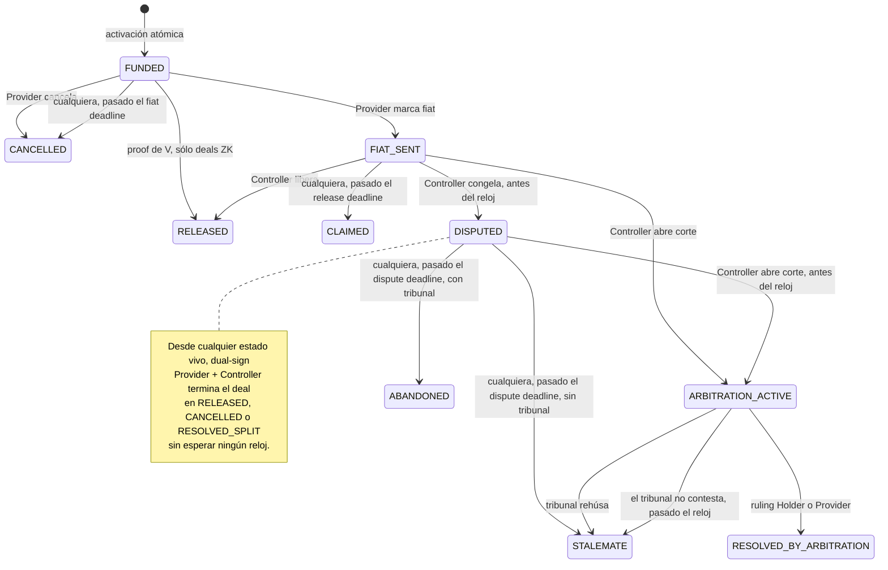

# PluriSwap

Escrow P2P de principal cripto contra fiat offchain. Kernel neutral (sin dueño, sin pausa, sin allowlist), paquetes opt-in, pools de terceros, rampas cero-bps. La privacidad es un valor de diseño.

**Toda la documentación del protocolo vive en [`PLURISWAP.md`](./PLURISWAP.md)**: visión, espíritu, diseño, decisiones e implementación. Empezá ahí.

Estado de verificación: [`INFORME.md`](./INFORME.md) — qué camino se ejercita, cómo, y qué no.
Hallazgos abiertos de la revisión: [`EVALUACION.md`](./EVALUACION.md).

Artefactos operativos (fuera del monolito por necesidad, no por fragmentación — su lector no es
quien diseña el protocolo):

- [`REPUTACION.md`](./REPUTACION.md) — qué muestra el perfil de una cuenta, qué de eso no se puede falsificar, y qué tiene que chequear quien la consume. Para frontends e integradores
- [`KLEROS_POLICY.md`](./KLEROS_POLICY.md) — policy que leen los jurados; se pinea a IPFS como `KLEROS_POLICY_URI` (PLURISWAP.md §5.8)

## Cómo termina un deal

Un deal produce **exactamente un** resultado económico. Estas son todas las ramas, y todas se
ejercitan sobre una chain real en cada corrida de `script/e2e.sh` — no sólo en tests.



Tres reglas que explican casi todo el dibujo:

- **Los relojes los ejecuta cualquiera.** Ningún derecho depende de que un keeper actúe: el timeout
  sigue disponible hasta que otra transición válida gane la carrera.
- **Dual-sign sale desde cualquier estado vivo.** Si el Provider y el Controller firman, el deal
  termina donde ellos digan, sin esperar ningún reloj.
- **Un deal con `PAYMENT_PROOF` es proof-o-timeout.** `markFiat`, `claim`, `openDisputed` y
  `openCourt` revierten `EdgeOff`: el grafo se reduce a `FUNDED → RELEASED` o `FUNDED → CANCELLED`.

### Los trece finales

| Final | Lo dispara | Cuándo | Holder / Provider | Completion fee | Bonds | Score |
| --- | --- | --- | --- | :-: | --- | --- |
| `RELEASED` release | Controller | desde `FIAT_SENT` | 0 / 100% | sí | vuelven | ambos limpios |
| `RELEASED` co-signed | dual-sign | cualquier estado vivo | 0 / 100% | sí | vuelven | ambos limpios |
| `RELEASED` por proof | cualquiera con proof de V | `FUNDED`, sólo ZK | 0 / 100% | sí | vuelven | ambos limpios |
| `CLAIMED` | cualquiera | pasado el release deadline | 0 / 100% | sí | vuelven | Provider limpio, Holder nada |
| `CANCELLED` cancel | Provider | antes de marcar fiat | 100% / 0 | no | vuelven | nadie |
| `CANCELLED` fiat timeout | cualquiera | pasado el fiat deadline | 100% / 0 | no | vuelven | nadie |
| `CANCELLED` mutual | dual-sign | cualquier estado vivo | 100% / 0 | no | vuelven | nadie |
| `RESOLVED_SPLIT` | dual-sign | cualquier estado vivo | bps firmados | sí | vuelven | ambos limpios |
| `STALEMATE` deadlock | cualquiera | pasado el dispute deadline, **sin** tribunal | 50% / 50% | no | **al sink, los dos** | **ambos −10** |
| `ABANDONED` | cualquiera | pasado el dispute deadline, **con** tribunal | 0 / 100% | sí | vuelven | **el que abrió −5**, el otro limpio |
| `RESOLVED_BY_ARBITRATION` holder | cualquiera, tras el ruling | `ARBITRATION_ACTIVE` | 100% / 0 | no | **slash al Holder** | perdedor **−15** |
| `RESOLVED_BY_ARBITRATION` provider | cualquiera, tras el ruling | `ARBITRATION_ACTIVE` | 0 / 100% | sí | **slash al Provider** | perdedor **−15** |
| `STALEMATE` tribunal rehúsa | cualquiera, tras el ruling | `ARBITRATION_ACTIVE` | 50% / 50% | no | vuelven | **ambos −5** |
| `STALEMATE` tribunal mudo | cualquiera | pasado el arbitration deadline | 50% / 50% | no | vuelven | **nadie** — falló la corte |

Dos asimetrías que conviene tener presentes, porque son decisiones y no accidentes:

- **Un refund no es un trade**, así que no paga completion fee. Un payout sí, gane como gane.
- **Un desacuerdo sin tribunal cuesta a los dos; con tribunal, lo pierde quien no escaló.** Si las
  partes firmaron sin ARBITRATION y nadie cede antes del reloj, el deal cierra en stalemate: mitad y
  mitad, los bonds de ambos al sink y −10 a cada uno. Existe para que acordar siempre convenga. Si
  firmaron con tribunal, el Controller que abrió la pelea y no la escaló la pierde: el principal va
  entero a la contraparte, y los bonds vuelven porque el abandono es culpa *asumida*
  (Parte IV, 2026-09-24).

### La reputación, medida

El cap es **lo máximo que podés tener abierto al mismo tiempo**, no un límite por deal. Un deal
cerrado al tope vale 2 puntos, porque el cap de T1 *es* la unidad de volumen del score:

| Deals cerrados al tope | Score | Cap | Cap con bond |
| ---: | ---: | ---: | ---: |
| 0 | 0 | 250 | 400 |
| 5 | 10 | 500 | 700 |
| 10 | 25 | 1.000 | 1.500 |
| 15 | 50 | 2.000 | 5.000 |
| 21 | 104 | 5.000 | sin límite |

Veintiún deals limpios de T1 a T5, acelerando solo — a cap más alto, más volumen por deal. Un
abandono o un stalemate del tribunal resta 5, un deadlock resta 10, y cualquiera de los dos **baja de
tier en el acto**. Lento de ganar, rápido de perder.

Esa curva es la del sujeto en aislamiento. En un mercado son **21 contrapartes distintas** (el crédito
es una vez por contraparte, §3.14.7) y el cap que ata es el más chico de los dos lados: contra novatos
cada deal vale 2 puntos y llegar arriba son ~50 personas. La escalera premia amplitud.

`script/ReputationLadder.s.sol` camina esta curva on-chain y la narra; `test/ReputationCurve.t.sol`
la pinea para que la tabla de arriba no se pudra en silencio.

### Dónde se ejercita cada cosa

| Script | Qué camina |
| --- | --- |
| `Paths.s.sol` | los doce finales Core (CASE-CORE-03..15), sin paquetes |
| `TrioDeal.s.sol` | un deal empaquetado: Passport + reputación + bonds, hasta `RELEASED` |
| `CatalogDeals.s.sol` | release por payment proof, y un arbitraje ganado por el Provider |
| `ReputationLadder.s.sol` | la curva: tiers, los dos rechazos del cap, lo que suma un bond, la democión |
| `ArbitrationPaths.s.sol` | los cinco finales de veredicto, con bonds puestos |
| `PoolDeal.s.sol` | un pool como Holder-contrato (EIP-1271 + pull exacto) |
| `DeployPrivate.s.sol` | la capa privada de §3.15 entera, con su cableado verificado |
| `RampDeal.s.sol` | la rampa Stargate (sólo en una chain real) |
| `Doctor.s.sol` | audita un deployment vivo: presencia, forma y consistencia |

Cobertura completa, incluido **lo que no está cubierto**: [`INFORME.md`](./INFORME.md).

## Stack

Foundry, Solidity `0.8.28`, Cancun, `via_ir`. OpenZeppelin v5. Arbitrum (Sepolia `421614` hoy). Sin proxy, sin `Pausable` / `Ownable` sobre settlement.

## Build y test

Auditar un deployment vivo (read-only, sin key):

```shell
forge script script/Doctor.s.sol:Doctor --rpc-url $RPC
```

Desplegar la cadena entera a una chain real:

```shell
RPC_URL=$ARBITRUM_SEPOLIA_RPC_URL DEPLOY_KEY=0x... script/e2e.sh
# ETHERSCAN_API_KEY=... para verificar el source en el explorer
```

```shell
forge build
forge test                       # unit + fuzz (256 runs) + invariants (32 x 256)
FOUNDRY_PROFILE=ci forge test    # fuzz 2048, invariants 128 x 512
```

CI (push y PR): `forge fmt --check`, `forge build --sizes` con gate de margen de bytecode, `forge test`, Slither (`--fail-medium`), Aderyn (`--fail-high`), **deploy + catálogo Core sobre una chain fría** (`script/e2e.sh`: despliega todo el stack en anvil, camina CASE-CORE-03..15, verifica los terminales que aterrizaron y audita el resultado con `Doctor.s.sol`), gates de drift de fixtures (bun regenera los vectors de los circuits y el fixture de los singletons Poseidon, y exige `git diff --exit-code`) + suite JS del consumer side de F4 (verify/chain, semántica con stubs); CI nunca necesita nargo/bb — proofs, verifiers y VKs viven como fixtures comprometidos. Nightly con perfil `ci`. Detalle y ley de TDD en `PLURISWAP.md` §5.4.

## Layout

```
src/Escrow.sol              kernel
src/interfaces/IEscrow.sol  superficie de lectura (packages, pools, ramps)
src/libraries/              Consent, Terms, Settlement, Clocks, Types, PackageId, Packages (external)
src/packages/               módulos opt-in detrás de interfaces
src/pools/                  Holder-contrato vault + factory
src/ramps/                  composers (Stargate)
circuits/                   la capa ZK: 11 circuitos Noir + el twin JS + la lib de consumer side F4 (verify/chain; ver circuits/README.md)
verifiers/                  subproyecto de los verifiers Honk generados (via_ir off)
script/                     deploy y deal scripts
deployments/                addresses, no secrets
test/                       un área de catálogo por archivo (+ fuzz/, invariant/, fork/)
mocks/                      stand-ins de test; nunca identidad de producción
```

Diseño, decisiones y detalle normativo: [`PLURISWAP.md`](./PLURISWAP.md).
