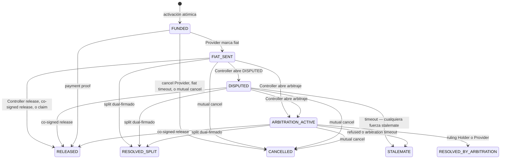
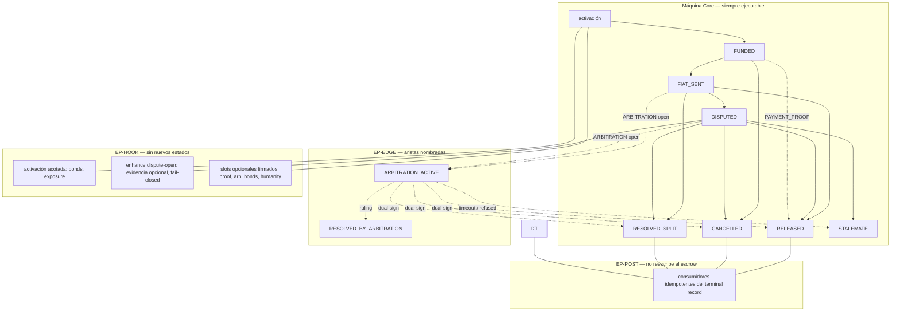

# Máquina de estados del escrow

Fuente del grafo y de las transiciones: `pluriswap/PROTOCOL.md` (PluriSwap Protocol Charter, versión 3). Este archivo extrae lo que gobierna la custodia de principal cripto y las transiciones del deal.

Los **roles del kernel** — Holder, Provider, Controller — son la lectura acordada de esa máquina. Divergen del charter en un punto: la gestión de pools no es kernel. Un pool es un Holder con constitución propia; ver `POOLS.md`. Rampas de bridge (Stargate u otras) tampoco son kernel; ver `RAMPS.md`. Paquetes opcionales y fees: `PACKAGES.md`. Cómo el kernel los llama, y el lugar de la DAO: `PROTECTION.md`.

El recinto del escrow es **Arbitrum**. El EIP-712 bindea esa chain y ese deployment. La superficie oficial de arranque son stables que Stargate lista ahí; ETH después. Un Holder que ya tiene el token en Arbitrum no necesita rampa.

El escrow es una máquina **cerrada** con **puntos de extensión nombrados**. Esa forma es lo que permite un protocolo permissionless y descentralizado: cualquiera puede abrir y cerrar un escrow Core sin paquetes, y cualquiera puede publicar un paquete compatible sin mutar el kernel ni bloquear las salidas Core.

---

## 1. Qué es el escrow

PluriSwap custodia **principal cripto** contra un acuerdo fiat offchain. No custodia fiat. No autentica por sí solo que el fiat se pagó. No inventa un tribunal.

**Mandatory Core** es el listón constitucional: un Holder y un Provider cualesquiera pueden activar, fondear y llegar a un resultado económico terminal usando solo transiciones Core. Sin identidad, reputación, bonds, payment proof, arbitraje, pool, aprobación DAO, ni frontend endosado.

El kernel es la máquina de estados inmutable del deal **y** la caja del principal. Escribe estado, verifica consentimiento, aplica el catálogo, hace pull exacto, y en el terminal acredita. No hay un paquete de custodia. Los paquetes hookeables nunca escriben estado Core y nunca mueven principal.

```
escrow  =  máquina + balances del deal + créditos maduros
escrow  →  paquetes     (unidireccional)
BondVault               (otra caja: skin, no principal)
```

Un deal activo es un escrow que ya activó y todavía no es terminal. Tras el terminal, los créditos maduros son pasivos abiertos, no deals activos.

### 1.1 Custodia

Mientras el deal vive, el principal es **del deal**. Nadie retira: ni Holder, ni Controller, ni rampa. Al terminal, el escrow parte según el outcome (Holder / Provider / fee) y escribe créditos irrevocables. Un `transfer` ERC-20 que falla **no** deshace el outcome: queda el crédito; el beneficiario (o quien él autorice) hace withdraw después. Un push en la misma tx es cortesía.

El BondVault no se mezcla (`PACKAGES.md` §5). Pools y rampas no son esta caja: el pool es Holder; la rampa actúa antes del pull o después del withdraw.

**Tamaño de contrato.** El límite de deployment (~24 KB) se ataja desde el día uno: libraries `external` de protocolo + OpenZeppelin `internal` para crypto/ERC-20. Mapa y allowlist: `IMPLEMENTATION.md`. Un vault hermano o un Diamond solo si el link no alcanza. Eso no reintroduce un paquete de custodia.

---

## 2. Actores del kernel

El kernel ve tres roles. No ve pools, mandatos, ni fees de operator.

| Rol | Dueño de | Sobre el deal puede | No puede |
| --- | --- | --- | --- |
| **Holder** | El principal | Producir la autorización EIP-712 del deal (sección 3); ser la fuente y el destino del principal | Redirigir el retorno tras activación; operar el deal si no es también Controller |
| **Provider** | El fiat (offchain) | Firmar los términos; marcar fiat, cancelar antes de fiat, dual-sign, claim tras el release deadline | Claim antes del deadline; marcar fiat sin haber activado |
| **Controller** | Nada del principal | Obtener la autorización del Holder y operar el deal: activar, release, `DISPUTED`, dual-sign, abrir arbitraje si está seleccionado | Inventar la firma del Holder; recibir principal; cambiar Holder o Provider |

Después de `FUNDED`, el Holder no vuelve a firmar. El Controller hace todo el lado holder. La única pieza que el Controller no puede fabricar es la autorización EIP-712 del Holder. Ahí está la compatibilidad entre persona a persona y un Holder-contrato (pool, Safe, tesorería): el mismo typed data, distinta forma de obtenerlo.

Persona a persona es el caso degenerado: `Holder == Controller`. Esa wallet produce la autorización y opera el deal. No hay segundo firmante holder-side.

El snapshot de activación congela Holder, Provider, Controller y clocks. **No hay receivers aparte.** Holder-gross vuelve al Holder. Provider-gross va a la address de firma del Provider. Así el que firmó es el que cobra, y la reputación no se parte entre una wallet que opera y otra que recibe. El Holder de *ese* deal no se cambia después: ni upgrade de términos, ni un campo de payout.

Holder y Provider usan addresses de firma distintas. Cualquiera puede relay. El relayer no fondea desde un Holder sin esa autorización.

---

## 3. Consentimiento EIP-712

El Controller conduce el deal. El Holder solo autoriza. Un solo esquema de typed data cubre persona a persona y un Holder que es un contrato. El kernel no tiene un path “pool” y otro “wallet”.

```
Controller recolecta
    ├─ HolderAuthorization   (EIP-712 del Holder; ECDSA o EIP-1271)
    ├─ firma del Provider    (mismos términos)
    └─ ControllerAcceptance  (solo si Holder ≠ Controller)
         │
         ▼
   activación atómica: verifica firmas → pull exacto desde el Holder → FUNDED
         │
         ▼
   a partir de ahí: Controller opera; Holder no firma más este deal
```

### 3.1 Qué autoriza el Holder

`HolderAuthorization` es un EIP-712. No es un `approve` ERC-20 suelto. En un solo digest el Holder autoriza, para **ese** deal:

- los términos (`DealTerms`);
- quién es Holder, Controller y Provider;
- token y principal;
- que el escrow haga pull exacto de ese principal desde el Holder;
- nonce y deadline **de esa party**.

El dominio EIP-712 bindea chain, deployment y versión de protocolo. Sin eso hay replay.

Cada firmante de activación (Holder, Provider, Controller si es distinto) consume `used[signer][nonce]`. Un nonce, un fill. Si la activación falla, no se consume ninguno. Detalle: `ENCODING.md`.

Cuando `Holder == Controller`, esa firma es también la aceptación del Controller. No hay segundo mensaje.

Cuando `Holder ≠ Controller`, el Holder nombra al Controller en el mismo typed data y el Controller firma `ControllerAcceptance` sobre el mismo `termsHash`. Sin esa aceptación se puede colgar el rol a alguien que no lo pidió.

El Provider firma los mismos términos. Tres roles, como máximo tres firmas; en persona a persona, dos (Holder/Controller + Provider).

### 3.2 Cómo se verifica

La misma verificación para EOA y para contrato:

| Holder | Qué entrega el Controller | Qué chequea el kernel |
| --- | --- | --- |
| EOA | firma ECDSA del digest EIP-712 | `ecrecover` == Holder |
| Contrato (pool, Safe, smart wallet) | `bytes` que ese contrato acepta | `IERC1271.isValidSignature(digest, bytes) == MAGICVALUE` |

El kernel no interpreta esas `bytes`. Un EOA manda 65 bytes. Un pool puede mandar vacío, un proof de mandato, o lo que su constitución defina. Si `isValidSignature` dice sí sobre **ese** digest, el Holder autorizó. Cómo el Controller consiguió esas bytes es offchain o constitución del contrato; no es máquina de estados.

Persona a persona: el Controller *es* el Holder, así que produce la ECDSA (o el 1271 de su propia smart wallet). Un pool: el Controller pide al contrato Holder que valide el mismo digest. El typed data no cambia.

### 3.3 Qué no cubre

Después de `FUNDED`, release, `DISPUTED`, dual-sign y abrir arbitraje los firma o los llama el **Controller**, no el Holder. El Holder ya delegó el proceso al nombrar Controller.

Dual-sign (cancel, split, co-signed release) = Provider + Controller snapshotado. En persona a persona es la misma wallet que el Holder; no es un path distinto.

La autorización del Holder no permite:

- redirigir holder-gross al Controller ni a un payout distinto del Holder;
- nombrar un payout del Provider distinto de su address de firma;
- cambiar Holder o Provider después;
- reusar el nonce de una party en otro fill;
- autorizar un principal distinto o un Controller distinto al del digest.

Pull sin digest válido, o digest válido con pull incompleto, rechaza atómico. No hay deal.

### 3.4 Relación con los términos

`termsHash` cubre el set versionado de negocio: protocolo y deployment, Holder, Provider, Controller, token, principal, fees de paquete, clocks, y cada extensión seleccionada (proof, arbitraje, bonds). No hay campo de receiver: las addresses de firma *son* los destinos. La spec técnica cierra el encoding. El kernel no activa contra un hash que no reconstruye esos campos.

Stale: si términos, Controller o identidad del Holder-contrato cambiaron después de firmar y antes de ejecutar, la autorización rechaza. No adopta términos nuevos en silencio.

### 3.5 Cómo se mueve el principal

La autorización y el pull son dos pasos de la misma activación atómica. El kernel verifica `HolderAuthorization` y después observa un movimiento exacto desde el Holder hacia **sí mismo**. No prescribe *cómo* el Holder se volvió pullable.

Cualquiera de estas implementaciones es conforme si el delta es exacto y same-transaction:

| Mecanismo | Quién coopera | Típico en |
| --- | --- | --- |
| ERC-20 `approve` + `transferFrom` | El Holder (EOA o contrato) aprueba al escrow; el escrow hace pull | Persona a persona; pool que aprueba por deal o con allowance |
| Permit2 (o equivalente) | El Holder aprueba Permit2 una vez; cada deal es un EIP-712. Permit2 verifica ECDSA o EIP-1271 | EOA y contrato con el mismo typed data |
| Transfer del propio Holder | El contrato Holder transfiere al escrow en la misma tx, tras validar el digest | Vault / pool con `onlyController` o mandato interno |
| ERC-2612 `permit` del token | Solo si el *owner* del token es una EOA (el `permit` clásico usa `ecrecover`) | Persona a persona. **No** alcanza si el Holder es un contrato |

Una wallet **no** puede auto-otorgarse gasto sobre tokens de un contrato ajeno. El contrato Holder tiene que optar: `approve`, EIP-1271, Permit2, o una función que transfiera. Eso no es un hueco del kernel; es la superficie que el Holder-contrato implementa.

Pre-transfer, surplus no solicitado, allowance sola sin digest, callback que reporta un valor, o pull incompleto **no** crean deal.

### 3.6 Factibilidad (EOA y contrato)

Este recorte es un patrón existente (Safe, Permit2, Seaport). No hay un path Solidity distinto para persona a persona y para pool. El typed data no cambia. Un pool futuro implementa `isValidSignature` y se vuelve pullable; entra por CASE-CORE-01.

Lo que *no* es un bloqueo de máquina, y no debe empujar gestión de pool al kernel:

- **ERC-2612 solo.** Insuficiente para Holder-contrato. El path canónico es EIP-712 + ECDSA o EIP-1271.
- **`isValidSignature` mal escrito.** Digest, nonce y expiry son responsabilidad del Holder-contrato. Un 1271 que dice sí a todo solo puede vaciar *ese* Holder, no otro deal ni otro pool.
- **Proxy upgradeable entre firma y activación.** El digest es el mismo; el código que lo valida puede cambiar. O los términos bindean code hash (stale → reject), o es riesgo aceptado del Holder. El escrow no se rompe.
- **Tokens no estándar** (fee-on-transfer, rebase). El kernel exige pull exacto; esos tokens no activan. Independiente de si el Holder es wallet o pool.
- **Bridge / rampa.** No es máquina. Stargate (u otra) es un composer delante o detrás del escrow (`RAMPS.md`). Superficie v1: stables que Stargate lista en Arbitrum. El protocolo no cobra por esa rampa.

El Controller obtiene las `bytes` como pueda (las firma él mismo si es el Holder; las pide al contrato si no). El kernel solo verifica y hace pull.

---

## 4. Por qué la forma de la máquina importa

Permissionlessness y descentralización no son un SKU comercial. Son invariantes de la máquina.

| Garantía | Consecuencia en la máquina |
| --- | --- |
| Cualquier address puede participar (PERM-01) | Activación y transiciones no piden aprobación de gobernanza |
| Cualquier address puede ejecutar un timeout (PERM-04, EXT-09) | El ejecutor no elige receptor ni outcome; la economía está predeterminada |
| Rechazo solo por condiciones objetivas (PERM-07, PERM-08) | No hay registry, endorsement, ni catálogo comercial como gate de ejecución |
| Custodia y reglas inmutables (DEC-01, DEC-02) | Nadie redirige principal, inventa un outcome, ni ejecuta una transición no listada |
| Deal activo inmune (DEC-03) | Snapshot en activación; gobernanza posterior no muta clocks, Holder, Provider, ni salidas |
| Sin pausa de settlement (DEC-04) | No existe freeze administrativo de una salida válida |
| Sin liveness privilegiada (DEC-07) | Una transición elegible no depende de un server, secret, signer, relayer o keeper del protocolo |
| Fallback first (KERNEL-04) | Si un paquete está ausente, revierte, drifted o delisted, las salidas Core siguen ejecutables |

La regla de completitud del charter cierra el catálogo: una transición no definida aquí está prohibida; un rol no tiene autoridad salvo la definida y consentida; un movimiento económico no definido está prohibido; un paso requerido fallido deja estado y contabilidad sin cambio; en una carrera gana la primera transacción exitosa.

Extender el protocolo **no** es abrir el catálogo. Es componer partes inmutables sobre una superficie de extensión estable. Mutar el kernel, o dejar que un paquete bloquee un path obligatorio, rompe permissionlessness.

---

## 5. Estados

### Core (siempre presentes)

| Estado | Clase | Significado |
| --- | --- | --- |
| `FUNDED` | Activo | Principal en custodia; fiat aún no marcado |
| `FIAT_SENT` | Activo | El Provider afirmó envío fiat; corre el release deadline |
| `DISPUTED` | Activo | Freeze abierto por el Controller; claim y release unilateral deshabilitados |
| `RELEASED` | Terminal | Principal al lado Provider (release, co-signed release, claim, o payment proof) |
| `RESOLVED_SPLIT` | Terminal | Split dual-firmado |
| `STALEMATE` | Terminal | 50/50 de protocolo: timeout de `DISPUTED` sin tribunal, o arbitraje rehusado / arbitration timeout |
| `CANCELLED` | Terminal | Principal al Holder (cancel Provider, fiat timeout, o mutual cancel) |

`CLAIMED` no es un estado. Es un **outcome económico** de `RELEASED` (timeout claim). `STALEMATE` sí es un estado. El terminal record distingue origen (reloj de `DISPUTED` vs adapter vs arbitration timeout) sin partir la economía: principal 50/50; bonds, si hay, se queman.

### Solo perfil ARBITRATION

| Estado | Clase | Significado |
| --- | --- | --- |
| `ARBITRATION_ACTIVE` | Activo (extensión) | Disputa externa abierta; corre el arbitration deadline |
| `RESOLVED_BY_ARBITRATION` | Terminal (extensión) | Ruling autenticado holder-win o provider-win |

Si ARBITRATION no está seleccionado, esas aristas **rechazan o están ausentes**. No deben existir como stubs muertos presentados como capacidad.

---

## 6. Grafo

Líneas sólidas = Mandatory Core. Líneas punteadas = solo si el perfil está habilitado en los términos firmados.



Tres caminos Core que cualquier implementación conforme debe poder ejecutar **sin paquetes**:

1. **Éxito no contestado.** activar → `FUNDED` → `FIAT_SENT` → release del Controller, dual-sign, o claim permissionless tras el release deadline (silencio = no-contestación bajo los timeouts firmados).
2. **Contestación Core.** activar → `FUNDED` → `FIAT_SENT` → Controller abre `DISPUTED` → dual-sign (incluido split), o cualquiera fuerza stalemate tras `disputeDeadline`.
3. **Fiat timeout en `FUNDED`.** A partir de `fiatDeadline`, cualquiera cancela y devuelve principal al Holder. Corre contra mark-fiat; no auto-cancela ni congela mark-fiat.

Core no tiene tribunal externo. Abrir `DISPUTED` congela el claim; no adjudica si el fiat se pagó. Un ruling externo sobre `FIAT_SENT` exige el perfil ARBITRATION.

El grafo no cambia porque el Holder sea una wallet de consumo o un contrato. Cambia cómo el Controller obtuvo `HolderAuthorization` (ECDSA o EIP-1271) y quién es el Controller.

---

## 7. Relojes

Los deadlines usan el timestamp canónico de la chain. Cada origen y deadline absoluto se escribe **una vez**.

Las **partes** eligen las duraciones (fiat, release, dispute; arbitration si el paquete está seleccionado). Van en los términos, las cubre `HolderAuthorization`, y el snapshot las congela. El único bound del kernel: `duration >= 0`. Mínimo 0, sin máximo. Negativo rechaza la activación. Cero: el timeout queda elegible en cuanto existe el origen (`en o después` del deadline). Un reloj de años es riesgo de las partes.

Un frontend o un pool puede sugerir defaults. Eso no es máquina.

| Reloj | Origen | Efecto permissionless |
| --- | --- | --- |
| `fiatDeadline` | timestamp de activación + fiat duration | Cualquiera cancela desde `FUNDED` (Holder-favorable). Corre contra mark-fiat. |
| Release deadline | timestamp de `FUNDED` → `FIAT_SENT` + release duration | Cualquiera claim desde `FIAT_SENT` (silencio = no-contestación). Abrir `DISPUTED` o arbitraje solo **estrictamente antes**. |
| `disputeDeadline` | timestamp de `FIAT_SENT` → `DISPUTED` + dispute duration | Cualquiera fuerza stalemate. Abrir arbitraje desde `DISPUTED` solo **estrictamente antes**. |
| Arbitration deadline | timestamp de entrada a `ARBITRATION_ACTIVE` + arbitration duration | Solo si ARBITRATION está habilitado. Cualquiera ejecuta stalemate. Se deriva del duration snapshotado; no exige respuesta del adapter. |

El stalemate de `DISPUTED` es 50/50 fijo; no usa `disputeTimeoutProviderBps`.

Los derechos de timeout **no caducan** porque un keeper no actuó de inmediato. Siguen ejecutables hasta que otra transición válida gane. No exigen que el Controller siga disponible.

---

## 8. Catálogo Core de transiciones

| Caso | Desde | Quién / qué | Timing | Resultado |
| --- | --- | --- | --- | --- |
| CASE-CORE-01 | Sin deal | Relay de `HolderAuthorization` (sección 3) + firma del Provider + pull exacto desde el Holder. Si `Holder ≠ Controller`, también `ControllerAcceptance` | Antes de creation expiry | Activa en `FUNDED` |
| CASE-CORE-02 | `FUNDED` | Provider marca fiat sent | Antes de que gane otra transición | Entra `FIAT_SENT`; arranca release deadline |
| CASE-CORE-03 | `FUNDED` | Provider cancela | Antes de mark-fiat | Principal al Holder; `CANCELLED` |
| CASE-CORE-04 | `FUNDED` | Cualquiera ejecuta fiat timeout | En o después de `fiatDeadline` | Principal al Holder; `CANCELLED` |
| CASE-CORE-05 | `FUNDED` | Cualquiera relay de autorización dual RES-01 (Provider + Controller) | Antes de expiry del payload | Mutual cancel |
| CASE-CORE-06 | `FIAT_SENT` | Controller libera | Antes de que gane otro terminal | `RELEASED` al Provider |
| CASE-CORE-07 | `FIAT_SENT` | Cualquiera claim | En o después del release deadline; sigue en `FIAT_SENT` | `RELEASED` con outcome `CLAIMED` |
| CASE-CORE-08 | `FIAT_SENT` | Cualquiera relay mutual cancel | Antes de expiry del payload | Mutual cancel |
| CASE-CORE-09 | `FIAT_SENT` | Cualquiera relay split RES-02 | Antes de otro terminal y expiry | `RESOLVED_SPLIT` |
| CASE-CORE-10 | `FIAT_SENT` | Cualquiera relay co-signed release RES-03 | Antes de otro terminal y expiry | `RELEASED` al Provider |
| CASE-CORE-11 | `FIAT_SENT` | Controller abre `DISPUTED` | Estrictamente antes del release deadline; a lo sumo una vez | Entra `DISPUTED`; arranca dispute deadline |
| CASE-CORE-12 | `DISPUTED` | Mutual cancel | Antes de expiry del payload | Mutual cancel |
| CASE-CORE-13 | `DISPUTED` | Co-signed release | Antes de otro terminal y expiry | `RELEASED` al Provider |
| CASE-CORE-14 | `DISPUTED` | Split dual-firmado | Antes de otro terminal y expiry | `RESOLVED_SPLIT`: una parte del principal al Holder, el resto al Provider |
| CASE-CORE-15 | `DISPUTED` | Cualquiera fuerza stalemate | En o después de `disputeDeadline` | `STALEMATE`: principal 50/50; bonds, si hay, se queman |
| CASE-CORE-16 | `DISPUTED` | Release unilateral o claim | Siempre | Rechaza; sin cambio económico |
| CASE-CORE-17 | Cualquier terminal | Cualquier acción que cambie estado | Siempre | Rechaza; sin cambio económico |

Dual-sign (cancel, split, co-signed release) exige `MutualCancel` / `MutualSplit` / `CoSignedRelease` EIP-712 del Provider y del Controller snapshotados (`ENCODING.md` §5). Relayer cualquiera. Cada uno trae su nonce.

Desde `DISPUTED`, el split (CASE-CORE-14) es la salida pacífica parcial: el Holder recupera una parte del principal y el Provider recibe el resto, según los bps firmados en el payload. No es un veredicto. El completion fee de ese terminal se calcula sobre el **principal completo del deal**, no sobre la tajada del Provider (sección 12).

Abrir `DISPUTED` es gratis en Core: sin fee y sin bond. Es el freno defensivo del lado Holder contra un claim no autenticado. No es un tribunal, no es un win del Holder, y no quema principal. Un paquete puede cobrar por abrir contest **solo** en deals que lo seleccionaron.

Si el deal seleccionó `PAYMENT_PROOF`, CASE-CORE-11 rechaza: ese escrow no entra a `DISPUTED`. Ver §9.1.

Mientras `DISPUTED`, el principal se mueve solo por dual-sign, por una salida de paquete habilitada, o por stalemate tras `disputeDeadline`.

---

## 9. Puntos de extensión

Esta es la superficie permanente. Un paquete se engancha aquí o no se engancha. Pedir una superficie nueva exige una nueva versión de protocolo.

Hay tres clases de extensión. Solo la primera añade estados o aristas a la máquina. Las otras dos tocan activación, reservas, o consumidores post-terminal **sin** abrir el catálogo de transiciones.

Delegar el proceso en un Controller **no** es una extensión. Es Core: CASE-CORE-01 y la sección 3. Un Holder-contrato no se engancha como perfil de máquina; produce el mismo `HolderAuthorization` vía EIP-1271.



### 9.1 EP-EDGE — aristas nombradas de la máquina

EXT-01: los paquetes se enganchan solo por la superficie de hooks acotada y por las aristas nombradas de esta sección. Si el perfil está ausente, la arista rechaza y **todo path terminal Core sigue ejecutable**.

#### EP-EDGE-PROOF — `PAYMENT_PROOF`

Habilita release automático autenticado. El deal firmó un verifier V: solo un proof de V cuenta; cualquier otro se ignora.

Si este perfil está seleccionado, el escrow es **proof o timeout**. No entra a `DISPUTED`. Tampoco hay claim ni release unilateral del Controller: esas salidas no están autenticadas por V. El grafo de *ese* deal queda:

- `FUNDED` + proof de V → `RELEASED`
- `FUNDED` + `fiatDeadline` (o cancel del Provider / mutual cancel) → `CANCELLED`

Si el fiat no se prueba a tiempo y se ejecuta el timeout, el principal vuelve al Holder. Es el comportamiento esperado: las partes acordaron V y una no cumplió. No hay otro camino. El Provider que pagó offchain y no obtuvo proof no tiene claim.

| Caso | Desde | Quién | Resultado |
| --- | --- | --- | --- |
| CASE-PAY-01 | `FUNDED` | Cualquiera con proof autenticado del verifier/policy seleccionados | `RELEASED` al Provider |

CASE-PAY-02 y CASE-PAY-03 no aplican: un deal con `PAYMENT_PROOF` no llega a `FIAT_SENT` ni a `DISPUTED`.

Contrato de extensión:

- El deal debe seleccionar verifier y policy inmutables en los términos (identidad de paquete, no un address suelto).
- El verifier autentica evidencia; decodificar claims del caller no es verificación.
- Public inputs incluyen el `dealId` de este escrow. Un proof de otro deal no verifica.
- `paymentNullifier` de un receipt autenticado: un pago liquida a lo sumo un deal bajo V. Gastado → reject. Distinto del nullifier de Passport.
- Autenticación, consumo de nullifier, transición, principal y fees del paquete ZK commit o revert juntos.
- El fee del paquete ZK se cobra **al verificar** (al pasar a `RELEASED`), no en activación. Timeout: no hubo verificación, no hay fee ZK.
- El verifier **no** redirige settlement ni cambia términos.

Esta arista es permissionless en la ejecución: cualquiera puede someter un proof válido de V. Publicar un verifier compatible es permissionless (PERM-03); usarlo en un deal exige selección explícita del paquete (TRUST-02).

#### EP-EDGE-ARB — `ARBITRATION`

Tribunal externo opcional. No reemplaza `DISPUTED`; escala a un ruling autenticado cuando las partes eligieron esa dependencia de confianza.

| Caso | Desde | Quién | Resultado |
| --- | --- | --- | --- |
| CASE-ARB-01 | `FIAT_SENT` | Controller paga fee acotado y abre | `ARBITRATION_ACTIVE`; arranca arbitration deadline |
| CASE-ARB-02 | `DISPUTED` | Igual, estrictamente antes de `disputeDeadline` | `ARBITRATION_ACTIVE`; **retira** el dispute timeout Core |
| CASE-ARB-03 | `ARBITRATION_ACTIVE` | Adapter autentica holder win | `RESOLVED_BY_ARBITRATION` |
| CASE-ARB-04 | `ARBITRATION_ACTIVE` | Adapter autentica provider win | `RESOLVED_BY_ARBITRATION` |
| CASE-ARB-05 | `ARBITRATION_ACTIVE` | Adapter autentica refused / no-decision | `STALEMATE` 50/50 |
| CASE-ARB-06 | `ARBITRATION_ACTIVE` | Cualquiera ejecuta arbitration timeout | `STALEMATE` 50/50 |
| CASE-ARB-07..09 | `ARBITRATION_ACTIVE` | Dual-sign cancel / split / co-signed release | Terminal Core correspondiente |

Contrato de extensión:

- Adapter y policy inmutables en los términos. Sin selección, abrir arbitraje rechaza.
- **Solo el Controller** abre corte (`CASE-ARB-01` desde `FIAT_SENT`, `CASE-ARB-02` desde `DISPUTED`). El Provider no. Un relayer solo transporta el open del Controller.
- Espacio de rulings cerrado: holder win, provider win, o refused/no-decision. Un ruling parcial, receptor alterno, o fee discrecional rechaza.
- El adapter **no** mueve custodia. Comunica un significado; el kernel aplica el mapa económico predeterminado.
- Fee de corte lo paga la **wallet del caller que abre** (el Controller), no el principal ni el Holder.
- Slash de bonds, si hay: lock del perdedor a la address de firma del ganador (Holder o Provider). Nunca al Controller.
- Abrir desde `DISPUTED` abandona el stalemate Core de `disputeDeadline` y lo reemplaza por el mapa de arbitraje (win o stalemate 50/50 fijo).
- Si el adapter o el tribunal desaparecen, el timeout de arbitraje es la liveness de **ese** path. Las salidas Core siguen siendo la liveness cuando ARBITRATION no está seleccionado.
- Delisting, pause, o overwrite de policy no pueden hacer que el protocolo rechace un ruling auténtico bajo la policy snapshotada, ni pueden deshabilitar las salidas Core independientes.

### 9.2 EP-HOOK — ganchos acotados, sin nuevos estados

Estos puntos no añaden nodos al grafo. Reservan, validan, o enriquecen. El kernel sigue siendo el único que escribe estado y el único que ejecuta fórmulas de settlement.

#### EP-HOOK-ACTIVATE — activación atómica (EXT-02, EXT-04)

La activación crea custodia de principal solo cuando consentimiento, nonce/expiry, funding exacto desde el Holder, y reservas seleccionadas succeden atómicamente. El principal queda en el escrow; no “pasa por” un paquete de custodia.

`HolderAuthorization` es consentimiento Core de CASE-CORE-01. No es un hook de paquete.

Hooks de activación permitidos (clases de resultado cerradas por la spec técnica):

| Perfil | Qué puede hacer en activación | Qué no puede hacer |
| --- | --- | --- |
| `BONDS` | Reservar colateral de rol con fórmula de slash por outcome/fault snapshotada | Elegir destinos, receivers, o fórmulas arbitrarias en el hook |
| Progressive admission | Reservar exposición para deals futuros bajo policy seleccionada | Convertirse en gate de un deal Core-only |

Reglas duras del hook:

- No puede devolver destinos de custodia, receivers, outcomes, estados, predicados, fórmulas, ni disposiciones terminales arbitrarias.
- Un componente autenticado produce solo clasificación/evidencia de fault cerrada. El kernel matchea esa clase al predicado firmado y ejecuta la fórmula fija.
- Settlement **no** hace callback de paquete después del commit terminal.
- Si una reserva o hook requerido falla, Core rechaza. No hay activación parcial.
- Failed activation: no hay deal, no se consume autorización de éxito, bond/fee sin cambio. Ningún nonce de activación se consume.

No hay hook `POOL` ni canal de operator fee en el kernel. Un contrato Holder puede pagar a su Controller fuera de esta máquina.

#### EP-HOOK-DISPUTE — enhance de `DISPUTED` (DISPUTE-06)

La transición base CASE-CORE-11 es Core y debe ejecutarse sin paquete. Un paquete puede:

- exigir fee, bond, u otro costo de contest **solo** si el deal seleccionó ese paquete;
- añadir un path de evidencia enhanced y fallar esa enhancement closed.

Un paquete **no** puede:

- hacer de su disponibilidad un prerrequisito de abrir `DISPUTED`;
- inyectar dispute duration en un deal que no la firmó;
- convertir el open gratis de Core en un peaje oculto.

La extensibilidad de contest usa el reloj `disputeDeadline` y el stalemate 50/50. **No** quema principal. Los bonds, si el paquete está seleccionado, se queman en ese stalemate (`PACKAGES.md`).

#### EP-HOOK-SLOTS — campos opcionales firmados (EXT-11)

Los términos pueden llevar slots para proof, arbitration, bonds, humanity/reputation, e identidad de paquete. Con el perfil apagado, esos campos están ausentes o inertes: no se cobran ni se enforzan.

Esto es el mecanismo permissionless de opt-in: el deal declara qué extensiones existen para **ese** escrow. El kernel no inyecta un DAO, un tribunal, ni un verifier.

#### EP-HOOK-ADMISSION — binding de paquetes (EXT-10)

Todo componente custody-adjacent seleccionado para un deal activo bindea chain, rol, address, identidad de código runtime, configuración/policy hash, manifest, API, terms hash, y la autorización de admission **en activación**. El kernel snapshottea ese binding y no depende de approval posterior.

Upgrade de proxy, pause de admin, delisting de registry, o drift de código **no** reescriben el snapshot ni deshabilitan las salidas Core independientes. Admission gobierna deals **futuros**, no deals vivos.

### 9.3 EP-POST — consumidores post-terminal (EXT-12)

Tras el commit, el kernel emite exactamente un terminal record inmutable y reconstruible (EXT-06). `settlementOf(dealId)` expone `status`, `holderAmt` y `providerAmt` — lo que `_finish` pagó. En el mismo settlement atómico, reasigna la posición deal-owned a créditos de beneficiario (EXT-08). El record se commitea **antes** de cualquier consumidor opcional y **antes** de un `transfer` que pueda revertir.

Consumidores permitidos, permissionless, idempotentes, a lo sumo una vez:

- ledgers de exposición;
- materializers de reputación;
- journals locales de un Holder-contrato (por ejemplo un pool) que reconcilia su tesorería.

Su fallo **no** revierte settlement Core, no bloquea deals ajenos, y no muta principal activo. Callbacks de un Holder-contrato **no** corren en el path de settlement Core.

`REPUTATION` y `HUMANITY` viven aquí (y en admission futura). No liberan principal. No añaden estados. Un humanity verifier no puede releasear escrow.

### 9.4 Qué un punto de extensión nunca puede hacer

Esta lista es el test de un protocolo permissionless. Si un diseño propuesto viola una fila, no es una extensión: es un fork del kernel.

| Prohibición | Por qué |
| --- | --- |
| Escribir estado del deal | KERNEL-07: un solo escritor |
| Mover principal Core | Solo el escrow, y solo según el catálogo. Un paquete no custodia ni transfiere principal |
| Bloquear, retrasar, o tasar un path obligatorio | KERNEL-04 |
| Inventar un outcome, receptor, o transición no listada | DEC-02, regla de completitud |
| Pausar una salida válida de un deal activo | DEC-04 |
| Mutar el snapshot de un deal vivo | DEC-03, EXT-05 |
| Exigir un server/keeper/signer del protocolo para una transición ya elegible | DEC-07 |
| Hacer endorsement, registry, o frontend un gate de ejecución | PERM-05, PERM-08 |
| Inyectar fee DAO o de paquete en un deal que no lo seleccionó | EXT-03, PROFILE-06 |
| Callback de paquete después del commit terminal | EXT-04, EXT-06 |
| Presentar una arista de perfil apagado como capacidad | 5.2 |
| Quemar principal en un timeout Core | DISPUTE-05 |
| Meter gestión de pool, mandato o fee de Controller en el kernel | El kernel ve Holder, Provider, Controller y `HolderAuthorization`. El resto es servicio aparte |

---

## 10. Autoridad sobre el escrow

| Actor | Sobre el escrow puede | No puede |
| --- | --- | --- |
| Holder | Producir `HolderAuthorization` EIP-712; ser fuente y destino del principal | Reescribir términos tras activación; operar el deal si no es el Controller snapshotado |
| Controller | Obtener esa autorización y operar el deal: release, dual-sign, `DISPUTED`, arbitraje si está seleccionado | Inventar la firma del Holder; recibir principal; cambiar Holder o Provider |
| Provider | Firmar términos; marcar fiat, cancelar antes de fiat, dual-sign, claim tras deadline; cobrar en su address de firma | Claim antes del deadline firmado; nombrar otro payout |
| Relayer | Transportar mensajes ya autorizados; pagar gas | Elegir términos, destinos, u outcomes; fondear sin `HolderAuthorization` válida |
| Keeper | Ejecutar transiciones de deadline públicas | Recibir autoridad de custodia |
| Payment verifier | Autenticar proof y devolver nullifier | Redirigir settlement |
| Arbitration adapter | Crear una disputa y devolver significado final autenticado | Administrar custodia; emitir un resultado no listado |
| Admission / gobernanza / attester | Deals futuros, opiniones, tesorería no custodial | Tocar principal activo |

Un contrato que custodia liquidez del Holder no es un actor del kernel. Es el Holder. Entra al deal por `HolderAuthorization` (ECDSA o EIP-1271), igual que una wallet.

---

## 11. Carreras

Entre transacciones simultáneamente elegibles, gana la primera que cambia estado. Las incompatibles posteriores rechazan. Cada acción se chequea contra su propia autoridad, enablement de perfil, y timing.

| Caso | Competidores |
| --- | --- |
| CASE-RACE-01 | Desde `FUNDED`: mark-fiat, cancel Provider, fiat timeout, mutual cancel; payment proof solo si está habilitado |
| CASE-RACE-02 | Desde `FIAT_SENT`: release del Controller, claim, abrir `DISPUTED`, dual-sign, payment proof si está, abrir arbitraje si está |
| CASE-RACE-03 | Abrir `DISPUTED` o arbitraje vs claim en el borde del release deadline: opens solo **antes**; claim solo **en o después** y aún en `FIAT_SENT`. Nunca elegibles al mismo timestamp observado |
| CASE-RACE-04 | Desde `ARBITRATION_ACTIVE`: ruling, timeout, dual-sign |
| CASE-RACE-05 | Desde `DISPUTED`: dual-sign, stalemate tras `disputeDeadline`, abrir arbitraje si está |
| CASE-RACE-06 | Ruling final vs arbitration timeout: a partir del deadline ambos pueden someterse; gana el primero |
| CASE-RACE-07 | Relays duplicados: tras éxito, el siguiente call que cambie estado rechaza |
| CASE-RACE-08 | Dual-sign vs stalemate en el borde de `disputeDeadline` |

Carrera intencional en `fiatDeadline`: timeout cancel y mark-fiat son elegibles a la vez. Core no auto-cancela. La protección del Holder es **ejecutar** el timeout, no la expiración pasiva del reloj.

---

## 12. Outcomes terminales del escrow

Un deal produce a lo sumo un resultado económico terminal. Settlement reasigna la posición existente a créditos irrevocables de beneficiario. El fallo de un `transfer` al Holder o al Provider **no** reescribe el outcome.

Principal se conserva: se parte entre Holder y Provider, sujeto al completion fee. Fees y bonds no son intercambiables: fees son peajes de paquete; bonds son colateral opcional.

El Controller no aparece en esta tabla. No es un lado económico del escrow.

| Outcome | Estado terminal | Principal | Perfil |
| --- | --- | --- | --- |
| OUT-01 Voluntary release | `RELEASED` | 100% Provider | Core (off si `PAYMENT_PROOF`) |
| OUT-02 Co-signed release | `RELEASED` | 100% Provider | Core |
| OUT-03 Payment-proof release | `RELEASED` | 100% Provider | `PAYMENT_PROOF` |
| OUT-04 Timeout claim | `RELEASED` | 100% Provider | Core, solo desde `FIAT_SENT` (off si `PAYMENT_PROOF`) |
| OUT-05 Provider cancel | `CANCELLED` | 100% Holder | Core |
| OUT-06 Fiat-timeout cancel | `CANCELLED` | 100% Holder | Core |
| OUT-07 Mutual cancel | `CANCELLED` | 100% Holder | Core |
| OUT-08 Mutual split | `RESOLVED_SPLIT` | bps firmados, **después** del completion fee sobre el principal completo | Core; también desde `DISPUTED` |
| OUT-09 Arb holder win | `RESOLVED_BY_ARBITRATION` | 100% Holder | `ARBITRATION` |
| OUT-10 Arb provider win | `RESOLVED_BY_ARBITRATION` | 100% Provider | `ARBITRATION` |
| OUT-11 Arb refused | `STALEMATE` | 50/50 protocolo | `ARBITRATION` |
| OUT-12 Arb timeout | `STALEMATE` | 50/50 protocolo | `ARBITRATION` |
| OUT-13 Dispute timeout | `STALEMATE` | 50/50 protocolo; cualquiera lo ejecuta | Core (off si `PAYMENT_PROOF`) |

**Completion fee.** Lo declara el paquete que lo cobra, no un campo libre del deal. La base es siempre el **principal completo**, nunca la tajada de un split.

En un split (OUT-08), incluido el que sale de `DISPUTED`: se deduce el fee sobre el principal entero y después se aplican los bps al resto. Una parte vuelve al Holder y la otra va al Provider. No se puede usar un split chico para achicar el fee. Si el paquete no declara completion fee, el fee es cero y el split es sobre el principal entero.

En timeout / cancel Holder-positivo no hay completion fee. En proof ZK, el fee del paquete ZK se cobra al verificar (OUT-03).

**Bonds** (si el paquete está seleccionado): viven en el BondVault, no en el escrow. Cada deal traba un lock hasta su terminal. Se sueltan (vuelven a `available`) en todo terminal pacífico. Slash solo en OUT-09 / OUT-10: lock del perdedor a la address de firma del ganador (Holder o Provider; nunca el Controller) y en todo `STALEMATE` (OUT-11, OUT-12, OUT-13) → **quema** de ambos locks a un sink inmutable, no a la DAO ni a una parte. El timeout de `DISPUTED` sin tribunal **es** stalemate: cualquiera lo llama tras `disputeDeadline`. Detalle en `PACKAGES.md` §5.

Claim no autentica fiat. Fiat timeout no es culpa del Provider. En un deal ZK, fiat timeout es la única salida si no hay proof: esperado, no un fallback extra.

---

## 13. Invariantes de estado y liveness

- Todo deal activo está en exactamente un estado válido.
- Todo deal produce a lo sumo un resultado terminal.
- Un deal terminal nunca cambia estado ni economía.
- Todo estado activo tiene un camino acotado a terminal **sin** gobernanza ni infraestructura propietaria.
- Todo timeout elegible sigue ejecutable por cualquiera hasta que otra transición válida gane.
- Una acción anyone-callable tiene destinos y economía predeterminados.
- Mientras `DISPUTED`, release unilateral y claim son imposibles.
- Un deal con `PAYMENT_PROOF` no entra a `DISPUTED`. Proof o fiat-timeout; no hay otra opción.
- Tras `disputeDeadline`, cualquiera fuerza `STALEMATE` (50/50). Si hay bonds, se queman. El split dual-firmado es la salida pacífica *antes* de ese reloj.
- En un split, el completion fee se calcula sobre el principal completo y se deduce antes de los bps.
- Abrir `DISPUTED` no exige fee ni bond de Core.
- Todo deal snapshottea Holder, Provider y Controller. La activación consume una `HolderAuthorization` EIP-712. Si `Holder == Controller`, esa firma cubre ambos roles. Si no, el Holder nombra al Controller y hace falta `ControllerAcceptance`.
- Holder-gross vuelve al Holder. Provider-gross a la address de firma del Provider. El Controller no cobra principal. El Holder de un deal vivo no se cambia.
- El kernel verifica el digest (ECDSA o EIP-1271) y un pull exacto. No exige ERC-2612, Permit2, ni un perfil `POOL`. Cómo el Holder se volvió pullable es local al Holder.
- Un Holder-contrato no abre otro catálogo de transiciones. Persona a persona y pool son el mismo deal.
- Las duraciones las eligen las partes. Mínimo 0, sin máximo. Negativo no activa.
- El escrow es la caja. Credit-first: un `transfer` fallido no reescribe el terminal. BondVault es otra caja.

---

## 14. Cómo extender sin romper permissionlessness

Una extensión nueva es conforme solo si encaja en una fila de esta tabla. Si no encaja, es un cambio de protocolo (nueva versión, opt-in, deals viejos intactos).

| Quiero… | Punto de extensión | Test de no-regresión |
| --- | --- | --- |
| Autorelease cuando un rail autentica el pago | EP-EDGE-PROOF | Deal con ZK: proof o fiat-timeout; `DISPUTED`/claim/release unilateral off. Sin el paquete, el grafo Core completo sigue |
| Un tribunal externo sobre `FIAT_SENT` | EP-EDGE-ARB | Sin ARBITRATION, Core llega a terminal; con adapter muerto, arbitration timeout es ejecutable por cualquiera |
| Que otra wallet gestione el deal del Holder | Core (`HolderAuthorization` EIP-712 / EIP-1271) | Mismo typed data para EOA y contrato; holder-gross vuelve al Holder; Provider cobra en su address de firma |
| Liquidez reutilizable | Servicio de pool como Holder (`POOLS.md`) | El kernel no añade estados ni fees de Controller; el pool produce el mismo `HolderAuthorization` vía EIP-1271 |
| Entrar o salir de Arbitrum | Composer de rampa (`RAMPS.md`), no Core | Sin la rampa, un Holder ya en Arbitrum activa igual. Stargate caído no congela deals fondeados. Cero fee de protocolo |
| Skin-in-the-game | EP-HOOK-ACTIVATE (`BONDS`) | Kernel ejecuta la fórmula firmada; el paquete no elige destinos |
| Cobrar por abrir contest | EP-HOOK-DISPUTE + slot firmado | Deals que no seleccionaron el paquete siguen abriendo `DISPUTED` gratis |
| Acotar el residual de disputa | **no aplica** | Stalemate Core es 50/50 fijo; no hay bps de residual |
| Sybil / uniqueness | EP-HOOK-ADMISSION + EP-POST (`HUMANITY`) | Nunca es gate de Core-only; no libera principal |
| Score de comportamiento | EP-POST (`REPUTATION`) | Consume el terminal record; fallo no revierte settlement |
| Fee de ecosistema / DAO | Lo declara cada paquete en su hash; el deal solo nombra el paquete | Core-only: cero. No hay `daoFee` en los términos |
| Un estado o arista que no está en esta máquina | **no es extensión** | Nueva versión de protocolo; deals activos inmunes |

Checklist para un paquete que pretende ser permissionless:

1. Se engancha solo en un punto nombrado de la sección 9.
2. Está ausente / healthy / hostile: los paths Core siguen ejecutables (KERNEL-04).
3. Identidad content-addressed; meaning inmutable (TRUST-03).
4. Binding snapshotado en activación; admission posterior irrelevante para el deal vivo (EXT-10).
5. Cualquiera puede ejecutar los timeouts y relays ya autorizados (PERM-04).
6. Publicar un componente compatible no requiere endorsement (PERM-03, PERM-05).
7. No escribe estado, no custodia principal, no callback post-commit.

Eso es el contrato. Core permanece un escrow de tres roles. Los paquetes son confianza elegida, no puertas del recinto. Un pool es un Holder, no un paquete de la máquina. Una rampa es un composer, no un verbo del kernel.
