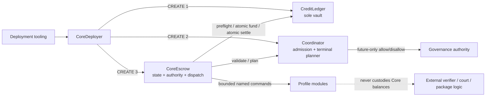
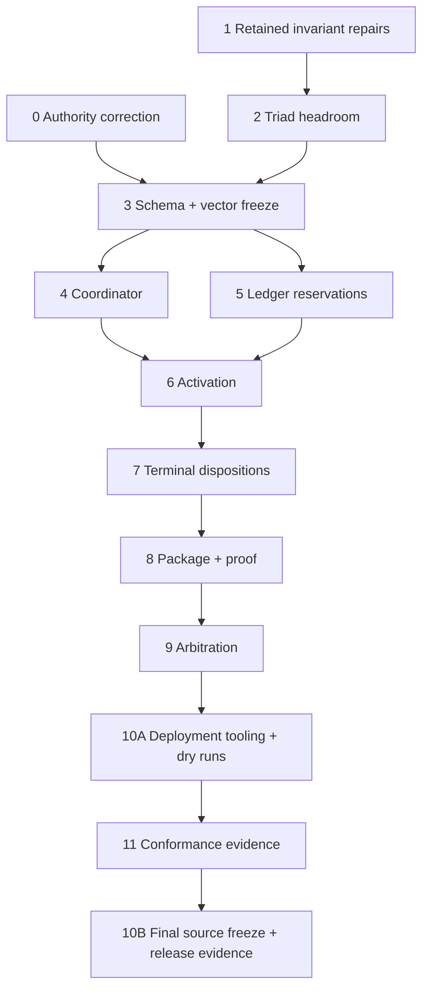

# Mandatory Core Conformance Implementation Plan

**Status:** Proposed execution plan; not ratification, audit approval, or production approval  
**Baseline:** `main` / `origin/main` at `d64d6c0a`  
**Authority:** `PROTOCOL.md`, `docs/v2/technical/MANDATORY_CORE.md` 0.3.0-rc1, and `docs/superpowers/specs/2026-07-29-core-architecture-immutability-design.md`

## Executive decision

The current branch is a useful **Core-only remediation candidate**, not an implementation of Mandatory Core 0.3.0-rc1.

Keep the immutable triad and the work that is already sound:

- `CreditLedger` remains the sole token vault.
- `CoreEscrow` remains tokenless and owns deal state, authority snapshots, module calls, and terminal commit orchestration.
- `Coordinator` remains future-only admission plus deterministic, stateless terminal planning. It does not become a mutable rules engine, activation validator, or fourth custody path.
- `CoreDeployer` remains mandatory one-shot deployment infrastructure and the sole creator of Ledger → Coordinator → Escrow.
- Existing explicit state membership, exact two-sided ERC-20 transfer checks, canonical signature validation, deterministic position ids/tombstones, status-4 reconciliation-only behavior, and module-free final settlement remain the implementation seams to extend.

Do not extend the current opaque-hash/Core-only ABI incrementally. Make one clean, versioned wire cutover, update every caller, and leave no compatibility aliases or unconditional extension stubs.

Two authority defects must be corrected before deployment identity can be implemented exactly:

1. `plannedDeploymentMethodHash` is required to include the predicted CREATE2 deployer while also being included in that deployer's constructor initcode, creating a circular derivation (`MANDATORY_CORE.md` §13.1.1).
2. `CoordinatorGovernanceV1` includes `authorityRuntimeCodeHash` even though the Intent is explicitly forbidden from depending on live runtime code. Runtime identity belongs in Evidence, not Intent (`MANDATORY_CORE.md` §§13.1.1, 13.2).

The current Q128.128 implementation also remains a release candidate only. The bounded initial-loss/replacement proof is valuable, but it does not close repeated-checkpoint, saturation, dust-exhaustion, or fairness review (`REMEDIATION_PLAN.md` Wave 6; `docs/security/Q128_BOUNDARY_BOUND.md`).

## Current-branch review

### Proven release blockers

1. `CoreEscrow.activate` rejects every nonzero profile or attachment commitment, and payment-proof/arbitration entrypoints are unconditional `ProfileNotSelected` stubs (`src/CoreEscrow.sol:147-159,417-431`). This directly conflicts with `MANDATORY_CORE.md` §§7.5–10.
2. `ICoreEscrow` has no typed package, pool, module, arbitration, reservation, or snapshot surfaces (`src/interfaces/ICoreEscrow.sol:14-68`).
3. `ICreditLedger.fundDealAndReservations` and settlement carry no reservation inputs; no reservation position can be funded or dispositioned (`src/interfaces/ICreditLedger.sol:24-49`, `src/CreditLedger.sol:307-405,511-601`).
4. Coordinator admission is not consumed at activation or runtime. No complete binding is snapshotted and no module command/result matrix is enforced.
5. Deployment accepts unrelated nonzero build/code/capability/governance hashes, supports only the CREATE2 script path, and publishes neither complete Intent nor Evidence preimages (`src/CoreDeployer.sol:63-70`, `script/DeployCore.s.sol:11-16,121-140`).
6. `test/Conformance.t.sol:408-415` currently calls unconditional extension-stub reverts “conformance.” Those assertions must be replaced with absent-profile rejection **and selected-profile success**.

Static enumeration finds 285 Foundry test/fuzz declarations across 21 `test/*.t.sol` files. No tests were run during this planning review. The count is not a conformance metric: the strongest evidence is concentrated in Core-only transitions, cap/reconciliation behavior, and bounded recovery sequences, while selected profiles, reservations, nested manifests, and stateful production invariants remain absent.

### Proven defects in the implemented Core-only subset

These are not deferred feature work:

- `CreditLedger._reconcile` uses a high-level `balanceOf` decode that accepts trailing return bytes rather than the exact 32-byte reader required by the token policy (`src/CreditLedger.sol:162-166`).
- `preflightValueAction` rewrites real status results to status 4 whenever a boundary was already in deficit, conflating reconciliation result with exposure prohibition (`src/CreditLedger.sol:296-301`).
- `withdrawPosition(maxAmount = 0)` returns `ZERO_PAYABLE` instead of rejecting an invalid cap (`src/CreditLedger.sol:628-639`).
- Funding executes pulls/debits before proving target ids are unused and does not aggregate repeated debits from one source position (`src/CreditLedger.sol:345-400`).
- Activation does not validate the complete funding-request shape before reconciliation preflight and accepts noncanonical populated fee calldata when the activation fee is zero (`src/CoreEscrow.sol:518-541`). The clean ABI cutover must remove these paths rather than preserve them.

### Preserved evidence

- CoreDeployer validates exact staged child initcode prefixes and constructor arguments before any CREATE, creates children in nonce order, checks code and reverse links atomically, rejects replay, and becomes inert after success (`src/CoreDeployer.sol:129-207`; `test/CoreDeployer.t.sol:34-153`).
- Ledger is the sole vault and uses exact source/destination deltas for token transfers (`src/CreditLedger.sol`, `src/libraries/ExactERC20.sol`).
- Direct state/deadline transitions, EOA/EIP-2098/ERC-1271 verification, receiver exclusions, terminal record storage, and module-free Ledger commit are sound seams to retain.
- The Q128 implementation has bounded, conservative initial-entry and active-source replacement behavior, but qualification remains open.

## Target architecture

### Responsibility boundaries

| Component | Owns | Must never own |
|---|---|---|
| `CreditLedger` | Token I/O, reconciliation, boundary accounting, active/matured/reservation positions, tombstones, recovery | Deal state, module dispatch, arbitrary receiver selection, package/arbitration policy |
| `CoreEscrow` | Deal state, activation/package/pool/reservation validation, signatures/nonces, immutable attachment snapshots, module calls, clocks, canonical terminal commit | Protocol-token balances, upgrade/pause/sweep authority, iterative deficit accounting |
| `Coordinator` | Complete-tuple future admission, immutable governance metadata, deterministic terminal planning | Activation/package/pool validation, active-deal mutation, custody, settlement, pauses, owner-dependent planning |
| `CoreDeployer` | Intent-bound one-shot child creation and reverse-link verification | Post-finalization authority or mutable protocol state |
| Modules | Bounded validation/classification under a snapshotted binding | Core custody, arbitrary Core commands, terminal allocation, timeout availability |

### Code-size budgets

- Use compiler-backed per-unit measurements rather than the superseded `<18,000` post-Unit-6 projection. With validation retained in `CoreEscrow`, the revised provisional target is **below 23,552 bytes after Unit 6** and **strictly below EIP-170 (24,576 bytes) for the final release**; the 1,024-byte reserve is removed.
- Gate actual deployment initcode, including constructor arguments and method-specific factory initcode, below EIP-3860's 49,152-byte ceiling.
- An internal library belongs to one runtime unless deliberate duplication is measured. No fourth Core contract and no external delegatecall library.

### Out of scope

- Payment-proof verifier/nullifier internals; Core implements only typed dispatch, result validation, evidence binding, rollback, and the fixed outcome.
- Arbitration court, quote-policy generation, appeal, and ruling-policy internals; Core implements only the typed request/payment/result/deadline surfaces.
- Bond formulas or vaults; pool constitution, NAV, mandate generation, operator logic, or rate-policy internals.
- Humanity, reputation, and exposure-policy internals.
- An internal Core governance system, native ETH, cross-chain settlement, crowdfunded pools, reference SKU semantics before their normative artifact, or predecessor-position migration.
- Final governance ratification, independent audits, bounded production cohort, and unrestricted-liquidity qualification. These are post-implementation gates, not implementation tasks.

## Requirements trace

| Authority area | Implementation units |
|---|---|
| §§1–5 topology, custody, reconciliation, recovery | 1, 2, 5, 11 |
| §6 typed signatures and package/pool/arbitration inputs | 0, 3, 6, 8, 9 |
| §§7–8 module API, admission, reservations | 3, 4, 5, 6, 7, 8 |
| §§9–11 activation, transitions, terminal record | 6, 7, 8, 9 |
| §§12–13 storage, Intent, Evidence | 3, 4, 5, 6, 7, 10 |
| §§14–15 invariants and conformance evidence | every unit; consolidated in 11 |

## Implementation units

Each unit is independently reviewable and compile-complete. Add behavior-first tests before changing retained behavior. Run its targeted test surface and size measurement before starting the dependent unit. An inherited interface changes only in the same unit that implements every new selector; placeholders and temporary unconditional stubs are forbidden. Every unit that changes a child constructor or bytecode also updates CoreDeployer's exact initcode validation, regenerates `CoreArtifactConstants`, and updates deployment fixtures in that same unit. Checked-in artifacts come only from their generators; Unit 10B is the final release-identity freeze, not the first time staged deployment is repaired.

### Unit 0 — Correct and freeze the governing candidate

**Files**

- `docs/v2/technical/MANDATORY_CORE.md`
- `PROTOCOL.md` is read-only authority in this unit; ratification changes occur only through the post-evidence governance process
- `docs/superpowers/specs/2026-07-29-core-architecture-immutability-design.md` only where it mirrors corrected identity semantics

**Changes**

1. Define `DeploymentMethodIntentV1` and its typehash without predicted addresses or postdeployment facts. Bind `transactionSender` and method-specific creator inputs: method 1 uses the direct EOA plus its planned CREATE nonce with zero factory/salt; method 2 uses the declared factory/salt with canonical-zero direct nonce. Use the derivation order:
   - freeze build/settings/dependencies and raw creation identities;
   - hash the non-circular method intent `(method, transactionSender, directCreateNonce, factory, salt, creation identities)`;
   - build exact CoreDeployer constructor initcode;
   - derive the direct CREATE address from sender/nonce or the CREATE2 address from factory/salt/initcode hash;
   - derive CREATE nonce 1–3 child addresses;
   - hash top-level `CoreDeploymentIntentV1` with those addresses.
2. Split governance identity:
   - `CoordinatorGovernanceIntentV1`: authority, signer count, threshold, minimum delay, permission mask, and policy hash;
   - Evidence/readbacks: authority runtime code hash and live policy verification.
3. Freeze one `ActivationRequestV1` envelope containing the exact typed package, pool, module, arbitration, reservation, funding, and signature preimages. This is the clean replacement for the current many-argument Core-only activation API.
4. Reaffirm Coordinator as admission plus stateless terminal planning. Complete activation/package/pool/reservation validation remains in Escrow or Escrow-owned internal libraries. Governance enforcement remains in the external authority contract; Core does not gain an internal governance system.
5. Preserve the Q128 release gate and accurately describe the current bounded candidate. Ratification is not a dependency of the technical wire cutover.
6. Increment the technical candidate revision and mark exact Solidity selectors provisional until Units 3–11 satisfy the conformance gates, as §16 already requires.

**Acceptance**

- Intent contains no live/postdeployment fact.
- Direct CREATE and CREATE2 derivations are acyclic and independently reproducible from branch-specific golden vectors.
- Governance Intent contains no runtime code hash.
- The activation envelope covers every mandatory preimage and has explicit canonical-zero rules.
- The Q128 status cannot be misreported as approved.

### Unit 1 — Repair retained Ledger invariants

**Files**

- `src/libraries/ExactERC20.sol`
- `src/CreditLedger.sol`
- `src/Coordinator.sol`
- `test/ExactERC20.t.sol`
- `test/CreditLedger.t.sol`
- `test/StatusFourMatrix.t.sol`
- new status-3 matrix coverage beside the existing status-4 suite

**Changes**

1. Expose the exact 32-byte `balanceOf` reader inside `ExactERC20` and make every reconciliation use it.
2. Return the actual reconciliation status. Test irreversible deficit mode separately when deciding whether a requested action may add exposure.
3. Reject zero withdrawal caps before payout computation; retain positive finite caps and `type(uint256).max` sentinel behavior.
4. Precompute every target id, reject existing/tombstoned targets, aggregate repeated source-position debits, and prove aggregate sufficiency before the first token call or storage mutation.
5. Make `Coordinator.disallow` derive the stored key without requiring the module's current code hash to match, so a drifted future binding can still be removed. Consumer-side live checks remain mandatory at activation/runtime.

**Evidence**

- Extra/short/malformed `balanceOf` reverts without checkpoint mutation.
- Existing-deficit unchanged, quarantine-consumed loss, and new checkpoint return distinct correct statuses.
- Status 3 continues the requested action atomically and rolls back its reconciliation effects if the later action fails.
- Zero cap rejects on the permissionless path.
- Duplicate target and repeated-source insufficiency fail before any external token call.

### Unit 2 — Prove an authority-compatible bytecode headroom path

**Files**

- `src/CoreEscrow.sol`
- `src/Coordinator.sol`
- `src/libraries/TerminalPlanning.sol`
- focused Escrow-owned validation libraries and Coordinator-owned terminal-planning libraries, each imported by only one runtime
- `src/CoreDeployer.sol`
- `src/libraries/CoreArtifactConstants.sol`
- `test/CoreEscrow.t.sol`
- `test/Coordinator.t.sol`
- `test/CoreDeployer.t.sol`
- artifact generator and `tools/check_contract_sizes.py`

**Changes**

1. Characterize current direct activation, transitions, terminal hashes, events, revert ordering, Ledger calls, and function-level bytecode contributors.
2. Produce measured prototypes for an authority-compatible reduction: consolidate duplicated closed action/state checks, remove obsolete opaque/stub decoders in the planned V1 cutover, keep terminal planning in Coordinator, use bounded indexed getters, and simplify storage/calldata paths only where independent vectors preserve behavior. Escrow-owned internal libraries are organization, not claimed bytecode extraction.
3. Allocate a byte budget to retained Core paths, V1 activation/snapshots, terminal reservations, package/proof, and arbitration. Demonstrate a compiler-backed path to `CoreEscrow < 18,000` after Unit 6 and final `<= 23,552`.
4. Do not move activation/package/pool validation to Coordinator, introduce a fourth Core contract, or use an external delegatecall library to meet the budget.
5. If no measured prototype meets the projection, stop before Unit 3 and revise the technical candidate; do not continue on an impossible size assumption.
6. Apply only behavior-preserving reductions suitable before the wire cutover, regenerate child constants, and keep staged deployment compile-complete.

**Acceptance**

- Core-only behavior, terminal hashes, event order, and rollback are unchanged for applied reductions.
- Coordinator terminal planners do not read owner/admission state.
- The size ledger records baseline and per-change deltas and reserves enough measured bytes for every remaining mandatory surface.
- A compiling prototype demonstrates the post-Unit-6 and final budgets, or execution stops at the explicit authority-review gate.

### Unit 3 — Freeze typed schemas, vectors, bounds, and planned views

**Files**

- `src/libraries/DealTypes.sol`
- expected new focused files: `AttachmentTypes.sol`, `ModuleTypes.sol`, and their hashing libraries
- `src/libraries/ManifestTypes.sol`
- `src/libraries/ManifestHashing.sol`
- `src/libraries/CoreErrors.sol`
- hash-vector generator and generated vectors

**Changes**

1. **Core/package/pool checkpoint:** freeze Deal, funding, payout, package selection/economics/contest, pool authority/mandate/operator-acceptance structures, constants, typehashes, canonical absence, and independent vectors.
2. **Module/arbitration/reservation checkpoint:** freeze module context/result, arbitration terms/open request/quote/result, reservation spec/rule/funding/disposition structures, bounds, typehashes, and independent vectors.
3. **Manifest/governance checkpoint:** freeze the corrected deployment-method, governance Intent/Evidence, artifact, build, capability, verification structures, array-root rules, and independent vectors.
4. Freeze exact diffs for `ICoordinator`, `ICreditLedger`, `ICoreEscrow`, and `ICoreModuleV1`, including indexed/count-based snapshot views, but do not apply an inherited-interface change before its concrete implementation.
5. Apply each compiled interface cutover only with its owner: Coordinator in Unit 4, Ledger in Unit 5, activation/snapshot Escrow surface in Unit 6, package/proof module surface in Unit 8, and arbitration surface in Unit 9. Migrate every caller in that same unit.
6. Leave no duplicate legacy types, aliases, deprecated selectors, or compatibility shims after the last owner cutover. Units 4–5 do not start until every Unit 3 schema/vector/interface-diff checkpoint is approved.

**Evidence**

- Independent ABI/hash vectors cover every new type, array-root ordering, canonical absence, one-bit mismatch, and EIP-712 domain.
- Bounds and unknown-value rejection are tested before any stateful feature implementation.
- Every planned interface diff has an owning compile-complete unit and no placeholder implementation.

### Unit 4 — Complete Coordinator identity, admission, and planners

**Files**

- `src/Coordinator.sol`
- `src/interfaces/ICoordinator.sol`
- Coordinator-owned terminal-planning libraries
- `test/Coordinator.t.sol`
- new planner vector/matrix tests

**Changes**

1. Bind chain/version/Escrow plus governance-intent metadata, capability hash, Core module API id, and fixed bounds as immutable/readable identity.
2. Validate governance bounds and the closed permission mask at construction. Authorization remains `msg.sender == authority`; threshold/delay enforcement lives in the declared external authority policy.
3. Preserve the complete eight-field module binding key and future-only allow/disallow semantics.
4. Add pure/stateless planners only for complete terminal records, operator-fee reserve/paid/unlocked amounts, and reservation dispositions under already validated snapshotted inputs.
5. Keep all activation and consumer-side checks in Escrow: Coordinator admission alone never proves a package/pool/reservation commitment or current module code/config identity.

**Evidence**

- Full binding tuple collision, allow, drift, disallow, and future-only matrices.
- Terminal planner vectors cover every pool-kind snapshot, terminal outcome, operator-fault class, reservation predicate/formula, and operator-fee disposition without reading mutable admission/governance state.
- Owner/admission mutations cannot alter planner output for identical inputs.

### Unit 5 — Implement reservation custody in Ledger

**Files**

- `src/CreditLedger.sol`
- `src/interfaces/ICreditLedger.sol`
- shared position/funding/hash types
- new focused reservation tests and Ledger differential/invariant coverage

**Changes**

1. Add deterministic reservation position ids, exact reservation funding authorization, dedicated nonce namespaces, and nonwithdrawable active reservation positions.
2. Preflight every sorted unique touched token boundary before any module call or funding. Enforce `MAX_BOUNDARY_NOMINAL` against aggregate deal, fee, and reservation exposure.
3. Make `fundDealAndReservations` validate all targets/source aggregates first, then execute wallet pulls/same-Ledger debits atomically, then create positions.
4. Extend terminal settlement with exact stored reservation dispositions and per-source outputs. Consume each source once and store terminal/disposition hashes on every tombstone.
5. Generalize existing healthy/deficit replacement accounting without changing the conservative Q128 direction or allowing more than the frozen bounded child count.
6. Expose reservation positions through the canonical position view without making them claimable while active.

**Evidence**

- Healthy wallet and same-vault mixed funding across multiple token boundaries.
- Exact-cap and above-cap aggregate vectors.
- Duplicate target/source, nonce/expiry/signature, token/mode/amount, and atomic rollback cases.
- Healthy and deficit reservation disposition, coalescing, tombstones, dust bounds, and later claims.
- Production Ledger vs exact-rational reference sequences include reservation replacement.

### Unit 6 — Implement complete activation and immutable snapshots

**Files**

- `src/CoreEscrow.sol`
- `src/interfaces/ICoreEscrow.sol`
- Escrow-owned module-dispatch helper
- activation, pool-authority, snapshot, and integration tests

**Changes**

Implement the normative activation order:

1. Validate live chain, timestamps, bounds, sorted uniqueness, canonical absence, complete funding-request shape, and every typed package cross-commitment.
2. Derive direct or pool activation authority. Validate provider consent, holder/pool authority, operator acceptance where required, and the `(economic holder, activation authority, nonce)` namespace.
3. Preflight all unique Ledger token boundaries. Status 4 returns reconciliation-only success with no module call, funding, deal, or nonce effect.
4. Validate every selected binding against profile flags, role/API/capability/manifest/config/code identity, and current Coordinator admission.
5. Call selected activation validators once in fixed role order with bounded data and exact `ModuleContext`; reject malformed or unauthorized results.
6. Recheck Core time/source assumptions after callbacks, then ask Ledger to revalidate funding signatures/nonces/expiries, targets, aggregate sources, cap, and every touched boundary immediately before the first funding leg. Post-module status 3 may continue; a new residual loss or persisted deficit creates no exposure, and a reverting post-module branch must not claim that a checkpoint persisted.
7. Atomically fund principal, activation fee, and reservations, then persist the complete funding, package, pool, arbitration, reservation, and module binding preimages; consume nonces; emit the activation event.

Direct deals must use canonical-zero attachment fields. Owned/custom pool deals use their exact signed matrices. Crowdfunded pools and reference SKUs remain rejected.

**Evidence**

- Selected-profile activation succeeds; absent/disabled/mismatched profiles reject.
- The activation rejection table covers zero/same parties, zero token/principal/durations, invalid bps, malformed or wrong EOA/ERC-1271 signatures, every signed-field mutation, insufficient balance/allowance, nonce replay across deal ids, wrong chain/version/Escrow/Ledger/domain, and complete no-effect snapshots.
- Module failure, reentrancy, funding failure, and later validation failure roll back all state and token effects.
- Later Coordinator changes and mandate changes do not affect active snapshots.
- Escrow holds zero protocol-token balance after every successful or reverting path.
- Every stored preimage is reconstructable through typed views.
- The measured post-activation Escrow runtime is below 18,000 bytes; otherwise Units 7–9 remain blocked.

### Unit 7 — Complete terminal planning and reservation disposition

**Files**

- `src/CoreEscrow.sol`
- `src/Coordinator.sol`
- `src/libraries/TerminalPlanning.sol`
- `src/CreditLedger.sol`
- terminal, reservation-policy, deadline-race, and event tests

**Changes**

1. Expand the two-phase terminal engine to include normalized operator fault, operator-fee paid/unlocked amounts, every reservation disposition, and the full fixed `TerminalRecord`.
2. Enforce the snapshotted actor matrix before terminal planning: direct holder rules; OWNED/CUSTOM controller/operator permission bits for unilateral release, contest, and arbitration; and the exact snapshotted `mutualResolutionAuthority` for mutual actions. Receivers and later mandates confer no authority.
3. Validate mutual fault/disposition consents in action-specific nonce domains; modules can authenticate only the closed fault classification, never a formula, beneficiary, split, or outcome.
4. Coalesce outputs only within the same source position. Prove conservation before entering the hard commit.
5. Preserve the hard boundary: after final checks, Core calls Ledger once; no module or optional callback occurs after that point.
6. Persist the full terminal record and queryable disposition preimages only after Ledger settlement succeeds.
7. Route every existing timeout, cancel, release, dispute, and mutual exit through the same engine.

**Evidence**

- Exhaustive state × action × outcome × fault-class matrix.
- The direct/OWNED/CUSTOM actor matrix covers each independent permission bit, no-permission rejection, shared controller/operator identities, receiver-not-authority, later mandate changes, and every mutual signature combination.
- Every closed reservation formula, default return, specific-vs-any predicate rule, split-only mutual consent, and impossible predicate rejection.
- Operator-fee zero/partial/full reserve and paid/unlocked conservation.
- Healthy/deficit deal-plus-reservation commit, duplicate settlement rejection, and golden terminal hashes.
- No callback can occur after the commit boundary.

### Unit 8 — Implement bounded module runtime, package contest, and payment proof

**Files**

- `src/interfaces/ICoreModuleV1.sol`
- Escrow-owned dispatcher library
- `src/CoreEscrow.sol`
- adversarial module/token helpers and module/package/proof tests

**Changes**

1. Implement the fixed module command/result matrix with exact context, role, source state, result, timing, action-data hash, and command-mask validation.
2. Keep base `openDispute` deterministic and module-independent. Collect the signed package toll exactly from caller to snapshotted recipient.
3. Add `openDisputeWithPackageEnhancement`; a missing/reverting/drifted package module fails only this optional edge and never disables base dispute.
4. Implement `submitPaymentProof` for the selected profile and permitted source states; bind evidence to the terminal record and enter the Unit 7 module-free commit.
5. Recheck source state and deadline after module callbacks. Reject arbitrary receiver/state/outcome/split commands.

**Evidence**

- Full command/state/result/call-order matrix, malformed return data, code/config drift, delisting isolation, and reentrancy.
- Base dispute succeeds while package enhancement fails.
- Exact toll transfer rejects fee/bonus/malformed tokens and rolls back on later failure.
- Payment proof dispatches to the fixed release outcome; Core-only deals still reject it.

### Unit 9 — Implement typed arbitration without sacrificing fallback exits

**Files**

- `src/CoreEscrow.sol`
- arbitration types/hashing and module dispatcher
- arbitration and deadline-race tests

**Changes**

1. Validate guard, live chain, source state/deadline, caller-equals-payer request, quote token/recipients/maximum/nonce/expiry, and selected arbitration binding.
2. Preflight every snapshotted deal/reservation boundary; status 4 returns reconciliation-only success with no module, fee, nonce, or arbitration-state effect.
3. When enhanced arbitration is requested, invoke the snapshotted package policy first over the same typed request, validate its exact context/result, and retain its evidence. Recheck source state before any fee transfer.
4. Execute the closed external order: package toll, court quote, then adapter `ARBITRATION_OPEN_VALIDATE`. Recheck source state and quote nonce after callbacks; only then store the request/results/evidence, open timestamp, checked deadline, consume the quote nonce, and enter `ARBITRATION_ACTIVE`.
5. Implement ruling dispatch with exact result/evidence mapping into Unit 7 terminal planning.
6. Implement permissionless Core-computed 50/50 arbitration timeout with no adapter call. Keep mutual signed exits available from `ARBITRATION_ACTIVE`.
7. Preserve first-success-wins races at `t-1`, `t`, and `t+1`; execute both transaction orders for every competing action and prove full rollback on the losing path.

**Evidence**

- Wrong caller/context/request/quote/maximum/nonce/expiry and every package-toll/court-quote/adapter-order failure.
- Package enhancement accept/revert/malformed/drift cases prove the shared request context, evidence capture, no fee call before acceptance, and no nonce consumption on any later failure.
- Open success followed by adapter disappearance/delisting still permits timeout.
- Ruling, timeout, and mutual-resolution races produce exactly one terminal record and settlement.

### Unit 10 — Implement deployment tooling, then freeze final Intent/Evidence

**Dependency:** Tooling implementation starts after Units 0–9. Final identity freeze and any real release deployment run only after Unit 11 and every tracked source/test/tooling/status mutation are complete.

**Files**

- `src/CoreDeployer.sol`
- `src/libraries/ManifestTypes.sol`
- `src/libraries/ManifestHashing.sol`
- `src/libraries/CoreArtifactConstants.sol`
- `script/DeployCore.s.sol`
- `deploy.sh`, `deploy.toml.example`
- manifest/vector/size tools and deployment tests

**Changes**

1. Generate every nested Intent preimage bottom-up. Derive raw document hashes from the exact repository bytes; do not accept arbitrary configured substitutes.
2. Recompute locally knowable build, creation-code, capability, governance, and method commitments. Bind expected numeric chain id and reject an RPC mismatch before deployment.
3. Support both methods:
   - method 1: the planned EOA and CREATE nonce directly create nonzero CoreDeployer, with zero factory/salt;
   - method 2: approved factory CREATE2-creates CoreDeployer with the non-circular method intent and salt.
4. Verify the configured finalizer signer before staging, or make finalization an explicit operator-signed second stage.
5. Before Unit 11, build deterministic predeployment Intent distributions and dry-run both methods against provisional build inputs; do not treat these as final release identities.
6. Make Evidence validation reject zero/mismatched Intent and zero/noncanonical mandatory fields before hashing or publication.
7. Gate full constructor initcode for each method, not only `type(CoreDeployer).creationCode.length`.
8. After Unit 11 is green, designate the immutable release-source commit, regenerate every build/code/capability/governance/method commitment, rerun both method workflows, and verify receipts, runtime hashes, constructor schema/arguments, reverse links, immutable readbacks, child order, finality, and on-chain `intentHash`.
9. Publish complete Artifact, completed DeploymentMethod, transaction/child-creation, Verification, Intent, and Evidence preimages as release artifacts outside the exact source archive. Make no tracked release-source mutation after this freeze.

**Evidence**

- Independent golden vectors for every nested schema and both method branches.
- Canonical absence, sorting, duplicate, one-bit mismatch, wrong-chain, wrong-signer, wrong-code, wrong-readback, zero/mismatched Evidence, and placeholder rejection.
- End-to-end direct and real-factory deployments prove creator, address, nonce/salt, child order, finalization, Intent, and Evidence.
- Reproducible artifact constants match the final build.

### Unit 11 — Consolidate conformance and qualification evidence

**Files**

- `test/Conformance.t.sol` and focused test suites
- invariant/differential handlers and adversarial helpers
- `.github/workflows/ci.yml`
- size, Q128, hash-vector, and Slither tooling
- `HANDOFF.md` and `REMEDIATION_PLAN.md` only after the implementation evidence is green

**Changes**

1. Replace the extension-stub assertion with two explicit contracts: absent-profile rejection and selected-profile dispatch success.
2. Maintain a requirement-to-test matrix for `MANDATORY_CORE.md` §§15.1–15.6. A test name is evidence only when it exercises the observable contract, not source text or selector presence.
3. Report evidence in distinct layers so shape checks cannot inflate behavioral coverage:
   - shape/build gates: wire ids, artifact freshness, compiler warnings, sizes, and Slither;
   - independent pure vectors: externally generated hashes/math and one-field mutations;
   - single-contract behavioral tables: result, storage, balances, events, nonces, and rollback;
   - triad end-to-end profiles: Core-only plus every enabled package/pool/module/reservation path;
   - stateful invariants and production/reference differential sequences;
   - both deployment methods and pinned-fork release evidence.
4. Add stateful invariants for sole-vault custody, boundary conservation, one terminal record/settlement, nonce-on-success, immutable snapshots, future-only admission, deficit irreversibility, paid finality, no new exposure, no dust capture, fallback exit availability, and no module call after commit.
5. Complete the token matrix, all EOA/ERC-1271 combinations, actual protocol replay-domain failures, funding/payout matrices, status-3 continuation, status-4 retry, both race orders, event cardinality, reservation lifecycle, module matrix, deployment matrices, and production-Ledger differential sequences.
6. Add matched cold/warm gas-growth tests across materially different position/checkpoint histories with iteration-detecting tolerances. Publish activation and terminal gas budgets and gate regressions in CI.
7. Pin the Foundry toolchain and expose separate required CI jobs for shape, Core behavior, profiles/reservations, stateful invariants, recovery differential, gas-growth, deployment, and pinned Arbitrum fork evidence.
8. Run generator drift checks, warning-free production build, contract/initcode size gates, all Foundry suites, and exact pinned Slither-baseline reconciliation.
9. Add pinned Arbitrum fork evidence for the approved release token/code set.
10. Finalize tracked operational status documents without self-referential commit/manifest values. After the immutable release-source commit exists, publish its exact commit, executed test counts, code sizes, gas budgets, manifest identities, and open gates in the external append-only release record.

**Qualification gates outside ordinary implementation completion**

- Complete repeated-checkpoint/history-saturation/dust-exhaustion differential and adversarial evidence is available.
- Governance ratifies the corrected technical candidate and the Q128 precision/dust/exhaustion/fairness policy only after that evidence.
- The live external Coordinator authority, emergency policy, threshold independence, public controls, delays, expiry, anti-bypass behavior, runtime identity, and readbacks conform to `PROTOCOL.md` §18/DOD-DEC-002 and are bound into final Evidence.
- Two independent Core security teams, a specialist custody/module review, and an economic/Q128 review close every critical/high finding against the exact release.
- Release/traceability records, production monitoring, enabled-profile canaries, and exercised incident, key-compromise, governance, and emergency runbooks satisfy every applicable `PROTOCOL.md` §§24–25 gate.
- The exact release completes the public-testnet/canary campaign, then at least 30 consecutive bounded-production days and at least 100 terminal executions spanning every enabled terminal path, with zero invariant violations and no unresolved critical/high incident.
- Any material source, configuration, policy, dependency, or enabled-profile change creates a new identity and reruns every affected gate.

## Dependency order

Units 4 and 5 may run in parallel after Unit 3 because their shared contracts are the frozen interfaces and schemas. Unit 6 is the integration barrier. Unit 10A implements deployment tooling before the conformance consolidation; Unit 10B freezes and evidences the exact release only after all tracked work is complete.

## Definition of implementation-complete

Implementation is complete only when all of the following are observed:

- Direct, owned-pool, and custom-pool activations execute their selected typed surfaces; crowdfunded/reference modes reject canonically.
- Ledger alone holds protocol tokens; Escrow and modules have zero protocol-token custody after every successful action.
- Principal, activation fee, and every reservation fund atomically across all touched boundaries.
- Every supported terminal path creates one canonical terminal record, one atomic deal-plus-reservation settlement, and permanent matching tombstones.
- Selected payment proof and arbitration paths dispatch; Core-only deals reject them; base dispute and arbitration timeout remain available without optional modules.
- Active authority/module/package/reservation snapshots are queryable and unaffected by later governance, mandate, code, or config changes.
- Both deployment methods produce reproducible, independently verified Intent and Evidence distributions bound to the final artifacts and expected chain.
- Final size, build, gas-growth, test, invariant, vector, fork, and static-analysis gates pass.

Implementation completion yields at most **CANDIDATE**. It does not grant QUALIFIED or unrestricted-production status; those labels require every applicable `PROTOCOL.md` §§24–25 gate, including governance, independent review, operational readiness, and the bounded cohort.
