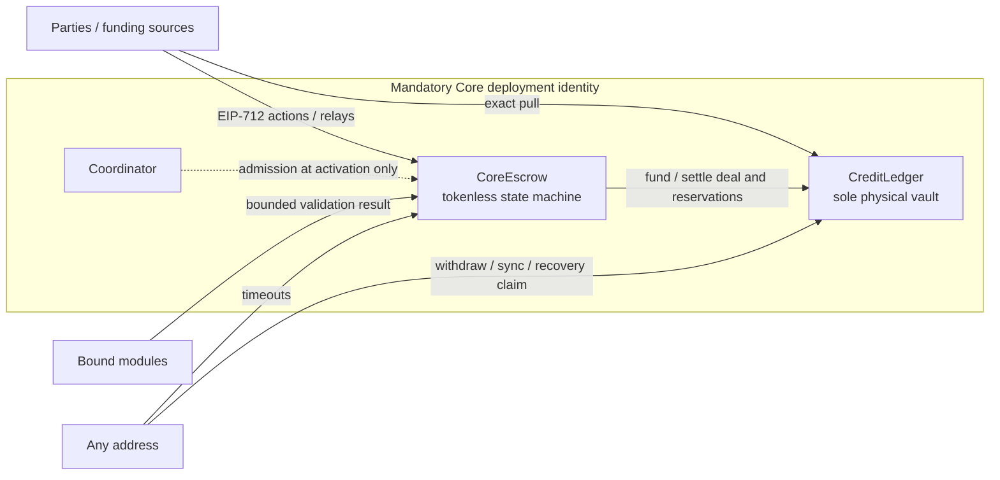

# Core Architecture and Immutability Design

**Status:** Controlled architecture candidate for production remediation
**Date:** 2026-07-30
**Architecture revision:** 0.3.0-rc1
**Protocol authority:** `PROTOCOL.md` (business source of truth)
**Executable authority:** `docs/v2/technical/MANDATORY_CORE.md` 0.3.0-rc1
**Scope:** Mandatory Core topology, trust boundaries, extension boundary, and deployment immutability; not Solidity storage layout or profile internals
**Reference home chain:** Arbitrum (ECO-007)

---

## 0. Document control

| Revision | Date | Control change |
| --- | --- | --- |
| Initial draft | 2026-07-29 | Split immutable Core into Escrow, Ledger, and Coordinator, but assigned principal custody to Escrow |
| 0.3.0-rc1 | 2026-07-30 | Supersedes the initial custody model: Ledger is sole vault; exact reconciliation statuses and checkpointed positions replace the cumulative scalar; typed funding/package/arbitration-open requests, deterministic position identities/payouts, signed PoolKind authority, fault-predicate reservations/operator fee, independent Core dispute, module-free commit, Core-owned timeout, mandatory CoreDeployer, complete terminal record, and executable ABI manifest are frozen |

This revision is the architecture input to production-conformant V2 work before `RAT-002`. Any existing deployment built from the earlier split-custody or scalar-deficit design is experimental and non-conforming for production Mandatory Core. The triad is immutable, so that deployment cannot be upgraded or migrated in place; remediation requires a new deployment identity and explicit user opt-in.

---

## 1. Purpose and authority boundary

This document freezes the topology and trust boundaries needed to implement `PROTOCOL.md` Mandatory Core:

1. one tokenless consent/state machine;
2. one physical token vault for all Core positions in a token boundary;
3. one future-activation module admission surface;
4. package attachment surfaces that are present and executable in the production Core release; and
5. no proxy, pause, rescue, or settlement callback that can rewrite active obligations.

`PROTOCOL.md` remains authoritative for business outcomes. `MANDATORY_CORE.md` freezes executable semantics, API direction, records, signing, token-call behavior, and manifest identity. Profile-specific proof, arbitration, bond, pool, humanity, reputation, and rate-policy internals remain outside this architecture.

---

## 2. Locked decisions

| Decision | Locked choice |
| --- | --- |
| Core composition | Exactly `CoreEscrow`, `CreditLedger`, and `Coordinator` form the Mandatory Core triad |
| Physical token custody | `CreditLedger` is the sole vault for active principal, fee/reservation positions, matured credits, and recovery assets |
| Escrow role | `CoreEscrow` owns consent, state, timing, outcomes, and canonical terminal records; it holds no protocol token balance |
| Module admission | Signed complete binding plus Coordinator admission at activation; active bindings are snapshotted |
| Module surface | Generic bounded activation validation and named runtime dispatch use a closed role/state/result/timing matrix; they are not permanent stubs |
| Funding | Principal and activation fee each use a typed source mode, source position when applicable, authority, nonce, expiry, and separate signature; all funding rolls back atomically |
| Package selection | Versioned typed package/economics cross-commitments bind exact deal hashes; Core never assigns semantics to an opaque package label/hash; reference SKUs remain gated pending their normative spec |
| Arbitration timeout | Signed duration is snapshotted into a Core deadline; timeout is permissionless and makes no module call |
| Arbitration open | Typed caller/payer quote request, bounded exact transfer, caller-bound module context, typed stored result, and closed rollback order |
| Reservations | Signed bounded specs/rules include closed fault predicates, are exactly funded at activation, and are dispositioned once by Core's closed terminal rules |
| Pool authority | Signed `PoolKind` selects the owned/custom authority matrix; typed snapshot separates economic pool, activation/mutual authorities, controller/operator identities, and independent release/contest/arbitration permissions |
| Operator fee | Exact reservation recipient/return receiver plus closed mutual/arbitration fault codes determine paid versus unlocked amounts |
| Settlement | Core stores one terminal record plus reservation dispositions and Ledger reassigns existing deal/reservation positions atomically; no receiver or module callback |
| Deficit model | Irreversible per-boundary fixed positions with paid, funded, and gap components; no new units after deficit |
| Position identity/payout | Domain-separated deterministic ids, permanent tombstones, source-local coalescing, typed healthy partial/full withdrawal and deficit-claim results |
| Package scope | Attachment boundary in Core; profile business logic outside Core |
| Crowdfunding | `CROWDFUNDED_POOL` remains rejected until CF-GATE |
| Deployment infrastructure | Every supported method uses `CoreDeployer` to create/cross-bind all triad children; it is not a fourth Core contract and has no later authority |
| Deployment identity | Exact versioned ABI manifest and published nested preimages, not JSON field convention |

---

## 3. Topology

| Contract | Holds protocol tokens? | Role | Mutable after deployment? |
| --- | --- | --- | --- |
| `CoreEscrow` | **No** | Bilateral consent, nonce and signature validation, deal state machine, module dispatch, canonical terminal storage, and Ledger commit after Coordinator static planning | No proxy or bytecode upgrade; constructor-bound configuration is immutable |
| `CreditLedger` | **Yes — exclusively** | Exact funding, active deal/reservation positions, activation-fee positions, matured beneficiary positions, withdrawals, irreversible deficit checkpoints, exact recovery deposits; no terminal business planning or reverse Core callback | No proxy, admin rescue, or custody pause |
| `Coordinator` | No | Admission registry for complete module identities on future activations, plus pure static terminal planning | Bytecode and authority bounds are fixed; admitted tuples may change only for future deals; planning helpers do not read admission state |



### 3.1 Sole-vault boundary

For Mandatory Core, a physical custody boundary is derived from at least `(chain, protocolVersion, CreditLedger, token)`. Every active principal position and matured credit for that tuple shares the Ledger's physical token balance and deficit fate. An internal label, deal identifier, pool identifier, or signed `custodyBoundaryId` cannot claim isolation while sharing that balance.

CoreEscrow MUST finish every successful protocol action with zero balance of every protocol token. Principal MUST NOT transit through Escrow. Activation fees are exact-pulled into Ledger and immediately represented as beneficiary positions. Completion fees are allocations of an existing principal position, not newly funded liabilities.

### 3.2 Immutability

- Escrow and Ledger have no upgrade proxy, pause authority, arbitrary call, or custody rescue.
- Coordinator cannot settle deals, redirect receivers, mutate a deal snapshot, or block Core exits.
- A successor release is a new immutable deployment and manifest. Users opt in; active positions do not migrate automatically.
- Ledger authorizes only its bound Escrow to create a healthy deal position or terminally reassign a deal-owned position.
- Escrow binds exactly one Ledger and Coordinator; reverse links are verified in the deployment manifest.

### 3.3 CoreDeployer

Every supported deployment MUST create one nonzero `CoreDeployer`, which MUST deterministically create and cross-bind all three triad children. It is deployment infrastructure:

- it is not included when counting the three Core contracts;
- it has no post-deployment custody, state-machine, module-admission, settlement, or upgrade authority;
- its creation/runtime code, deployment method, salt, constructor ABI preimage, child creation order, and resulting addresses are V1 ABI-manifest facts; and
- production tooling MUST fail closed on missing or placeholder document hashes, chain, governance bounds, code hashes, or capability set.

No direct-triad or absent-deployer method is supported. A direct transaction or a CREATE2 factory may create CoreDeployer, but every Ledger/Coordinator/Escrow child creator is that exact manifest-bound address. Whether the deployer becomes inert or remains as an immutable read-only record is an implementation choice only if the manifest proves it cannot affect the triad after construction.

---

## 4. Activation and custody flow

Activation is one atomic operation:

1. Escrow validates chain/version, complete signed terms, separate typed principal/activation-fee funding specs and authorizations, typed package-selection/economics/contest cross-commitments or canonical absence, typed pool kind/authority/mandate/operator acceptance, typed arbitration terms when enabled, bounded reservation specs/rules, nonces, expiry, parties, receivers, timing, fees, token/boundary identity, profile flags, reference-package disablement, and crowdfunding gate.
2. Escrow validates sorted, unique module bindings against signed terms, package cross-commitments, live identity, and Coordinator admission.
3. Ledger preflights every distinct principal, fee, and reservation token boundary before any stateful module call.
4. Preflight status `3` records quarantine absorption and continues. Status `4` enters/persists deficit in a successful reconciliation-only transaction; Escrow creates no deal and consumes no nonce.
5. Selected modules receive only the bounded activation context in role order and return the closed matrix result with zero timing fields.
6. Ledger rechecks all boundaries: quarantine absorption follows status-`3` accounting and may continue; a residual loss reverts the post-module branch without returning status `4`; otherwise every healthy boundary exact-pulls or authoritatively debits same-vault positions for principal, activation fee, and signed reservations atomically.
7. Ledger creates only the deterministic deal/fee/reservation position ids, and Escrow stores immutable deal, funding, package, arbitration, reservation, authority, and module snapshots, consumes every successful nonce, and emits the activation record.

An already persisted deficit rejects new exposure. Module, signature, source-authority, source-position, position-id collision, or exact-funding failure remains atomic: no deal, position, fee, reservation, nonce consumption, transfer, debit, or partial hook effect remains. Core-only activation remains complete with no package selection/contest, pool authority, arbitration terms, reservation, or module binding, but still requires exact signed principal and any nonzero activation-fee funding.

### 4.1 Holder authority snapshot

Direct deals use the holder as funding source/authority, activation signer, unilateral release/contest/arbitration actor, and the holder half of mutual authorization. Pool-origin deals use the economic pool itself as separately signed funding source/authority and bind one typed hash containing `PoolKind`, pool identities, activation authority, controller, optional operator, independent controller/operator release/contest/arbitration masks, mutual-resolution authority, mandate, operator-fee recipient/bps/cap/reserve, and operator-fault policy.

`OWNED` snapshots controller authority for activation, mutual resolution, and all three unilateral bits. `CUSTOM` snapshots the pool contract as activation/mutual authority and independently bounds controller bits. Both kinds bound operator bits separately. `CROWDFUNDED` is rejected.

Core authorizes unilateral pool actions only when `msg.sender` is the stored controller or operator and that actor's stored mask contains the exact action bit. Funding, activation, and mutual resolution use separate typed EIP-712 authorizations; activation and mutual resolution may be relayed, while funding also binds the exact pool source/mode/amount. A receiver, token allowance, pool module, later mandate, Coordinator change, or later controller/operator replacement grants no active-deal authority.

---

## 5. Position and deficit architecture

### 5.1 Healthy mode

Ledger represents custody as explicit deterministic positions rather than one beneficiary aggregate:

- one active deal position per funded deal;
- matured beneficiary positions for activation fees and terminal allocations; and
- profile reservation positions only when a selected, separately specified package requires them.

Healthy nominal liabilities equal outstanding active positions plus outstanding beneficiary and reservation positions. Attributable assets cover that total. Healthy payout supports a finite positive cap or all-payable sentinel, exact partial/full withdrawal, fixed or signed alternate receiver, and typed zero/deficit-routing results. It consumes only the selected matured position; success-only nonces and permanent id tombstones prevent replay.

### 5.2 Deficit mode

Reconciliation status `4` means an attributable residual shortfall. It irreversibly enters DEFICIT from healthy mode or appends a loss checkpoint while already deficient, and freezes/preserves total nominal units. Existing active deals remain deal-owned positions; matured credits remain beneficiary positions.

Each deficit position is conceptually:

```text
nominalUnits = paidAssets + fundedEntitlement + unfundedGap
```

- prior successful payments are final;
- a loss checkpoint moves only unpaid funded value into gap, pro rata;
- an exact attributable recovery checkpoint moves gap back into funded value, pro rata;
- a claim moves funded value into paid assets;
- raw positive balance changes are quarantined surplus, never recovery;
- a negative raw delta consumes quarantined surplus first; when fully absorbed, status `3` changes only surplus accounting and the action continues without a deficit checkpoint;
- no checkpoint creates units or restores healthy status; and
- every boundary and position operation is O(1), independent of position count and checkpoint history.

The executable specification defines observable rounding and reconciliation. The exact rational
model in `test/helpers/ReferenceRecoveryModel.sol` remains the independent oracle. The production
candidate uses conservative Q128.128 indices: it MUST match the oracle except for explicitly
attributed boundary representation error and the bounded terminal-replacement shift authorized by
`MANDATORY_CORE.md` §4.6. That encoding remains release-gated by the differential, saturation,
rollback, fairness, and independent-review evidence in §§15.2–15.3; this architecture reconciliation
does not make it production-approved.

### 5.3 Terminal reassignment

Settlement transfers no token. Ledger consumes the deal-owned position, coalesces equal-beneficiary
outputs only within that deal source, and creates deterministic terminal beneficiary positions. It
similarly consumes each active reservation and coalesces only within that reservation. It never
coalesces across deals, fee sources, or reservations. Nominal allocations follow Core settlement
math and sum exactly to each source position.

Active `DEAL` and `RESERVATION` sources are nonclaimable, so they reach terminal replacement with
zero paid assets and zero position-local claim history. In DEFICIT, each child inherits the current
boundary's global Q128 gap coefficient with zero local history. Independent upward materialization
MAY conservatively move funded value into gap, but nominal and paid assets conserve exactly, the
child gap sum cannot be below the source gap, and recorded `replacementRoundingDust` cannot exceed
`childCount - 1` smallest token units. Arbitrary beneficiary-to-beneficiary recovery-unit transfer
is forbidden. The exact rational oracle remains authoritative for economic intent, and production
use remains subject to the release gates above.

### 5.4 Generic reservation lifecycle

Core ships a bounded reservation interpreter, not bond, pool, or fee-policy internals:

1. bilateral deal consent binds sorted reservation specs, exact source/amount/token, return receiver, disposition authority, policy hash, and closed `(outcome, operator-fault predicate)` rule hashes;
2. independent sources authorize external pulls or same-Ledger funded-position splits;
3. Ledger creates non-withdrawable `RESERVATION` positions only during atomic healthy activation;
4. active reservations cannot be resized, retargeted, reclaimed, or disposed by a module or Coordinator;
5. Core normalizes the authenticated operator-fault class, selects the matching signed rule itself, and derives the stored formula; only mutual split may substitute a fully authorized bounded `MUTUAL_AUTH` disposition, while mutual cancel and co-signed release cannot rewrite allocations; and
6. Ledger consumes each reservation once against the same terminal/disposition hash.

The exact typed preimages, limits, formulas, signer coverage, Core/Ledger APIs, and stored disposition hash are in `MANDATORY_CORE.md` §8.5. Profiles may choose which conforming specs/rules to request but cannot add an outcome, beneficiary, callback, or custody path.

`ReservationSpec` has no generic beneficiary: its return receiver is the fallback, while each primary formula binds its beneficiary in the corresponding rule. An `OPERATOR_FEE` reservation is stricter than the generic rule table: its paid recipient comes only from the exact signed pool-authority/operator-acceptance snapshot, its spec stores the pool return receiver, and Core applies the built-in provider-gross formula. Other reservations may use mutually exclusive any-class or exact-class predicates, allowing one arbitration outcome to release on no fault and slash on authenticated fault. Profile internals output only the closed authenticated class/evidence; Core selects the signed rule. The existence of the reservation proves atomic operator-acceptance consumption; no separate acceptance-consumed field exists. Only a fully operator-consented mutual-split fault or a selected arbitration result under the snapshotted fault policy can make the fee ineligible; timeout/outcome labels never invent fault.

---

## 6. Generic bounded module boundary

### 6.1 Admission tuple

Each selected module binds, at minimum:

- role;
- direct module address;
- runtime code hash;
- immutable policy/configuration semantic hash;
- module manifest hash;
- Core module API identifier;
- module-specific terms hash; and
- declared capability/result set.

Coordinator admission keys the complete tuple, not an address or role alone. EOAs, unknown APIs or capabilities, proxy identities that do not freeze implementation/configuration, and live identity mismatches reject.

### 6.2 Snapshot

Bindings are sorted and unique by role. Every enabled profile flag has exactly one compatible binding; orphan bindings and unknown flags reject. At activation, Escrow records the complete binding hash, capability set, and activation-context hash. Coordinator is never queried again to authorize that active deal. Delisting affects only later activations.

### 6.3 Activation hook surface

A versioned generic Core-module API receives a bounded, read-only activation context. Its result contains only:

- the required interface magic value;
- one closed result code;
- an evidence/context hash;
- the closed operator-fault classification/evidence pair (zero except authenticated arbitration ruling), never a reservation predicate or disposition; and
- reserved timing fields that are canonical zero in 0.3.0-rc1.

The deployment manifest fixes maximum module count, input bytes, fixed result shape, and calls per action. Custody commands derive only from signed terms and Core's closed rules; a module result cannot choose an arbitrary token, receiver, state, outcome, fee, split, or call target. No `delegatecall` is permitted. A hook failure or malformed result fails activation atomically.

### 6.4 Named runtime dispatch

Payment-proof release and arbitration open/ruling are the named module extension edges required by `PROTOCOL.md`. Their public entrypoints route through one generic bounded internal dispatcher:

1. verify deal state and selected capability;
2. authenticate the snapshotted direct module and live identity;
3. pass only the named action and bounded context, including the exact external caller;
4. require a closed result code and evidence hash; and
5. let Core alone map that result to its fixed state, outcome, receiver, fee, and basis-point rules.

These entrypoints MUST be functional dispatch surfaces in a production-conformant Core; they may not remain unconditional `ProfileDisabled` or `ProfileNotImplemented` stubs. When the profile is absent, the named edge rejects. Package internals may be unavailable or fail, but independent Core cancel, mutual-resolution, release, claim, dispute, and timeout exits remain available according to the current state.

Base Core `openDispute` never dispatches a module. Core directly enforces any deterministic toll in the signed package preimage and enters `DISPUTED` from its authority/state/deadline rules. A separate package-enhanced open may call `PACKAGE_POLICY` and fail closed, but that failure cannot disable or add a module prerequisite to base `openDispute`.

The command matrix fixes the invoked role, source state, positive result, zero timing fields, module order, and Core-owned effect. Enhanced dispute invokes only `PACKAGE_POLICY`. Arbitration open binds a typed caller/payer quote request, preflights Ledger, optionally validates package data, exact-pays the signed package toll to its external recipient and bounded court quote to its external receiver, then invokes the adapter and stores the Core-computed typed result; any failure rolls every effect back. Those external source-to-destination transfers verify both deltas but create no Ledger accounting. Proof and ruling invoke only their action role. Arbitration timeout is not a module command: it reads the Core deadline and settles permissionlessly without adapter, package, or Coordinator response.

### 6.5 Settlement isolation

A terminal entrypoint separates optional pre-settlement validation from the settlement commit. Before the hard commit boundary, Core may invoke the snapshotted module for one closed validation result. After it computes the final terminal preimage and crosses that boundary, the Ledger/Core commit invokes no module, receiver, custom pool, reputation system, package policy, or other optional consumer. Post-terminal consumers read the stored terminal record later and act idempotently; their failure cannot reverse settlement.

---

## 7. State and terminal commit

Core nonterminal states are `FUNDED`, `FIAT_SENT`, `DISPUTED`, and—only when selected—`ARBITRATION_ACTIVE`.

When ARBITRATION is selected, bilateral EIP-712 terms bind a typed positive arbitration duration and policy/fee preimage. Successful arbitration open authenticates `caller == payer == msg.sender`, exact quote token/amount/receiver/nonce/expiry and maximum, caller-bound module context and adapter evidence, then stores the complete typed request/result while snapshotting `arbitrationStartedAt` and checked `arbitrationDeadline` once. From `ARBITRATION_ACTIVE`, final ruling, Core-computed timeout, fresh mutual cancel, fresh co-signed release, and fresh mutual split race; the first successful terminal transaction wins. Timeout becomes eligible at the stored deadline and never calls a module.

The terminal predicate is explicit membership in exactly:

- `RELEASED`;
- `RESOLVED_SPLIT`;
- `RESOLVED_BY_DISPUTE_TIMEOUT`;
- `CANCELLED`;
- `RESOLVED_BY_ARBITRATION`; and
- `STALEMATE`.

It MUST NOT depend on enum ordinal comparison.

Terminal execution is atomic in two phases:

1. pre-settlement validation checks authority/state/time/replay; Ledger status `3` continues while status `4` persists and returns before a module; otherwise Core optionally obtains the one closed module result, rechecks state/nonce, and computes final terminal/disposition hashes;
2. crossing the commit boundary permanently closes module validation for that call;
3. the module-free commit has Ledger recheck and reassign every existing deal/reservation position exactly once, then stores Core terminal state/record/nonces and emits the event; and
4. a post-preflight quarantine absorption applies status-`3` accounting and continues; a residual loss or later mandatory failure reverts the whole transaction, including the earlier optional module effect, without returning status `4` or claiming a persisted deficit checkpoint.

No token transfer occurs and no optional consumer runs on this path.

The stored terminal record explicitly includes holder-side principal return, provider/completion-fee amounts, normalized operator-fault code/evidence, operator-fee paid and unlocked amounts/receivers, activation `reservationsHash`, and the hash of the stored reservation-disposition preimages. No undefined extension-terminal hash is permitted.

---

## 8. Identity, signing, and platform constraints

- Deal and resolution signatures use EIP-712 and bind chain id, protocol version, verifying Escrow, funding hashes, typed package-selection/economics/contest cross-commitments, typed pool kind/authority/permissions, arbitration terms, reservation specs/dispositions, module bindings, and extension hashes.
- Ledger funding and payout-redirection signatures use a distinct Ledger domain and cannot replay across purpose/action, Escrow, or another Ledger.
- EOA verification accepts only canonical signatures; ERC-1271 preserves arbitrary contract-signature bytes and exact magic-value semantics.
- Chain id is constructor-bound, validated against `block.chainid`, and rechecked on every signed action.
- Exact ERC-20 `transferFrom` operations are source-to-destination: optional-return-safe low-level calls verify both source decrease and destination increase. Ledger funding/recovery sets destination to Ledger and only then updates Ledger accounting; package tolls and arbitration quotes set destination to the signed external recipient and never become Ledger assets. Missing return data is acceptable only when the call succeeds and both deltas are exact.
- Non-contract tokens, false or malformed return data, fee/bonus/short transfers, and delta mismatches reject atomically.
- Native ETH is not a Core custody asset.
- `block.timestamp` is the Core clock. Permissionless timeouts, not an admin pause, address ordinary sequencer liveness risk.
- Cross-chain funding helpers are ecosystem infrastructure; they do not hold active positions or drive Core settlement.
- Deployment identity is the exact versioned ABI `intentHash` (`CoreDeploymentIntentV1`) in `MANDATORY_CORE.md` §13. Postdeployment `CoreDeploymentEvidenceV1` references that Intent and is not constructor-bound. Mandatory CoreDeployer and every Intent nested preimage (build, planned deployment method, creation-code identities, capability/core-surface-schema, planned governance) has a published typed preimage and canonical absent value; Evidence carries runtime/tx/readback facts; JSON is transport only. This candidate requires the nested reference-package-spec field to be canonical zero while the enclosing Core-surface-schema and capability hashes remain nonzero and exact.

---

## 9. Appendix C surface map

| Surface | Architecture fulfillment |
| --- | --- |
| CORE-SURF-001 | Closed Core machine plus live named dispatch through the generic module API |
| CORE-SURF-002 | Atomic typed wallet/same-vault funding plus deterministic deal-position creation |
| CORE-SURF-003 | Optional zero-capable fee positions in Ledger |
| CORE-SURF-004 | Bounded signed reservation lifecycle, deterministic operator-fee/fault disposition, plus closed activation/module commands |
| CORE-SURF-005 | Immutable typed funding, package, pool authority/permissions, terms, arbitration open/deadline, reservation, module, and capability snapshots |
| CORE-SURF-006 | Stored complete terminal/disposition records plus atomic Ledger reassignment |
| CORE-SURF-007 | Exact pool funding into the same Ledger custody boundary |
| CORE-SURF-008 | Typed capped healthy partial/full withdrawals and checkpointed deficit claims |
| CORE-SURF-009 | Permissionless predetermined Core timeouts |
| CORE-SURF-010 | Complete module-admission tuple and activation-only query |
| CORE-SURF-011 | Signed bounded module terms and capability slots |
| CORE-SURF-012 | Post-terminal idempotent consumers outside settlement |
| CORE-SURF-013 | Core-only completeness; stronger packages remain opt-in |

A package requiring any additional Core authority, custody path, command, or transition needs a new protocol version.

---

## 10. Out of scope

- Low-level funded/gap index formula until `test/helpers/ReferenceRecoveryModel.sol` passes the `MANDATORY_CORE.md` §15.2 differential gate
- Solidity storage slots and exact ABI declarations until the `src/interfaces/` artifacts pass the applicable `MANDATORY_CORE.md` §15 acceptance gates
- Payment-proof verifier, arbitration court, bond, pool, humanity, reputation, and rate-policy internals
- Crowdfunded pools before CF-GATE
- Native ETH and cross-chain settlement
- Migration of active deals or positions from an experimental predecessor
- A governance system inside Core

---

## 11. Architecture conformance checkpoints

An implementation is architecture-conformant only if:

1. Ledger is the sole physical vault and Escrow remains tokenless through activation and settlement.
2. Healthy activation uses separate typed principal/fee funding authority, creates one deterministic exactly funded deal-owned position, and creates only the separately signed/exactly funded fee/reservation positions.
3. Terminal settlement stores one complete canonical record/disposition set and reassigns those existing positions into deterministic source-local-coalesced outputs without token transfer or new nominal units.
4. Deficit is irreversible; repeated ordered loss/recovery checkpoints and claims satisfy the paid/funded/gap model with same-checkpoint claim-order independence and O(1) actions.
5. Raw surplus never becomes recovery without the exact attributable-recovery path.
6. Complete module identities are admitted once and snapshotted; later Coordinator changes cannot affect active deals.
7. Generic bounded hooks and named runtime dispatch are implemented under the closed role/state/result/timing matrix, while profile internals remain separate.
8. Module failure cannot block an otherwise valid independent Core exit.
9. Arbitration timeout uses the signed stored deadline and remains permissionless with no module response; dual-signed exits remain available from `ARBITRATION_ACTIVE`.
10. Every supported deployment uses one nonzero manifest-bound CoreDeployer as creator of all triad children; it has no post-deployment protocol authority.
11. The exact V1 ABI manifest identifies the triad, deployer method, documents, capability set, code, configuration, dependencies, governance bounds, and every nested preimage.
12. Every value-moving Ledger action reconciles first; status `4` enters/persists deficit through reconciliation-only success without relying on enter-and-revert.
13. Signed bounded reservations are exactly funded, immutable while active, and dispositioned once with stored preimages and no module callback.
14. Reconciliation status `3` means a negative raw delta was fully covered by quarantine: only quarantine changes, mode/checkpoint/attributed assets stay fixed, and the requested action continues.
15. Pool-origin actions authorize only the exact snapshotted activation/mutual authority or controller/operator permission bit; receivers and later mandates confer no authority.
16. Operator-fee paid/unlocked amounts derive only from the exact reservation, signed pool-authority recipient, provider gross, atomic operator acceptance, and closed authenticated fault code; no redundant acceptance-consumed field exists.
17. Pool-kind/flag/capability masks match, and `OWNED` versus `CUSTOM` uses its exact signed authority matrix; `CROWDFUNDED` rejects.
18. Manifest identity commits the reservation fault schema/class/predicate masks; modules return only authenticated classification and Core alone matches the signed disposition rule.
19. Typed package selection cross-binds exact economics/profile/module/authority/reservation hashes, Core assigns no meaning to opaque labels, and reference SKUs remain disabled until their normative technical artifact is frozen.
20. Healthy partial/full payout, deficit claim routing, caps/sentinel, zero-payable results, alternate receivers, and nonce consumption follow the typed Ledger surface.
21. Arbitration open binds the authenticated caller/payer, quote, maximum, nonce/expiry, exact transfer order, caller-aware module context, stored typed result, and atomic rollback.
