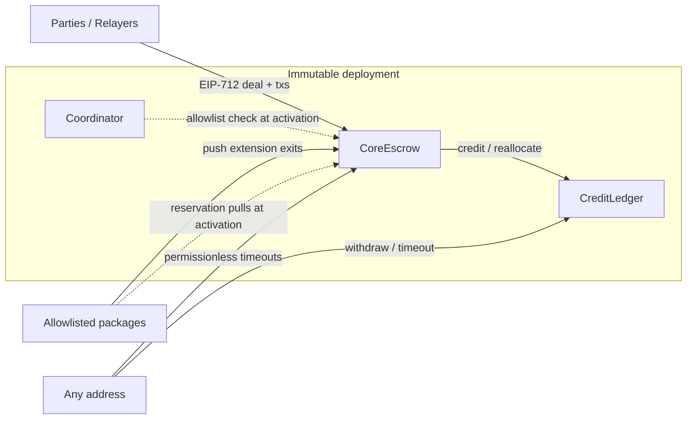

# Core Architecture and Immutability Design

**Status:** Draft for review  
**Date:** 2026-07-29  
**Protocol authority:** `PROTOCOL.md` (business source of truth)  
**Scope:** Architecture and immutability design for Mandatory Core only — not ABI, storage layouts, or executable requirements  
**Target chain (reference home):** Arbitrum (ECO-007)  
**Supersedes for this pass:** none (greenfield V2 Core architecture)

---

## 1. Purpose

This document freezes the **contract topology, trust boundaries, extension model, and platform constraints** for an immutable Mandatory Core deployment that:

1. Implements the closed Core escrow state machine in `PROTOCOL.md` §§5–10, 17 (Core-relevant parts), and Appendix C.
2. Remains usable with zero optional packages (PROFILE-002).
3. Exposes frozen Appendix C surfaces so reference assured rungs and independent packages can attach later **without a Core upgrade** (REF-PKG-009, CORE-SURF-013).
4. Accounts for Solidity language limits and Arbitrum chain properties that cannot be patched after deploy.

ABI-level detail lives in `docs/v2/technical/MANDATORY_CORE.md`, which derives from this architecture and `PROTOCOL.md`.

---

## 2. Decisions locked

| Decision | Choice |
| --- | --- |
| Document type | Architecture + immutability design (full tech spec later) |
| Custody topology | Thin immutable escrow + separate immutable coordinator |
| Package readiness | Core + frozen Appendix C surfaces |
| Package selection | Declared in the deal’s EIP-712 signed terms |
| Module admission | Signature **and** Coordinator allowlist at activation; active deals snapshotted |
| Extension call pattern | Hybrid: activation may pull from bound modules; settlement never callbacks out; extension exits are push entrypoints |
| Credit model | Separate immutable `CreditLedger` (split Core triad) |

---

## 3. Topology and immutability model

Three contracts form one deployment identity. Custody paths use **no proxies and no upgrade admin**.

| Contract | Role | Mutable after deploy? |
| --- | --- | --- |
| `CoreEscrow` | Deal state machine, principal custody, fee charging at activation/settlement, extension entrypoints, canonical terminal records | **No** — bytecode and constructor-bound config frozen |
| `CreditLedger` | Pull credits, withdrawals, beneficiary redirects, per-token deficit ledger | **No** |
| `Coordinator` | Deployment-scoped allowlist of module identities for **new** activations | Allowlist may grow/shrink for **future** deals only; cannot rewrite active-deal snapshots |

### 3.1 Immutability rules

- No admin pause, upgrade proxy, or custody rescue on Escrow or Ledger (DEC-001, DEC-002, DEC-004).
- Evolution is a new protocol version and new deployment; users opt in (DEC-005).
- Active deals bind snapshotted parties, receivers, fees, deadlines, `disputeTimeoutProviderBps`, holder-side authority, and selected module identities. Later coordinator or package changes cannot alter them (DEC-003, CORE-SURF-005).
- Escrow is the only address authorized to mint or reallocate credits on the Ledger for this deployment.
- Ledger never invents outcomes. Escrow never pays settlement receivers directly on the terminal path (TOKEN-007).

### 3.2 Deployment binding

Escrow constructor (or a one-time init that permanently burns init authority) freezes at least:

- chain id;
- protocol version;
- charter hash and technical-specification hash (as ratified for that release);
- `CreditLedger` address;
- `Coordinator` address.

Deal EIP-712 domain separation MUST include chain id, Escrow address, and protocol version to prevent cross-deployment and cross-chain replay.

---

## 4. Consent, packages, and activation

### 4.1 Packages in signed terms

Optional packages are **not** bolted onto a live deal. The deal arrives with the packages it uses already selected in its EIP-712 terms (PROFILE-001, §6.1, CORE-SURF-011).

Selecting a package means the signed terms include that profile’s identity fields (module address, runtime codehash, policy semantic hash, and any fee/bond/residual constraints the package requires). When a profile is absent, those fields are absent or inert and extension edges MUST reject.

### 4.2 Activation (`CASE-CORE-001`) — atomic

1. Verify bilateral signatures (EOA; EIP-1271 supported so pool/contract holders can authorize later without redesign).
2. Check nonce unused, creation expiry, positive principal, nonzero distinct parties and receivers, duration and bps ranges (TIME-003, ACT-004, ACT-005).
3. For every selected custody-adjacent module: require Coordinator allowlist match on `(role, address, codehash, policyHash)` at activation time (TRUST-006, CORE-SURF-010).
4. Exact ERC-20 principal pull into `CoreEscrow` measured by balance delta; fee-on-transfer / short transfer / false return reverts (TOKEN-002, TOKEN-003).
5. Charge activation fee once when nonzero (or credit Ledger to the snapshotted fee recipient).
6. Run selected reservation hooks (bonds, pool funding, operator fee) fail-closed — any failure reverts the whole activation (ACT-007, CORE-SURF-004).
7. Snapshot the deal, emit/write the activation record, consume the nonce.

Failed activation leaves no deal, unused nonce semantics, and unchanged pool/bond/fee exposure.

### 4.3 Coordinator role

- Gates **new** deals only.
- Cannot pause Escrow, redirect receivers, invent outcomes, or disable timeouts on live deals.
- Delisting or replacing a module after activation has **no** effect on that deal’s snapshotted extension exits.
- Does not hold shared user principal in initial V2 modular pools.

### 4.4 Relay neutrality

Any address may submit activation and resolution transactions. The relayer cannot alter terms, receivers, or outcomes (ACT-006, PERM-004).

---

## 5. State machine and extension edges

`CoreEscrow` implements only the Mandatory Core graph from `PROTOCOL.md` §8. Extension edges are **fixed push entrypoints** authenticated against the deal snapshot. New package implementations deploy as new module contracts; Core does not upgrade.

### 5.1 Core states

Non-terminal: `FUNDED`, `FIAT_SENT`, `DISPUTED`  
Terminal: `RELEASED`, `RESOLVED_SPLIT`, `RESOLVED_BY_DISPUTE_TIMEOUT`, `CANCELLED`

ARBITRATION-only states (`ARBITRATION_ACTIVE`, `RESOLVED_BY_ARBITRATION`, `STALEMATE`) exist only when the deal selected ARBITRATION; otherwise those edges reject.

### 5.2 Core transitions (always present)

Mark fiat; provider cancel; fiat timeout; mutual cancel / co-signed release / split; holder release; claim from `FIAT_SENT` only; open `DISPUTED`; dispute-timeout residual.

While `DISPUTED`, unilateral holder release and permissionless claim reject (DISPUTE-003, CASE-CORE-027). Opening Core `DISPUTED` requires no Core fee or bond (DISPUTE-007).

### 5.3 Frozen extension entrypoints

Present in Core bytecode; reject unless the deal selected the profile and the snapshot matches:

- Payment-proof release from `FUNDED` / `FIAT_SENT` / `DISPUTED`
- Open arbitration from `FIAT_SENT` / `DISPUTED`; ingest final ruling / arbitration timeout / dual-sign while `ARBITRATION_ACTIVE`

### 5.4 Call pattern (hybrid)

| Phase | Pattern |
| --- | --- |
| Activation / reservation | Escrow MAY pull from bound modules under exact-balance, fail-closed rules |
| Settlement | Escrow NEVER callbacks out to packages, pools, or receivers. It writes the canonical terminal record, then credits the Ledger |
| Extension exits | Modules **push** authenticated results into Escrow; Escrow checks snapshotted identity (including codehash recorded at activation), then transitions |

### 5.5 Races and outcomes

- Among simultaneously eligible actions, the first successful state-changing transaction wins; losers revert with no economic effect (§8.4).
- Timeout rights remain executable until another valid transition wins (INV-STATE-005).
- Fiat timeout races mark-fiat by design (TIME-005); Core does not auto-cancel or freeze mark-fiat.
- Claim is terminal state `RELEASED` with a distinct outcome label; dispute timeout uses `RESOLVED_BY_DISPUTE_TIMEOUT` / `DISPUTE_TIMEOUT` so later reputation/bond consumers can distinguish paths without Core changes (OUT-002).

---

## 6. Settlement, credits, and economic safety

### 6.1 Terminal path (`CoreEscrow`)

1. Validate transition authority, timing, and snapshot.
2. Compute principal split and fees per §9 (floor rounding; remainder to holder side; completion fee = `min(signedCompletionFee, providerGross)` when `providerGross > 0`).
3. Emit one immutable canonical terminal record (CORE-SURF-006) before any external consumer runs.
4. Reduce deal principal liability; call `CreditLedger.credit(...)` only for holder/provider/fee/bond beneficiaries. Receivers MUST NOT be `address(0)` and MUST NOT be the Escrow or Ledger address (TOKEN-010A).
5. Mark the deal terminal. No receiver `transfer` on this path.

Custom-pool callbacks MUST NOT run on the Core settlement path (POOL-SET-005 intent via CORE-SURF-006).

### 6.2 `CreditLedger`

- Creates irrevocable credits until exact withdrawal to the fixed receiver (or a beneficiary-signed alternate receiver).
- Any address may retry withdrawal; the executor cannot redirect value.
- Failed token transfer preserves the full credit (TOKEN-009).
- Per-token custody boundary: if controlled assets fall below liabilities after an observed external loss, the boundary enters irreversible DEFICIT and allocates fixed pro-rata recovery units (TOKEN-015–019). No cross-token subsidy.
- Reentrancy guards on credit and withdraw paths (TOKEN-012).
- Unsolicited ERC-20 transfers create no user liability (TOKEN-013).

### 6.3 Escrow ↔ Ledger trust freeze

- Ledger accepts credit/reallocate calls only from the bound Escrow.
- Escrow constructor freezes the Ledger address; neither address can be swapped later.
- Both contracts remain independently immutable.

### 6.4 Fees

- Activation fee: charged exactly once on successful activation; non-refundable on all terminals when nonzero (FEE-H-003). Zero is valid Core.
- Completion fee: collected only from provider gross; zero signed amount and zero gross are both valid (FEE-P-001, FEE-P-003).
- Core never injects a DAO or package recipient. Package fee schedules apply only when selected in signed terms (PROFILE-006, CORE-SURF-003).

---

## 7. Appendix C surface map

| Surface | Obligation | Home |
| --- | --- | --- |
| CORE-SURF-001 | Closed machine + named extension edges | `CoreEscrow` entrypoints |
| CORE-SURF-002 | Atomic activation + exact custody | `CoreEscrow` |
| CORE-SURF-003 | Optional fee channels (zero allowed) | `CoreEscrow` → `CreditLedger` |
| CORE-SURF-004 | Activation reservation hooks, fail-closed | `CoreEscrow` |
| CORE-SURF-005 | Immutable deal snapshot | `CoreEscrow` storage |
| CORE-SURF-006 | Canonical terminal record | `CoreEscrow` state + events |
| CORE-SURF-007 | Exact pool-reservation boundary shape | Escrow hook only; pool logic out of Core |
| CORE-SURF-008 | Pull credits | `CreditLedger` |
| CORE-SURF-009 | Permissionless predetermined timeouts | `CoreEscrow` |
| CORE-SURF-010 | Module binding + coordinator authorization | `Coordinator` + activation checks |
| CORE-SURF-011 | Signed optional-field slots | EIP-712 terms |
| CORE-SURF-012 | Post-terminal idempotent consumers | Consume terminal records off the Escrow settlement path |
| CORE-SURF-013 | Package independence / ladder readiness | Core complete with all optional slots empty |

A package MUST NOT require a Core surface beyond this table without a new protocol version.

---

## 8. Solidity and Arbitrum constraints

### 8.1 Solidity / EVM

- **24KB contract size:** keep state machine and principal custody in Escrow; credits and deficit accounting in Ledger; do not inline package business logic into Core.
- **No upgrade escape hatch:** prefer fail-closed checks, Solidity `^0.8` checked arithmetic, explicit state enums, checks-effects-interactions, and reentrancy guards.
- **Exact token deltas only:** measure `balanceOf` before/after; reject fee-on-transfer, rebase, and false-return tokens. Mandatory Core has no native-ETH escrow path (ERC-20-like only).
- **EIP-712 + EIP-1271:** domain separation by chain id + Escrow address + protocol version; 1271 enables contract/pool authorization without redesign.
- **No settlement callbacks:** avoids ERC-777/hook reentrancy rewriting outcomes; pull credits absorb receiver liveness risk.
- **Extension slots are data + entrypoints, not plugins:** no unbounded `delegatecall` into user-supplied code. Core verifies snapshotted module identity.
- **Storage meaning is frozen at activation:** this design pass does not freeze slot layouts, but Escrow MUST NOT depend on “add a field later” for already-active deals. Layout detail comes in the full tech spec.

### 8.2 Arbitrum

- **`block.timestamp` is the protocol clock** (TIME-001). No special L2 finality assumption inside Core.
- **Sequencer / delayed-inbox liveness:** timeouts stay permissionlessly executable by any address until another transition wins. Extreme sequencer withholding is a chain availability risk (TRUST-007), not solvable by an admin pause.
- **Calldata and indexing:** keep terminal records event-rich for indexers; store fiat details as commitments/hashes in terms, not large onchain blobs.
- **No cross-chain settlement in Core:** at-cost Stargate (or successor) helpers are ecosystem infrastructure only (ECO-007, OFF-010). They MUST NOT hold active-deal principal or drive Escrow settlement.
- **Ordinary L2 transactions only** for Core paths: do not require retryable tickets or L1→L2 alias flows for activation or exits.
- **Chain id in the signing domain** prevents replay across Arbitrum chains, forks, and testnets.

### 8.3 Explicit non-goals for this Core deploy

- Governance pause or proxy upgrades
- Native ETH escrow
- Forced fiat authentication in Core
- Baking Kleros, Human Passport, or ZKP2P/Peer verifier bytecode into Escrow
- Cross-chain deal settlement

---

## 9. Out of scope (deferred)

- ABI, storage layouts, exact EIP-712 type strings, and event schemas
- Full `MANDATORY_CORE.md` technical specification
- Pool, bond, payment-proof, arbitration, humanity, and reputation module internals
- Reference SKU parameter encoding and burn-sink address choice
- Deployment scripts, manifests, and release qualification
- EARS / executable requirements regeneration
- Crowdfunded pools (CF-GATE)

---

## 10. Conformance checkpoints for a later implementation

An implementation of this architecture is Core-ready only if:

1. Core-only deals activate and reach a terminal result with all optional slots empty.
2. Selected packages require Coordinator allowlist + signed identity at activation, and snapshots survive later delisting.
3. Settlement never external-calls receivers or packages before credits exist.
4. Fiat timeout, claim (from `FIAT_SENT`), and dispute timeout are anyone-callable with predetermined economics.
5. Escrow and Ledger bytecode are non-upgradeable; no pause that blocks valid exits.
6. Appendix C surfaces above are present so packages can deploy later without Core changes.

---

## 11. Next steps

1. ~~Review and approve this design.~~
2. ~~Write the full Mandatory Core technical specification (`docs/v2/technical/MANDATORY_CORE.md`).~~ → drafted 2026-07-29.
3. Produce an implementation plan from that tech spec.
4. Optional profile tech specs (BONDS, PAYMENT_PROOF, ARBITRATION, POOL, …) against Appendix C surfaces.
)
