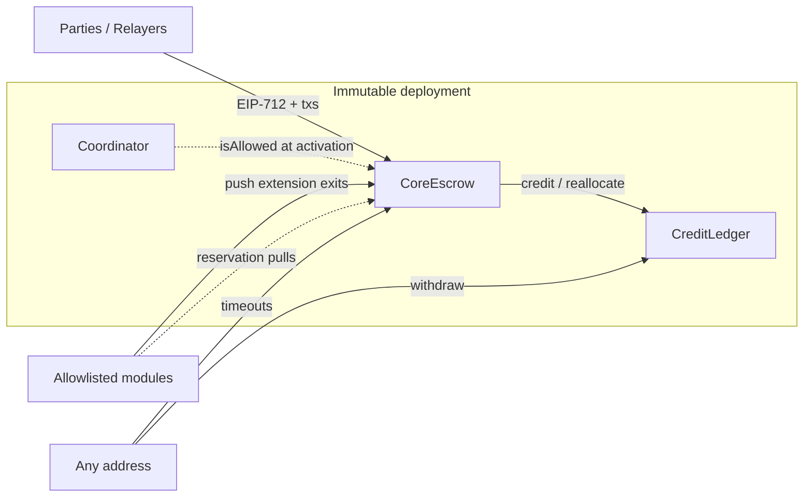

# Mandatory Core — Technical Specification

**Status:** Spec candidate  
**Date:** 2026-07-29  
**Document version:** 0.2.0  
**Protocol version:** 2  
**Business authority:** `PROTOCOL.md`  
**Architecture authority:** `docs/superpowers/specs/2026-07-29-core-architecture-immutability-design.md`  
**Reference home chain:** Arbitrum (ECO-007)  
**Runtime scope:** Mandatory Core (optional profiles attach only at frozen extension points; module internals are OUT_OF_SCOPE except Core-side hooks)

---

## 0. Authority and precedence

**TECH-CORE-000 — Precedence.**

1. `PROTOCOL.md` defines normative business behavior.
2. This document defines exact data, formulas, interfaces, signatures, events, and state representation for Mandatory Core.
3. If this document conflicts with `PROTOCOL.md`, this document is non-conformant until revised.
4. The immutability architecture constrains topology and call patterns; it does not override `PROTOCOL.md`.
5. Code, tests, and deployments provide conformance evidence; they do not redefine this specification.

Normative language follows `PROTOCOL.md` §1.3 (MUST / SHOULD / MAY).

| Identifier family | Meaning |
| --- | --- |
| `TECH-CORE-*` | Technical requirements in this document |
| `ACT-*`, `CASE-CORE-*`, `FEE-*`, … | Business rules in `PROTOCOL.md` (unchanged meanings) |
| `CORE-SURF-*` | Appendix C surfaces in `PROTOCOL.md` |

---

## 1. Deployment topology

### 1.1 Contracts

**TECH-CORE-001 — Triad.** One Mandatory Core deployment consists of exactly three non-upgradeable contracts:

| Contract | Symbol | Holds assets? | Purpose |
| --- | --- | --- | --- |
| `CoreEscrow` | Escrow | Yes — active deal principal and any Escrow-scoped reservation custody | State machine, activation, transitions, terminal handoff |
| `CreditLedger` | Ledger | Yes — matured credits and deficit-boundary assets | Pull credits, withdrawals, deficit recovery |
| `Coordinator` | Coordinator | No | Allowlist of custody-adjacent module identities for **new** activations |

**TECH-CORE-002 — No custody proxies.** Proxies, UUPS, transparent/beacon proxies, or admin pause switches MUST NOT wrap Escrow or Ledger custody. Coordinator **bytecode** is immutable; its allowlist **storage** MAY change for future deals only.

### 1.2 Constructor immutables

#### Escrow

| Field | Type | Notes |
| --- | --- | --- |
| `chainId` | `uint64` | MUST equal `block.chainid` at deploy; re-checked on signed actions |
| `protocolVersion` | `uint32` | `2` |
| `charterHash` | `bytes32` | Content hash of ratified charter (`PROTOCOL.md` artifact) |
| `techSpecHash` | `bytes32` | Content hash of **this** specification artifact |
| `ledger` | `ICreditLedger` | CreditLedger address |
| `coordinator` | `ICoordinator` | Coordinator address |

Deploy MUST revert if `ledger` or `coordinator` is zero, equals Escrow, or equals each other.

#### Ledger

| Field | Type | Notes |
| --- | --- | --- |
| `escrow` | `address` | Sole caller authorized for `credit` / `reallocateRecovery` |
| `chainId` | `uint64` | Same chain binding |

#### Coordinator

| Field | Type | Notes |
| --- | --- | --- |
| `chainId` | `uint64` | Same chain binding |
| `escrow` | `address` | Bound Escrow (informational; Escrow queries allowlist) |

Coordinator MAY expose governance that only mutates the allowlist. That authority MUST NOT settle deals, redirect receivers, or pause Escrow/Ledger exits.

### 1.3 Deployment identity

**TECH-CORE-003.** A conforming immutable deployment manifest MUST include creation and runtime codehashes of Escrow, Ledger, and Coordinator; constructor preimages; `charterHash`; `techSpecHash`; chain id; and addresses (`PROTOCOL.md` §19). Deployment identity is the content hash of that manifest.

### 1.4 Topology diagram



---

## 2. Numeric ranges and units

| Quantity | Domain | Notes |
| --- | --- | --- |
| Token amounts | `uint256` | Token smallest units |
| Basis points | `uint16` ∈ `[0, 10_000]` | `10_000` = 100% |
| `disputeTimeoutProviderBps` | `uint16` ∈ `[0, 10_000]` | Required on every deal |
| Durations | `uint64` seconds | Strictly `> 0` |
| Timestamps / deadlines | `uint64` | Unix seconds; clock = `uint64(block.timestamp)` |
| Nonces | `uint256` | See §5.5 |
| Deal id | `bytes32` | See §6.2 |
| Profile flags | `uint32` bitfield | §3.3 |
| Module slots | `uint8` ∈ `[0, 7]` | §8 |

**TECH-CORE-010 — Overflow.** `origin + duration` MUST fit in `uint64` or activation/transition MUST revert (TIME-003).

**TECH-CORE-011 — Rounding.** Provider shares and fees ALWAYS use integer `floor`. Principal remainder goes to the holder side (ECON-009).

**TECH-CORE-012 — BPS denominator.** All bps divisions use denominator `10_000`.

---

## 3. Types

### 3.1 Deal state

```solidity
enum DealState {
    None,                       // 0
    Funded,                     // 1 FUNDED
    FiatSent,                   // 2 FIAT_SENT
    Disputed,                   // 3 DISPUTED
    Released,                   // 4 RELEASED
    ResolvedSplit,              // 5 RESOLVED_SPLIT
    ResolvedByDisputeTimeout,   // 6 RESOLVED_BY_DISPUTE_TIMEOUT
    Cancelled,                  // 7 CANCELLED
    ArbitrationActive,          // 8 ARBITRATION only
    ResolvedByArbitration,      // 9 ARBITRATION only
    Stalemate                   // 10 ARBITRATION only
}
```

**Terminal:** `Released`, `ResolvedSplit`, `ResolvedByDisputeTimeout`, `Cancelled`, `ResolvedByArbitration`, `Stalemate`.

```solidity
function isTerminal(DealState s) pure returns (bool) {
    return uint8(s) >= uint8(DealState.Released);
}
```

### 3.2 Outcome

```solidity
enum Outcome {
    None,                     // 0
    VoluntaryRelease,         // 1  CASE-OUT-001
    CosignedRelease,          // 2  CASE-OUT-001A
    PaymentProofRelease,      // 3  CASE-OUT-002
    TimeoutClaim,             // 4  CASE-OUT-003
    ProviderCancel,           // 5  CASE-OUT-004
    FiatTimeoutCancel,        // 6  CASE-OUT-005
    MutualCancel,             // 7  CASE-OUT-006
    MutualSplit,              // 8  CASE-OUT-007
    ArbitrationHolderWin,     // 9  CASE-OUT-009
    ArbitrationProviderWin,   // 10 CASE-OUT-010
    ArbitrationRefused,       // 11 CASE-OUT-011
    ArbitrationTimeout,       // 12 CASE-OUT-012
    DisputeTimeout            // 13 CASE-OUT-013
}
```

Reserved business IDs CASE-CORE-010, CASE-CORE-013–019, CASE-OUT-008 MUST NOT be reassigned.

### 3.3 Profile flags

```solidity
library ProfileFlags {
    uint32 constant PAYMENT_PROOF    = 1 << 0;
    uint32 constant ARBITRATION      = 1 << 1;
    uint32 constant BONDS            = 1 << 2;
    uint32 constant POOL             = 1 << 3;
    uint32 constant REPUTATION       = 1 << 4;
    uint32 constant HUMANITY         = 1 << 5;
    uint32 constant RATE_POLICY      = 1 << 6;
    uint32 constant CROWDFUNDED_POOL = 1 << 7; // reject until CF-GATE
}
```

**TECH-CORE-020.** Activation with `profileFlags == 0` MUST be sufficient for a complete Core escrow (PROFILE-002).

### 3.4 Module role and identity

```solidity
enum ModuleRole {
    PaymentProofVerifier, // 0
    ArbitrationAdapter,   // 1
    BondVault,            // 2
    Pool,                 // 3
    HumanityVerifier,     // 4
    ReputationPolicy,     // 5
    RatePolicy,           // 6
    PackagePolicy         // 7
}

struct ModuleIdentity {
    ModuleRole role;
    address module;
    bytes32 codehash;   // extcodehash expected at activation and at use
    bytes32 policyHash; // content-addressed policy semantics
}
```

Empty module: all zero. `ModuleRole` ordinal MUST equal storage slot index (§8).

### 3.5 Calldata: `DealTerms`

```solidity
struct DealTerms {
    address holder;
    address provider;
    address holderReceiver;
    address providerReceiver;
    address token;
    bytes32 tokenRiskHash;
    bytes32 custodyBoundaryId;
    uint256 principal;
    uint256 activationFee;
    address activationFeeRecipient;
    uint256 completionFee;
    address completionFeeRecipient;
    uint256 nonce;
    uint64 createExpiry;
    uint64 fiatDuration;
    uint64 releaseDuration;
    uint64 disputeDuration;
    uint16 disputeTimeoutProviderBps;
    bytes32 fiatCurrency;
    uint256 fiatAmount;
    bytes32 paymentMethod;
    bytes32 payeeCommitment;
    bytes32 paymentReferenceCommitment;
    uint32 profileFlags;
    bytes32 packageId;
    bytes32 packageHash;
    ModuleIdentity[] modules;
    bytes extensions; // ABI-encoded optional profile structs; empty if flags == 0
}
```

Onchain, EIP-712 hashes `modules` and `extensions` as `modulesHash` / `extensionsHash` (§5.2). Calldata carries the preimages.

### 3.6 Storage: `Deal`

```solidity
struct Deal {
    DealState state;
    Outcome outcome;
    address holder;
    address provider;
    address holderReceiver;
    address providerReceiver;
    address token;
    uint256 principal;
    uint256 activationFee;
    address activationFeeRecipient;
    uint256 completionFee;
    address completionFeeRecipient;
    uint16 disputeTimeoutProviderBps;
    uint64 activatedAt;
    uint64 fiatDeadline;
    uint64 releaseDuration;     // snapshotted
    uint64 releaseDeadline;     // 0 until FiatSent
    uint64 disputeDuration;     // snapshotted
    uint64 disputeDeadline;     // 0 until Disputed
    uint32 profileFlags;
    bytes32 packageId;
    bytes32 packageHash;
    bytes32 termsHash;
    bytes32 custodyBoundaryId;
    bytes32 tokenRiskHash;
    bytes32 extensionsHash;
    ModuleIdentity[8] modules;  // fixed slots
}
```

For direct deals, holder-side authority is `holder`. Pool-origin authority is defined in the POOL tech spec; Core reads snapshotted holder/provider/receivers only.

### 3.7 Resolution

```solidity
enum ResolutionAction {
    MutualCancel,     // 0 RES-001
    CosignedRelease,  // 1 RES-002A
    Split             // 2 RES-002
}

struct ResolutionAuth {
    bytes32 dealId;
    ResolutionAction action;
    uint256 resolutionNonce;
    uint64 expiry;
    uint16 providerShareBps; // Split: 0..=10000; else MUST be 0
    bytes extensions;        // empty for Core-only
}
```

---

## 4. Interfaces

### 4.1 `ICoordinator`

```solidity
interface ICoordinator {
    function isAllowed(
        ModuleRole role,
        address module,
        bytes32 codehash,
        bytes32 policyHash
    ) external view returns (bool);

    /// @dev Optional admin API — MUST NOT affect active deals.
    function allow(ModuleRole role, address module, bytes32 codehash, bytes32 policyHash) external;
    function disallow(ModuleRole role, address module, bytes32 codehash, bytes32 policyHash) external;

    event ModuleAllowed(ModuleRole indexed role, address indexed module, bytes32 codehash, bytes32 policyHash);
    event ModuleDisallowed(ModuleRole indexed role, address indexed module, bytes32 codehash, bytes32 policyHash);
}
```

Allowlist key MUST be the full tuple `(role, module, codehash, policyHash)`.

### 4.2 `ICreditLedger`

```solidity
interface ICreditLedger {
    function credit(
        bytes32 dealId,
        address token,
        address beneficiary,
        uint256 amount
    ) external;

    function reallocateRecovery(
        bytes32 dealId,
        address token,
        address fromBeneficiary,
        address toBeneficiary,
        uint256 units
    ) external;

    function withdraw(address token, address beneficiary) external;

    function withdrawTo(
        address token,
        address beneficiary,
        address to,
        uint256 amount,
        uint256 nonce,
        uint64 expiry,
        bytes signature
    ) external;

    /// @notice Persist DEFICIT when assets < liabilities. Anyone may call.
    /// @dev Ordinary withdraw MUST NOT enter-and-revert in one call (state would roll back).
    function syncDeficit(address token) external;

    function claimRecovery(address token, address beneficiary) external;

    function creditOf(address token, address beneficiary) external view returns (uint256);
    function liabilityOf(address token) external view returns (uint256);
    function assetsOf(address token) external view returns (uint256);
    function inDeficit(address token) external view returns (bool);
    function recoveryUnits(address token, address beneficiary) external view returns (uint256);
    function recoveryClaimed(address token, address beneficiary) external view returns (uint256);

    event Credited(bytes32 indexed dealId, address indexed token, address indexed beneficiary, uint256 amount);
    event Withdrawn(address indexed token, address indexed beneficiary, address to, uint256 amount);
    event DeficitEntered(address indexed token, uint256 totalUnits, uint256 assets);
    event RecoveryClaimed(address indexed token, address indexed beneficiary, uint256 amount);
    event RecoveryReallocated(bytes32 indexed dealId, address indexed token, address fromBeneficiary, address toBeneficiary, uint256 units);
}
```

**TECH-CORE-030.** `credit` / `reallocateRecovery` MUST revert unless `msg.sender == escrow`.  
**TECH-CORE-031.** `withdraw` / `withdrawTo` MAY be called by any address; value always pays the beneficiary (or beneficiary-authorized `to`).

### 4.3 `ICoreEscrow`

```solidity
interface ICoreEscrow {
    function activate(
        DealTerms calldata terms,
        bytes calldata holderSignature,
        bytes calldata providerSignature,
        bytes calldata activationData
    ) external returns (bytes32 dealId);

    function markFiatSent(bytes32 dealId) external;
    function providerCancel(bytes32 dealId) external;
    function fiatTimeoutCancel(bytes32 dealId) external;
    function holderRelease(bytes32 dealId) external;
    function claim(bytes32 dealId) external;
    function openDispute(bytes32 dealId, bytes calldata openData) external;
    function disputeTimeout(bytes32 dealId) external;

    function mutualResolve(
        bytes32 dealId,
        ResolutionAuth calldata auth,
        bytes calldata holderSignature,
        bytes calldata providerSignature
    ) external;

    // Extension stubs — MUST exist; revert ProfileDisabled when flag off
    function submitPaymentProof(bytes32 dealId, bytes calldata proofData) external;
    function openArbitration(bytes32 dealId, bytes calldata openData) external payable;
    function submitArbitrationRuling(bytes32 dealId, bytes calldata rulingData) external;
    function arbitrationTimeout(bytes32 dealId) external;

    function getDeal(bytes32 dealId) external view returns (Deal memory);
    function dealState(bytes32 dealId) external view returns (DealState);
    function termsHashOf(bytes32 dealId) external view returns (bytes32);
    function moduleOf(bytes32 dealId, ModuleRole role) external view returns (ModuleIdentity memory);

    function usedHolderNonce(address holder, uint256 nonce) external view returns (bool);
    function usedResolutionNonce(bytes32 dealId, ResolutionAction action, uint256 nonce) external view returns (bool);

    function DOMAIN_SEPARATOR() external view returns (bytes32);
    function charterHash() external view returns (bytes32);
    function techSpecHash() external view returns (bytes32);
}
```

### 4.4 Exact ERC-20 helper (normative behavior)

```text
function pullExact(IERC20 token, address from, uint256 amount):
    before = token.balanceOf(address(this))
    token.safeTransferFrom(from, address(this), amount)
    after = token.balanceOf(address(this))
    if after - before != amount: revert ExactTransferFailed()

function pushExact(IERC20 token, address to, uint256 amount):
    before = token.balanceOf(address(this))
    token.safeTransfer(to, amount)
    after = token.balanceOf(address(this))
    if before - after != amount: revert ExactTransferFailed()
```

Missing ERC-20 return data is treated as success only if the call did not revert; delta check remains mandatory (TOKEN-003).

---

## 5. EIP-712 signing

### 5.1 Domain

```text
EIP712Domain(
  string name,
  string version,
  uint256 chainId,
  address verifyingContract
)
```

| Field | Value |
| --- | --- |
| `name` | `"PluriSwap"` |
| `version` | `"2"` |
| `chainId` | deployment chain id |
| `verifyingContract` | Escrow address |

```text
DOMAIN_SEPARATOR = hashStruct(EIP712Domain(...))
digest(structHash) = keccak256("\x19\x01" ‖ DOMAIN_SEPARATOR ‖ structHash)
```

Ledger uses its own domain with `verifyingContract = Ledger` for `withdrawTo` authorizations.

### 5.2 `DealTerms` typehash

Normative type string:

```text
DealTerms(
  address holder,
  address provider,
  address holderReceiver,
  address providerReceiver,
  address token,
  bytes32 tokenRiskHash,
  bytes32 custodyBoundaryId,
  uint256 principal,
  uint256 activationFee,
  address activationFeeRecipient,
  uint256 completionFee,
  address completionFeeRecipient,
  uint256 nonce,
  uint64 createExpiry,
  uint64 fiatDuration,
  uint64 releaseDuration,
  uint64 disputeDuration,
  uint16 disputeTimeoutProviderBps,
  bytes32 fiatCurrency,
  uint256 fiatAmount,
  bytes32 paymentMethod,
  bytes32 payeeCommitment,
  bytes32 paymentReferenceCommitment,
  uint32 profileFlags,
  bytes32 packageId,
  bytes32 packageHash,
  bytes32 modulesHash,
  bytes32 extensionsHash
)
```

```text
modulesHash = keccak256(abi.encode(terms.modules))
extensionsHash = terms.extensions.length == 0
  ? bytes32(0)
  : keccak256(terms.extensions)
termsHash = hashStruct(DealTerms with modulesHash, extensionsHash)
```

Both parties sign `digest(termsHash)`.

### 5.3 ModuleIdentity encoding

```text
ModuleIdentity(uint8 role, address module, bytes32 codehash, bytes32 policyHash)
```

Array encoding is standard `abi.encode(ModuleIdentity[])`.

### 5.4 Optional `extensions`

When `profileFlags == 0`, `extensions` MUST be empty and `extensionsHash == 0`.  
When flags are set, `extensions` MUST be the concatenation (or single ABI tuple) defined by the enabled profile tech specs, hashed into `extensionsHash`. Core MUST store `extensionsHash` and MUST NOT interpret unknown extension bytes beyond hash commitment and profile-specific hooks those specs register.

### 5.5 `ResolutionAuth` typehash

```text
ResolutionAuth(
  bytes32 dealId,
  uint8 action,
  uint256 resolutionNonce,
  uint64 expiry,
  uint16 providerShareBps,
  bytes32 extensionsHash
)
```

```text
resolutionExtensionsHash = auth.extensions.length == 0 ? bytes32(0) : keccak256(auth.extensions)
```

### 5.6 Ledger `CreditWithdrawAuth`

```text
CreditWithdrawAuth(
  address token,
  address beneficiary,
  address to,
  uint256 amount,
  uint256 nonce,
  uint64 expiry
)
```

Domain: Ledger as `verifyingContract`. `amount` may be `type(uint256).max` to mean “full current credit at execution.”

### 5.7 Signature verification algorithm

**TECH-CORE-040.**

```text
function verifySigner(expected, digest, signature):
    if expected.code.length > 0:
        if IERC1271(expected).isValidSignature(digest, signature) != 0x1626ba7e:
            revert InvalidSignature()
    else:
        // ECDSA: signature is 65 bytes (r‖s‖v) or EIP-2098 64 bytes
        signer = ecrecover(digest, signature)
        if signer == address(0) || signer != expected:
            revert InvalidSignature()
```

### 5.8 Nonce domains

| Nonce | Storage key | Consumed when |
| --- | --- | --- |
| Deal nonce | `holderNonceUsed[holder][nonce]` | successful `activate` |
| Resolution nonce | `resolutionNonceUsed[dealId][action][nonce]` | successful `mutualResolve` |
| Credit withdraw nonce | `withdrawNonceUsed[beneficiary][nonce]` on Ledger | successful `withdrawTo` |

---

## 6. Activation (`CASE-CORE-001`)

### 6.1 Preconditions (ordered)

1. `nonReentrant`
2. `block.chainid == chainId`
3. `terms.createExpiry > block.timestamp` else `Expired`
4. `terms.principal > 0` else `InvalidTerms`
5. `holder != provider`; all of holder, provider, receivers, token nonzero
6. receivers ≠ Escrow and ≠ Ledger (`SelfReceiver`)
7. `fiatDuration, releaseDuration, disputeDuration > 0`
8. `disputeTimeoutProviderBps <= 10_000`
9. `activationFee <= principal` and `completionFee <= principal`
10. if fee `> 0` then recipient nonzero and ≠ Escrow/Ledger; if fee `== 0` recipient MAY be zero
11. `profileFlags & CROWDFUNDED_POOL == 0` else `CrowdfundGated`
12. Validate modules vs flags (§6.4)
13. `!holderNonceUsed[holder][nonce]` else `NonceUsed`
14. `verifySigner(holder, digest(termsHash), holderSig)`
15. `verifySigner(provider, digest(termsHash), providerSig)`
16. Exact pull principal from funding source (§6.5)
17. Collect activation fee if nonzero (§6.6)
18. Run `activationData` reservation hooks fail-closed (§6.7)

On any failure: full revert; no storage writes; nonce unused.

### 6.2 Effects

```text
termsHash = hashStruct(DealTerms…)
dealId = keccak256(abi.encode(
    address(this),
    termsHash,
    terms.holder,
    terms.provider,
    terms.nonce
))
// dealId MUST NOT already exist (collision → revert InvalidTerms)

store Deal snapshot from terms
state = Funded
outcome = None
activatedAt = uint64(block.timestamp)
fiatDeadline = activatedAt + fiatDuration   // checked overflow
releaseDeadline = 0
disputeDeadline = 0
modules[role] = each provided ModuleIdentity (others zero)
holderNonceUsed[holder][nonce] = true
emit DealActivated(...)
```

### 6.3 Funding source

**Core-only direct deals:** principal pulled from `terms.holder` via `transferFrom` (holder MUST have approved Escrow), unless `activationData` encodes a profile-specific funding path (POOL). Relayer MAY be any address; relayer cannot change terms (ACT-006).

### 6.4 Module / flag consistency

For each bit in `profileFlags` that requires a custody-adjacent module, the corresponding `ModuleIdentity` MUST be present, nonzero, `role` matching slot, `coordinator.isAllowed(...)`, and `module.codehash == extcodehash(module)`.

For Core-only (`flags == 0`), `modules.length == 0` and all slots zero.

Orphan modules (identity without flag) or flags without identity → `InvalidTerms`.

### 6.5 Exact principal pull

```text
pullExact(token, funder, principal)
liabilities[token] += principal   // Escrow-internal active principal liability
```

### 6.6 Activation fee

If `activationFee > 0`:

- Prefer immediate `pullExact` from fee payer (holder for direct deals) and `ledger.credit(dealId, token, activationFeeRecipient, activationFee)` **or** pull to Escrow then credit in same tx.
- MUST NOT leave fee as a revocable promise.
- On later terminal: never refund (FEE-H-003).

If `activationFee == 0`: skip.

### 6.7 `activationData`

Opaque to Core except registered hooks:

| Profile | Hook intent |
| --- | --- |
| none | `activationData` MUST be empty |
| BONDS | reserve bonds fail-closed |
| POOL | exact pool pull + operator fee reservation |
| HUMANITY / progressive admission | exposure reservation |
| package contest schedule | validate signed fee fields vs `packageHash` if required at activation |

Unknown nonempty `activationData` with `profileFlags == 0` → `InvalidTerms`.

---

## 7. Transition procedures

Unless stated, every state-changing function is `nonReentrant`, loads `Deal`, reverts `TerminalDeal` if terminal, and uses `uint64 now = uint64(block.timestamp)`.

### 7.1 Catalog

| Case | Function | From | Authority | Timing | Result |
| --- | --- | --- | --- | --- | --- |
| CASE-CORE-001 | `activate` | — | dual sig + fund | `< createExpiry` | `Funded` |
| CASE-CORE-002 | `markFiatSent` | `Funded` | provider | — | `FiatSent` |
| CASE-CORE-004 | `providerCancel` | `Funded` | provider | — | `Cancelled` / `ProviderCancel` |
| CASE-CORE-005 | `fiatTimeoutCancel` | `Funded` | anyone | `now >= fiatDeadline` | `Cancelled` / `FiatTimeoutCancel` |
| CASE-CORE-006/011/022 | `mutualResolve` Cancel | `Funded`/`FiatSent`/`Disputed` | dual sig | `< auth.expiry` | `Cancelled` / `MutualCancel` |
| CASE-CORE-007 | `holderRelease` | `FiatSent` | holder | — | `Released` / `VoluntaryRelease` |
| CASE-CORE-009 | `claim` | `FiatSent` | anyone | `now >= releaseDeadline` | `Released` / `TimeoutClaim` |
| CASE-CORE-012/024 | `mutualResolve` Split | `FiatSent`/`Disputed` | dual sig | `< auth.expiry` | `ResolvedSplit` / `MutualSplit` |
| CASE-CORE-021 | `openDispute` | `FiatSent` | holder | `now < releaseDeadline` | `Disputed` |
| CASE-CORE-023/026 | `mutualResolve` CosignedRelease | `FiatSent`/`Disputed` | dual sig | `< auth.expiry` | `Released` / `CosignedRelease` |
| CASE-CORE-025 | `disputeTimeout` | `Disputed` | anyone | `now >= disputeDeadline` | `ResolvedByDisputeTimeout` / `DisputeTimeout` |
| CASE-CORE-027 | release/claim | `Disputed` | — | always | revert |

ARBITRATION dual-sign from `ArbitrationActive` is enabled only with the profile (CASE-ARB-016/017/018).

### 7.2 `markFiatSent`

```text
require state == Funded
require msg.sender == provider
releaseDeadline = now + releaseDuration  // overflow check
state = FiatSent
emit FiatMarked(dealId, releaseDeadline)
```

### 7.3 `providerCancel` / `fiatTimeoutCancel`

```text
require state == Funded
if providerCancel: require msg.sender == provider
if fiatTimeout: require now >= fiatDeadline
settle(holderBps=10000, outcome=ProviderCancel|FiatTimeoutCancel, state=Cancelled)
```

### 7.4 `holderRelease`

```text
require state == FiatSent
require msg.sender == holder
settle(providerBps=10000, outcome=VoluntaryRelease, state=Released)
```

### 7.5 `claim`

```text
require state == FiatSent
require now >= releaseDeadline
settle(providerBps=10000, outcome=TimeoutClaim, state=Released)
```

### 7.6 `openDispute`

```text
require state == FiatSent
require msg.sender == holder
require now < releaseDeadline
// Package contest-open fee (FEE-PKG-004): if packageHash binds contest fee,
// openData MUST pay exact toll before transition; else openData empty.
// Core itself charges no fee (DISPUTE-007).
disputeDeadline = now + disputeDuration
state = Disputed
emit DisputeOpened(dealId, disputeDeadline)
```

### 7.7 `disputeTimeout`

```text
require state == Disputed
require now >= disputeDeadline
bps = deal.disputeTimeoutProviderBps
settle(providerBps=bps, outcome=DisputeTimeout, state=ResolvedByDisputeTimeout)
```

### 7.8 `mutualResolve`

```text
require state in {Funded, FiatSent, Disputed} // (+ ArbitrationActive if profile)
require auth.dealId == dealId
require now < auth.expiry
require !resolutionNonceUsed[dealId][auth.action][auth.resolutionNonce]
structHash = hashStruct(ResolutionAuth…)
digest = digest(structHash)
verifySigner(holder, digest, holderSig)
verifySigner(provider, digest, providerSig)
resolutionNonceUsed[...] = true

match auth.action:
  MutualCancel:
    require auth.providerShareBps == 0
    require state != None
    settle(providerBps=0, outcome=MutualCancel, state=Cancelled)
  CosignedRelease:
    require auth.providerShareBps == 0
    require state in {FiatSent, Disputed, ArbitrationActive?}
    settle(providerBps=10000, outcome=CosignedRelease, state=Released)
  Split:
    require auth.providerShareBps <= 10000
    require state in {FiatSent, Disputed, ArbitrationActive?}
    settle(providerBps=auth.providerShareBps, outcome=MutualSplit, state=ResolvedSplit)
```

### 7.9 Race semantics

Eligibility is evaluated against storage at execution. First successful state-changing transaction wins; losers revert with no economic effect (CASE-RACE-*).

| Boundary | Strict before | At or after |
| --- | --- | --- |
| Release deadline | `openDispute`, `openArbitration` from FiatSent | `claim` from FiatSent |
| Dispute deadline | `openArbitration` from Disputed | `disputeTimeout` |
| Fiat deadline | — | `fiatTimeoutCancel` races `markFiatSent` (TIME-005) |

Timeout rights remain executable until another valid transition wins (INV-STATE-005).

### 7.10 Extension stubs

| Function | Flag | Flag off |
| --- | --- | --- |
| `submitPaymentProof` | `PAYMENT_PROOF` | `ProfileDisabled` |
| `openArbitration` | `ARBITRATION` | `ProfileDisabled` |
| `submitArbitrationRuling` | `ARBITRATION` | `ProfileDisabled` |
| `arbitrationTimeout` | `ARBITRATION` | `ProfileDisabled` |

When enabled: authenticate `extcodehash(module) == snapshot.codehash`, execute profile rules, settle only via §9. Failure of a module MUST leave Core exits available (TRUST-006/007).

---

## 8. Module snapshot slots

| Slot | `ModuleRole` |
| --- | --- |
| 0 | PaymentProofVerifier |
| 1 | ArbitrationAdapter |
| 2 | BondVault |
| 3 | Pool |
| 4 | HumanityVerifier |
| 5 | ReputationPolicy |
| 6 | RatePolicy |
| 7 | PackagePolicy |

**TECH-CORE-050.** Changing slot assignment requires a new protocol version.  
**TECH-CORE-051.** Extension execution MUST require live `extcodehash` match to snapshot.

---

## 9. Settlement engine

### 9.1 `settle(providerBps, outcome, newState)`

```text
require !isTerminal(state)
providerGross = floor(principal * providerBps / 10000)
holderGross = principal - providerGross
if providerGross == 0:
    completionCollected = 0
else:
    completionCollected = min(completionFee, providerGross)
providerNet = providerGross - completionCollected

// CEI: effects on Escrow accounting before external calls
activePrincipal[token] -= principal
state = newState
outcome = outcome
terminatedAt = now
terminalHash = hash(TerminalRecord(...))

if ledger.inDeficit(token):
    // reallocate fixed recovery units under same splits (TOKEN-007/015)
    reallocate units to holderReceiver / providerReceiver / fee recipient
else:
    if holderGross > 0: ledger.credit(dealId, token, holderReceiver, holderGross)
    if providerNet > 0: ledger.credit(dealId, token, providerReceiver, providerNet)
    if completionCollected > 0: ledger.credit(dealId, token, completionFeeRecipient, completionCollected)

// profile side-effects (bonds, etc.) — credit only, no receiver callbacks
emit DealTerminated(...)
```

**TECH-CORE-060.** No `transfer` to settlement receivers inside `settle`.  
**TECH-CORE-061.** Exactly one terminal per deal (OUT-001).  
**TECH-CORE-062.** Dispute timeout NEVER burns principal (DISPUTE-005).

### 9.2 Provider bps by outcome

| Outcome | providerBps |
| --- | --- |
| VoluntaryRelease, CosignedRelease, PaymentProofRelease, TimeoutClaim, ArbitrationProviderWin | `10_000` |
| ProviderCancel, FiatTimeoutCancel, MutualCancel, ArbitrationHolderWin | `0` |
| MutualSplit | signed share |
| ArbitrationRefused, ArbitrationTimeout | `5_000` |
| DisputeTimeout | snapshotted `disputeTimeoutProviderBps` |

### 9.3 Terminal record

```text
TerminalRecord(
  address escrow,
  bytes32 dealId,
  uint8 state,
  uint8 outcome,
  address token,
  uint256 principal,
  uint256 holderGross,
  uint256 providerGross,
  uint256 completionCollected,
  address holderReceiver,
  address providerReceiver,
  address completionFeeRecipient,
  bytes32 termsHash,
  uint64 terminatedAt
)
terminalHash = keccak256(abi.encode(TerminalRecord))
```

---

## 10. CreditLedger

### 10.1 Ordinary accounting

Per token:

```text
assets(token)     = token.balanceOf(ledger)
liabilities(token) = sum(credits[token][*]) + deficitBookkeeping
require assets >= liabilities when not in DEFICIT after protocol actions
```

`credit` increases `credits[token][beneficiary]` and liabilities.  
`withdraw` pushes exact amount; zeroes credit; decreases liabilities.

Failed push MUST revert without consuming credit (TOKEN-009).

### 10.2 `withdrawTo`

Verify `CreditWithdrawAuth` from `beneficiary`; `to` ≠ Escrow/Ledger; amount ≤ credit (or full credit if `max`); consume nonce; push exact.

### 10.3 Deficit

Before increasing liabilities or paying ordinary withdraw, observe assets vs liabilities. Persisting DEFICIT MUST succeed in a call that does not revert afterward (`syncDeficit` or `claimRecovery`). A withdrawing call that only reverts MUST NOT be relied on to persist DEFICIT (EVM rollback).

```text
if assets < liabilities after observing external loss:
    inDeficit[token] = true  // irreversible (via syncDeficit / claimRecovery)
    totalUnits = liabilities
    assign each beneficiary units = their nominal credit (lazy on first touch is permitted)
    reject new liability increases
    reject ordinary withdraw (DeficitActive)
```

Claimable via `claimRecovery`:

```text
entitled = floor(cumulativeDistributable * units / totalUnits)
pay = entitled - claimed
```

No cross-token subsidy. Unsolicited surplus does not mint credits (TOKEN-013).

### 10.4 Reentrancy

Escrow and Ledger MUST guard activation, settle, credit, reallocate, and withdraw. Token callbacks MUST NOT re-enter those paths (TOKEN-012).

### 10.5 ETH

`receive` / `fallback` on Escrow and Ledger MUST revert.

---

## 11. Events

```solidity
event DealActivated(
    bytes32 indexed dealId,
    address indexed holder,
    address indexed provider,
    address token,
    uint256 principal,
    uint64 fiatDeadline,
    bytes32 termsHash,
    uint32 profileFlags,
    bytes32 packageId
);

event FiatMarked(bytes32 indexed dealId, uint64 releaseDeadline);
event DisputeOpened(bytes32 indexed dealId, uint64 disputeDeadline);

event DealTerminated(
    bytes32 indexed dealId,
    uint8 state,
    uint8 outcome,
    uint256 holderGross,
    uint256 providerGross,
    uint256 completionCollected,
    bytes32 terminalHash
);
```

Indexers MUST treat `DealTerminated` as authoritative for Core economics. Fine-grained transition events MAY be added without changing `terminalHash` preimage.

---

## 12. Errors

```solidity
error InvalidSignature();
error Expired();
error NonceUsed();
error InvalidState();
error InvalidTiming();
error Unauthorized();
error InvalidTerms();
error ExactTransferFailed();
error ModuleNotAllowed();
error ModuleCodehashMismatch();
error ProfileDisabled();
error TerminalDeal();
error ZeroAddress();
error InvalidBps();
error SelfReceiver();
error CrowdfundGated();
error DealExists();
error DeficitActive();
error InsufficientCredit();
```

---

## 13. Storage layout (logical)

Escrow:

```text
mapping(bytes32 => Deal) deals;
mapping(address => mapping(uint256 => bool)) holderNonceUsed;
mapping(bytes32 => mapping(uint8 => mapping(uint256 => bool))) resolutionNonceUsed;
mapping(address => uint256) activePrincipal; // per token
```

Physical Solidity slot packing is an implementation choice provided the Deal fields in §3.6 are recoverable and module slots remain fixed 0..7. A future ABI freeze MAY publish exact erc7201 namespaces; until then, deployments MUST publish storage proofs via the immutable manifest’s runtime codehash.

Ledger:

```text
mapping(address => mapping(address => uint256)) credits; // token => beneficiary => amount
mapping(address => bool) inDeficit;
mapping(address => uint256) totalRecoveryUnits;
mapping(address => uint256) cumulativeDistributable;
mapping(address => mapping(address => uint256)) units;
mapping(address => mapping(address => uint256)) claimed;
mapping(address => mapping(uint256 => bool)) withdrawNonceUsed;
```

---

## 14. Solidity and Arbitrum constraints

### 14.1 Solidity

| ID | Constraint |
| --- | --- |
| TECH-CORE-070 | Solidity `^0.8.24+` with checked arithmetic |
| TECH-CORE-071 | Escrow runtime bytecode ≤ EIP-170 24KB |
| TECH-CORE-072 | No upgradeability for Escrow/Ledger custody |
| TECH-CORE-073 | No `delegatecall` into package modules on settlement path |
| TECH-CORE-074 | No native ETH escrow |
| TECH-CORE-075 | Integer floor only |

### 14.2 Arbitrum

| ID | Constraint |
| --- | --- |
| TECH-CORE-080 | Clock = `block.timestamp` (TIME-001) |
| TECH-CORE-081 | Core paths = ordinary L2 txs (no retryable requirement) |
| TECH-CORE-082 | Bridges out of Core; MUST NOT hold deal principal |
| TECH-CORE-083 | Sequencer censorship mitigated by anyone-callable timeouts, not pause |
| TECH-CORE-084 | EIP-712 binds chain id + Escrow |

---

## 15. Appendix C matrix

| Surface | Fulfillment |
| --- | --- |
| CORE-SURF-001 | §7 + extension stubs |
| CORE-SURF-002 | §6 |
| CORE-SURF-003 | DealTerms fees + §9 |
| CORE-SURF-004 | §6.7 |
| CORE-SURF-005 | §3.6 |
| CORE-SURF-006 | §9.3 |
| CORE-SURF-007 | Pool module slot + activationData hook |
| CORE-SURF-008 | §4.2 / §10 |
| CORE-SURF-009 | fiatTimeout / claim / disputeTimeout (+ arb stub) |
| CORE-SURF-010 | Coordinator + §6.4 |
| CORE-SURF-011 | §5 |
| CORE-SURF-012 | Consumers after `DealTerminated` |
| CORE-SURF-013 | flags == 0 complete path |

---

## 16. Invariant → check map

| Invariant | Enforcement |
| --- | --- |
| INV-CONSENT-001 | dual sig on activate |
| INV-CONSENT-004 | holder nonce |
| INV-CUST-001 | Ledger asset/liability checks |
| INV-CUST-004 | settle principal split |
| INV-STATE-001 | single `Deal.state` |
| INV-STATE-002/003 | terminal once |
| INV-STATE-005 | anyone-callable timeouts |
| INV-STATE-007 | disputed blocks claim/release |
| INV-STATE-008 | residual bps formula |
| INV-STATE-009 | no Core dispute fee |
| INV-FEE-001 | activation fee once, non-refund |
| INV-FEE-002 | completion fee gross cap |
| TOKEN-007 | credit-before-withdraw |
| TOKEN-010A | no self receivers |
| TOKEN-012 | reentrancy guards |
| DEC-001/002/004 | no proxy/pause/admin seize |

---

## 17. Conformance tests (normative intent)

1. Zero-fee Core: activate → markFiat → holderRelease → withdraw both sides.  
2. Activation fee nonzero: cancel/timeout does not refund fee.  
3. Fiat timeout by third party returns principal holder-side.  
4. Claim after release deadline; completion fee collected.  
5. Open dispute → dispute timeout residual; fee if providerGross > 0.  
6. Dual-sign cancel / cosigned release / split from FiatSent and Disputed.  
7. After dispute: claim and holderRelease revert.  
8. Extension stubs revert `ProfileDisabled` when flags 0.  
9. Non-allowlisted module cannot activate; delist after activate does not block Core exits.  
10. Fee-on-transfer funding reverts.  
11. Withdraw to reverting receiver preserves credit; retry works.  
12. Reentrancy cannot double-settle.  
13. Signature replay across chain/Escrow/version fails.  
14. `providerBps` extremes 0 and 10000 on dispute timeout.  
15. Mutual split rounding dust to holder.  

---

## 18. OUT_OF_SCOPE

- BONDS vault & slash formula encoding  
- PAYMENT_PROOF verifier / nullifier internals  
- ARBITRATION adapter quote & ruling codec  
- POOL constitution, mandates, operator bits  
- HUMANITY / REPUTATION / RATE_POLICY  
- Reference SKU preimages, burn sink address  
- BATCH_EXECUTION  
- Crowdfunded pools (CF-GATE)  
- EARS generation, deploy CI, audit reports  

---

## 19. TECH-CORE index

| ID | Summary |
| --- | --- |
| TECH-CORE-000 | Precedence |
| TECH-CORE-001 | Contract triad |
| TECH-CORE-002 | No custody proxies |
| TECH-CORE-003 | Deployment manifest |
| TECH-CORE-010–012 | Numeric rules |
| TECH-CORE-020 | Core-only flags |
| TECH-CORE-030–031 | Ledger auth |
| TECH-CORE-040 | Signature verify |
| TECH-CORE-050–051 | Module slots |
| TECH-CORE-060–062 | Settlement |
| TECH-CORE-070–075 | Solidity constraints |
| TECH-CORE-080–084 | Arbitrum constraints |

---

## 20. Document control

| Version | Date | Notes |
| --- | --- | --- |
| 0.1.0 | 2026-07-29 | Initial draft |
| 0.2.0 | 2026-07-29 | Full algorithms, storage, EIP-712, interfaces, invariant map |
| 0.2.1 | 2026-07-29 | Add `syncDeficit` / `claimRecovery`; deficit persistence note |

When normative bytes change, new deployments MUST use a new `techSpecHash`. Active deals on prior deployments remain governed by their activation binding (VER-003).
)
